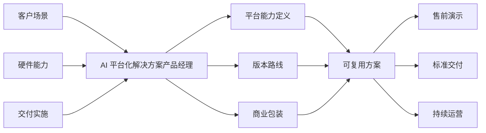

# AI 平台化解决方案产品经理：角色定位与能力框架

当公司从“卖服务器、交换机、液冷和算力部件”走向“卖可复用的 AI 平台化解决方案”时，最容易缺的一环，往往不是某个单点技术，而是一个能把客户场景、AI 工作流、平台能力、版本路线、用户体验、交付方式和商业包装串成统一产品叙事的角色。

这个角色通常不是传统硬件产品经理，也不是纯软件产品经理，而更接近 **AI 平台化解决方案产品经理**。

> 本文基于 [[ML-Lifecycle-Management-官方文档总结]]、[[MLOps-开源平台对比]]、[[MLOps-Data-Versioning-与-Data-Management-开源方案对比]]、[[内部MLOps-数据版本控制与数据管理平台-PRD]] 与 [[Internal-MLOps-Availability-Structured-Analysis]] 的结论整理，重点回答：这个岗位为什么会出现、在价值链中处于什么位置、需要懂哪些背景知识、和硬件团队及交付团队如何分工。

## 1. 一句话定义

AI 平台化解决方案产品经理，本质上是在 **客户场景**、**AI 技术工作流**、**算力基础设施**、**平台产品化** 和 **商业化交付** 之间做翻译、抽象和组合的人。

他要负责的，不只是“收需求写 PRD”，而是回答以下 6 个问题：

1. 客户到底想解决什么业务问题，而不只是要多少张卡、多少台服务器。
2. 这个问题对应的 AI 工作流是什么，训练、推理、数据、调度、运维各有哪些关键路径。
3. 哪些能力应该沉淀成平台共性，哪些仍然保留为项目级定制。
4. 平台第一版应该做什么，后续版本路线如何演进。
5. 售前如何讲、Demo 如何演、交付如何落、运维如何持续。
6. 这套方案最终是按硬件卖、按项目卖，还是按平台版本和服务能力卖。

## 2. 为什么这个角色会出现

如果公司原本擅长的是硬件研发制造和客户定制交付，那么在向 AI 平台化解决方案升级时，通常会遇到 4 类结构性变化。

### 2.1 价值重心从“设备能力”转向“可用性和工作流完成度”

客户采购 AI 基础设施时，真正关心的往往不是单一设备参数，而是：

- 能不能更快开始训练和推理。
- 集群是否好部署、好用、好管。
- 资源是否能分配、隔离、观测和回收。
- 平台能否支持研发、验证、上线和运维闭环。

这意味着单卖服务器、交换机或液冷系统，已经不足以承载客户对“AI 生产力”的完整预期。

### 2.2 客户交付从“一次性项目”走向“可复用平台能力”

如果每个客户项目都从头拼环境、拼流程、拼运维规则，会出现几个后果：

- 售前方案难复用。
- 交付成本高，周期长。
- 平台能力沉淀不下来。
- 版本不可控，后续升级困难。

因此组织需要有人持续判断：什么应该标准化，什么应该保留弹性，什么能力值得做成平台模块。

### 2.3 AI 平台不是硬件堆叠，而是端到端工作流产品

根据 [[ML-Lifecycle-Management-官方文档总结]] 与现有 MLOps 笔记，AI 平台真正要承接的是一条完整链路：

- 数据准备
- 训练与实验跟踪
- 模型管理
- 资源调度
- 推理部署
- 监控运维
- 治理与审计

当公司从算力硬件走向 AI 平台方案时，真正卖出去的已经不只是设备，而是这条链路的“可用体验”和“可持续运营能力”。

### 2.4 组织分工会天然出现一个“中间断层”

在很多公司里：

- 硬件团队懂服务器、交换机、液冷、算力部件。
- 平台研发或架构团队懂 Kubernetes、Kubeflow、MLflow、调度、存储和可观测性。
- 交付团队懂部署、集成、验收和问题收敛。
- 售前团队懂客户沟通和方案汇报。

但中间往往缺少一个角色，专门把这些能力连接成“客户可理解、团队可交付、公司可复用”的平台产品。这正是 AI 平台化解决方案产品经理存在的原因。

## 3. 这个角色在价值链中的位置

更准确地说，这个岗位不是某个单点模块 owner，而是 **平台化转换器**：

- 把客户语言翻译成产品语言。
- 把技术能力翻译成可售卖能力。
- 把项目经验翻译成版本能力。
- 把离散交付翻译成可复用方案。

## 4. 这个岗位到底不是什么

很多组织在定义该岗位时会混淆边界。为了避免岗位失真，先明确它不等于以下角色。

| 角色 | 主要关注点 | 为什么不等同于 AI 平台化解决方案产品经理 |
| --- | --- | --- |
| 硬件产品经理 | 硬件规格、成本、性能、BOM、可靠性 | 关注设备本体，不直接定义 AI 工作流和平台体验 |
| 项目经理 | 计划、进度、资源、风险、验收 | 关注项目执行控制，不负责平台能力抽象与版本路线 |
| 交付经理 | 部署、集成、问题闭环、上线验收 | 关注项目落地，不天然负责平台共性沉淀 |
| 解决方案架构师 | 技术架构和方案设计 | 更偏技术方案正确性，不一定负责产品边界、优先级和商业包装 |
| 售前经理 | 客户沟通、商机推进、投标答疑 | 更偏商机推进，不一定负责长期平台路线 |
| 纯软件产品经理 | 功能体验、需求管理、版本迭代 | 如果缺少算力基础设施和交付理解，容易脱离实际可落地能力 |

这个岗位最接近的是：**懂基础设施和 AI 工作流的产品型连接器**。

## 5. 需要掌握的背景知识地图

如果要把这个岗位做好，至少要建立 6 块背景知识，而不是只懂其中一块。

### 5.1 客户业务与行业场景

需要理解：

- 客户做 AI 的主要业务目标是什么。
- 典型应用属于训练优先、推理优先，还是训推一体。
- 客户组织里谁是 buyer，谁是 user，谁是 operator。
- 客户真正买单的是性能、效率、稳定性、合规性还是交付速度。
- 不同行业对国产化、私有化、数据安全、SLA 的要求有什么差异。

如果不理解场景，就容易把平台做成通用功能堆砌，而不是围绕客户关键任务设计。

### 5.2 AI 工作流与 MLOps 生命周期

需要理解的不是某一个工具，而是端到端流程：

- 数据接入和准备
- 训练任务与实验跟踪
- 模型注册与版本管理
- 推理部署和服务暴露
- 监控告警与可观测性
- 资源调度与多租户管理
- 治理、权限、审计和可追溯性

这部分可参考 [[ML-Lifecycle-Management-官方文档总结]] 与 [[MLOps-开源平台对比]]。核心原因在于：只有理解 AI 工作流，才能判断什么能力应该被平台原生承接，什么能力可以通过集成外部组件实现。

### 5.3 算力基础设施与集群形态

需要具备足够的基础设施认知，而不是停留在“有 GPU 就行”：

- 服务器、GPU 或其他算力部件的资源形态和约束。
- 交换机、网络拓扑、带宽和延迟对训练的影响。
- 存储类型、吞吐、共享访问方式和数据路径。
- 液冷方案、功耗、密度、散热对机房方案的影响。
- 集群部署、扩容、故障恢复和容量规划的基本逻辑。
- 万卡集群、多节点训练、资源隔离和调度挑战。

这不要求产品经理替代架构师或硬件工程师，但要求他能判断：客户场景与底层资源供给之间是否匹配，以及平台承诺是否可兑现。

### 5.4 平台产品化方法

这一部分是岗位的核心差异化能力，包括：

- 把离散需求抽象成平台共性能力。
- 做 MVP 定义，而不是一次性做大而全。
- 明确平台边界、角色模型、用户旅程和关键路径。
- 定义版本路线、优先级和阶段性退出标准。
- 将功能、体验、运维、治理和可观测性一起纳入产品范围。

从现有知识库看，[[内部MLOps-数据版本控制与数据管理平台-PRD]] 已经体现了这种平台产品化思路：不是只谈技术架构，而是同时定义用户、范围、原则、MVP、路线图和 owner。

### 5.5 解决方案交付与标准化实施

因为公司的现实基础通常来自定制项目，所以该岗位必须理解交付视角：

- 典型部署流程和环境依赖是什么。
- 哪些问题会在现场暴露，而不是在 PPT 上暴露。
- 哪些能力可以模板化交付，哪些仍需要现场适配。
- 验收口径如何定义，SLA/SLO 边界如何表达。
- 升级、运维、迁移、扩容如何进入标准方案。

如果产品定义脱离交付约束，最后就会变成“能讲不能交”。

### 5.6 商业化包装与版本设计

最终公司卖出去的，往往不是“功能列表”，而是一个可购买、可讲解、可分层、可持续扩展的方案。因此还需要理解：

- 方案按什么层次打包，基础版、增强版、企业版还是行业版。
- 定价是跟硬件打包、按项目收费、按节点收费，还是按平台订阅收费。
- 平台能力与服务能力如何组合。
- 哪些能力必须进入标配，哪些作为增值项。
- 售前 Demo、PoC、标准 BOM、实施包和运维包如何串联。

## 6. 建议的知识结构与能力模型

可以把这个岗位的能力模型拆成 5 个维度。

| 能力维度 | 关键问题 | 典型表现 |
| --- | --- | --- |
| 场景抽象能力 | 是否能从客户项目中抽取共性问题 | 能把多个客户的类似诉求收敛成统一平台需求 |
| 技术理解能力 | 是否理解 AI 工作流与算力基础设施约束 | 能与架构师、平台研发、硬件团队进行高质量沟通 |
| 平台产品能力 | 是否能定义边界、优先级、路线图和体验 | 能输出平台模块划分、MVP 和版本策略 |
| 交付联动能力 | 是否理解部署、集成、验收和运维现实 | 能让产品定义真正被售前和交付复用 |
| 商业包装能力 | 是否能把技术能力变成可讲、可卖、可签约的方案 | 能形成套餐、价值叙事、SLA 边界和销售故事 |

如果只强其中一项，岗位都容易失衡：

- 只有技术理解，没有产品判断，会变成架构协调员。
- 只有产品方法，没有基础设施理解，会变成空中产品经理。
- 只有交付经验，没有平台抽象，会一直停留在项目定制。
- 只有销售包装，没有技术深度，会造成承诺失真。

## 7. 这个岗位的核心产出物

一个成熟的 AI 平台化解决方案产品经理，通常会持续产出以下资产：

1. **客户场景地图**：目标行业、典型用户、关键痛点、优先场景。
2. **AI 工作流蓝图**：从数据、训练、调度、推理到运维的关键路径。
3. **平台能力地图**：哪些能力是控制面，哪些是数据面，哪些是集成能力。
4. **版本路线图**：V1 先做什么，V2/V3 如何扩展。
5. **方案标准包**：标准架构、标准部署、标准验收、标准运维边界。
6. **售前演示资产**：Demo 场景、故事线、能力矩阵、差异化卖点。
7. **商业包装**：版本分层、报价逻辑、服务边界、SLA 口径。
8. **复用机制**：把项目交付经验反哺成平台需求池和版本 backlog。

这些产出物的共同目标，是把一次性项目经验转化为组织可复用资产。

## 8. 与硬件团队、交付团队、售前团队如何分工

这个岗位的价值，不在于替代其他团队，而在于建立更清晰的接口。

| 团队 | 主要职责 | AI 平台化解决方案产品经理的接口责任 |
| --- | --- | --- |
| 硬件团队 | 服务器、交换机、液冷、算力部件的设计与选型 | 把底层硬件能力翻译成平台可承诺能力，避免脱离实际资源边界 |
| 平台研发或架构团队 | Kubernetes、MLOps、调度、监控、权限、平台模块研发 | 定义优先级、用户旅程、能力边界和版本路线 |
| 交付团队 | 集群部署、系统集成、现场落地、验收、问题闭环 | 将项目反馈沉淀成标准包和平台需求，而不是仅止于项目修补 |
| 售前团队 | 需求澄清、方案讲解、PoC、招投标支撑 | 提供统一叙事、能力清单、演示资产和价值表达 |
| 经营和管理层 | 业务方向、投入产出、定价策略、重点客户 | 用平台路线和商业包装支持从项目收入走向平台收入 |

一个简单判断标准是：

- 硬件团队决定“底层能提供什么”。
- 交付团队决定“现场怎么装起来”。
- 平台研发决定“系统怎么实现”。
- 售前团队决定“怎么对外讲”。
- **AI 平台化解决方案产品经理决定“什么值得做成产品，以及这些能力如何被组织复用和持续经营”。**

## 9. 对公司的直接价值

这个岗位的组织价值，通常体现在以下几个层面。

### 9.1 从卖硬件走向卖解决方案

它能帮助公司把“硬件能力”升级为“平台能力”，降低客户只把公司视为设备供应商的风险。

### 9.2 提高方案复用度

通过抽象共性场景、标准化工作流和版本化能力，可以减少每个项目都从头定制的低效模式。

### 9.3 帮助售前和交付形成统一产品语言

一旦平台能力有统一定义，售前更容易讲清楚，交付更容易按标准执行，客户也更容易理解边界和价值。

### 9.4 让软件平台补齐硬件价值链

对于国产化算力、液冷智算、万卡集群等能力，真正形成壁垒的不只是硬件本身，而是围绕这些硬件的调度、运维、治理和使用体验。

### 9.5 为后续商业模式升级提供基础

如果没有平台产品经理，公司通常只能做：

- 一次性硬件销售
- 一次性项目交付
- 高度依赖个人经验的解决方案复制

而有了这个角色，才有机会逐步发展出：

- 标准化平台包
- 行业方案包
- 订阅式软件能力
- 平台运维和增值服务收入

## 10. 常见误区

### 10.1 把这个岗位当成“会写 PPT 的售前”

如果岗位只负责包装话术，而不参与平台边界、优先级和版本定义，就很难沉淀出真正的产品能力。

### 10.2 把这个岗位当成“需求收集器”

这个岗位的核心不只是收集需求，而是做抽象、取舍和版本化决策。

### 10.3 把这个岗位放在纯软件产品体系里孤立运作

如果缺少硬件、交付和架构侧的深度协作，这个岗位很容易失去落地抓手。

### 10.4 只做项目，不做平台能力沉淀

如果项目做完没有回流成平台 backlog、标准包和版本路线，这个岗位最终会退化成高级项目协调。

## 11. 一个务实的岗位判断标准

如果要判断组织里是否真的需要这个岗位，可以看 5 个信号：

1. 客户需求已经不再是单一设备采购，而是端到端 AI 方案。
2. 公司已经具备一定硬件和交付能力，但平台体验还没有统一定义。
3. 多个项目之间已经出现重复需求，却缺少统一抽象。
4. 售前、架构、交付和研发之间经常出现边界不清或口径不一。
5. 管理层希望从项目型收入走向平台型、解决方案型收入。

如果这 5 个信号中已经出现 3 个以上，这个岗位通常不是“可有可无”，而是组织升级中的关键角色。

## 12. 总结

“硬件研发制造 + 客户定制交付”走向“AI 平台化解决方案”的过程中，最关键的不是再多加一个协调岗位，而是补上一个真正能把 **客户场景、AI 工作流、平台能力、交付方式和商业化路径** 串成产品的人。

这个人本质上是平台化转换器。他既要理解算力基础设施和 AI 生命周期，又要具备产品化抽象、版本管理、交付联动和商业包装能力。

对公司来说，这个岗位的核心意义，不只是“有人来写需求”，而是帮助公司从“卖硬件和项目”逐步走向“卖平台能力和可复用解决方案”。

## Update History

- 2026-06-10: 初次创建，系统总结 AI 平台化解决方案产品经理的角色定位、背景知识、分工边界、能力模型与组织价值。