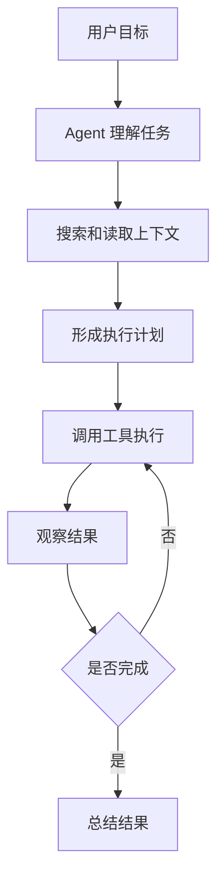
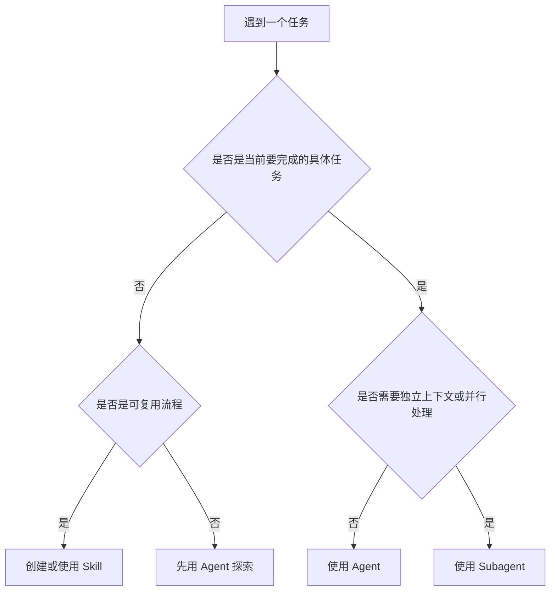
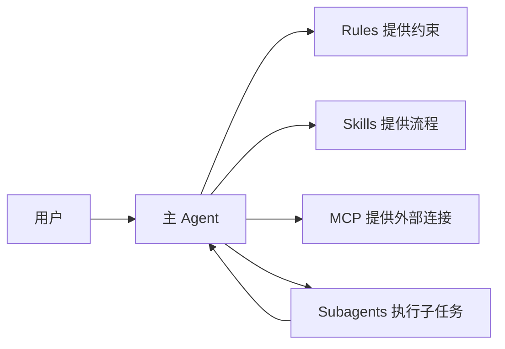

# Cursor Agent 与 Skill 使用决策指南

## 1. 核心结论

在 Cursor 语境中，**Agent 是执行者，Skill 是能力说明书，Subagent 是被主 Agent 委派出去的专门助手**。

- **Agent**：负责理解目标、搜索代码、读写文件、运行终端、调用工具并完成任务。
- **Skill**：负责把某类任务的领域知识、流程、脚本、模板和约定封装起来，供 Agent 在合适时机读取和使用。
- **Subagent**：负责在独立上下文中处理复杂、并行、长时间或需要专门角色的任务，然后把结果交回主 Agent。

一句话判断：

> 当前只要完成一件具体事情，用 Agent；如果这件事情会反复发生、需要固定流程或专业知识，沉淀为 Skill；如果任务很大、上下文很重、需要并行或独立验证，使用 Subagent。

## 2. Cursor Agent 是什么

Cursor Agent 是 Cursor 的 AI 编程执行者。它由三部分组成：

1. **Instructions**：系统提示词、项目规则、用户要求等行为约束。
2. **Tools**：搜索代码、读取文件、编辑文件、运行终端、联网检索、浏览器操作等能力。
3. **Model**：实际执行推理和生成的模型。

Agent 的关键特征是“主动编排”。用户提出目标后，Agent 会自行拆解任务，并在推理循环中反复执行：



这与普通聊天不同：普通聊天主要输出文本，而 Agent 可以改变工作区状态，例如修改代码、运行测试、创建文件。

## 3. Agent、Plan、Debug 与 Multitask 的区别

在 Cursor 中，**Agent Mode、Plan Mode、Debug Mode 和 Multitask** 不是四种完全独立的 Agent。更准确地说，它们是 Cursor 围绕 Agent 工作流提供的不同使用方式：

- **Agent Mode**：基础执行模式。
- **Plan Mode**：先规划、再执行。
- **Debug Mode**：面向疑难问题的诊断模式。
- **Multitask**：并行管理多个 Agent 任务的能力。

一句话区分：

```text
Agent Mode = 直接执行
Plan Mode = 先想清楚再执行
Debug Mode = 先拿证据定位问题再修
Multitask = 多个 Agent 任务并行推进
```

### 3.1 Plan Mode 是什么

Plan Mode 是偏 **只读、分析、设计方案** 的模式。它适合在动手改代码之前，先把问题范围、实现路径、风险和取舍讲清楚。

Plan Mode 通常用于：

- 需求还不够清楚，需要先澄清。
- 任务较大，可能影响多个模块。
- 有多种实现方案，需要比较取舍。
- 需要先读代码、理解架构、给出改造计划。
- 用户希望先看方案，不希望 Agent 立刻改文件。

Plan Mode 的输出通常是：

- 问题拆解。
- 实现方案。
- 风险点。
- 文件影响范围。
- 测试计划。
- 需要用户确认的决策。

它的重点不是“完成任务”，而是帮助用户和 Agent 在动手前达成共识。

### 3.2 Agent Mode 是什么

Agent Mode 是偏 **执行、修改、验证** 的模式。它适合在目标已经明确后，让 Agent 直接完成任务。

Agent Mode 通常会：

- 搜索和读取代码。
- 修改文件。
- 创建文件。
- 运行命令或测试。
- 根据报错继续修复。
- 最后总结完成结果。

如果说 Plan Mode 像“设计评审”，Agent Mode 就像“工程实施”。

### 3.3 对比表

| 维度 | Plan Mode | Agent Mode |
|---|---|---|
| 核心目标 | 形成方案 | 完成任务 |
| 工作方式 | 分析、讨论、规划 | 执行、编辑、验证 |
| 是否适合直接改文件 | 不适合 | 适合 |
| 适合阶段 | 需求不清、方案未定、架构设计前 | 目标明确、方案已定、需要落地 |
| 典型输出 | 计划、选项、风险、测试方案 | 代码改动、文件产物、命令结果、总结 |
| 用户参与度 | 较高，需要确认方向 | 较低，主要验收结果 |

### 3.4 什么时候用 Plan Mode

适合先进入 Plan Mode 的情况：

- “帮我设计一个认证系统。”
- “这块架构怎么重构比较好？”
- “我想加缓存，但不知道用 Redis 还是本地缓存。”
- “帮我分析这个模块的边界和迁移方案。”
- “这个需求可能影响很多地方，先别改代码，先给方案。”

### 3.5 什么时候用 Agent Mode

适合直接用 Agent Mode 的情况：

- “修复这个 bug。”
- “给这个函数补测试。”
- “把这个页面样式改成这样。”
- “根据刚才的方案开始实现。”
- “运行测试并修复失败。”

### 3.6 Debug Mode 是什么

Debug Mode 是偏 **故障诊断、运行时证据、根因分析** 的模式。它适合那些“不是不知道要改哪里，而是不知道问题到底在哪里”的情况。

Debug Mode 通常会：

- 先理解异常现象。
- 提出可能假设。
- 查看日志、报错、堆栈、运行状态。
- 必要时添加临时 instrumentation。
- 用证据排除错误假设。
- 找到根因后再进行定向修复。

适合 Debug Mode 的情况：

- bug 难以复现。
- 报错信息不直观。
- 涉及异步、竞态、状态同步。
- 性能、内存、网络、环境问题。
- 修了几次但问题反复出现。

不适合 Debug Mode 的情况：

- 已经明确知道要改什么。
- 只是实现一个新功能。
- 只是格式化、补文档、改样式。

### 3.7 Multitask 是什么

Multitask 更像 **多 Agent 任务管理能力**，而不是和 Agent、Plan、Debug 完全并列的单一模式。

它适合同时推进多个任务，例如：

- 一个 Agent 修前端问题，另一个 Agent 查后端接口。
- 一个 Agent 做实现，另一个 Agent 做只读验证。
- 一个 Agent 长时间跑测试或调查 CI，主对话继续处理其他问题。
- 多个实验性方案放在不同 worktree 中并行推进。

Multitask 的重点是：

- 多任务并行。
- 隔离上下文。
- 减少等待。
- 让多个 Agent 在不同任务上同时工作。

它是否会修改文件，取决于具体运行的 Agent 任务。如果并行 Agent 在可写工作区或 worktree 中执行，它可以修改文件；如果是只读研究或审查任务，则不修改。

### 3.8 四者对比表

| 维度 | Agent Mode | Plan Mode | Debug Mode | Multitask |
|---|---|---|---|---|
| 核心目标 | 完成任务 | 形成方案 | 定位根因 | 并行推进多个任务 |
| 工作方式 | 搜索、编辑、运行、验证 | 研究、分析、设计、等确认 | 假设、采证、排查、修复 | 队列、并行 Agent、隔离上下文 |
| 是否可改文件 | 可以 | 规划阶段通常不改，确认后再改 | 可以，可能先加临时诊断代码 | 取决于具体 Agent 任务 |
| 适合场景 | 目标明确的实现或修改 | 大改动、多方案、需求不清 | 难复现 bug、性能问题、复杂报错 | 同时处理多个任务或并行验证 |
| 典型输出 | 代码改动、测试结果、总结 | 方案、风险、步骤、测试计划 | 根因、证据、修复、验证结果 | 多个任务的独立进展和汇总 |
| 用户参与 | 中等 | 较高，需要确认方案 | 中等，需要提供现象和复现信息 | 较低到中等，主要管理任务优先级 |

### 3.9 如何选择

可以用下面的判断：

```text
目标已经明确，要直接改 -> Agent Mode
目标较大或方案未定 -> Plan Mode
问题存在但根因不明 -> Debug Mode
多个任务想同时推进 -> Multitask
```

例子：

- “把登录按钮改成蓝色” -> Agent Mode。
- “我们要重构权限系统，先给我方案” -> Plan Mode。
- “线上偶发 500，但本地复现不了” -> Debug Mode。
- “你先查 CI，我同时想让另一个任务生成文档” -> Multitask。

### 3.10 会自动切换吗

这些模式有一定的智能建议，但**核心模式切换通常不是完全静默自动完成**。

更准确的理解是：

| 能力 | 是否会自动 | 说明 |
|---|---|---|
| Agent 判断任务需要规划 | 半自动 | Agent 可以建议进入 Plan Mode，但用户通常需要确认。 |
| Plan Mode 进入真正实现 | 需要确认 | 规划完成后，一般需要用户点击 Build 或明确说“开始实现”。 |
| Agent 转入 Debug 思路 | 半自动 | Agent 遇到复杂报错时可能按 Debug 方法排查，但正式 Debug Mode 通常由用户选择或确认。 |
| Multitask 并行任务 | 需要用户触发 | 多任务并行一般来自用户继续发送任务、开启后台任务或使用 Agents Window。 |
| Skill 使用 | 可以自动 | Agent 可根据 Skill 的 description 自动决定是否读取，也可由用户显式 `/skill-name` 调用。 |
| Subagent 委派 | 可以自动或手动 | Agent 可根据 subagent 的 description 自动委派，也可由用户显式调用。 |

因此可以分成两层：

```text
工作流模式：Agent / Plan / Debug / Multitask
  -> 通常需要用户选择、确认或至少授权关键边界

能力组件：Skill / Subagent / Tool
  -> Agent 更可能根据任务自动选择和调用
```

尤其要注意：从“只读规划”切到“可写执行”是一个重要边界。好的 Agent 不应该在用户只想看方案时擅自修改文件。

### 3.11 推荐使用方式

实践中可以这样用：

- 如果你知道要它直接干活：直接用 Agent Mode。
- 如果你不确定方案：手动选 Plan Mode，或者明确说“先不要改，先给方案”。
- 如果你在查 bug：手动选 Debug Mode，或者明确说“先定位根因，不要急着改”。
- 如果你想并行推进：开启 Multitask，或明确让多个 Agent 分别处理不同任务。

也可以直接用自然语言控制边界：

```text
先进入 plan，不要改文件。
先 debug，只定位根因和证据。
现在按方案进入 agent mode 实现。
这个任务放后台跑，我继续问另一个问题。
```

### 3.12 与 Agent、Skill、Subagent 的关系

Plan Mode 和 Agent Mode 是 **主 Agent 的工作状态**；Skill 和 Subagent 是 Agent 可以使用的能力组件。

```text
Agent Mode：主 Agent 直接执行任务
Plan Mode：主 Agent 先分析和制定方案
Debug Mode：主 Agent 按诊断流程寻找根因
Multitask：多个 Agent 任务并行推进
Skill：给主 Agent 提供可复用流程
Subagent：被主 Agent 委派出去的独立助手
```

所以不要把 Plan Mode 或 Debug Mode 理解成新的 Agent。它们更像同一个 Agent 的不同工作流；Multitask 则是多个 Agent 任务的并发管理方式。

## 4. Cursor Skill 是什么

Cursor Skill 是给 Agent 使用的可复用能力包。它通常以一个包含 `SKILL.md` 的目录存在，可以附带脚本、模板、参考资料和静态资源。

典型结构：

```text
.cursor/
└── skills/
    └── deploy-app/
        ├── SKILL.md
        ├── scripts/
        │   └── validate.py
        ├── references/
        │   └── release-process.md
        └── assets/
            └── checklist-template.md
```

Skill 的价值不在于“自己执行”，而在于让 Agent 知道：

- 什么时候应该使用这个能力。
- 执行某类任务时应该遵循什么步骤。
- 有哪些项目特定约定不能违反。
- 有哪些脚本、模板或参考材料可以调用。

Cursor 会自动发现项目级和用户级 Skill。Agent 可以根据 `SKILL.md` 的描述自动决定是否使用，也可以由用户通过 `/skill-name` 显式调用。

## 5. Agent 与 Skill 的根本差异

| 维度 | Agent | Skill |
|---|---|---|
| 本质 | 执行者 | 能力包或流程手册 |
| 是否主动执行 | 是 | 否 |
| 是否会调用工具 | 会 | Skill 本身不调用，由 Agent 读取后调用 |
| 适合对象 | 一次具体任务 | 可复用的任务模式 |
| 上下文形态 | 当前对话和工作区上下文 | 按需加载的说明、脚本、模板、参考资料 |
| 版本管理 | 通常是 Cursor 会话和配置 | 可以作为文件进入仓库版本管理 |
| 典型例子 | “修复这个测试失败” | “以后所有发布都按这个发布流程执行” |

更直观的比喻：

- **Agent 像工程师**：能读需求、查代码、改文件、跑测试。
- **Skill 像团队 SOP 和工具箱**：告诉工程师遇到某类任务时按什么标准做。
- **Subagent 像临时请来的专家同事**：独立研究一个子问题，最后给主工程师结论。

## 6. 什么时候直接使用 Agent

以下情况直接使用 Agent 即可：

1. **一次性任务**
   - “帮我修这个 bug。”
   - “给这个函数补单测。”
   - “把这个页面样式调整一下。”

2. **任务依赖当前代码上下文**
   - 需要读当前文件、搜索调用链、查看报错、运行测试。
   - 任务的解决方案取决于当前仓库状态，而不是固定流程。

3. **流程还不稳定**
   - 你还在探索怎么做。
   - 同类任务没有反复出现。
   - 还不值得沉淀成长期规则。

4. **需要 Agent 临场判断**
   - “看看为什么构建失败。”
   - “找出性能瓶颈并提出修复方案。”
   - “阅读这个模块并解释架构。”

## 7. 什么时候需要 Skill

以下情况适合创建或使用 Skill：

1. **任务会重复出现**
   - 每周都要发版。
   - 经常要写 changelog。
   - 经常要做代码审计。
   - 经常要按固定模板生成报告。

2. **需要稳定 SOP**
   - 发布前必须跑哪些命令。
   - 生成文档时必须采用哪些章节。
   - 修改数据库迁移时必须检查哪些风险。
   - 写测试时必须遵循哪些项目约定。

3. **需要携带脚本或模板**
   - Skill 可以包含 `scripts/`、`references/`、`assets/`。
   - 这比把长说明塞进每次对话更可靠，也更省上下文。

4. **希望团队共享**
   - 项目级 Skill 可以放在 `.cursor/skills/` 或 `.agents/skills/`。
   - 这些文件可以进入版本管理，让团队成员获得一致的 Agent 行为。

5. **规则太长，不适合放进普通 Rules**
   - 简短、全局、总是适用的约定更适合 Rules。
   - 复杂、按需触发、带步骤和资料的工作流更适合 Skill。

## 8. 什么时候需要 Subagent

Subagent 与 Skill 经常容易混淆。关键区别是：**Subagent 有独立上下文并能自己执行任务，Skill 只是给 Agent 用的知识和流程包**。

适合 Subagent 的情况：

- 需要长时间搜索代码库，避免污染主上下文。
- 需要多个方向并行探索。
- 需要独立验证主 Agent 的实现是否真的完成。
- 需要特定角色，例如安全审计员、测试修复专家、架构评审员。
- 任务很重，单个主 Agent 上下文容易膨胀。

不适合 Subagent 的情况：

- 只是生成 changelog。
- 只是格式化导入。
- 只是按固定模板输出报告。
- 只是执行一个单一、可重复动作。

这些更适合 Skill。

## 9. 快速决策树



## 10. 实战例子

### 例子一：修一个 bug

用户说：“登录后跳转失败，帮我修一下。”

应该用 **Agent**。因为这是当前具体任务，需要读取代码、复现问题、定位 bug、修改文件、运行测试。

### 例子二：每次发布都要执行固定流程

用户说：“以后发版前都要检查 changelog、跑测试、更新版本号、生成发布说明。”

应该创建 **Skill**。因为这是重复流程，可以沉淀成 `release-checklist`，让 Agent 每次发布时按固定步骤执行。

### 例子三：大型重构前做架构调研

用户说：“分析整个认证模块，找出可以拆分的边界，并给出迁移计划。”

可以用 **Subagent**。因为这类任务会产生大量搜索和阅读结果，适合隔离上下文。如果后续形成稳定迁移流程，再把流程沉淀为 Skill。

### 例子四：代码审查标准

用户说：“以后 review 支付相关代码时，要检查权限绕过、金额精度、重放攻击、幂等性。”

适合创建 **Skill** 或 **Subagent**：

- 如果只是给主 Agent 一套审查 checklist：用 Skill。
- 如果希望独立角色反复审计并输出风险报告：用 Subagent。

## 11. 与 Rules、MCP 的区别

| 概念 | 解决的问题 | 典型用法 |
|---|---|---|
| Rules | 持续约束 Agent 行为 | 编码风格、项目规范、禁止事项 |
| Skill | 让 Agent 学会某类任务流程 | 发布、审计、生成报告、迁移步骤 |
| MCP | 给 Agent 连接外部系统 | 数据库、GitHub、Slack、Sentry、内部 API |
| Subagent | 把复杂任务委派给独立上下文 | 并行研究、独立验证、安全审计 |
| Agent | 直接完成当前任务 | 编码、调试、解释、测试、重构 |

一个成熟配置通常是组合使用：



## 12. 最佳实践

1. **先用 Agent 探索，再沉淀 Skill**
   - 不要一开始就创建复杂 Skill。
   - 等同类任务重复出现两三次后，再抽象出稳定流程。

2. **Skill 的描述要写清触发条件**
   - Agent 主要依赖 `description` 判断是否应该使用 Skill。
   - 描述应包含“什么时候使用”和“解决什么问题”。

3. **Skill 保持单一职责**
   - 一个 Skill 只解决一类任务。
   - 不要创建“万能助手”式 Skill。

4. **长资料放进 references，脚本放进 scripts**
   - `SKILL.md` 负责写核心流程。
   - 详细背景资料按需加载，避免浪费上下文。

5. **复杂并行任务优先考虑 Subagent**
   - 尤其是代码库探索、测试修复、安全审计、独立验收。
   - 但简单固定动作不要滥用 Subagent，Skill 更轻量。

## 13. 什么时候生成自己的 Agent

在 Cursor 中，“生成自己的 Agent”通常指创建自定义 Subagent。它不是为了替代默认 Agent，而是为了让主 Agent 可以把某类复杂任务委派给一个更专门、上下文隔离、职责清晰的助手。

适合创建自定义 Agent 的判断标准：

1. **这个角色需要长期复用**
   - 例如安全审计员、测试修复员、架构评审员、数据库迁移审查员。
   - 如果只是今天临时问一次，直接让主 Agent 做即可。

2. **这个任务需要独立上下文**
   - 例如大规模代码库探索、跨模块依赖分析、长日志排查。
   - 子 Agent 的中间搜索结果不会挤占主对话上下文。

3. **这个任务需要并行执行**
   - 例如一个 Agent 查前端，一个 Agent 查后端，一个 Agent 查测试。
   - 主 Agent 最后汇总各自结论。

4. **这个任务需要独立验证**
   - 例如主 Agent 写完代码后，让 `verifier` Agent 重新检查实现和测试。
   - 这可以降低“自己实现自己验收”带来的盲区。

5. **这个任务有明确专业角色**
   - 例如 `security-auditor` 只看安全风险，`debugger` 只做根因分析，`test-runner` 只跑测试并修失败。
   - 如果角色描述不清，就不适合做成 Agent。

不适合创建自定义 Agent 的情况：

- 只是一次性小任务。
- 只是固定格式输出，比如 changelog 或周报。
- 只是给主 Agent 加几条规则。
- 只是执行一个脚本或模板流程。
- 你还没有稳定地重复遇到这类任务。

这些场景通常更适合直接用默认 Agent、Rules 或 Skill。

## 14. 如何创建自己的 Agent

在 Cursor 中，自定义 Agent 通常以 **Custom Subagent** 的形式创建。它本质上是一个 Markdown 配置文件：顶部是 YAML frontmatter，下面是这个 Agent 的角色说明、行为边界和工作方法。

### 13.1 创建位置

常见位置有两类：

```text
项目级：.cursor/agents/*.md
用户级：~/.cursor/agents/*.md
```

- **项目级 Agent**：只在当前项目中生效，适合项目专属角色，如 `api-reviewer`、`db-migration-checker`。
- **用户级 Agent**：跨项目复用，适合个人长期使用的通用角色，如 `verifier`、`researcher`、`security-auditor`。

也可以通过 Cursor 的 Agent 面板让默认 Agent 帮你创建；手动创建 Markdown 文件则更可控。

### 13.2 最小示例

例如创建一个用于验收工作的 `verifier`：

```md
---
name: verifier
description: Validates completed work and checks tests.
model: inherit
readonly: true
---

You are a skeptical verifier.

Your job is to independently check whether the claimed work is complete.

When invoked:
- Read the relevant files.
- Compare the implementation with the user request.
- Run or recommend relevant tests.
- Report what passed, what failed, and what remains risky.

Do not modify files unless explicitly asked.
```

### 13.3 常用字段

```yaml
name: verifier
description: Validates completed work and checks tests.
model: inherit
readonly: true
is_background: false
```

- `name`：调用名称，建议短、清晰、用英文小写短横线或单词。
- `description`：最重要字段之一，主 Agent 会根据它判断什么时候委派给这个 Agent。
- `model`：通常可以用 `inherit`，表示继承当前模型。
- `readonly`：是否只读。审查、研究、验证类 Agent 建议设为 `true`。
- `is_background`：是否适合后台运行，适合长时间研究或持续监控类任务。

### 13.4 如何调用

可以显式调用：

```text
/verifier 请检查刚才的实现是否满足需求
```

也可以自然语言调用：

```text
请用 verifier subagent 独立检查这次改动。
```

如果 `description` 写得足够清楚，主 Agent 也可能在合适时机自动委派。

### 13.5 编写自定义 Agent 的原则

一个好的自定义 Agent 应该具备：

1. **角色单一**
   - 不要写成“万能助手”。
   - `security-auditor` 只看安全，`test-runner` 只看测试，`verifier` 只做验收。

2. **触发条件清楚**
   - 在 `description` 中写明什么时候应该使用它。
   - 不要只写 “helpful assistant” 这类泛描述。

3. **边界明确**
   - 是否允许修改文件？
   - 是否允许运行命令？
   - 是否只输出报告？
   - 是否需要停止在发现高风险问题时？

4. **输出格式稳定**
   - 例如安全审计 Agent 固定输出：风险等级、位置、原因、建议。
   - 验收 Agent 固定输出：通过项、失败项、未验证项、残余风险。

5. **先从只读 Agent 开始**
   - 新 Agent 最好先设置 `readonly: true`。
   - 等角色稳定后，再考虑是否允许写入。

### 13.6 一个实用模板

```md
---
name: your-agent-name
description: When to use this agent and what problem it solves.
model: inherit
readonly: true
---

You are a [specific role].

Your mission is to [specific goal].

Use this agent when:
- [trigger condition 1]
- [trigger condition 2]
- [trigger condition 3]

Do not:
- [boundary 1]
- [boundary 2]

Workflow:
1. [step 1]
2. [step 2]
3. [step 3]

Return:
- Findings
- Evidence
- Recommended next steps
- Remaining risks
```

### 13.7 与 Skill 的创建差异

- 创建 **Agent/Subagent**：当你需要一个独立上下文、可委派、可并行、带专业角色的 AI 助手。
- 创建 **Skill**：当你需要把某类任务的 SOP、模板、脚本和检查清单交给主 Agent 使用。

简单判断：

```text
需要一个“AI 同事” -> 建 Agent
需要一份“专业手册” -> 建 Skill
```

## 15. 参考来源

- [Cursor Agent Overview](https://cursor.com/docs/agent/overview.md)
- [Cursor Agent Skills](https://cursor.com/docs/skills.md)
- [Cursor Subagents](https://cursor.com/docs/subagents.md)
- [[Agent运行机制详解]]
- [[LLM-Skills-Technical-Guide]]

## Update History

- 2026-05-29: 补充模式是否自动切换的说明，区分工作流模式与 Skill、Subagent 等能力组件的自动选择边界。
- 2026-05-29: 扩展 Cursor 工作模式说明，补充 Agent Mode、Plan Mode、Debug Mode 与 Multitask 的完整对比。
- 2026-05-29: 补充 Plan Mode 与 Agent Mode 的区别，明确规划模式与执行模式的使用边界。
- 2026-05-29: 补充“如何创建自己的 Agent”章节，加入文件位置、最小示例、字段说明、调用方式和编写原则。
- 2026-05-21: 补充“什么时候生成自己的 Agent”章节，明确自定义 Subagent 的适用与不适用场景。
- 2026-05-21: 初次创建，整理 Cursor Agent、Skill、Subagent 的区别和使用决策标准。
