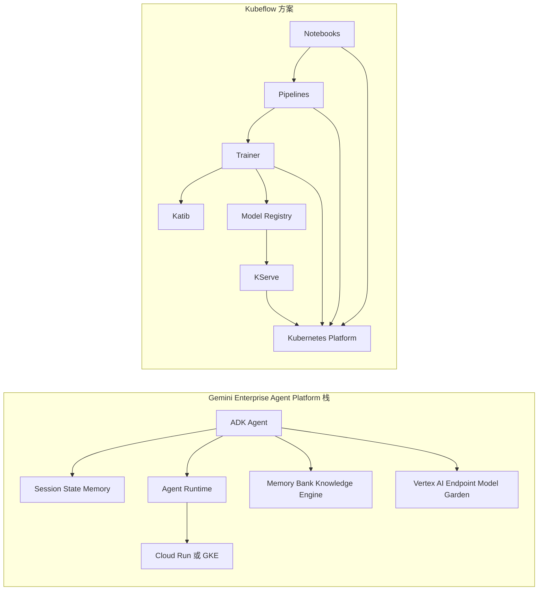

# Gemini Enterprise Agent Platform 和 Kubeflow 方案对比

## 1. 先给结论

如果你的目标是构建一个**面向企业用户的 AI Agent 应用层**，重点关注多轮对话、工具调用、长期记忆、评测、托管运行时，以及尽快在 Google Cloud 上上线，那么更适合的是 **Gemini Enterprise Agent Platform 栈**。

如果你的目标是构建一个**Kubernetes 上的通用 AI / ML 平台底座**，重点关注训练、分布式作业、Pipeline、模型注册、模型服务、多租户 GPU 集群与私有化控制，那么更适合的是 **Kubeflow 方案**。

这两者**不是完全同层竞争**：

- Gemini Enterprise Agent Platform 更偏 **agent application runtime + managed AI services**。
- Kubeflow 更偏 **self-hosted AI platform / MLOps reference platform**。

很多企业的最终形态不是二选一，而是：

- **用 Kubeflow 管训练、数据和模型生命周期**。
- **用 Gemini / ADK 管 Agent 应用、推理编排和企业级交互入口**。

## 2. 本文默认的“Gemini Enterprise Agent Platform”范围

“Gemini Enterprise Agent Platform”这个说法在实际交流里容易混用多个 Google 产品层。为了避免拿不同层级硬比，本文默认按下面这套实操栈理解：

- **ADK**：Google 的开源 Agent Development Kit，用于构建 agent、tool、workflow、memory、evaluation。
- **Agent Platform / Vertex AI endpoints**：托管模型与 agent 运行所依赖的云端能力。
- **Memory Bank / Knowledge Engine**：Google Cloud 提供的长期记忆与 RAG memory 能力。
- **Cloud Run / GKE 部署路径**：ADK agent 的托管与半托管运行方式。
- **Google Cloud 的观测、IAM、构建与网络能力**：用于生产落地。

如果你说的还包含 **Agentspace**，那它更接近“企业员工侧统一 AI 入口 / 工作台”，不是 Kubeflow 的直接对位项；Kubeflow 对应的是更底层的平台与生命周期能力。

## 3. 一句话区分两者

- **Gemini 栈**：帮你更快做出并运营一个企业级 Agent 产品。
- **Kubeflow 栈**：帮你搭出一个企业自己的 AI 平台底座。

## 4. 核心对比矩阵

| 维度 | Gemini Enterprise Agent Platform 栈 | Kubeflow 方案 |
|---|---|---|
| 核心定位 | 企业级 Agent 开发与运行栈 | Kubernetes 上的 AI / MLOps reference platform |
| 设计中心 | 对话式 agent、工具调用、多 Agent、记忆、评测、托管推理 | 训练、Pipeline、分布式作业、模型注册、模型服务、平台治理 |
| 默认交付模式 | Google Cloud managed services + ADK | 自建 / 自运维 Kubernetes 平台 |
| 主要抽象 | Agent、Tool、Session、State、Memory、Workflow、Runtime | Notebook、Pipeline、TrainJob、Katib、Registry、Serving |
| 生命周期覆盖 | 更强在 agent 应用层与推理编排层 | 更强在 AI 全生命周期与平台层 |
| 模型策略 | 对 Gemini 最友好，也能接 Agent Platform endpoint、Claude on Vertex、MaaS open models | 模型中立，但接入、训练、部署、治理主要靠你自己拼装 |
| 记忆能力 | 有 MemoryService、Memory Bank、RAG Memory 等一等公民能力 | 无原生 agent memory 抽象，通常需额外集成向量库 / RAG 组件 |
| RAG 路径 | 可直接走 Knowledge Engine / Agent Platform 相关能力 | 需自己组合向量库、索引、数据管道与服务层 |
| 编排重点 | 多 Agent 协作、图工作流、工具调用、会话执行 | ML workflow、训练流水线、批处理和部署流水线 |
| 运行位置 | Cloud Run、GKE、Google 托管能力 | 自有 Kubernetes 集群或托管 Kubernetes |
| 运维复杂度 | 中低到中，偏托管 | 中高到高，偏平台工程 |
| 可移植性 | 中，明显依赖 Google Cloud 语义 | 高，Kubernetes-native，跨云 / 私有化更强 |
| 治理方式 | IAM、Cloud Logging、Metrics、Traces、Cloud Build、API 权限 | Kubernetes、Istio、认证、网络策略、存储、Secrets、自建观测 |
| 成本结构 | 服务费 + 模型调用费 + 较低平台运维人力 | 基础设施费 + 较高平台工程与运维人力 |
| 最适合团队 | 想快做 agent 产品的应用团队 | 有平台团队、GPU 集群和私有化诉求的 AI 平台团队 |

## 5. 架构层级图

这张图的重点不是“谁更大”，而是两者的出发点不同：

- Gemini 栈从 **agent 交互与运行时** 往下连接模型与云能力。
- Kubeflow 从 **Kubernetes 平台与 AI 生命周期** 往上承接训练、部署与服务。

## 6. 分维度拆解

### 6.1 设计中心不同

ADK 的核心抽象是：

- Agent
- Tool
- Workflow Agent
- Session / State
- Memory
- Runner
- Evaluation

这说明 Google 这套栈首先在解决的问题是：

> 如何把一个能对话、会调用工具、可跨多轮会话、可评测、可部署的 agent 做成生产系统。

Kubeflow 的核心抽象则是：

- Notebook
- Pipeline
- TrainJob
- Hyperparameter Tuning
- Model Registry
- Serving

它首先解决的是：

> 如何在 Kubernetes 上把 AI / ML 的开发、训练、优化、注册、部署和服务流程平台化。

所以从第一性原理上看，**Gemini 栈更像“agent 产品工程栈”，Kubeflow 更像“AI 平台工程栈”**。

### 6.2 生命周期覆盖面不同

Kubeflow 官方架构非常明确，它覆盖的 AI lifecycle 包括：

- 数据准备
- 模型开发
- 模型训练
- 模型优化
- 模型注册
- 模型服务
- 生产反馈

这使它适合做企业自己的：

- 训练平台
- GPU 资源调度平台
- ML workflow 平台
- 私有化模型部署平台

Gemini Enterprise Agent Platform 栈虽然也能接入更广义的 Vertex AI 和 Google Cloud 数据能力，但**它本身不是一个像 Kubeflow 那样以完整训练生命周期为主线的统一平台**。它更强的是：

- 交互式推理应用
- 多 Agent 协作
- 工具和 API 编排
- 会话状态与长期记忆
- Agent 评测与调优

简单说：

- **Kubeflow 更像平台底座**。
- **Gemini 栈更像运行在平台之上的智能应用层**。

### 6.3 部署与运维模式不同

Gemini 栈的优势之一是托管能力更强。

从 ADK 官方文档看，agent 可以：

- 本地开发与调试。
- 部署到 Cloud Run。
- 部署到 GKE。
- 接入 Agent Platform / Vertex AI endpoint。

同时，Memory Bank、Knowledge Engine、托管模型 endpoint、本地与云端一致的 SDK 语义，让团队在“从原型到生产”时不必自己先造完整平台。

Kubeflow 的代价则更明显：

- 你需要 Kubernetes 基础。
- 往往需要处理认证、网络、存储、Ingress、Service Mesh、CRD 兼容。
- 多组件版本治理、升级、回滚都需要平台工程能力。

因此在运维复杂度上：

- **Gemini 栈通常低于 Kubeflow**。
- **Kubeflow 的控制权通常高于 Gemini 栈**。

### 6.4 模型策略与开放性不同

Gemini 栈并不只是“只能用 Gemini”。根据 ADK 官方文档，它支持：

- Gemini 模型。
- Agent Platform endpoint。
- Model Garden 部署的模型 endpoint。
- Fine-tuned model endpoint。
- Anthropic Claude on Agent Platform。
- MaaS open models，例如 Llama。

但这类开放性是**在 Google Cloud 语义内的开放**。也就是说，你依然是在 Google 提供的运行、权限和 endpoint 体系里工作。

Kubeflow 的开放性则是另一种：

- 不预设你必须用哪家模型厂商。
- 不预设你必须走哪家云的托管 endpoint。
- 你可以接 vLLM、Triton、KServe、自建推理镜像、私有模型仓库。

因此：

- 想快速用好 Google 生态内的模型与托管能力，Gemini 栈更顺。
- 想在多云、私有模型、异构框架之间保持最大控制权，Kubeflow 更合适。

### 6.5 记忆和 RAG 的成熟度不同

这是两者差别非常大的地方。

ADK 里，Memory 是一等公民：

- 有 `MemoryService` 抽象。
- 有 `Memory Bank` 做托管长期记忆。
- 有 `RAG Memory` 走 Knowledge Engine。
- Agent 可以通过预置工具或 callback 查询与写入 memory。

这意味着如果你做的是：

- 企业助理
- 客服 Agent
- Copilot
- 多轮业务助手

那么 Google 这套栈在“让 agent 记住人和上下文”这件事上有天然优势。

Kubeflow 本身没有把“agent memory”定义成核心平台对象。你当然可以在 Kubeflow 上自己拼：

- 向量库
- RAG pipeline
- 文档摄取
- 会话数据库
- 总结写回机制

但那是**你自己实现的上层应用能力**，不是 Kubeflow 自带的一等能力。

### 6.6 编排能力的侧重点不同

ADK 的 workflow 更偏：

- 多 agent 协作
- 图工作流
- 顺序、并行、循环 agent
- 工具调用
- 人类输入
- 事件驱动与会话执行

它解决的是“一个 agent 如何思考、调用工具、切换子 agent、沿会话前进”。

Kubeflow Pipelines 的编排更偏：

- 数据处理步骤
- 模型训练步骤
- 评估步骤
- 部署步骤
- 可复现 pipeline 执行

它解决的是“一个 ML workflow 如何以 job 形式在集群里被可靠执行”。

所以如果你问：

> 哪个更适合在线推理场景中的多轮 agent 编排？

答案通常是 **Gemini 栈**。

如果你问：

> 哪个更适合离线训练、批量评估、周期性重训练和模型发布流水线？

答案通常是 **Kubeflow**。

### 6.7 企业治理与安全边界不同

Gemini Enterprise Agent Platform 栈天然继承 Google Cloud 的一部分企业治理能力，例如：

- IAM
- Cloud Logging
- Metrics / Traces
- Cloud Build
- GKE / Cloud Run 部署权限模型

这会让很多企业团队在上线时更快进入“可审计、可观察、可控权限”的状态。

Kubeflow 也能达到很强的企业治理水平，但它通常要求你自己建设和整合：

- 身份认证
- 租户隔离
- 网络策略
- 镜像与制品治理
- Service Mesh
- Secret 管理
- 观测与告警

因此：

- **Gemini 栈的治理更偏托管型治理**。
- **Kubeflow 的治理更偏自建型治理**。

### 6.8 成本结构不同

Gemini 栈的典型成本是：

- 模型调用费用。
- 托管服务费用。
- Cloud Run / GKE / 存储 / 检索等云资源费用。
- 较少的平台自研与运维人力。

Kubeflow 的典型成本是：

- Kubernetes 集群和 GPU 资源费用。
- 平台团队的人力成本。
- 集成、升级、稳定性治理成本。
- 更高的长期平台 ownership。

因此它们不是简单的“哪个更便宜”，而是：

- **Gemini 栈更像买能力，减少自建。**
- **Kubeflow 更像买控制权，增加自建。**

## 7. 什么时候选 Gemini 栈

更适合你的场景包括：

- 你要做企业知识助手、客服 Agent、员工 Copilot、业务流程 Agent。
- 你最关心的是多轮对话、工具调用、长期记忆、评测和快速上线。
- 你已经接受 Google Cloud 作为主平台。
- 你不想先建设一个重型的自有 MLOps 平台。
- 你希望团队以应用工程师为主，而不是先组建一支 Kubernetes 平台团队。

## 8. 什么时候选 Kubeflow

更适合你的场景包括：

- 你要建设企业统一 AI 平台，而不是单个 agent 产品。
- 你有大量训练、微调、批量任务、GPU 调度、模型注册和私有部署需求。
- 你需要跨云、私有化或混合云控制权。
- 你希望模型 serving、training、pipeline 都建立在 Kubernetes 原生能力上。
- 你有足够强的平台工程团队来维护复杂性。

## 9. 什么时候两者组合最好

下面这种组合非常常见，也往往最现实：

- **Kubeflow** 负责：数据准备、训练、微调、评估流水线、模型注册、私有 serving。
- **Gemini / ADK** 负责：Agent 应用层、工具编排、记忆、交互体验、线上任务执行。

例如：

1. 企业内部用 Kubeflow 训练或微调自己的领域模型。
2. 模型作为 endpoint 或服务暴露出来。
3. 上层用 ADK 构建企业 Copilot 或业务 Agent。
4. ADK agent 再去调用这些模型服务、RAG 服务、内部 API 和业务系统。

这时两者关系不是替代，而是分层：

- **Kubeflow 在下层做模型和平台。**
- **Gemini 栈在上层做 agent 和交互。**

## 10. 最容易犯的两个误区

### 10.1 误区一：Gemini Enterprise Agent Platform 可以直接替代 Kubeflow

不准确。

如果你的核心问题是：

- 训练作业怎么调度
- GPU 集群怎么管理
- Pipeline 怎么复现
- 模型版本怎么治理
- 私有化推理怎么托管

那么 Gemini 栈并不能天然替代 Kubeflow 这类平台。

它更像是把“agent 应用”这层做得更强，而不是把“企业 AI 平台底座”整个吃掉。

### 10.2 误区二：Kubeflow 天然就是企业 Agent 平台

也不准确。

Kubeflow 可以成为 enterprise agent platform 的基础设施一部分，但它不等于一个现成的 agent product stack。要把 Kubeflow 变成类似 Gemini 栈那样的企业 Agent 平台，你通常还要补很多层：

- agent runtime
- tool calling framework
- session / state 管理
- long-term memory
- online agent evaluation
- human-in-the-loop
- prompt / policy / guardrail 层

## 11. 决策建议

如果你想快速做决策，可以直接按下面这条规则：

- **先问自己是在做“AI 平台”还是在做“Agent 产品”。**
- 做 **Agent 产品**，优先看 Gemini Enterprise Agent Platform 栈。
- 做 **AI 平台**，优先看 Kubeflow。
- 两者都要，优先采用 **分层组合**，不要强行让一个平台独自承担两层职责。

## 12. 与现有知识库的关系

如果你想继续展开，可以结合这些已有笔记一起看：

- [[Gemini-Kubeflow-Dify-LangGraph-四方对比]]：如果你要把 Gemini、Kubeflow、Dify、LangGraph 放在同一个选型框架里看，优先读这篇。
- [[AI-Agent-架构与框架全景指南]]：理解 agent framework、runtime 和工具编排的分层。
- [[MLOps-开源平台对比]]：理解 Kubeflow 在 MLOps 全景中的位置。
- [[Kubeflow-官方指南中文]]：理解 Kubeflow 的架构、组件和安装路径。
- [[ML-Lifecycle-Management-官方文档总结]]：理解平台视角下的完整生命周期治理。

## 13. Sources

- https://adk.dev/
- https://adk.dev/get-started/about/
- https://adk.dev/agents/models/agent-platform/
- https://adk.dev/deploy/gke/
- https://adk.dev/sessions/memory/
- https://www.kubeflow.org/docs/started/architecture/
- https://www.kubeflow.org/docs/components/pipelines/
- https://www.kubeflow.org/docs/components/trainer/
- https://www.kubeflow.org/docs/components/katib/
- https://www.kubeflow.org/docs/components/hub/

## 14. Update History

- 2026-06-12: 初次创建，建立 Gemini Enterprise Agent Platform 与 Kubeflow 的分层对比框架，并补充选型建议。