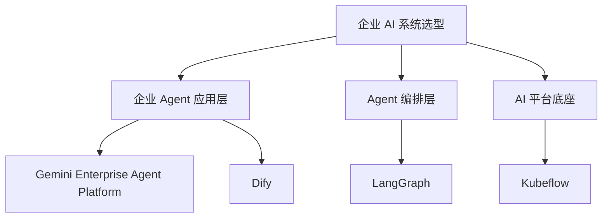
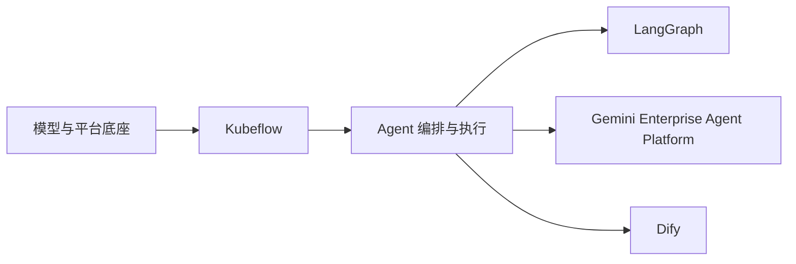

# Gemini、Kubeflow、Dify、LangGraph 四方对比

## 1. 先给结论

这四个名字经常会在“企业要做 AI Agent 平台”这个话题里一起出现，但它们其实分属不同层级：

- **Gemini Enterprise Agent Platform 栈**：偏 **托管型企业 Agent 栈**。
- **Kubeflow**：偏 **Kubernetes-native AI 平台底座**。
- **Dify**：偏 **开源低代码 AI 应用与 agentic workflow 平台**。
- **LangGraph**：偏 **代码优先的低层 Agent 编排框架**。

如果只用一句话来判断：

- 想要 **Google Cloud 上较完整的企业 Agent 栈**，优先看 **Gemini**。
- 想要 **自建 AI 平台和训练部署底座**，优先看 **Kubeflow**。
- 想要 **快速搭建可视化 AI 应用或工作流产品**，优先看 **Dify**。
- 想要 **自己精细编排长流程、长状态、多 Agent runtime**，优先看 **LangGraph**。

## 2. 为什么它们容易被混在一起

因为这四者都可能出现在同一条交付链路里：

- 企业想做一个 AI 助手或 Copilot。
- 需要模型、工作流、工具调用、记忆、上线部署。
- 还可能要训练、评测、私有化、审计和多租户治理。

但真正的问题在于，这些能力并不都由同一层来承担。

更准确的理解方式是：

- **Gemini** 和 **Dify** 更靠近 **应用交付层**。
- **LangGraph** 更靠近 **编排与 runtime 层**。
- **Kubeflow** 更靠近 **模型平台与基础设施层**。

## 3. 四者一句话定位

| 方案 | 一句话定位 |
|---|---|
| Gemini Enterprise Agent Platform 栈 | Google Cloud 上面向企业 Agent 的托管开发与运行栈 |
| Kubeflow | Kubernetes 上的 AI / MLOps reference platform |
| Dify | 开源、可视化、低代码的 AI 应用与 agentic workflow 平台 |
| LangGraph | 面向长运行、强状态 Agent 的低层 orchestration framework 和 runtime |

## 4. 先放回正确层级

这张图想表达的重点是：

- **Gemini** 和 **Dify** 更像“我要交付一个 AI 产品”的答案。
- **LangGraph** 更像“我要自己写出 agent runtime”的答案。
- **Kubeflow** 更像“我要搭 AI 平台基础设施”的答案。

## 5. 核心对比矩阵

| 维度 | Gemini Enterprise Agent Platform 栈 | Kubeflow | Dify | LangGraph |
|---|---|---|---|---|
| 核心定位 | 托管型企业 Agent 栈 | Kubernetes AI 平台底座 | 开源低代码 AI 应用平台 | 低层 Agent 编排框架 |
| 主要用户 | 企业应用团队、平台化产品团队 | AI 平台团队、MLOps 团队 | 产品团队、解决方案团队、全栈团队 | 资深应用工程师、Agent 工程团队 |
| 抽象层级 | 中高 | 中低 | 高 | 低 |
| 开发方式 | 代码优先，结合托管云服务 | 平台优先，组件集成为主 | 可视化优先，低代码为主 | 代码优先，图编排为主 |
| 默认交付模式 | Google Cloud managed services + ADK | 自建 / 自运维 Kubernetes | 自托管开源平台或平台化部署 | 作为代码库 / 服务的一部分集成 |
| 设计中心 | Agent、Tool、Session、Memory、Evaluation | Pipeline、TrainJob、Registry、Serving | Workflow、Tool、Knowledge、AI App | State、Node、Edge、Persistence、HITL |
| 强项 | 企业级 Agent、记忆、托管推理、GCP 集成 | 训练、调度、模型生命周期、私有化 | 快速交付 AI 应用、可视化编排、业务上手快 | 长流程、强状态、复杂控制、工程可定制 |
| 弱项 | GCP 依赖较强 | 运维复杂、上手重 | 深度定制和低层控制不如代码框架 | 产品壳、后台运营面和低代码体验较弱 |
| 记忆能力 | MemoryService、Memory Bank、RAG Memory | 需自建或外接 | 更偏知识库与应用侧上下文管理 | 原生支持短期和长期 memory 模式 |
| 工作流特点 | 多 Agent、图工作流、工具调用、会话驱动 | ML pipeline、训练与发布流水线 | 可视化业务流程和 agentic workflow | 长运行状态机、durable execution、HITL |
| 模型策略 | 最适合 Gemini，也可接 Vertex endpoint、Claude、open models | 模型中立，自由接入 | 模型中立，偏应用层 provider 接入 | 模型中立，开发者自行组合 |
| 训练 / 微调 | 不是主中心，但可接 Vertex 能力 | 核心强项 | 不是主中心 | 不是主中心 |
| 私有化控制 | 中 | 高 | 中高 | 高 |
| 云厂商锁定 | 中高，偏 Google Cloud | 低到中 | 中 | 低 |
| 上线速度 | 快 | 慢 | 很快 | 中 |
| 最适合的问题 | 企业 Agent 产品怎么快速上线 | 企业 AI 平台怎么建设 | 业务 AI 应用怎么快速落地 | 复杂 Agent 如何工程化控制 |

## 6. 分别怎么理解

### 6.1 Gemini Enterprise Agent Platform 栈

这一路线更像：

> 我已经接受 Google Cloud 作为主平台，现在要把企业 Agent 做成生产系统。

它的典型组成包括：

- ADK
- Agent Platform / Vertex AI endpoint
- Memory Bank / Knowledge Engine
- Cloud Run / GKE
- Cloud Logging、Metrics、Traces、IAM

它强在：

- Agent 抽象比较完整。
- 长期记忆、RAG memory、evaluation 都是体系内能力。
- 生产治理更容易接入 Google Cloud 企业边界。
- 从原型到生产的路径更短。

它弱在：

- 对 Google Cloud 语义依赖明显。
- 不是以训练平台、模型调度平台为中心设计的。

### 6.2 Kubeflow

这一路线更像：

> 我要建设企业自己的 AI 平台，而不只是上线一个 Agent 应用。

它强在：

- 覆盖训练、优化、注册、部署、服务等完整生命周期。
- 适合 GPU 集群、多租户、私有化或混合云场景。
- Kubernetes-native，可与 KServe、Katib、Trainer、Pipelines 等组合。

它弱在：

- 运维成本高。
- 需要平台工程能力。
- 不直接等于一个开箱即用的企业 Agent 产品栈。

### 6.3 Dify

Dify 的官方引言非常直接：它是一个 **open-source platform for building agentic workflows**，强调：

- 可视化定义流程。
- 连接已有工具和数据源。
- 部署解决实际问题的 AI 应用。

所以 Dify 更像：

> 我想用尽量少的底层工程工作，快速搭出一个 AI 应用、内部助手或工作流产品。

它强在：

- 低代码和可视化体验友好。
- 业务团队和解决方案团队更容易参与。
- 从 demo 到可运营应用的速度快。
- 开源、自托管友好，云厂商绑定弱于托管型闭环方案。

它弱在：

- 对极复杂的底层 runtime 控制，通常不如 LangGraph 这类代码框架。
- 对训练平台、模型生命周期、GPU 调度等平台问题并不是主解。

### 6.4 LangGraph

LangGraph 官方定位很清楚：它是 **low-level orchestration framework and runtime for building, managing, and deploying long-running, stateful agents**。

核心关键词包括：

- Persistence
- Human-in-the-loop
- Comprehensive memory
- Production-ready deployment

因此 LangGraph 更像：

> 我需要自己掌握 agent 的状态、节点、边、恢复、中断、回放和人工介入。

它强在：

- 复杂 agent 行为可精细控制。
- 非常适合长流程、强状态、多阶段系统。
- 可把 durable execution 和人工审批做成底层原语。

它弱在：

- 不是一个现成的“产品平台”。
- 没有像 Dify 那样天然面向业务使用者的可视化后台壳。
- 没有像 Gemini 栈那样成体系地附带云托管服务闭环。

## 7. 真正的差异不在“谁更强”，而在“谁在解决哪一层问题”

### 7.1 Gemini vs Dify

这两个最容易被放在一起，因为都能支撑企业 AI 应用交付。

关键区别：

- **Gemini 栈**：更偏 **托管、代码优先、Google Cloud 深集成、企业级 Agent 栈**。
- **Dify**：更偏 **开源、自托管、低代码、业务交付效率**。

简单说：

- 已经站在 GCP 体系内，且要深做企业 Agent，优先 Gemini。
- 想快速做可视化 AI 应用平台，且更重视开源与自托管灵活性，优先 Dify。

### 7.2 Gemini vs LangGraph

这两个都更偏代码优先，但重点不同：

- **Gemini 栈**：强在完整托管生态与企业交付闭环。
- **LangGraph**：强在你自己掌控 orchestration runtime。

简单说：

- 要“更快上线企业 Agent 系统”，偏 Gemini。
- 要“自己定义 Agent 的大脑和神经系统”，偏 LangGraph。

### 7.3 Dify vs LangGraph

这是“低代码平台”和“低层框架”的典型对比。

- **Dify**：让你更快交付应用。
- **LangGraph**：让你更深控制执行。

简单说：

- 要速度、可视化、业务可参与，选 Dify。
- 要复杂逻辑、长状态、可恢复、HITL，选 LangGraph。

### 7.4 Kubeflow vs 其他三者

Kubeflow 和另外三者最根本的差别是：它不是主要在解决“Agent 应用怎么做”，而是在解决：

- 模型怎么训练
- 作业怎么调度
- Pipeline 怎么执行
- 模型怎么注册
- 服务怎么平台化部署

所以 Kubeflow 常常不是 Gemini、Dify、LangGraph 的替代品，而是它们的下层基础设施候选。

## 8. 典型选型场景

### 8.1 你要在两周内做一个企业知识助手

优先级通常是：

1. 已深度使用 GCP：**Gemini 栈**
2. 需要开源低代码和快速业务交付：**Dify**

### 8.2 你要构建复杂的多 Agent 调度系统

优先级通常是：

1. **LangGraph**
2. 如果同时需要托管云闭环，再考虑 **Gemini 栈**

### 8.3 你要建设统一 AI 平台

优先级通常是：

1. **Kubeflow**
2. 上层再叠加 **Gemini / Dify / LangGraph**

### 8.4 你要让业务团队也能参与搭建应用

优先级通常是：

1. **Dify**
2. 如果团队以工程师为主而非业务配置者，再看 **Gemini** 或 **LangGraph**

## 9. 最现实的组合方式

很多企业最后不是四选一，而是组合。

### 9.1 Kubeflow + Gemini

- Kubeflow 负责训练、微调、模型资产与私有 serving。
- Gemini 栈负责上层企业 Agent、记忆、工具编排与生产接入。

### 9.2 Kubeflow + LangGraph

- Kubeflow 负责模型和平台底座。
- LangGraph 负责复杂 Agent runtime 和业务执行逻辑。

### 9.3 Dify + 自有模型 / 自有平台

- Dify 负责快速交付 AI 应用、可视化 workflow 和运营面。
- 下层模型服务与数据服务由企业自己托管。

### 9.4 Gemini + Dify

这种组合不是最典型，但也可能出现：

- 模型与部分能力使用 Gemini。
- 应用入口或快速原型层借助 Dify 完成交付。

但通常这条路要额外注意职责重叠，避免两个上层平台同时承担应用编排。

## 10. 最简决策规则

如果你现在只想快速判断，直接按下面这张表：

| 你的核心问题 | 更优先的方向 |
|---|---|
| 如何最快做出企业级 Agent 产品 | Gemini Enterprise Agent Platform 栈 |
| 如何建设统一训练部署平台 | Kubeflow |
| 如何让业务和产品团队快速搭应用 | Dify |
| 如何精细控制长运行、多状态 Agent | LangGraph |

## 11. 你可以这样理解四者关系

这个图不是严格架构图，而是帮助记忆：

- **Kubeflow** 更靠底层平台。
- **LangGraph** 更靠编排内核。
- **Gemini** 和 **Dify** 更靠应用交付。

## 12. 与现有知识库的关系

建议结合以下笔记一起看：

- [[Gemini-Enterprise-Agent-Platform-vs-Kubeflow-对比]]：聚焦 Gemini 栈和 Kubeflow 的双边分层比较。
- [[AI-Agent-架构与框架全景指南]]：理解 Agent framework 与 runtime 的大图景。
- [[LangGraph-ReAct-Agent实战指南]]：理解 LangGraph 的工程化方式。
- [[MLOps-开源平台对比]]：理解 Kubeflow 在 MLOps 生态中的准确位置。
- [[Kubeflow-官方指南中文]]：理解 Kubeflow 组件和安装架构。

## 13. Sources

- https://adk.dev/
- https://adk.dev/get-started/about/
- https://adk.dev/agents/models/agent-platform/
- https://adk.dev/sessions/memory/
- https://www.kubeflow.org/docs/started/architecture/
- https://docs.dify.ai/en/introduction
- https://docs.langchain.com/langgraph
- https://langchain-ai.github.io/langgraph/

## 14. Update History

- 2026-06-12: 初次创建，建立 Gemini、Kubeflow、Dify、LangGraph 四方对比框架，并给出分层选型建议和组合方式。