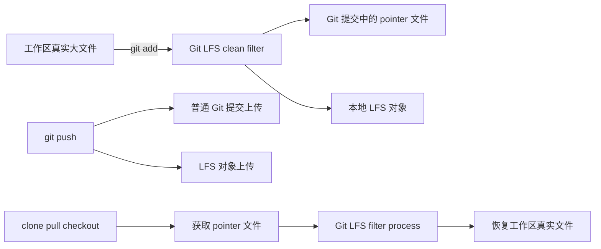

# Git LFS 工作原理与配置指南

Git LFS, Git Large File Storage, 是 Git 针对大体积二进制文件的一层旁路存储机制。它的核心思路不是让 Git 真正高效地保存大文件，而是让 Git 仓库里只保留一个很小的指针文件，真实的大文件内容则上传到 GitHub 的 LFS 存储。

这能解决两个典型问题：

1. Git 对大二进制文件的版本管理效率很差，历史仓库会迅速膨胀。
2. GitHub 普通 Git 仓库对单个大文件有严格限制，超过 100 MiB 会直接拒绝 push。

## 1. Git LFS 是怎么工作的

### 1.1 核心机制

Git LFS 通过 Git filter 机制拦截大文件的提交和检出流程：

1. 你在工作区看到的是完整的大文件。
2. 你执行 `git add` 时，Git LFS 的 `clean filter` 会把真实文件内容保存到本地 LFS 对象区，并把待提交内容替换成一个很小的 pointer 文件。
3. 你执行 `git commit` 时，Git 仓库真正记录的是这个 pointer 文件。
4. 你执行 `git push` 时，普通 Git 对象上传到 GitHub 仓库，LFS 对象则单独上传到 GitHub LFS 存储。
5. 其他人在 `clone`、`pull`、`checkout` 时，Git 先拿到 pointer 文件，然后 Git LFS 再根据 pointer 下载真实文件并恢复到工作区。



### 1.2 Pointer 文件长什么样

GitHub 官方文档给出的 pointer 文件格式大致如下：

```text
version https://git-lfs.github.com/spec/v1
oid sha256:4cac19622fc3ada9c0fdeadb33f88f367b541f38b89102a3f1261ac81fd5bcb5
size 84977953
```

含义分别是：

1. `version`: Git LFS pointer 规范版本。
2. `oid`: 真实文件内容的哈希标识。
3. `size`: 原始文件大小。

也就是说，Git 历史里保存的是几十到几百字节的文本指针，不是原始的 `.pptx`、`.mp4` 本体。

## 2. 需要做什么配置

### 2.1 客户端安装

每个会操作仓库大文件的人，本地都需要安装 Git LFS。典型安装后先执行一次：

```bash
git lfs install
```

这一步会配置 Git 所需的 filter，并安装相关 hook。

### 2.2 仓库级追踪规则

你需要告诉 Git LFS 哪些文件类型要走 LFS。标准方式是：

```bash
git lfs track "*.pptx"
git lfs track "*.mp4"
```

这会自动修改仓库里的 `.gitattributes`。例如：

```gitattributes
*.pptx filter=lfs diff=lfs merge=lfs -text
*.mp4 filter=lfs diff=lfs merge=lfs -text
```

必须把 `.gitattributes` 提交进仓库，而不是只放在个人全局配置里。否则别人 clone 后不知道哪些类型需要走 LFS，也更容易出现 pointer 文件和真实文件混乱的问题。

### 2.3 日常提交流程

对新文件的标准流程是：

```bash
git lfs install
git lfs track "*.pptx"
git lfs track "*.mp4"
git add .gitattributes
git add your-file.pptx demo.mp4
git commit -m "track large binaries with lfs"
git push
```

push 时你会看到两类上传：

1. 普通 Git 提交上传。
2. LFS 对象上传。

## 3. 已有仓库该怎么切换到 LFS

这里分两种场景。

### 3.1 只从现在开始接管，不改历史

这是最稳妥、最常见的方式，适合已经 push 到远端且不想 force-push 的仓库。

做法是：

```bash
git lfs install --local
git lfs track "*.pptx"
git lfs track "*.mp4"
git add .gitattributes
git ls-files -z '*.pptx' '*.mp4' | xargs -0 git add --renormalize --
git commit -m "track pptx and mp4 with git lfs"
git push
```

含义是：

1. 历史提交不变。
2. 从这次提交开始，当前版本的这些文件改为 LFS pointer。
3. 不需要重写历史，也不需要 force-push。

### 3.2 连历史里的大文件也改成 LFS

如果你想让旧提交里的大文件也不再是普通 Git blob，就需要改写历史：

```bash
git lfs migrate import --include="*.pptx,*.mp4"
git push --force-with-lease
```

这条路径要谨慎，因为它会改 commit SHA。只要仓库已有协作者，就必须先协调，否则别人本地分支会和远端历史发生冲突。

## 4. GitHub 上的限制和计费规则

### 4.1 单文件大小限制

根据 GitHub 官方文档，Git LFS 的单文件上限和套餐有关：

1. GitHub Free: 2 GB
2. GitHub Pro: 2 GB
3. GitHub Team: 4 GB
4. GitHub Enterprise Cloud: 5 GB

超过对应上限的文件会被 Git LFS 拒绝。

### 4.2 免费额度

GitHub 官方文档当前给出的 LFS 免费额度是：

1. GitHub Free / Pro / Free for organizations: 10 GiB 存储 + 10 GiB 月下载带宽
2. GitHub Team / Enterprise Cloud: 250 GiB 存储 + 250 GiB 月下载带宽

### 4.3 计费方式的关键点

GitHub LFS 不是只看文件当前大小，而是按对象和下载量累计：

1. 每 push 一个新版本，按整文件大小计入存储，不是只算 diff。
2. 每次下载 LFS 文件，计入带宽。
3. GitHub Actions 下载 LFS 文件，也计入带宽。
4. fork 后的下载，带宽仍算到原仓库 owner 名下。

一个很容易忽略的点是：你修改一个 500 MB 的视频哪怕只改了 1 字节，再 push 一次，也会再增加 500 MB 的 LFS 存储占用。

### 4.4 超额后的行为

根据 GitHub 官方文档：

1. 如果超过免费额度且没有支付方式，LFS 上传会被阻止。
2. 如果超出存储额度，用户仍可 clone 仓库，但可能只能拿到 pointer 文件而非真实对象。
3. 如果超出月带宽额度，LFS 功能可能会在当月余下时间被禁用，直到下个计费周期恢复。

## 5. 协作和仓库治理上的注意事项

### 5.1 所有协作者都要装 Git LFS

如果协作者本机没有安装 Git LFS，常见现象是：

1. clone 下来拿到的是 pointer 文件文本。
2. push 时可能无法正确上传 LFS 对象。
3. 某些自动化流程会把 pointer 当成真实文件，导致构建或处理失败。

### 5.2 `.gitattributes` 必须入库

这不是可选项，而是团队协作的基础配置。它决定：

1. 哪些文件类型会被 clean 为 pointer。
2. clone 或 fork 后其他人是否自动继承同样规则。
3. GitHub 生成 ZIP 或 tarball 时，是否可以按仓库设置选择包含 LFS 对象。

### 5.3 Git LFS 不能解决所有历史问题

如果一个超过 100 MiB 的文件已经作为普通 Git blob 进入了待 push 的提交历史，那么：

1. 你后来把它删掉，也不代表 GitHub 会接受 push。
2. 你后来开始使用 LFS，也不会自动抹掉那段历史中的普通 blob。
3. 需要改写历史，或者把本地尚未推送的提交重做成不含该 blob 的版本。

## 6. 当前仓库的实际配置

这个仓库当前已经完成了 Git LFS 基础配置：

1. [.gitattributes](.gitattributes) 已配置 `*.pptx` 和 `*.mp4` 走 LFS。
2. [.gitignore](.gitignore) 已补充 `.pptx` 压缩中间产物的忽略规则。
3. 当前仓库中的 `.pptx` 和 `.mp4` 已按“从现在开始接管，不改历史”的方式迁入 LFS。

## 7. 推荐操作模板

### 7.1 新仓库从一开始就启用 LFS

```bash
git lfs install
git lfs track "*.pptx" "*.mp4" "*.psd"
git add .gitattributes
git commit -m "configure git lfs"
```

### 7.2 已有仓库新增大文件类型

```bash
git lfs track "*.zip"
git add .gitattributes
git ls-files -z '*.zip' | xargs -0 git add --renormalize --
git commit -m "track zip with git lfs"
git push
```

### 7.3 查看当前 LFS 状态

```bash
git lfs ls-files
git lfs status
git lfs env
```

## 参考链接

1. https://docs.github.com/en/repositories/working-with-files/managing-large-files/about-git-large-file-storage
2. https://docs.github.com/en/repositories/working-with-files/managing-large-files/configuring-git-large-file-storage
3. https://docs.github.com/en/billing/concepts/product-billing/git-lfs

## Update History

- 2026-06-09: 初次创建，结合 GitHub 官方文档和当前仓库实际配置，整理 Git LFS 的工作机制、配置步骤、协作要求与计费边界。