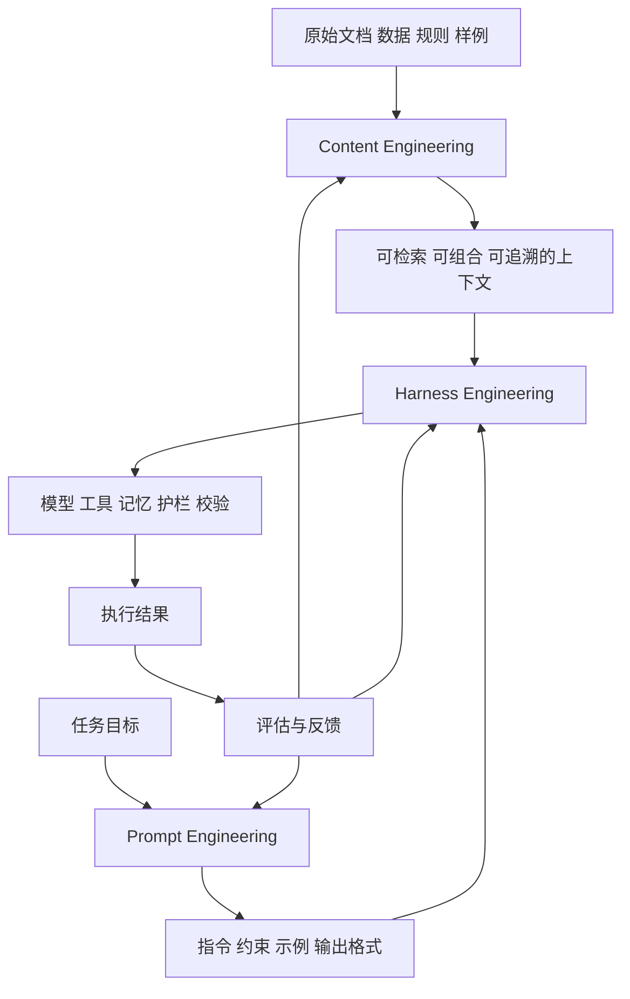

# Harness Engineering、Content Engineering 与 Prompt Engineering 的区别与联系

## 1. 核心结论

这三个概念不是互斥关系，而是三个不同层级的工程面向：

- **Prompt Engineering**：工程化设计“给模型下什么指令”。
- **Content Engineering**：工程化设计“给模型喂什么内容”。
- **Harness Engineering**：工程化设计“模型在怎样的运行时里完成任务”。

如果压缩成一句话：

```text
Prompt 决定表达方式，
Content 决定知识底座，
Harness 决定执行系统。
```

也可以把它们理解为一个生产级 AI 系统的三层分工：

$$
AI\ System\ Effectiveness \approx Prompt\ Quality \times Content\ Quality \times Harness\ Quality
$$

只要其中一项接近 0，系统整体效果通常就会明显下滑。

### 1.1 术语说明

- **Prompt Engineering** 是最成熟、最标准化的术语。
- **Harness Engineering** 是近两年 Agent 工程化里更偏系统层的说法，和 **Agent Runtime Engineering**、**Scaffolding**、**Orchestration** 很接近。
- **Content Engineering** 在 AI 领域还不是完全统一的标准术语。很多社区更常使用 **Context Engineering**。本文采用较窄的工作定义：**把原始文档、规则、样例、记忆和检索结果加工成可供模型稳定消费的上下文资产**。

因此，若把这三个词放在同一张图里理解，最稳妥的结论不是“谁取代谁”，而是：**Prompt 在指令层，Content 在知识层，Harness 在系统层。**

## 2. 三者的分层关系



这个图表达的是：

- **Content Engineering** 负责把知识素材变成“可喂给模型的上下文”。
- **Prompt Engineering** 负责定义模型如何使用这些上下文。
- **Harness Engineering** 负责把上下文、提示词、工具、记忆、校验和护栏装配成一个可执行闭环。

## 3. 三者分别在做什么

### 3.1 Prompt Engineering

Prompt Engineering 的核心对象是**模型输入中的指令层**。

它主要解决的问题是：

- 让模型明确自己的角色。
- 让模型知道任务目标和输出格式。
- 让模型按指定步骤思考或执行。
- 让模型减少歧义、跑偏和格式错误。

典型工作包括：

- 写 system prompt、task prompt、few-shot 示例。
- 定义输出结构、字段约束、判分标准。
- 设计拒答条件、边界条件、反例提示。
- 为工具调用写清晰的工具描述和参数约束。

它最常见的成果物是：

- 系统提示词。
- 任务模板。
- Few-shot 示例集。
- 输出 schema。
- evaluator prompt。

它最常见的失败信号是：

- 输出格式不稳定。
- 风格不符合预期。
- 明明知道知识却答非所问。
- 同一内容换个说法就效果骤降。

### 3.2 Content Engineering

Content Engineering 的核心对象是**模型所依赖的知识和上下文资产**。

它主要解决的问题是：

- 模型该基于哪些事实作答。
- 外部知识如何被切分、组织、检索和拼装。
- 哪些内容是权威版本，哪些内容已经过时。
- 如何让上下文既足够完整，又不过度噪声化。

典型工作包括：

- 建立 canonical source，也就是权威内容源。
- 设计文档切分、metadata、标签和引用结构。
- 维护 FAQ、知识卡片、摘要层和术语表。
- 为 RAG 设计 chunk、检索、重排和去重策略。
- 管理长期记忆、短期记忆、案例库和示例库。

它最常见的成果物是：

- 知识库文档。
- 可检索片段和 metadata。
- 结构化事实表、术语表、实体关系。
- 记忆条目、案例样本、标准答案片段。
- 用于注入上下文的摘要块和引用块。

它最常见的失败信号是：

- 回答有道理但事实不准。
- 引用的是旧版本或错误版本内容。
- 检索召回不到关键证据。
- 上下文太长、太杂、彼此冲突。

需要特别注意的是：**RAG 只是 Content Engineering 的一个实现机制，不等于 Content Engineering 本身。**
Content Engineering 关心的是“知识资产如何被生产、治理和消费”，RAG 只是其中的检索与注入手段。

### 3.3 Harness Engineering

Harness Engineering 的核心对象是**模型所在的执行运行时**。

它主要解决的问题是：

- 模型如何调用工具。
- 多步任务如何编排、暂停、重试和终止。
- 哪些动作需要权限校验或人工审批。
- 如何记录轨迹、监控成本、评估结果和追责审计。

典型工作包括：

- 设计 Agent 循环与 workflow。
- 定义工具 schema、接口约束和错误恢复机制。
- 构建 sandbox、权限系统、policy guardrails。
- 配置记忆接口、检索接口和状态管理。
- 加入 evaluator、自动测试、停机条件和人工确认点。

它最常见的成果物是：

- Agent runtime。
- Tool contracts。
- Workflow graph。
- Sandbox 与安全策略。
- 评测 harness、日志、观察面板、审计轨迹。

它最常见的失败信号是：

- Agent 无限循环或过度试错。
- 工具会用但用错顺序。
- 本该人工审批的操作被直接执行。
- 出错后不会恢复，也无法定位问题出在哪一层。

## 4. 核心区别对比表

| 维度 | Prompt Engineering | Content Engineering | Harness Engineering |
| :--- | :--- | :--- | :--- |
| **核心问题** | 怎么告诉模型做事 | 给模型什么知识和上下文 | 整个系统如何可靠运行 |
| **主要对象** | 指令、示例、输出格式 | 文档、事实、记忆、检索结果 | 工具、流程、状态、护栏、评测 |
| **作用层级** | 单次调用或局部交互 | 调用前后的知识供给层 | 端到端运行时与控制层 |
| **直接目标** | 提高服从性和表达质量 | 提高 grounding、准确率和新鲜度 | 提高完成度、安全性和可运维性 |
| **典型技术** | system prompt、few-shot、schema、evaluator prompt | chunking、metadata、RAG、summary、memory、知识图谱 | tool use、workflow、policy、sandbox、HITL、observability |
| **典型产物** | Prompt 模板、示例集、输出规范 | 知识库、上下文包、案例库、引用层 | Agent runtime、工具接口、审批与审计机制 |
| **评估指标** | 格式符合率、指令遵循度、首答质量 | 召回率、引用质量、事实正确率、知识新鲜度 | 任务完成率、安全事件率、延迟、成本、可追踪性 |
| **常见失效** | 跑题、格式错、语气不稳 | 幻觉、引用旧内容、证据不足 | 乱用工具、死循环、越权执行、难以调试 |

## 5. 三者之间的联系

### 5.1 Prompt 是“解释器”，Content 是“燃料”

同样一批上下文，Prompt 不同，模型使用方式就不同。

例如：

- 一个 Prompt 让模型“总结文档”，模型会抽象概括。
- 另一个 Prompt 让模型“逐条引用并判断冲突”，模型会进入比对模式。

所以，**Content 决定模型能知道什么，Prompt 决定模型如何使用这些内容。**

### 5.2 Harness 把 Prompt 和 Content 变成可执行系统

没有 Harness，Prompt 和 Content 常常只停留在单轮问答层。

一旦任务变成：

- 多轮推理。
- 检索后再决策。
- 调工具后再校验。
- 出错要重试。
- 高风险动作要审批。

就需要 Harness 把三件事装配起来：

1. 先拿到合适内容。
2. 再用合适 Prompt 驱动模型。
3. 再把模型放进有工具、有状态、有护栏的运行时里执行。

### 5.3 三者是“分工不同”，不是“前后淘汰”

很多文章喜欢说“某某工程取代了 Prompt Engineering”。更准确的说法是：

- 在**单轮、轻任务**里，Prompt Engineering 往往就够。
- 在**知识密集型问答**里，Content Engineering 比单纯改 Prompt 更关键。
- 在**多步骤 Agent 系统**里，Harness Engineering 的重要性上升最快。

也就是说，系统越复杂，关注点越会从 Prompt 向 Content 和 Harness 外扩，但 **Prompt 并没有消失，只是不再是唯一抓手。**

## 6. 边界与重叠地带

### 6.1 Prompt 和 Content 的边界

- `你必须基于提供材料回答，并输出三条引用。` 这属于 **Prompt Engineering**。
- `哪三段材料会被提供给模型，它们怎么切分、去重、排序。` 这属于 **Content Engineering**。

两者都作用于模型输入，但前者关注**指令结构**，后者关注**知识载荷**。

### 6.2 Content 和 Harness 的边界

- `知识库怎么建、怎么切、怎么标注。` 属于 **Content Engineering**。
- `何时检索、检索几轮、证据不足时是否中止。` 属于 **Harness Engineering**。

前者负责把内容准备好，后者负责在运行时正确使用这些内容。

### 6.3 Prompt 和 Harness 的边界

- 写一个更清晰的工具描述，属于 **Prompt Engineering** 的一部分。
- 决定 Agent 什么时候允许调用这个工具、失败后怎么回退，属于 **Harness Engineering**。

这也是为什么在 Agent 系统里常说要同时优化 **prompt** 和 **agent-computer interface**。

## 7. 一个实战例子：企业代码 Agent

以“让一个代码 Agent 修复测试失败”为例：

- **Prompt Engineering** 负责定义行为规范：
  - 先找失败测试，再改代码。
  - 修改后必须跑验证。
  - 输出时要说明假设、改动和验证结果。
- **Content Engineering** 负责准备上下文资产：
  - 哪些报错日志要喂给模型。
  - 哪些仓库说明、接口文档、历史修复记录最相关。
  - 哪些文件片段应该被检索和排序到前面。
- **Harness Engineering** 负责搭建执行环境：
  - 提供搜索、读文件、改文件、跑测试的工具。
  - 规定先读后改、改后验证、失败后重试的流程。
  - 控制权限、超时、审批和日志。

如果这个 Agent 输出差，排查顺序通常也应该分层：

| 现象 | 更可能的问题层 |
| :--- | :--- |
| 回答格式混乱、忽略约束 | Prompt Engineering |
| 改错文件、引用错接口、事实依据不足 | Content Engineering |
| 不跑测试、乱用工具、死循环、越权操作 | Harness Engineering |

## 8. 如何判断当前该优先优化哪一层

可以用一个简单判断框架：

1. **模型不听话、格式不稳、输出风格不对**：先看 Prompt。
2. **模型看起来会说，但事实不准、知识过时、证据缺失**：先看 Content。
3. **模型需要多步执行、调工具、守规则、可追责**：先看 Harness。

在生产环境里，更现实的情况通常是：

- Prompt 是起点。
- Content 是稳定性来源。
- Harness 是规模化落地前提。

## 9. 最终总结

最值得记住的不是三个术语本身，而是它们分别回答的三个问题：

- **Prompt Engineering**：模型应该怎么做？
- **Content Engineering**：模型应该基于什么来做？
- **Harness Engineering**：整个系统应该如何安全、稳定、可验证地把这件事做完？

所以，三者的关系可以浓缩为：

```text
Prompt 负责指令，
Content 负责事实，
Harness 负责执行。
```

对于真正的生产级 AI/Agent 系统，通常不是三选一，而是三者协同。

## 参考资料

- Anthropic, Building effective agents: https://www.anthropic.com/engineering/building-effective-agents
- OpenAI, Best practices for prompt engineering with the OpenAI API: https://help.openai.com/en/articles/6654000-best-practices-for-prompting
- Harness AI Development Hub: https://www.harness.io/products/ai-development

## 相关笔记

- [[Harness-Engineering-深度解析]]
- [[RAG-Skill-Agent-区别与联系]]
- [[AI-Agent-架构与框架全景指南]]
- [[Prompt优化与Token减支策略]]
- [[Agent运行机制详解]]

## Update History

- 2026-06-04: 初次创建，系统化梳理 Harness Engineering、Content Engineering 与 Prompt Engineering 的层级差异、边界和协同关系。