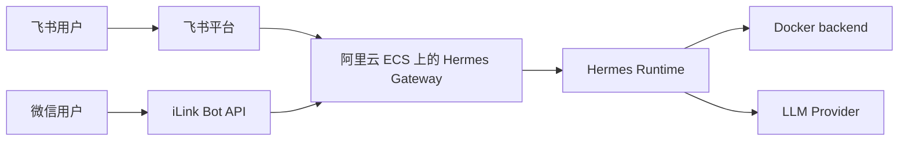

# Hermes Agent 阿里云消息入口实操：飞书与微信

> 这篇笔记只解决一个问题：**在阿里云 ECS 上，如何把 Hermes Agent 接到国内可用的消息入口**。  
> 默认前提是你已经完成 [[Hermes-Agent-阿里云部署指南]] 里的基础安装、provider 配置、Docker backend 和 gateway 常驻化。

## 1. 先说结论

- 如果你要一个**更像生产可用入口**的方案，优先上 **飞书**。
- 飞书的推荐接法是 **WebSocket 出站连接**，阿里云 ECS 不需要额外暴露公网 webhook。
- 微信这条线走的是 **Weixin 个人微信 + iLink Bot API**，更适合“个人私聊入口”，**不要默认把它当成稳定群聊机器人方案**。
- 如果你的真实诉求是“企业微信”，那应该优先看 **WeCom / WeCom Callback**，不是这篇里的 Weixin。

## 2. 两条入口在阿里云上的形态



关键区别只有两个：

- **飞书**：推荐 WebSocket 模式，ECS 只要能正常出网即可。
- **微信**：使用 iLink 的 long-poll 模式，同样不需要公网回调，但账号形态和群聊能力受 iLink 限制更大。

## 3. 上手前的最小前提

在进入飞书或微信实操前，先确认这 4 件事：

1. 你已经在 ECS 上跑通 `hermes chat`，模型 provider 可正常回复。
2. 你已经决定 Hermes 是以前台验证还是 `systemd --system` 常驻。
3. ECS 可以正常访问外网，至少能访问模型提供商和对应消息平台的 API。
4. Hermes 所在 Python 环境里已经具备 messaging 依赖；如果缺包，再按报错补装。

如果网关启动时报依赖缺失，优先按平台补齐：

```bash
pip install lark-oapi websockets aiohttp cryptography
```

说明：

- 飞书 WebSocket 主要依赖 `lark-oapi` 和 `websockets`
- 飞书 webhook 模式需要 `aiohttp`
- 微信 Weixin 适配器需要 `aiohttp` 和 `cryptography`

## 4. 飞书接入实操

## 4.1 为什么飞书更适合放在阿里云上

Hermes 官方对 Feishu / Lark 的推荐模式是 **WebSocket**。这对阿里云 ECS 很友好：

- 不要求你先申请域名
- 不要求先配 Nginx / HTTPS / 公网回调
- 安全组通常只保留 `22/tcp` 就够了
- 入口链路更简单，排障点更少

飞书的默认交互模型也比较适合 agent：

- 私聊里，bot 会直接响应消息
- 群聊里，默认只有在 **@bot** 时才响应
- 共享群聊默认仍按用户隔离会话，不会天然把一个群聊混成一个共享上下文

## 4.2 推荐路线：直接跑 `hermes gateway setup`

在 ECS 上执行：

```bash
hermes gateway setup
```

选择 `Feishu / Lark`。官方推荐流程是：

1. 让 Hermes 展示二维码
2. 用飞书移动端扫码
3. Hermes 自动创建 bot 应用并保存凭证

这条路最省心，因为 Hermes 会尽量把应用创建和凭证保存一起完成。

## 4.3 如果自动创建失败，走手工创建

如果你的环境里二维码自动建应用不可用，就走飞书开发者后台：

1. 打开 `https://open.feishu.cn/`
2. 创建一个新应用
3. 在 `Credentials & Basic Info` 里取到 `App ID` 和 `App Secret`
4. 给应用开启 `Bot` 能力
5. 回到 ECS 执行 `hermes gateway setup`，手工录入凭证

最少要配的权限：

- `im:message`
- `im:message:send_as_bot`
- `im:resource`
- `im:chat`
- `im:chat:readonly`

建议再补上这几个，后面做可观测和 allowlist 更顺：

- `im:message.reactions:readonly`
- `admin:app.info:readonly`
- `contact:user.id:readonly`

## 4.4 事件订阅怎么选

飞书有两种接法：

- **WebSocket**：推荐，最适合 ECS
- **Webhook**：只有你明确需要公网回调时再用

### 方案 A：WebSocket 模式

这是阿里云上最推荐的配置：

```env
FEISHU_APP_ID=cli_xxx
FEISHU_APP_SECRET=secret_xxx
FEISHU_DOMAIN=feishu
FEISHU_CONNECTION_MODE=websocket
FEISHU_ALLOWED_USERS=ou_xxx,ou_yyy
FEISHU_GROUP_POLICY=allowlist
```

还要在飞书后台做两件事：

1. 在 `Events and Callbacks` 里把连接模式设成 `Long Connection`
2. 订阅事件 `im.message.receive_v1`

然后在 `Version Management` 发布一个版本。**不发布版本，权限和事件订阅不会真正生效。**

### 方案 B：Webhook 模式

只有在你已经有对外域名或统一回调网关时才建议用 webhook。

对应变量通常长这样：

```env
FEISHU_APP_ID=cli_xxx
FEISHU_APP_SECRET=secret_xxx
FEISHU_DOMAIN=feishu
FEISHU_CONNECTION_MODE=webhook
FEISHU_WEBHOOK_HOST=127.0.0.1
FEISHU_WEBHOOK_PORT=8765
FEISHU_WEBHOOK_PATH=/feishu/webhook
FEISHU_VERIFICATION_TOKEN=token_xxx
FEISHU_ENCRYPT_KEY=encrypt_xxx
```

这时 Hermes 会在本机起一个回调端点：

```text
http://127.0.0.1:8765/feishu/webhook
```

阿里云上比较实用的做法是：

1. 安全组开放 `80/tcp` 和 `443/tcp`
2. Nginx 反代到本地 `127.0.0.1:8765`
3. 飞书后台回调 URL 配到你的公网 HTTPS 地址

最小 Nginx 反代形态可以是：

```nginx
server {
    listen 443 ssl;
    server_name bot.example.com;

    location /feishu/webhook {
        proxy_pass http://127.0.0.1:8765/feishu/webhook;
        proxy_set_header Host $host;
        proxy_set_header X-Forwarded-For $proxy_add_x_forwarded_for;
        proxy_set_header X-Forwarded-Proto $scheme;
    }
}
```

如果你只是想先把入口跑通，不要从 webhook 模式开始。

## 4.5 飞书上怎样做“最小可用”验证

建议按下面顺序验证：

1. ECS 上执行：

```bash
hermes gateway run
```

2. 飞书私聊 bot，确认能回复。
3. 把 bot 拉进一个测试群，确认只有在 `@bot` 时才响应。
4. 在一个你希望接收通知的聊天里执行 `/set-home`。

如果你准备长期运行，再执行：

```bash
sudo hermes gateway install --system
sudo hermes gateway start --system
hermes gateway status --system
```

## 4.6 飞书上最容易踩的坑

- **应用没发布**：权限和事件明明配了，但 bot 就是不工作。
- **以为群里不 @ 也会回**：默认不会，除非你显式设 `FEISHU_REQUIRE_MENTION=false`。
- **没做 allowlist**：如果 `FEISHU_ALLOWED_USERS` 为空，能触达 bot 的人可能都能和它对话。
- **Webhook 模式没配 token 或 encrypt key**：会直接导致验证失败或签名校验失败。
- **同一个 app_id 被两台 Hermes 同时占用**：官方明确说明同一个 Feishu app 不适合被多个 Hermes 实例同时使用。

## 4.7 如果你要用审批卡片

Hermes 在飞书里可以用交互卡片承接审批或确认动作。要让卡片按钮真正可点，需要补三件事：

1. 订阅事件 `card.action.trigger`
2. 在 Bot 能力里启用 `Interactive Card`
3. 如果你使用 webhook 模式，把 `Message Card Request URL` 指到同一个 webhook 地址

在 **WebSocket 模式** 下，卡片动作由 SDK 处理，通常不需要你再额外暴露一个公网卡片回调地址。

## 5. 微信接入实操

## 5.1 先明确：这里说的是 Weixin，不是企业微信

Hermes 的 `Weixin` 适配器对接的是 **个人微信 + Tencent iLink Bot API**。它和企业微信 `WeCom` 不是一回事。

这条线最重要的现实限制是：

- Hermes 连上的通常不是“你扫码的那个普通微信号本体”
- 而是一个 iLink bot identity，例如 `xxx@im.bot`
- 这个 bot identity **通常不能像普通联系人那样稳定进入普通微信群**
- 很多情况下，iLink **根本不会把普通微信群消息事件送到 Hermes**

所以实操上要先把预期压准：

- **私聊入口**：可做
- **普通微信群入口**：不要先承诺给业务方

## 5.2 为什么微信这条线在阿里云上也不需要公网入口

Weixin 适配器走的是 **HTTP long-poll**，不是 webhook，也不是 WebSocket。

这意味着：

- ECS 不需要暴露 `80/443`
- 不需要域名
- 只要 ECS 能主动访问 iLink API 即可

但你要保证 ECS 的出网能访问这些域名：

- `https://ilinkai.weixin.qq.com`
- `https://novac2c.cdn.weixin.qq.com/c2c`

后者是媒体文件传输 CDN，图片、文件、视频等能力会用到。

## 5.3 微信的接法：先扫码，再固化 allowlist

在 ECS 上执行：

```bash
hermes gateway setup
```

选择 `Weixin`，然后：

1. Hermes 请求 iLink Bot API 生成二维码
2. 终端里展示二维码或二维码 URL
3. 用微信移动端扫码
4. 在手机上确认登录
5. Hermes 把 `account_id`、`token`、`base_url` 自动保存到 `~/.hermes/weixin/accounts/`

完成后，至少在 `.env` 里确认：

```env
WEIXIN_ACCOUNT_ID=your-account-id
WEIXIN_DM_POLICY=allowlist
WEIXIN_ALLOWED_USERS=user_id_1,user_id_2
WEIXIN_HOME_CHANNEL=chat_id
```

说明：

- `WEIXIN_TOKEN` 通常已经由扫码流程自动保存
- `WEIXIN_DM_POLICY=allowlist` 更适合云上长期运行
- `WEIXIN_ALLOWED_USERS` 里放的是**用户 ID**，不是手机号，也不是微信昵称

## 5.4 微信 allowlist 的正确落地方法

微信这条线最容易误会的地方是：**不是每个用户都去扫 Hermes 的二维码**。

正确流程是：

1. 先由管理员完成一次扫码登录，把 ECS 上的 Hermes 绑定到一个 iLink bot identity。
2. 让被授权用户去给这个 bot identity 发私信。
3. 从 Hermes gateway 日志或入站事件里读出这些用户的 `user_id`。
4. 把这些 `user_id` 写入 `WEIXIN_ALLOWED_USERS`。
5. 重启 gateway。

如果你发现“只有扫码的人自己能聊，别人不行”，通常不是 Hermes 配错，而是：

- 别人发消息的对象不是 iLink bot identity
- 而是扫码那个人自己的普通微信号

这两个身份不是同一个东西。

## 5.5 微信群为什么通常不适合当主入口

Hermes 官方文档把这点说得很直白：对于 QR 登录生成的 iLink bot identity，**普通微信群事件通常根本不会送达**。

因此：

- `WEIXIN_GROUP_POLICY` 默认就是 `disabled`
- 即使你改成 `open` 或 `allowlist`，也不代表普通微信群就一定能工作
- `WEIXIN_GROUP_ALLOWED_USERS` 这个变量名虽然叫 `USERS`，实际放的是**群 ID**，不是成员用户 ID

如果你的目标是：

- 群里 `@bot` 即答
- 多人协作使用
- 更像团队工作入口

那就直接优先飞书，不要先押微信普通群。

## 5.6 微信的最小验证步骤

1. ECS 上执行：

```bash
hermes gateway run
```

2. 用扫码绑定后的 bot identity 做私聊。
3. 观察日志，确认能收到入站消息。
4. 再让第二个授权用户发私聊，记录其 `user_id`。
5. 把 `user_id` 加入 allowlist 后重启。

如果要常驻：

```bash
sudo hermes gateway install --system
sudo hermes gateway start --system
hermes gateway status --system
```

## 5.7 微信上最容易踩的坑

- **把 Weixin 当 WeCom**：两条能力线完全不同。
- **默认期待普通微信群可用**：官方已经明确提醒，大多数 QR 登录 iLink bot 场景下并不可靠。
- **只配了 account_id，没拿到 token**：通常重新跑一遍 `hermes gateway setup` 最稳。
- **同一个 token 被两台 Hermes 同时使用**：官方说明同一个 token 同时只能有一个 poller。
- **`errcode=-14`**：常见含义是会话过期，需要重新扫码登录。

## 6. 飞书与微信的取舍建议

| 维度 | 飞书 | 微信 Weixin |
|---|---|---|
| 推荐连接方式 | WebSocket | Long-poll |
| 是否必须公网回调 | 否，WebSocket 不需要 | 否 |
| 阿里云安全组是否通常只开 22 | 是 | 是 |
| 私聊可用性 | 高 | 中到高 |
| 群聊可用性 | 高，默认要求 `@bot` | 低，普通微信群常常收不到事件 |
| 更适合的场景 | 团队协作、长期运维入口、通知中心 | 个人私聊入口、实验性个人助手 |
| 我给的默认建议 | 先上 | 作为补充入口，不作为主入口 |

## 7. 我建议你在阿里云上的落地顺序

最稳的顺序是：

1. 先按 [[Hermes-Agent-阿里云部署指南]] 跑通 CLI 和 provider。
2. 第一个消息入口先接 **飞书 WebSocket**。
3. 用飞书完成 `/set-home`，把它作为告警、cron 和运维通知的主入口。
4. gateway 稳定后再补一个 **Weixin 私聊入口**，仅用于个人触达。
5. 不要在第一阶段就承诺“普通微信群里也能稳定跑 agent”。

如果你只有一个入口预算，直接选飞书。

## 8. 参考资料

- Hermes 官方 Messaging Gateway 文档：`https://hermes-agent.nousresearch.com/docs/user-guide/messaging`
- Hermes 官方 Feishu / Lark 文档：`https://hermes-agent.nousresearch.com/docs/user-guide/messaging/feishu`
- Hermes 官方 Weixin 文档：`https://hermes-agent.nousresearch.com/docs/user-guide/messaging/weixin`
- Hermes 官方 FAQ：`https://hermes-agent.nousresearch.com/docs/reference/faq`
- 飞书开发者后台：`https://open.feishu.cn/`

## 9. Update History

- 2026-06-11：初版，补充阿里云 ECS 上对接飞书与微信消息入口的实操路径、限制与选型建议。