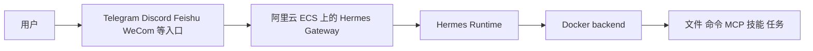
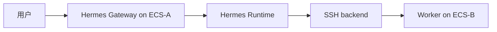

# Hermes Agent 阿里云部署指南

> 本文面向“把 Hermes Agent 长期部署在阿里云上使用”的场景，默认路线是 **阿里云 ECS Linux 实例 + Hermes Agent + Docker backend + systemd 常驻网关服务**。  
> 如果你还没看过产品定位，可先参考 [[OpenClaw-Hermes-Pi-Claude-Codex-Copilot-区别与选型指南]] 和 [[OpenClaw-vs-Hermes-Agent-详细对比]]。
> 如果你现在关心的是“怎么把 Hermes 真正接到飞书或微信入口”，继续看 [[Hermes-Agent-阿里云消息入口实操-飞书与微信]]。

## 1. 先说结论

在阿里云上部署 Hermes Agent，最稳妥的入门路线不是一上来就做“多机编排”或“本地大模型”，而是：

```text
阿里云 ECS Ubuntu 22.04/24.04 LTS
  -> SSH 登录
  -> 安装 Hermes Agent
  -> 先跑通 CLI 对话
  -> 再切换到 Docker terminal backend
  -> 配置 messaging gateway
  -> 用 systemd 做常驻服务
```

原因很简单：Hermes 官方明确建议先把**基础聊天跑通**，再叠加 gateway、cron、skills、voice、routing 这些第二层能力。对云主机部署来说，这样最不容易在“模型没配好、网关没配好、系统服务也没配好”这三类问题里一起卡死。

## 2. 推荐拓扑

### 2.1 单机版：最推荐

这是最适合个人和小团队的路线：



特点：

- 一台 ECS 就够
- 部署和运维都简单
- 用 Docker backend 隔离 agent 执行环境
- 最适合 always-on assistant 或个人工作流自动化

### 2.2 分离版：网关机 + 执行机

如果你更在意安全边界，可以把 Hermes 的消息入口和实际执行环境拆开：



这种模式适合：

- 你希望消息入口机尽量瘦
- 你要把执行权限放在内网 worker 上
- 你希望后续扩成多台执行节点

但第一次部署不建议从这条路开始。Hermes 官方也把 `docker` 视为生产网关场景里更直接的隔离方案。

## 3. 阿里云侧准备

## 3.1 实例选择

实践上建议：

- **2 vCPU / 4 GB RAM**：仅跑 Hermes CLI + 网关 + 远程模型调用的最低可用配置
- **4 vCPU / 8 GB RAM**：更适合长期在线、带 Docker backend、带浏览器或多渠道消息入口
- **GPU 实例**：只有在你计划把本地模型直接跑在 ECS 上时才需要

如果你使用的是 OpenRouter、Claude、DashScope、Gemini 这类远程模型，CPU 机型就够了。

### 3.2 操作系统建议

优先选：

- Ubuntu 22.04 LTS
- Ubuntu 24.04 LTS

原因：

- Hermes 安装说明对 Linux 路线最成熟
- systemd、Docker、Playwright 依赖、SSH 运维都最顺手
- 后续查资料和排障成本最低

### 3.3 安全组建议

阿里云 ECS 侧至少要考虑以下入站规则：

- `22/tcp`：仅允许你的办公公网 IP 或固定出口 IP 登录 SSH
- `80/tcp` 和 `443/tcp`：只有在你要接 webhook、API Server、反向代理时才开放

不建议：

- 直接把 `22` 对全网开放
- 在还没配 allowlist / pairing 的情况下开放对外服务入口

### 3.4 登录方式建议

优先使用：

- ECS SSH key pairs

弱化使用：

- 口令直登 root

Hermes 官方对生产部署也明确建议**不要以 root 身份长期运行 gateway**。

## 4. 部署步骤

### 4.1 登录 ECS 并准备基础环境

先登录你的 ECS：

```bash
ssh ubuntu@<ecs-public-ip>
```

首次进入后执行：

```bash
sudo apt update
sudo apt install -y git curl ca-certificates
git --version
```

Hermes 官方安装说明里提到，非 Windows 平台唯一硬前置通常是 `git`，其余 Python、Node.js、ripgrep、ffmpeg 等由安装器自动处理。

### 4.2 不要长期用 root 运行 Hermes

如果你当前是 root 登录，建议先创建普通用户：

```bash
adduser hermes
usermod -aG sudo hermes
```

然后切换过去：

```bash
su - hermes
```

后续所有 Hermes 安装、配置、网关操作，尽量都在这个普通用户下完成。

### 4.3 安装 Hermes Agent

最标准安装命令：

```bash
curl -fsSL https://hermes-agent.nousresearch.com/install.sh | bash
```

如果你的 ECS 是纯 headless 机器，暂时不需要浏览器自动化，可以用：

```bash
curl -fsSL https://hermes-agent.nousresearch.com/install.sh | bash -s -- --skip-browser
```

安装完成后：

```bash
source ~/.bashrc
hermes doctor
```

如果 `hermes` 命令找不到，先检查 PATH：

```bash
echo "$PATH"
ls ~/.local/bin/hermes
```

Hermes 官方安装器默认会把启动命令放在 `~/.local/bin/hermes`。

### 4.4 先跑通基础 CLI，不要急着上网关

先做最小验证：

```bash
hermes model
```

配置好 provider 之后，进入 CLI：

```bash
hermes
```

建议先测试一条很容易判断对错的 prompt，例如：

```text
请检查当前目录，并告诉我当前机器上最重要的系统信息。
```

你需要看到的是：

- 模型/provider 显示正常
- Hermes 能回复
- 必要时能调用 terminal 或 file 工具
- 连续两轮对话都不报错

如果 CLI 都没跑通，不要继续配 gateway。

## 5. Provider 选择

### 5.1 最省事：Nous Portal

如果你想最快跑起来：

```bash
hermes setup --portal
```

这个方案的优点是：

- provider 和 tool gateway 一起配置
- 少填很多单独 API key
- 更适合第一次部署

### 5.2 阿里云用户最自然的路线：DashScope / Qwen

Hermes 官方 quickstart 已把 **Alibaba Cloud** 列为一级 provider，Qwen 通过 DashScope 接入。

你可以先把密钥写进去：

```bash
hermes config set DASHSCOPE_API_KEY <your-dashscope-api-key>
```

然后运行：

```bash
hermes model
```

选择阿里云 / Qwen 路线。

如果你在中国大陆地域部署 ECS，这通常是一个很自然的组合：

- ECS 在阿里云
- 模型走 DashScope / Qwen
- 延迟和网络路径更可控

### 5.3 模型窗口注意事项

Hermes 官方要求模型上下文窗口至少 **64K tokens**。所以：

- 先选满足 64K 以上上下文的模型
- 不要一开始就拿小上下文本地模型试生产部署

## 6. 切换到 Docker backend

如果你只是做开发测试，`local` backend 可以先用。

但如果你要把 Hermes 作为阿里云上的长期在线 agent，官方安全建议很明确：**生产 gateway 场景优先使用 `docker` backend**。

### 6.1 安装 Docker

在 Ubuntu 上先装 Docker：

```bash
sudo apt install -y docker.io
sudo systemctl enable --now docker
sudo usermod -aG docker "$USER"
newgrp docker
docker version
```

### 6.2 配置 Hermes 使用 Docker backend

最简单的方式：

```bash
hermes config set terminal.backend docker
hermes config set terminal.cwd /home/hermes
hermes config set terminal.container_cpu 2
hermes config set terminal.container_memory 4096
hermes config set terminal.container_disk 20480
```

也可以直接编辑 `~/.hermes/config.yaml`，一个比较稳的起点如下：

```yaml
model:
  provider: alibaba

terminal:
  backend: docker
  cwd: /home/hermes
  timeout: 180
  docker_image: "nikolaik/python-nodejs:python3.11-nodejs20"
  container_cpu: 2
  container_memory: 4096
  container_disk: 20480
  container_persistent: true
  docker_persist_across_processes: true

approvals:
  mode: smart
  cron_mode: deny

display:
  language: zh
  tool_progress: new
```

这里的核心点是：

- `terminal.backend: docker`：让 agent 的命令执行落在容器里
- `terminal.cwd`：明确工作目录，不让 agent 在敏感目录乱跑
- `container_cpu` / `container_memory` / `container_disk`：限制资源
- `approvals.mode: smart`：降低批准疲劳，但不要一开始就 `off`

### 6.3 为什么 Docker backend 值得用

Hermes 官方安全文档明确说明：

- `docker` 是推荐的生产 gateway 隔离边界
- 容器默认做 `cap-drop`、`no-new-privileges`、PID limit、tmpfs 限制
- 在 Docker backend 下，危险命令审批不再是主要边界，容器本身才是边界

所以在阿里云 ECS 上，`Docker backend` 是最实用的安全增强。

## 7. 配置 gateway

### 7.1 配之前先想清楚入口类型

Hermes 支持非常多的消息入口，包括：

- Telegram
- Discord
- Slack
- Feishu / Lark
- WeCom
- DingTalk
- Teams
- API Server
- Webhooks

如果你只是给自己用，最省心的一般是：

- Telegram
- Discord
- Feishu / WeCom

### 7.2 先设置 allowlist 或 pairing 思路

Hermes 官方安全文档强调：

- 默认应该拒绝未知用户
- 不要把 `GATEWAY_ALLOW_ALL_USERS=true` 当默认配置

如果你知道自己的用户 ID，可以直接写 allowlist，例如：

```bash
hermes config set GATEWAY_ALLOWED_USERS 123456789
hermes config set TELEGRAM_ALLOWED_USERS 123456789
```

如果你不想先查用户 ID，可以依赖 DM pairing：

- 未授权用户私聊 bot
- bot 返回 pairing code
- 你在 ECS 上执行批准命令

例如：

```bash
hermes pairing approve telegram ABC12DEF
```

### 7.3 启动交互式网关配置

```bash
hermes gateway setup
```

先把一个平台跑通，不要同时配 5 个入口。

### 7.4 前台验证

先以前台模式跑：

```bash
hermes gateway run
```

确认：

- 你能从消息入口发消息给 bot
- bot 能回复
- `whoami`、`status`、`model` 这些命令可用
- 如果你发起长任务，后台会正常工作

确认通过后，再做 systemd 常驻化。

## 8. 把 Hermes 变成阿里云上的常驻服务

对 ECS 这类 VPS / headless host，Hermes 官方建议使用 **system service**。

### 8.1 安装 systemd service

```bash
sudo hermes gateway install --system
sudo hermes gateway start --system
```

查看状态：

```bash
hermes gateway status --system
```

看日志：

```bash
journalctl -u hermes-gateway -f
```

### 8.2 不要同时装 user service 和 system service

官方文档特别提醒：

- VPS / headless host 用 `--system`
- 不要把 user service 和 system service 同时装上

否则 start/stop/status 的行为会变得模糊。

## 9. 阿里云上的网络与暴露策略

### 9.1 只用 Telegram / Discord / Feishu 等普通入口

如果你只是对接这类平台，通常优先保证：

- ECS 能正常出网
- 安全组开放 `22/tcp`
- 平台所需 token、凭证配置正确

很多场景不需要你额外开放 `80/443` 给公网。

### 9.2 需要 webhook / API Server / Web UI

如果你要用：

- Slack webhook
- Webhooks
- API Server
- 自己的反代域名入口

则通常需要：

- ECS 公网 IP 或 EIP
- 安全组开放 `80/tcp`、`443/tcp`
- 域名解析到 ECS
- Nginx 或 Caddy 做 TLS / 反向代理

在阿里云侧，这一步主要就是 ECS 安全组和公网地址规划，不是 Hermes 本身的难点。

## 10. 运维建议

### 10.1 基础巡检命令

```bash
hermes doctor
hermes gateway status --system
hermes sessions list
tail -f ~/.hermes/logs/gateway.log
journalctl -u hermes-gateway -f
```

### 10.2 更新前先备份

Hermes 自身支持备份：

```bash
hermes backup
```

对阿里云 ECS 来说，额外建议：

- 更新前做一次 ECS 快照
- 至少备份 `~/.hermes/`

这样回滚最省事。

### 10.3 不要把密钥塞进代码仓库

Hermes 官方建议：

- 机密放 `~/.hermes/.env`
- 非机密配置放 `~/.hermes/config.yaml`
- `.env` 权限收紧

例如：

```bash
chmod 600 ~/.hermes/.env
```

## 11. 更稳的生产做法

如果你准备把阿里云上的 Hermes 作为长期生产服务，而不是个人实验，建议至少做到：

- 使用普通用户运行，而不是 root
- 使用 Docker backend
- 配 `GATEWAY_ALLOWED_USERS` 或 DM pairing
- 不启用 `GATEWAY_ALLOW_ALL_USERS=true`
- 明确设置 `terminal.cwd`
- 定期检查 `~/.hermes/logs/`
- 定期执行 `hermes update`

如果还要再上一个台阶，可以考虑：

- gateway ECS 和 worker ECS 分离
- `terminal.backend: ssh` 指向内网执行机
- 在阿里云安全组里把 worker 只暴露给 gateway 所在安全组

## 12. 常见问题

### 12.1 安装成功但 `hermes` 命令找不到

先执行：

```bash
source ~/.bashrc
echo "$PATH"
ls ~/.local/bin/hermes
```

### 12.2 CLI 能跑，gateway 不工作

优先排查：

- bot token 是否有效
- allowlist / pairing 是否已配置
- `hermes gateway setup` 是否完整跑过
- `hermes gateway status --system` 和 `journalctl` 是否有错误

### 12.3 Docker backend 不工作

先检查：

```bash
docker version
groups
```

如果当前用户不在 docker 组，重新登录会话后再试。

### 12.4 Qwen / DashScope 配好了，但第一轮对话就失败

优先检查：

- `DASHSCOPE_API_KEY` 是否正确
- 选择的模型是否可用
- 模型上下文是否满足 64K 要求
- `hermes model` 是否真正保存成功

### 12.5 我是否应该在阿里云上直接跑本地模型

可以，但不建议作为第一版路线。

更稳的做法是：

- 第一版先让 ECS 只承担 Hermes runtime + gateway
- 模型先走远程 provider
- 等功能稳定后，再决定是否换成 GPU ECS + 本地模型

## 13. 推荐的最小上线顺序

按这个顺序最稳：

1. 创建 ECS，开放 22 端口。
2. 安装 Hermes，跑通 `hermes doctor` 和 CLI 对话。
3. 配置 provider，先做一轮可验证聊天。
4. 安装 Docker，切到 `terminal.backend: docker`。
5. 跑通一个消息平台的 `hermes gateway run`。
6. 改成 `sudo hermes gateway install --system` 常驻运行。
7. 视需要再开放 80/443、接 webhook、接反向代理、接更多平台。

## 14. 参考链接

- Hermes Installation: https://hermes-agent.nousresearch.com/docs/getting-started/installation
- Hermes Quickstart: https://hermes-agent.nousresearch.com/docs/getting-started/quickstart
- Hermes Messaging Gateway: https://hermes-agent.nousresearch.com/docs/user-guide/messaging
- Hermes Security: https://hermes-agent.nousresearch.com/docs/user-guide/security
- Alibaba Cloud ECS: https://www.alibabacloud.com/help/en/ecs/
- Alibaba Cloud Create and manage an ECS instance: https://www.alibabacloud.com/help/en/ecs/getting-started/create-and-manage-an-ecs-instance-by-using-the-ecs-console
- Alibaba Cloud Add a security group rule: https://www.alibabacloud.com/help/en/elastic-compute-service/latest/add-security-group-rules
- Alibaba Cloud SSH key pairs: https://www.alibabacloud.com/help/en/elastic-compute-service/latest/key-pairs

## Update History

- 2026-06-11: 初次创建，整理 Hermes Agent 在阿里云 ECS 上的推荐部署路线、Docker backend、安全组、gateway 和 systemd 服务化步骤。