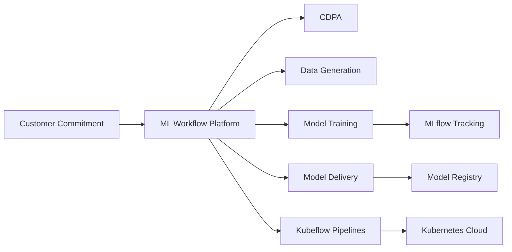
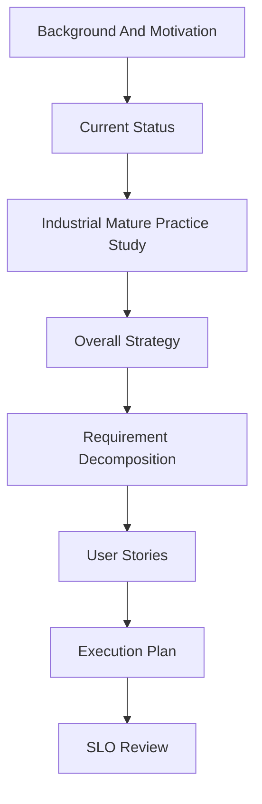

# 内部 MLOps 平台 Availability 提升结构化分析

> 本文是对 [[Internal-MLOps-Availability-Requirements-User-Stories-Technical-Plan]] 的重新编排版。  
> 章节顺序按评审和汇报逻辑组织为：Background & Motivation → Current Status → Industrial Mature Practice Study → 总体思路 → 需求分解 → User Story 定义 → 执行计划 → Glossary。

## 1. Background & Motivation

### 1.1 客户承诺背景

本次 availability 提升工作的核心背景是：

> ML workflow solution availability should be at least 99.9%.

这里的 ML workflow platform 不是单一工具，而是覆盖 **CDPA → data generation → model training → model delivery** 的端到端工作流平台。它必须在 development、integration、operations 和 maintenance 的完整生命周期内保持可用，而不是只在临时 demo 或 ad hoc test 中可用。

从客户和团队视角看，99.9% availability 的业务动机包括：

- 支撑 customer-facing commitments，避免平台不稳定影响对客户交付的可信度。
- 让 MLCA team、Customer 等团队能够稳定执行 Kubeflow workflow。
- 在多人同时请求或突发流量下自动扩容 server resources，避免系统明显 lagging。
- 在升级 Kubeflow、NVIDIA drivers、Kubernetes、MLflow 等 stack 时，尽量不影响正在运行的 workflows。
- 在基础设施失败后，workflow 能从最近 checkpoint 恢复，而不是从头开始。
- 在系统损坏或完全丢失后，能通过 backup 和 restore 快速恢复。
- 将 workflows 调度到合适节点，提高资源利用率和成本效率。
- 采集系统 metrics，并在异常时主动 alert。

### 1.2 为什么需要专门做 Availability Study

即使平台已经在 production 或 testing 中运行，仍然需要专门做 availability study。原因是当前缺少一套可证明、可复盘、可对齐的可用性定义和证据链。

| 问题 | 为什么必须研究 |
| ---- | -------------- |
| 缺少统一测量口径 | 当前未必能清楚回答单个组件和端到端 workflow 的实际 availability 是多少 |
| 99.9% 不是单一数字 | 需要定义纳入哪些服务、统计窗口、planned maintenance、partial degradation 和依赖 SLA |
| 依赖服务复杂 | Cluster、storage、image registry、identity service、network、Artifactory、Gerrit 等依赖由不同团队提供，需要 back-to-back OLA |
| 冗余和成本需要权衡 | 需要决定保留多少 headroom、哪些组件要 replicas、failover、backup 和 restore |
| 自动化边界不清 | auto-scaling、failover、health check、recovery playbook 哪些要自动化，哪些可人工处理，会直接影响可达到的 availability |
| 故障和恢复语义不清 | 需要定义 workflow metadata 的 RTO、RPO，以及部分降级时什么算 available 或 unavailable |
| 容量和调度影响体验 | GPU、CPU、memory、storage 的 sizing、scaling 和 placement 需要绑定真实 spike scenarios 和 job placement use cases |
| 需要向 stakeholders 证明 | 需要 dashboard、SLO、error budget、incident postmortem 和定期 review 来证明是否达到 99.9% |

### 1.3 本文对 99.9% 的解释原则

本方案将客户的 99.9% availability 需求拆成三层：

| 层级 | 解释 |
| ---- | ---- |
| 用户感知层 | ML developers 和客户团队能否完成端到端 workflow 的关键动作 |
| 平台能力层 | MLOps 平台是否具备监控、扩缩容、恢复、备份、调度、升级和故障处理能力 |
| 责任边界层 | 哪些由平台团队负责，哪些依赖 IT 上游服务，哪些属于 scheduled maintenance 或 capacity SLO |

因此，本方案不会把“99.9%”当成一个抽象口号，而是转化为可执行的 user stories、技术控制点、指标、执行计划和 Go or No-Go 条件。

## 2. Current Status

### 2.1 当前平台形态

当前内部 MLOps 平台可以理解为一个基于 Kubernetes 的组合式平台，核心能力通常包括：

- Kubeflow：用于 workflow orchestration、pipeline control plane、dashboard、notebook 或 serving 相关能力。
- MLflow：用于 experiment tracking、metric logging、model registry 和 artifact 管理。
- Kubernetes cloud：由 IT 或 cloud team 提供集群、node pool、调度、网络、存储和基础资源。
- DevTools：Gerrit/Git、Jenkins、image registry、Artifactory 等支持代码、镜像、构建和发布。
- IAM/Auth：Azure authentication 或企业身份系统支撑用户登录和访问控制。
- Observability：Prometheus、Grafana、Alertmanager 或内部监控平台用于指标、告警和 dashboard。

端到端关系可以概括为：



### 2.2 当前主要风险

当前状态的核心问题不是“没有平台”，而是“还不能证明端到端 99.9% 是否真实可信”。主要风险如下：

| 风险域 | 当前常见表现 | 对 99.9% 的影响 |
| ------ | ------------ | --------------- |
| 测量口径 | 只看 Pod 或组件健康，缺少用户旅程级 SLI | 无法证明 ML developer 是否真的可用 |
| 状态层 | MLflow backend store、KFP metadata DB、artifact store 可能存在单点 | DB 或存储故障会放大为平台不可用 |
| 入口链路 | Ingress、Auth、DNS、TLS、Gateway 任何一环异常都会影响全部用户 | 登录或访问失败会直接击穿核心 journey |
| 上游依赖 | Azure auth、Gerrit、Jenkins、Kubernetes cloud、GPU、CPU、memory 由 IT 提供 | 如果没有 OLA 和维护窗口治理，总体 SLA 不可控 |
| 变更与升级 | K8s、Kubeflow、MLflow 等工具集升级可能造成 service break | 如果无窗口、回滚、canary 和计入口径，会影响用户体验和 SLA 可信度 |
| 可观测性 | 监控可能偏组件，缺少 synthetic probe 和 burn-rate alert | 容易由用户先发现故障，MTTA 变长 |
| 运维闭环 | runbook、RCA、error budget、monthly SLO review 尚需固化 | 重复故障难以系统性减少 |
| 容量与调度 | GPU、CPU、memory、storage、DB connection、queue waiting time 需要基线 | 容量不足会造成性能降级、排队和用户误判为不可用 |

### 2.3 Current Status 的建议结论

当前不建议直接对外承诺完整 MLOps platform 端到端 99.9% SLA。更现实的阶段性结论是：

> 先建立 `ML Developer Core Journey Availability internal SLO`，以月度 99.9% 为目标，连续 2 到 3 个自然月证明可达后，再讨论正式 SLA 承诺。

该结论背后的原因是：

- 99.9% 月度 error budget 只有 **43.2 分钟**，一次长 P1 就可能消耗整月预算。
- MLOps 端到端路径依赖多个上游服务，串行依赖会放大总体不可用风险。
- 只看 Kubeflow、MLflow 或 Pod 状态不足以代表 ML developer 的真实体验。
- 工具集升级和 planned maintenance 必须透明纳入报告，否则用户体验和 SLA 口径会分裂。

### 2.4 当前应立即建立的基线

在正式提升前，需要先建立 baseline：

| Baseline | 需要回答的问题 | 输出 |
| -------- | -------------- | ---- |
| 近 3 个月 service break | 过去实际发生了多少 P1/P2，影响了哪些 journey | incident baseline report |
| 当前 core journey availability | 过去 30 天用户核心路径可用性是多少 | SLI dashboard |
| Top root cause | 哪些根因消耗最多 downtime | reliability backlog |
| Upstream impact | 哪些故障来自 Azure auth、Git、Jenkins、Kubernetes cloud、GPU/CPU/memory | upstream dependency impact report |
| Upgrade impact | 工具集升级造成了多少 planned break、overrun 和 rollback | upgrade impact report |
| Capacity baseline | spike、headroom、queue waiting time 和 resource utilization 如何 | capacity baseline report |

## 3. Industrial Mature Practice Study

### 3.1 为什么不直接照搬公有云 SLA

公有云 SLA 条款通常假设供应商对底层基础设施、控制面、监控、容量和升级流程有完整控制权。内部 MLOps 平台则不同：

- 平台运行在内网环境，监控、告警和通知工具可能不能依赖外部 SaaS。
- Azure auth、Gerrit、Jenkins、Kubernetes cloud、GPU、CPU、memory 等由 IT 或其他团队提供。
- 工具集升级是必要活动，但会造成 planned maintenance 或 service break。
- 训练任务成功率受用户代码、数据、镜像和资源请求影响，不宜直接混入第一阶段 platform availability。

因此，本方案建议采用成熟 SRE/SLO 方法论和可自建工具，把成熟实践映射到内网执行流程。

### 3.2 成熟实践对照

| 成熟实践 | 参考链接 | 可借鉴点 | 内网落地方式 | 第一阶段产出 |
| -------- | -------- | -------- | ------------ | ------------ |
| Google SRE SLI/SLO/Error Budget | [Google SRE Workbook - Implementing SLOs](https://sre.google/workbook/implementing-slos/), [Google SRE Book - Service Level Objectives](https://sre.google/sre-book/service-level-objectives/) | 用用户相关 SLI 定义 SLO，用 error budget 平衡可靠性和发布速度；不要追求 100% 可用性 | 建立月度 SLO review、error budget policy、P1/P2 RCA、发布冻结规则 | `ML Developer Core Journey Availability` SLO、43.2 分钟月度 error budget、月度 review 模板 |
| Google Art of SLOs | [Google SRE - Art of SLOs](https://sre.google/resources/practices-and-processes/art-of-slos/) | 从用户交互和用户感知出发，而不是从组件存活出发 | 按 ML developer journey 设计 SLI，例如 login、pipeline submission、MLflow metric round-trip、artifact round-trip | user journey SLI 清单、synthetic probe 设计 |
| OpenSLO | [OpenSLO Specification](https://github.com/OpenSLO/OpenSLO), [OpenSLO website](https://openslo.com/) | 将 SLO 声明为代码，便于评审、版本化、复用和跨工具迁移 | 在 Gerrit/Git 中维护 `slo/*.yaml`，由 Jenkins 校验 schema，再生成 PrometheusRule 或 dashboard 配置 | SLO-as-code 目录、OpenSLO 风格 YAML、变更评审流程 |
| Prometheus Blackbox Exporter | [Prometheus Blackbox Exporter](https://github.com/prometheus/blackbox_exporter/), [Prometheus multi-target exporter pattern](https://prometheus.io/docs/guides/multi-target-exporter/) | 从用户视角探测 HTTP、HTTPS、DNS、TCP、ICMP、gRPC 等端点 | 在内网 `monitoring` namespace 部署 blackbox exporter，从平台外部或独立探测节点模拟 ML developer 访问 | login、DNS、TLS、portal、API endpoint 黑盒探测 |
| Prometheus Operator | [Prometheus Operator](https://prometheus-operator.dev/) | 用 Kubernetes CRD 管理 Prometheus、ServiceMonitor、PrometheusRule 和 Alertmanager | 通过 GitOps 管理 ServiceMonitor、PrometheusRule、Alertmanager routing，减少手工配置 | `ServiceMonitor`、`PrometheusRule`、Alertmanager receiver |
| Sloth | [Sloth Prometheus SLO Generator](https://sloth.dev/), [Sloth GitHub](https://github.com/slok/sloth) | 基于 Google SRE 方法自动生成 Prometheus SLO recording rules、burn-rate alerts 和 dashboard | 初期可手写 PrometheusRule；成熟后用 Sloth CLI 或 Operator 从 SLO spec 生成规则 | SLO recording rules、multi-window burn-rate alerts |
| Pyrra | [Pyrra website](https://pyrra.dev/), [Pyrra GitHub](https://github.com/pyrra-dev/pyrra) | 让 Prometheus SLO 更易管理，支持 Kubernetes CRD 和 UI | 如果团队需要更轻量的 SLO UI，可在内网部署 Pyrra 管理 SLO | SLO UI、error budget dashboard |
| Grafana | [Grafana dashboards documentation](https://grafana.com/docs/grafana/latest/dashboards/) | 用 dashboard 展示 SLO、error budget、burn rate、incident 和趋势 | 建立 executive view、ML developer journey view、dependency view、upgrade impact view | 月度 SLO dashboard 和 stakeholder review dashboard |
| Alertmanager | [Prometheus Alertmanager](https://prometheus.io/docs/alerting/latest/alertmanager/) | 告警分组、抑制、路由和升级 | P1/P2 直接路由到 on-call；P3 进入 ticket；上游依赖告警同步对应 IT owner | P1/P2 routing、on-call receiver、ITSM webhook |
| ITIL 变更管理和维护窗口 | [ITIL change enablement overview](https://www.axelos.com/resource-hub/blog/what-is-change-enablement), 组织内部 change management 流程 | planned maintenance 要有通知、审批、窗口、回滚、维护后验证和超窗处理 | K8s、Kubeflow、MLflow、NVIDIA drivers 等升级进入 change calendar；维护后跑 core journey canary；超窗转 incident | upgrade checklist、maintenance window policy、planned maintenance report |

### 3.3 内网优先的落地顺序

第一阶段建议采用“轻工具、强流程”的落地顺序：

1. 先用 Prometheus、Blackbox Exporter、Grafana、Alertmanager 建立最小闭环。
2. SLO 先可以用 PrometheusRule 手写，避免工具导入阻塞。
3. 当 SLO 数量稳定后，再引入 OpenSLO、Sloth 或 Pyrra 做 SLO-as-code 和规则生成。
4. 所有 SLO、alert、dashboard、runbook 和 upgrade checklist 都进入 Gerrit/Git 评审，避免运维知识只存在个人经验里。

### 3.4 可采纳的成熟 SLA 口径

建议采用三种 availability 口径，避免责任边界混乱：

| 口径 | 是否包含上游和计划维护影响 | 用途 |
| ---- | -------------------------- | ---- |
| Gross user-facing availability | 包含所有用户感知不可用，包括上游故障和 planned maintenance | 反映 Customer 和 ML developer 的真实体验 |
| Net SLA availability | 按 SLA/OLA 边界扣除合规 scheduled maintenance 或明确 exclusions | 用于正式业务或客户承诺 |
| Platform-owned controllable availability | 只衡量 MLOps team 可直接控制的部分，同时单独展示 upstream impact | 用于平台团队内部工程改进 |

## 4. 总体思路

### 4.1 核心原则

MLOps 平台主要服务对象是 **ML developers**。因此 availability 不能只从 Kubeflow Pod、MLflow Pod、Ingress Pod 是否存活出发，而要从开发者是否能完成关键工作出发。

核心判断标准：

> 如果 ML developer 无法登录、查询实验、提交 pipeline、记录 metric、访问 model registry、上传下载 artifact 或查看运行状态，即使底层 Pod 还活着，也应视为用户感知 availability 受损。

### 4.2 分析和执行逻辑



### 4.3 推荐第一阶段目标

第一阶段不要直接承诺“完整 MLOps platform 端到端 99.9%”。建议定义为：

> **ML Developer Core Journey Availability internal SLO：核心 ML developer 工作旅程在月度统计周期内达到 99.9% 可用性。**

这比“平台所有东西都 99.9%”更实际，因为它：

- 面向真实用户体验。
- 范围可控。
- 指标可测。
- 能区分平台团队可控故障和上游 IT 依赖故障。
- 能逐步扩展到 Notebook、GPU capacity、KServe serving、training success 等二阶段 SLO。

### 4.4 推荐 SLO 组合

| SLO | 目标 | 统计周期 | 是否第一阶段 |
| --- | ---- | -------- | ------------ |
| ML Developer Core Journey Availability | 99.9% | Calendar month | 是 |
| P1 MTTA | 小于等于 5 分钟 | Calendar month | 是 |
| P1 MTTR | 小于等于 30 分钟 | Calendar month | 是 |
| User-ticket first detection ratio | 小于 20% | Calendar month | 是 |
| Upstream dependency impact reporting | 100% P1/P2 标记 | Calendar month | 是 |
| GPU scheduling latency | 待基线后设定 | Rolling 7 days | 第二阶段 |
| Notebook spawn success rate | 99.5% 到 99.9% | Calendar month | 第二阶段 |
| KServe endpoint availability | 按业务重要性单独定义 | Calendar month | 第二阶段 |

### 4.5 Availability 计算方式

月度 availability 使用以下公式：

```text
Availability = (TotalMinutes - UnplannedDowntimeMinutes) / TotalMinutes
```

30 天自然月中：

```text
TotalMinutes = 30 * 24 * 60 = 43200
99.9% error budget = 43200 * 0.001 = 43.2 minutes
```

P1/P2 MTTR 和 MTTA 使用以下公式：

```text
MTTR = sum(MitigationTime - IncidentStartTime) / IncidentCount
MTTA = sum(AcknowledgeTime - AlertStartTime) / IncidentCount
```

### 4.6 上游 SLA 与误差预算分摊

如果一个用户旅程依赖多个串行服务，总体可用性大致会被这些依赖共同限制：

```text
EndToEndAvailability ≈ A_mloops * A_auth * A_cluster * A_storage * A_registry * A_network
```

例如，如果核心路径依赖 5 个都只有 99.9% 的串行服务，理论乘积约为：

```text
0.999^5 = 0.995
```

这意味着即使每个依赖单独看都是 99.9%，端到端路径也可能只有约 99.5%。因此，如果 MLOps 要对外承诺 99.9%，不能简单接受所有上游 99.9% 并串起来。

建议先做内部 error budget 分摊：

| Budget bucket | 建议占比 | 30 天预算 | 示例 |
| ------------- | -------: | --------: | ---- |
| MLOps platform owned | 50% | 21.6 分钟 | Kubeflow、MLflow、Ingress、artifact、platform config |
| Upstream critical dependencies | 30% | 13.0 分钟 | Azure auth、Kubernetes cloud、storage、network |
| Planned maintenance and upgrades | 10% | 4.3 分钟 | 合规但有用户影响的 planned upgrade 透明展示 |
| Unknown or unclassified | 10% | 4.3 分钟 | 尚未归因或跨团队问题 |

## 5. 需求分解

### 5.1 Stakeholders

本需求建议按 5 类 stakeholder 管理，避免把每个工具 owner 都直接提升为同一层级的业务 stakeholder。Platform、DevOps、IAM、DevTools、Cloud 等更适合归并到 MLOps team 或 IT team 下面，再通过 dependency registry 和 RACI 明确责任。

| Stakeholder 分类 | 包含角色或团队 | 核心关注点 | 需要从计划中得到什么 | 典型决策权 |
| ---------------- | ------------- | ---------- | -------------------- | ---------- |
| Customer | 外部客户、内部客户、使用 ML workflow solution 的交付对象 | 端到端 ML workflow solution 是否能支撑 customer-facing commitment，尤其是 99.9% availability 是否可信 | SLA 范围、证据、例外项、恢复能力、月度 availability 报告 | 是否接受 SLA/SLO 口径；是否接受 planned maintenance 和 exclusions |
| ML developers | MLCA team、模型开发团队、数据科学家、pipeline 使用者 | 能否稳定完成 CDPA、data generation、model training、model delivery、实验追踪、artifact 和 model registry 操作 | 清晰的用户旅程 SLI、故障通知、恢复预期、容量和调度透明度 | 提供用户场景优先级；确认哪些 journey 最关键 |
| MLOps team | Platform team、MLOps platform owner、SRE/on-call、部分 DevOps 执行角色 | 平台能力、SLO 达成、故障恢复、runbook、RCA、error budget、Kubeflow/MLflow 等工具集升级 | 可执行 backlog、SLO dashboard、告警规则、runbook、升级 checklist、Go/No-Go 标准 | 定义平台方案；推进 HA、监控、恢复和运营闭环 |
| IT team | IT IAM、IT DevTools、IT Cloud、storage、network、image registry、Artifactory、Gerrit、Jenkins、Kubernetes cloud、GPU/CPU/memory 资源 owner | 上游服务 OLA、维护窗口、容量、基础设施稳定性、升级和变更影响 | dependency registry、back-to-back OLA、维护日历、升级路径、RTO/RPO 和容量模型 | 承诺上游 OLA；批准或执行基础设施变更和维护 |
| Business owners | 产品负责人、项目负责人、交付负责人、工程管理层 | 业务连续性、成本、风险、客户承诺、发布节奏和资源投入 | 月度 SLO review、error budget、成本和容量权衡、RCA action、SLA readiness 结论 | 是否正式承诺 SLA；是否冻结发布；是否投入冗余和自动化成本 |

简化后的责任关系：

| 问题 | Primary owner | Supporting stakeholders | 说明 |
| ---- | ------------- | ----------------------- | ---- |
| 99.9% SLA/SLO 口径 | Business owners | Customer、MLOps team | Business owner 负责承诺，Customer 确认接受范围，MLOps team 提供可证明数据 |
| ML developer journey SLI | MLOps team | ML developers、Business owners | MLOps team 负责定义和实现，ML developers 确认旅程是否真实代表使用体验 |
| 上游 IT 依赖和 OLA | IT team | MLOps team、Business owners | IT team 负责基础服务目标，MLOps team 负责把依赖影响纳入报告 |
| Toolset upgrade break | MLOps team | IT team、ML developers、Business owners | MLOps team 和 IT team 执行升级，Business owners 决定维护窗口可接受性 |
| Incident 和 RCA | MLOps team | IT team、ML developers | MLOps team 牵头，若根因在上游 IT 服务，则 IT team 必须参与 RCA 和 permanent fix |
| 容量和成本权衡 | Business owners | IT team、MLOps team、ML developers | Business owners 决定成本边界，IT/MLOps 提供容量模型，ML developers 提供真实 spike scenario |

### 5.2 需求分层

| 层级 | 需求 | 说明 | 是否第一阶段 |
| ---- | ---- | ---- | ------------ |
| 业务需求 | ML developers 能稳定使用 MLOps 完成日常模型开发 | 这是所有技术工作的上层目标 | 是 |
| 用户体验需求 | 登录、实验查询、pipeline 控制面、MLflow 写读、model registry、artifact round-trip 可用 | 直接体现用户感知 availability | 是 |
| 可观测性需求 | 在用户大规模报障前发现核心路径故障 | 从 ticket-driven 转向 alert-driven | 是 |
| 架构需求 | 核心入口、API、状态层、制品层无明显单点 | 支撑 99.9% 的基础 | 是 |
| 上游依赖需求 | Azure 鉴权、Gerrit/Git、Jenkins、Kubernetes cloud、GPU、CPU、memory 有 owner 和 OLA | 内部平台通常无法单独保证端到端 SLA | 是 |
| 工具集升级需求 | K8s、Kubeflow、MLflow 等 toolsets 定期升级时要有维护窗口、回滚、canary 和计入口径 | 升级是必要活动，但会影响 ML developer 用户旅程 | 是 |
| 运维需求 | P1/P2 分级、on-call、runbook、RCA、error budget review | 让可靠性持续运营 | 是 |
| 容量需求 | GPU、CPU、memory、storage 不足可预警、可解释、可规划 | 容量不直接混入 availability，但要单独治理 | 是 |
| 端到端 workflow 需求 | CDPA、data generation、model training、model delivery 能稳定串联 | 客户承诺关注完整 workflow solution，而不是单个工具 | 是 |
| 弹性伸缩需求 | 并发请求或突发流量下自动扩容 server resources | 支撑 spike scenarios 和多人同时请求 | 是 |
| 故障恢复需求 | 基础设施失败后从 last saved checkpoint 恢复 | 避免 workflow 从头重跑导致时间和资源浪费 | 是 |
| 备份恢复需求 | 系统损坏或完全丢失后可快速 restore | 支撑灾难恢复和数据保护 | 是 |
| 调度放置需求 | workflows 能调度到合适节点 | 提升利用率、成本和成功率 | 是 |
| 扩展需求 | Notebook、KServe、训练任务成功率、GPU scheduling latency | 第二阶段逐步扩展 | 否 |

### 5.3 第一阶段 In Scope

| 范围 | 内容 | 理由 |
| ---- | ---- | ---- |
| ML developer login | Azure 鉴权、Dashboard 或平台门户入口 | 登录失败是最直接的不可用 |
| Experiment visibility | MLflow 和 KFP experiment、run、metric 查询 | 开发者需要查看实验与运行结果 |
| Pipeline control plane | 提交 pipeline、获取 run id、查询 run status | 平台核心控制面能力 |
| MLflow tracking | log metric、log param、query run | 实验追踪核心路径 |
| Model registry query | 查询 registered model 和 model version | 模型资产管理核心路径 |
| Artifact round-trip | 上传和下载小型 canary artifact | 验证制品链路、对象存储和权限 |
| Ingress/Auth/DNS/TLS | 用户入口依赖链路 | 影响全部用户路径 |
| 上游 IT 依赖 | Azure 鉴权、Gerrit/Git、Jenkins、Kubernetes cloud、GPU、CPU、memory | 必须纳入依赖治理和维护窗口 |
| Toolset upgrades | Kubernetes、Kubeflow、MLflow、Istio、cert-manager、KServe、Argo、Prometheus 等升级 | 升级可能造成 planned service break，必须纳入 change calendar 和 availability report |
| End-to-end workflow | CDPA、data generation、model training、model delivery 的关键链路 | 客户需求关注 workflow solution 是否可用 |
| Resource management | 并发请求、突发流量、autoscaling、headroom | 支撑 spike scenarios，避免系统 lagging |
| Failure recovery | checkpoint、retry、resume、workflow metadata 恢复 | 支撑基础设施失败后的恢复 |
| Backup and restore | metadata、artifact、配置、镜像、workflow 定义恢复 | 支撑系统损坏或丢失后的快速恢复 |
| Scheduling and placement | node selector、affinity、taint/toleration、queue、quota | 支撑利用率、成本和合适节点调度 |

### 5.4 第一阶段 Out of Scope

| 不纳入第一阶段 99.9% 的内容 | 原因 | 替代治理方式 |
| -------------------------- | ---- | ------------ |
| 任意训练任务成功率 | 受用户代码、数据、镜像、依赖影响大 | 单独定义 training job success SLO |
| 任意 Notebook 创建成功率 | 受容量、镜像、用户环境影响明显 | 第二阶段纳入 notebook spawn SLI |
| GPU 一定有空闲 | 容量不是控制面 availability | 定义 GPU capacity SLO 和 queue waiting time |
| CPU 和 memory 无限可用 | 容量规划问题不等同平台不可用 | 定义 resource headroom 和 quota SLO |
| KServe 在线推理 endpoint availability | 推理数据面应独立治理 | 单独建立 serving SLO |
| 用户网络和客户端问题 | 平台无法直接控制 | SLA exclusions 中说明 |

### 5.5 非功能需求

| 类别 | 需求 | 可衡量标准 |
| ---- | ---- | ---------- |
| Availability | 核心 ML developer journey 月度可用性达到 99.9% | 月度 downtime 小于等于 43.2 分钟 |
| Detection | 核心故障由监控主动发现 | P1 中 synthetic probe 或 alert 首发现比例大于 80% |
| Response | P1 快速确认 | P1 acknowledge 小于等于 5 分钟 |
| Recovery | P1 快速缓解 | P1 mitigation 小于等于 30 分钟 |
| Observability | 核心用户旅程有 SLI 和 dashboard | 每个核心 journey 都有 success rate、latency、error budget |
| Resilience | 单 Pod 或单节点故障不导致核心旅程整体不可用 | 演练通过，或生产事件中未造成整体中断 |
| Dependency | 上游 IT 服务有 owner、OLA、维护窗口 | 依赖清单覆盖率 100% |
| Change Safety | 生产变更可审计、可回滚 | 关键配置通过 GitOps 或等价流程发布 |
| Upgrade Safety | 工具集升级影响可预测、可回滚、可验证 | 100% 生产升级有维护窗口、pre-check、rollback plan、post-upgrade canary 和影响记录 |
| RTO | 关键 workflow control plane 故障后恢复时间可定义 | P1 mitigation 小于等于 30 分钟；具体 RTO 按组件细分 |
| RPO | workflow metadata 和 tracking metadata 数据丢失可定义 | 关键 metadata RPO 按业务确认，备份和恢复演练可证明 |
| Partial Degradation | 部分降级时有明确 available/unavailable 判定 | 例如可提交 job 但 GPU 极度受限，应计入 capacity degradation 而非简单 available |

## 6. User Story 定义

### 6.1 Epic 1：用户感知 SLO 与指标体系

| Story ID | User Story | 验收标准 | 指标 |
| -------- | ---------- | -------- | ---- |
| US-01 | 作为 ML developer，我希望能稳定登录 MLOps 平台，以便开始日常实验和 pipeline 工作。 | canary user 每 5 分钟完成一次登录 journey；失败连续 2 次触发告警；登录失败能区分 Azure 鉴权、Ingress、TLS、Dashboard 问题。 | login journey success rate、auth callback latency |
| US-02 | 作为 ML developer，我希望能查看实验和运行记录，以便判断模型训练和实验结果。 | canary 每 1 分钟查询 MLflow 或 KFP experiment 和 run；返回合法结果；失败进入 SLO 统计。 | experiment query success rate、P95 latency |
| US-03 | 作为 ML developer，我希望能提交 pipeline run，以便启动训练或数据处理流程。 | canary pipeline 可提交并返回 run id；提交失败可区分 KFP API、DB、Argo、Auth 或 Git 依赖问题。 | pipeline submission success rate、submission latency |
| US-04 | 作为 ML developer，我希望能查看 pipeline 运行状态，以便定位失败和跟踪进度。 | canary run status 查询成功；能返回状态、metadata 和日志链接；失败触发 P2 或 P1。 | pipeline status query success rate |
| US-05 | 作为 ML developer，我希望能记录并读取 MLflow metrics，以便比较实验效果。 | canary run 写入 metric 后可再次读取且值一致；失败能定位 backend store 或 tracking server。 | metric round-trip success rate |
| US-06 | 作为 ML developer，我希望能访问 model registry，以便查看模型版本和注册状态。 | canary 查询 registered model 和 model version 成功；失败能定位 MLflow registry、backend DB 或权限问题。 | model registry query success rate |
| US-07 | 作为 ML developer，我希望能上传和下载 artifact，以便保存模型、日志和中间结果。 | canary artifact 上传下载成功并 checksum 一致；失败能定位 artifact store、权限、网络或容量问题。 | artifact round-trip success rate |

### 6.2 Epic 2：上游依赖与维护窗口治理

| Story ID | User Story | 验收标准 | 指标 |
| -------- | ---------- | -------- | ---- |
| US-08 | 作为 platform owner，我希望知道 Azure 鉴权维护或故障对 MLOps 登录的影响，以便合理解释 availability。 | Azure 鉴权 owner、维护窗口、升级路径记录在 dependency registry；登录 probe 能标记 auth dependency failure。 | auth upstream incident count、maintenance impact minutes |
| US-09 | 作为 ML developer，我希望 Git 和 Jenkins 故障不会被误判为 MLOps 内部故障，以便问题能被正确升级。 | Gerrit/Git 和 Jenkins 有 canary probe；影响 pipeline 或发布时自动标记 upstream DevTools dependency。 | Git fetch success rate、Jenkins critical job availability |
| US-10 | 作为 platform owner，我希望 Kubernetes cloud、GPU、CPU、memory 维护可提前感知，以便避开高风险发布。 | IT 维护日历进入 MLOps change calendar；维护期间冻结高风险发布；维护后执行 canary。 | planned maintenance coverage、post-maintenance canary success |
| US-11 | 作为 business owner，我希望月报能区分用户感知不可用和平台团队可控不可用，以便正确治理责任边界。 | 月报同时输出 user-facing availability、platform-owned availability、upstream dependency impact。 | 三类 availability report 按月输出 |
| US-11A | 作为 business owner，我希望上游服务 SLA 被纳入总体 SLA 模型，以便避免 MLOps 对不可控依赖做过度承诺。 | dependency registry 记录每个关键上游服务的 SLA 或 OLA、统计窗口、排除项、owner、升级路径和 error budget 消耗；月报展示 upstream budget consumption。 | upstream SLA coverage、upstream error budget consumed |

### 6.3 Epic 3：可观测性与告警

| Story ID | User Story | 验收标准 | 指标 |
| -------- | ---------- | -------- | ---- |
| US-12 | 作为 on-call engineer，我希望在用户提单前收到核心 journey 故障告警，以便缩短 MTTA。 | 核心 journey probe 接入 Alertmanager；P1 告警能路由到 on-call；告警包含可能根因。 | alert detection ratio、MTTA |
| US-13 | 作为 platform engineer，我希望 dashboard 能展示 SLO 和 error budget，以便做月度 review。 | Grafana 展示 core journey availability、burn rate、error budget、top failed journey。 | error budget consumed、burn rate |
| US-14 | 作为 DevOps engineer，我希望组件指标能帮助定位 journey 失败原因，以便快速恢复。 | Dashboard、KFP、MLflow、Ingress、Auth、DB、artifact store、CoreDNS、node pool 有诊断指标。 | root cause identification time |

### 6.4 Epic 4：架构加固与恢复能力

| Story ID | User Story | 验收标准 | 指标 |
| -------- | ---------- | -------- | ---- |
| US-15 | 作为 ML developer，我希望单个 Pod 或节点故障不会让我无法使用核心平台能力。 | Dashboard、KFP API、MLflow、Ingress、Auth、CoreDNS、Istio Gateway 多副本并配置 PDB。 | single pod or node failure drill pass |
| US-16 | 作为 platform engineer，我希望 MLflow 和 KFP 状态层没有单点，以便避免数据层故障导致全平台中断。 | MLflow backend store、KFP metadata DB 使用 HA DB；artifact store 使用对象存储或 HA MinIO。 | DB availability、artifact availability、restore test result |
| US-17 | 作为 on-call engineer，我希望有明确 runbook，以便 P1 能在 30 分钟内缓解。 | 登录、KFP、MLflow、artifact、Ingress、Auth、DB、上游依赖均有 runbook。 | P1 mitigation time、runbook coverage |

### 6.5 Epic 5：运营闭环与 SLA readiness

| Story ID | User Story | 验收标准 | 指标 |
| -------- | ---------- | -------- | ---- |
| US-18 | 作为 platform owner，我希望每月 review SLO，以便持续决定优先做稳定性还是功能发布。 | 每月 SLO review 固定召开；输出 error budget、P1/P2、RCA action、下月 reliability backlog。 | monthly SLO review completion |
| US-19 | 作为 engineering manager，我希望 error budget 消耗能影响发布策略，以便避免稳定性恶化。 | error budget 超过阈值时触发发布冻结或收紧；策略写入变更流程。 | release freeze events、budget consumed |
| US-20 | 作为 business owner，我希望正式 SLA 前有连续数据证明，以便承诺真实可信。 | 连续 2 到 3 个月 core journey SLO 大于等于 99.9%；P1 MTTR 小于等于 30 分钟。 | SLA readiness score |

### 6.6 Epic 6：工具集升级与计划维护治理

| Story ID | User Story | 验收标准 | 指标 |
| -------- | ---------- | -------- | ---- |
| US-21 | 作为 DevOps engineer，我希望定期升级 Kubernetes、Kubeflow、MLflow 等 toolsets 时有明确维护窗口和回滚方案，以便升级不会变成不可控 service break。 | 每次生产升级都有 change ticket、影响评估、维护窗口、rollback plan、owner、pre-check 和 post-upgrade canary。 | upgrade change coverage、rollback readiness |
| US-22 | 作为 ML developer，我希望工具集升级造成的不可用能提前通知，并在窗口结束后快速恢复，以便安排实验和 pipeline。 | 升级至少提前通知；维护窗口说明影响范围；窗口结束后 core journey canary 通过；超窗自动转 incident。 | planned maintenance notice coverage、post-upgrade canary success、maintenance overrun minutes |
| US-23 | 作为 business owner，我希望月报能区分 planned upgrade break、unplanned break 和 upgrade overrun，以便判断 99.9% 是否真实可靠。 | 月报分别输出 gross user-facing availability、net SLA availability、planned upgrade minutes、upgrade overrun minutes、upgrade-related incidents。 | planned upgrade impact minutes、upgrade-related P1/P2 count |

### 6.7 Epic 7：客户用例驱动的端到端 workflow 可用性

| Story ID | User Story | 验收标准 | 指标 |
| -------- | ---------- | -------- | ---- |
| US-24 | 作为 MLCA team 或 Customer，我希望能稳定执行 Kubeflow workflow，以便完成从 data generation 到 model training 再到 model delivery 的端到端流程。 | 定义一条代表性 canary workflow；能提交、调度、运行、记录 metadata、产出 artifact 并完成状态查询；失败可定位到 CDPA、KFP、MLflow、artifact、cluster 或上游依赖。 | end-to-end workflow canary success rate、workflow stage failure count |
| US-25 | 作为 ML developer，我希望多人同时请求时平台能自动扩容或保持足够 headroom，以便突发流量下系统不明显 lagging。 | 定义 spike scenario；关键 API、workflow submission 和 artifact 操作在并发压力下满足 success rate 和 latency threshold；容量不足时有告警。 | autoscaling reaction time、resource headroom、P95 latency under spike |
| US-26 | 作为 ML developer，我希望基础设施失败后 workflow 能从最近 checkpoint 恢复，以便避免从头重跑。 | 对支持 checkpoint 的 workflow 定义 checkpoint interval、resume procedure 和验证用例；模拟 node 或 pod failure 后能从 checkpoint 恢复。 | checkpoint resume success rate、lost work duration |
| US-27 | 作为 platform owner，我希望系统损坏或完全丢失后能通过 backup 和 restore 快速恢复，以便满足灾难恢复要求。 | metadata DB、MLflow tracking data、artifact、workflow definitions、GitOps config 有备份；至少每季度做 restore drill。 | restore drill success、RTO、RPO |
| US-28 | 作为 platform engineer，我希望 workflows 能被调度到合适节点，以便提升资源利用率和成本效率。 | 定义 node placement 策略、GPU/CPU queue、quota 和 priority；workflow 能按资源需求调度到合适 node pool。 | scheduling success rate、queue waiting time、resource utilization |
| US-29 | 作为 on-call engineer，我希望平台能采集系统 metrics 并在异常时告警，以便提前发现容量、故障和性能问题。 | 关键组件、workflow、资源池和上游依赖都有 metrics；异常能触发告警；告警关联 runbook。 | alert coverage、false negative count、anomaly detection lead time |

## 7. 执行计划

### 7.1 执行原则

1. **先测量，再承诺**：没有连续数据前，只能说 target 或 internal SLO，不能说已具备 SLA。
2. **先用户旅程，再组件指标**：SLO 以 ML developer core journey 为准，组件指标用于定位。
3. **先止血，再重构**：先修复 Top 故障和监控缺口，再做 HA 架构改造。
4. **先内网可执行，再追求完美工具链**：PrometheusRule 手写可先跑起来，后续再上 OpenSLO 或 Sloth。
5. **上游依赖要透明**：Azure 鉴权、Git、Jenkins、Kubernetes cloud、GPU、CPU、memory 维护必须进入报告。
6. **升级维护要三口径统计**：K8s、Kubeflow、MLflow 等升级造成的 planned break 要进入 gross user-facing availability；只有合规 scheduled maintenance 才可从 net SLA availability 中排除。
7. **端到端 workflow 要有代表性 canary**：用轻量级 workflow 验证 CDPA、data generation、model training、model delivery 的关键链路。

### 7.2 阶段 0：需求冻结与基线设计

周期：1 到 2 周。

| 工作包 | 具体任务 | Owner | 交付物 | 验收标准 |
| ------ | -------- | ----- | ------ | -------- |
| SLO scope | 冻结 ML Developer Core Journey 范围 | Platform owner、业务方 | SLO scope 文档 | 范围、排除项、统计周期被确认 |
| Customer motivation | 固化客户 99.9% 背景和 use cases | Business owner、Platform owner | Motivation and use case summary | 客户承诺、use cases、scope 和 reference diagram 被记录 |
| User journey mapping | 梳理登录、实验查询、pipeline、MLflow、registry、artifact 路径 | Platform team | Journey map | 每条 journey 有成功标准 |
| E2E workflow canary design | 设计 CDPA、data generation、training、delivery 的代表性 canary workflow | Platform team、MLCA team | Canary workflow design | 每个阶段有输入、输出、成功标准和失败分类 |
| Dependency registry | 梳理 Azure 鉴权、Git、Jenkins、Kubernetes cloud、GPU、CPU、memory | Platform team、IT owners | Dependency registry | 每个依赖有 owner、影响、升级路径 |
| Upstream SLA model | 收集关键上游服务 SLA/OLA，并建立 error budget 分摊模型 | MLOps team、IT team、Business owners | Upstream SLA and OLA matrix | 关键依赖有 SLA/OLA、统计窗口、排除项和 budget bucket |
| Upgrade policy | 定义 K8s、Kubeflow、MLflow 等升级的 downtime 计入口径 | Platform owner、DevOps、业务方 | Upgrade maintenance policy | 明确 gross、net SLA、platform-owned 三口径 |
| RTO and RPO | 定义 workflow metadata、artifact、tracking data 的 RTO/RPO | Platform owner、DB team、Storage team | RTO/RPO matrix | RTO/RPO 被业务方和 owner 确认 |
| Baseline schema | 定义 incident 字段和 downtime 统计口径 | SRE 或 DevOps | Incident template | 能记录 MTTA、MTTR、root cause、upstream impact |

阶段验收：

- 有一份被平台、DevOps、IT 和业务方认可的 SLO scope。
- 能说明第一阶段哪些纳入 99.9%，哪些只做容量或依赖报告。
- 有 dependency registry 初版。
- 有 upstream SLA/OLA matrix，能判断哪些依赖可纳入 99.9%，哪些需要 exclusion、冗余或降级。
- 能回答 K8s、Kubeflow、MLflow 升级造成的 service break 哪些计入、哪些排除、如何披露。
- 有一条代表性 E2E workflow canary 设计和 RTO/RPO 初版。

### 7.3 阶段 1：最小可观测性和 SLI 建立

周期：2 到 4 周。

| 工作包 | 具体任务 | Owner | 交付物 | 验收标准 |
| ------ | -------- | ----- | ------ | -------- |
| Synthetic probes | 实现 login、experiment query、pipeline submission、metric round-trip、artifact round-trip | Platform team、DevOps | Canary probes | 每个核心 journey 有 success metric |
| E2E workflow canary | 实现轻量级 CDPA 到 model delivery canary | Platform team、MLCA team | E2E canary workflow | 每日或每小时可运行并输出阶段性成功率 |
| Prometheus metrics | 暴露或采集 `mlops_developer_journey_success_total` 等指标 | DevOps | Prometheus metrics | Prometheus 可查询 core journey 成功率 |
| Capacity baseline | 建立 CPU、memory、GPU、storage、DB connection、queue waiting time baseline | DevOps、IT Cloud | Capacity baseline report | 能看到 headroom 和容量瓶颈 |
| Upstream SLI probes | 为关键上游依赖建立 canary 或健康指标 | IT team、MLOps team | Upstream dependency dashboard | Azure auth、Git、Jenkins、Kubernetes API、storage、registry 状态可见 |
| Dashboard | 建 Grafana executive view 和 journey view | SRE 或 DevOps | Grafana dashboard | 能看到 30 天 availability、error budget、失败 journey |
| Alerting | 接入 Alertmanager 和 on-call | SRE 或 DevOps | P1/P2 alert rules | 连续失败能触发 P1/P2 |
| Baseline report | 回填近 3 个月 service break | Platform team | Baseline report | 输出当前 availability、MTTA、MTTR、Top root cause |

阶段验收：

- 平台能回答“过去 30 天 core journey availability 是多少”。
- 至少 5 条核心 user journey 有 synthetic probe。
- E2E workflow canary 可运行，并能定位失败阶段。
- P1 不再只依赖用户提单发现。

### 7.4 阶段 2：止血和重复故障治理

周期：2 到 4 周。

| 工作包 | 具体任务 | Owner | 交付物 | 验收标准 |
| ------ | -------- | ----- | ------ | -------- |
| Top root cause fix | 修复 downtime 排名前 5 的根因 | Platform team、DevOps | Fix backlog | 同根因 P1 下月不重复 |
| Runbook | 编写登录、KFP、MLflow、artifact、Ingress、Auth、DB、上游依赖 runbook | Platform team | Runbook set | P1 runbook 覆盖率 100% |
| Workload hardening | 补齐 replicas、readiness、liveness、startup、resources、PDB | DevOps | Kustomize patches | 核心服务无单副本 |
| Control plane isolation | 平台控制面与用户 workload 隔离 | IT Cloud、DevOps | Node pool 和 quota 设计 | 用户训练压力不拖垮控制面 |
| Autoscaling and headroom | 定义 spike scenarios、headroom、HPA 或集群扩容策略 | DevOps、IT Cloud | Capacity and scaling model | spike scenario 下 success rate 和 latency 可衡量 |
| Checkpoint and resume | 为支持 checkpoint 的 workflow 建立恢复验证 | Platform team、MLCA team | Checkpoint test report | 模拟故障后可从 checkpoint 恢复 |
| Maintenance process | 建立 IT 维护窗口联动流程 | Platform owner、IT owners | Maintenance checklist | 维护前通知、维护后 canary |
| Toolset upgrade process | 建立 K8s、Kubeflow、MLflow 升级流程 | DevOps、Platform team | Upgrade checklist | 每次升级有 pre-check、窗口、回滚、post-upgrade canary |

阶段验收：

- service break 频率下降。
- P1 MTTA 小于等于 5 分钟。
- P1 mitigation 有 runbook 可执行。
- 至少 1 个月没有同根因 P1 重复。
- 工具集升级超窗或失败会自动转 incident，并进入 RCA。

### 7.5 阶段 3：HA 架构改造

周期：4 到 8 周。

| 工作包 | 具体任务 | Owner | 交付物 | 验收标准 |
| ------ | -------- | ----- | ------ | -------- |
| MLflow HA | Tracking server 多副本，backend store 外置 HA DB，artifact store 对象存储化 | Platform team | MLflow HA deployment | metric round-trip 和 registry query 稳定 |
| KFP HA | KFP API 多副本，metadata DB HA，artifact store HA | Platform team | KFP HA deployment | pipeline submission 和 status query 稳定 |
| Ingress/Auth HA | Ingress、Gateway、Auth 多副本和 PDB | DevOps、IAM team | HA entry path | 登录 journey 不因单 Pod 或单节点失败中断 |
| DB and artifact recovery | 建立备份恢复和演练 | DB team、Storage team | Restore drill record | RPO/RTO 明确且演练通过 |
| Backup and restore | 备份 metadata、artifact、workflow definitions、GitOps config | Platform team、DB team、Storage team | Backup and restore runbook | 系统损坏或丢失后有最小恢复路径 |
| Scheduling and placement | 建立 node placement、queue、quota、priority 策略 | DevOps、IT Cloud | Scheduling policy | workflow 调度到合适 node pool，queue waiting time 可见 |
| GitOps | 生产配置进入 GitOps 或等价流程 | Platform team、DevOps | GitOps repo | 生产变更可审计、可回滚 |
| Upgrade hardening | 对 K8s、Kubeflow、MLflow 升级做 staging、canary、rolling 或 blue-green 策略 | DevOps、Platform team | Upgrade playbook | 升级后 core journey canary 通过，失败可回滚 |

阶段验收：

- 单 Pod 或单节点故障不导致核心 journey 整体不可用。
- MLflow 和 KFP 状态层不依赖 SQLite、本地文件、单 PVC 或单实例 DB。
- 至少完成一次 DB 或 artifact restore 演练。

### 7.6 阶段 4：SLO 运营和 SLA readiness

周期：连续 2 到 3 个自然月。

| 工作包 | 具体任务 | Owner | 交付物 | 验收标准 |
| ------ | -------- | ----- | ------ | -------- |
| Monthly SLO review | 每月 review availability、error budget、P1/P2、Top root cause | Platform owner、SRE、业务方 | SLO review report | 连续输出月报 |
| RCA closure | P1/P2 做 RCA 并关闭 permanent fix | Platform team | RCA records | P1/P2 RCA 完成率 100% |
| Error budget policy | 按预算消耗调整发布策略 | Engineering manager | Policy and decision log | 预算超阈值触发发布治理 |
| Upstream report | 输出 upstream dependency impact | Platform owner、IT owners | Upstream impact report | 上游故障和维护影响可解释 |
| Upstream budget review | Review 上游依赖的 error budget 消耗和 OLA 达成 | Business owners、IT team、MLOps team | Upstream budget report | 能看到上游依赖是否威胁总体 99.9% |
| Upgrade report | 输出 planned upgrade impact、overrun、rollback、change failure | DevOps、Platform owner | Upgrade impact report | 每次升级影响可解释、可追踪 |
| Capacity and recovery review | review spike、headroom、checkpoint、restore、placement | Platform owner、IT Cloud、MLCA team | Capacity and recovery report | 容量、恢复和调度风险有 backlog |
| SLA readiness | 判断是否可对业务承诺 99.9% | Business owner、Platform owner | Go or No-Go decision | 连续 2 到 3 个月达标 |

阶段验收：

- ML Developer Core Journey availability 连续 2 到 3 个月大于等于 99.9%。
- P1 MTTR 稳定小于等于 30 分钟。
- P1 主要由监控主动发现。
- 上游 planned maintenance 和非计划故障有清晰归因。
- 工具集升级的 planned maintenance minutes、overrun minutes 和 upgrade-related incidents 可单独解释。
- E2E workflow canary、capacity baseline、checkpoint resume 和 backup/restore drill 有连续证据。

### 7.7 最小可执行 Backlog

| 优先级 | Backlog | 为什么先做 | 完成定义 |
| ------ | ------- | ---------- | -------- |
| P0 | 冻结 ML Developer Core Journey SLO | 没有范围就无法衡量 | 范围、排除项、统计口径确认 |
| P0 | 建立 5 条核心 synthetic probes | 先把用户感知路径量起来 | login、experiment query、pipeline submission、metric round-trip、artifact round-trip 有指标 |
| P0 | 建立 dependency registry | 上游 IT 依赖会影响端到端体验 | Azure、Git、Jenkins、Kubernetes cloud、GPU、CPU、memory 有 owner |
| P0 | 建立 upstream SLA/OLA matrix | 避免总体 SLA 被不可控依赖拖垮 | 每个关键依赖有 SLA/OLA、排除项、统计窗口、owner 和 budget bucket |
| P0 | 定义工具集升级计入口径 | K8s、Kubeflow、MLflow 升级会造成 planned service break | gross、net SLA、platform-owned 三口径确认 |
| P0 | 设计 E2E workflow canary | 客户关注完整 workflow solution | CDPA、data generation、training、delivery 的 canary 设计完成 |
| P0 | 定义 RTO/RPO 和 partial degradation | 需要明确失败和恢复语义 | RTO/RPO matrix 和 partial degradation rules 确认 |
| P0 | 输出近 3 个月 baseline report | 先知道当前差距 | availability、MTTA、MTTR、Top root cause 可见 |
| P0 | 建立 P1/P2 alert 和 on-call 路由 | 不再等用户提单 | 核心 journey 连续失败能触发 on-call |
| P1 | 建立 capacity baseline 和 spike scenario | 自动扩容和 headroom 需要可衡量 | spike test、headroom 和 queue waiting time 可见 |
| P1 | 建立 upgrade checklist | 降低升级造成 service break 的概率 | pre-check、staging、窗口、回滚、post-upgrade canary 完成 |
| P1 | 修复 Top 5 重复根因 | 最快减少 service break | 下月同根因 P1 不重复 |
| P1 | 补齐多副本、PDB、probes、resources | 降低单点和维护中断风险 | 核心服务无单副本 |
| P1 | MLflow 和 KFP 状态层 HA 设计 | 状态层是 99.9% 最大风险 | HA DB 和 artifact store 方案评审通过 |
| P1 | 建立 checkpoint、backup 和 restore 验证 | 满足故障恢复和灾备需求 | checkpoint resume test 和 restore drill 完成 |
| P1 | 建立 runbook 和 RCA 模板 | 降低 MTTR 和复发 | P1 runbook 覆盖率 100% |
| P2 | SLO-as-code 和 Sloth/OpenSLO | 提高长期治理质量 | SLO YAML 可评审、可发布 |

### 7.8 执行资产与模板

#### Incident 基线记录字段

| 字段 | 说明 |
| ---- | ---- |
| Incident ID | 全局唯一事件编号，建议与 ticket 或 incident 平台关联 |
| Severity | P1、P2、P3 |
| Affected Service | Dashboard、KFP API、MLflow、Ingress、Auth、DB、Artifact store、upstream dependency 等 |
| User Impact | 全部用户不可用、部分 namespace 不可用、单租户不可用、性能严重降级 |
| Alert Start Time | 告警首次触发时间 |
| Acknowledge Time | on-call 确认时间 |
| Incident Start Time | 确认影响平台可用性的开始时间 |
| Mitigation Time | 主要用户路径恢复时间 |
| Full Recovery Time | 根因修复且服务完全恢复时间 |
| Detection Source | synthetic probe、Prometheus alert、用户 ticket、人工巡检 |
| Root Cause Category | 容量、配置、变更、版本兼容、状态层、网络、认证、证书、存储、节点、上游 IT 维护、上游 IT 故障 |
| Upstream Dependency | 是否涉及 Azure auth、Gerrit/Git、Jenkins、Kubernetes cloud、GPU、CPU、memory 等上游服务 |
| Maintenance Window | 是否为已批准维护窗口内事件，是否超出窗口 |
| Immediate Mitigation | 回滚、重启、扩容、切流、恢复备份、禁用异常变更 |
| Permanent Fix | 长期修复动作 |
| Repeat Incident | 是否与历史事件同根因 |
| Counted Downtime Minutes | 计入 availability 的不可用分钟数 |

#### SLO-as-code 最小模板

```text
slo/
  mlops-developer-journey.yaml
  prometheus-rules/
  dashboards/
  runbooks/
```

统一指标命名建议：

| 指标 | 含义 |
| ---- | ---- |
| `mlops_developer_journey_success_total` | 按 journey 统计成功次数 |
| `mlops_developer_journey_total` | 按 journey 统计总次数 |
| `mlops_developer_journey_duration_seconds` | 按 journey 统计耗时 |
| `mlops_upstream_dependency_success_total` | 上游依赖探测成功次数 |
| `mlops_upstream_dependency_total` | 上游依赖探测总次数 |

#### Kubernetes 加固和 GitOps 目录模板

关键 workload 至少满足以下标准：

| 能力 | 最低标准 |
| ---- | -------- |
| Replicas | 生产环境 2 到 3 副本，入口类服务优先 3 副本 |
| Readiness probe | 只在服务可接受真实流量时成功 |
| Liveness probe | 检测不可恢复的进程卡死，避免过度重启 |
| Startup probe | 对启动慢的组件单独配置，避免启动期间被 liveness 误杀 |
| Resource requests | CPU 和 memory requests 基于 P95 使用量和扩容策略设定 |
| Resource limits | memory limit 必须设置，CPU limit 根据服务特性谨慎设置 |
| PDB | 最小可用副本至少为 1，核心入口服务建议 `maxUnavailable` 为 1 |
| Topology spread | 副本分布到不同节点或故障域 |
| PriorityClass | 平台控制面优先级高于用户训练 workload |

推荐 GitOps 或 Kustomize 结构：

```text
kubeflow-platform/
  base/
    upstream-release-lock/
    shared-components/
  env/
    dev/
    staging/
    prod/
  patches/
    reliability/
      replicas/
      probes/
      pdb/
      resources/
      topology-spread/
    security/
      auth/
      network-policy/
      secrets/
      tls/
    observability/
      servicemonitor/
      prometheusrule/
      grafana-dashboard/
  runbooks/
  change-management/
```

#### HA 改造重点

| 组件 | 当前常见风险 | 目标状态 |
| ---- | ------------ | -------- |
| MLflow Tracking Server | 单实例、无 PDB、无 readiness | 多副本、PDB、readiness、HPA |
| MLflow Backend Store | SQLite、本地文件、单实例 DB | HA PostgreSQL 或 MySQL |
| MLflow Artifact Store | 本地文件、单 PVC、单 MinIO | 企业对象存储或 HA MinIO |
| KFP API Server | 单副本、无 HPA、无 PDB | 多副本、HPA、PDB、readiness |
| KFP Metadata DB | 单实例 MySQL 或 PVC | HA PostgreSQL 或 MySQL |
| Ingress Controller | 入口层单点或配置不可回滚 | 2 到 3 副本、PDB、配置审查、5xx 告警 |
| Istio Gateway | 路由层单点 | 多副本、PDB、VirtualService 变更回滚 |
| Auth | 登录和 token 链路不可观测 | login synthetic probe、证书和 secret 监控 |
| CoreDNS | 集群服务发现风险 | 多副本、PDB、CPU 资源保障、DNS latency 告警 |
| cert-manager | 证书过期不可预警 | issuer 健康检查、证书剩余天数告警、续期演练 |

#### Runbook 与 RCA 模板

第一阶段至少建立以下 runbook：

| Runbook | 触发条件 | 核心动作 |
| ------- | -------- | -------- |
| Dashboard 不可访问 | Dashboard probe 失败 | 检查 Ingress、Auth、Dashboard Pod、recent rollout、logs，必要时回滚 |
| KFP API 不可用 | KFP API probe 失败 | 检查 API Pod、DB connection、metadata DB、Argo、recent rollout |
| MLflow API 不可用 | MLflow probe 失败 | 检查 tracking server、backend store、artifact store、DB connection |
| Ingress 5xx 升高 | Ingress 5xx 告警 | 定位 upstream service、查看 route config、回滚 VirtualService 或 Ingress 变更 |
| Auth 登录失败 | login flow probe 失败 | 检查 auth provider、TLS、redirect URI、secret、token issuer |
| 证书即将过期 | cert alert | 检查 cert-manager、issuer、challenge、secret，同步更新证书 |
| DB connection 耗尽 | DB connection 告警 | 检查连接池、慢查询、异常客户端、扩容或重启泄漏服务 |
| NodeNotReady | 平台节点不可用 | 检查副本分布、驱逐 Pod、隔离节点、确认 PDB 是否阻塞 |
| ImagePullBackOff | 平台 Pod 拉镜像失败 | 检查 registry、imagePullSecret、镜像 tag、网络和镜像缓存 |

每个 P1/P2 RCA 至少包含：

| 部分 | 内容要求 |
| ---- | -------- |
| Summary | 事件一句话描述、影响范围、持续时间 |
| Timeline | Alert、acknowledge、mitigation、full recovery 的时间线 |
| Impact | 受影响服务、受影响用户范围、计入 downtime 分钟数 |
| Root Cause | 技术根因和触发条件 |
| Detection Gap | 是否由监控发现；若由用户 ticket 发现，说明监控缺口 |
| Mitigation | 当次恢复动作和效果 |
| Permanent Fix | 防止复发的工程动作 |
| Prevention Owner | 每个修复动作的 owner |
| Due Date | 每个修复动作的完成日期 |
| Verification | 如何证明修复有效，例如 probe、演练、回归测试 |

### 7.9 Go or No-Go

正式对业务承诺 99.9% 前，需要满足以下 Go 条件：

| 维度 | Go 条件 | No-Go 信号 |
| ---- | ------- | ---------- |
| 数据 | 连续 2 到 3 个月 core journey availability 大于等于 99.9% | 无法回答过去 30 天真实可用性 |
| 用户感知 | 核心 user journey 均有 SLI 和 probe | 只看 Pod 或组件健康 |
| 发现能力 | P1 主要由监控主动发现 | 仍主要靠用户提单 |
| 恢复能力 | P1 MTTR 小于等于 30 分钟 | 单次 P1 超过 43.2 分钟 |
| 架构 | 核心入口、API、状态层无明显单点 | MLflow、KFP、Ingress、Auth 或 DB 单实例 |
| 上游依赖 | 上游 IT owner、OLA、维护窗口和升级路径明确 | Azure、Git、Jenkins、Kubernetes cloud 维护无预警影响平台 |
| 上游 SLA | 关键依赖 SLA/OLA、排除项、预算分摊和缓解手段明确 | 上游服务 SLA 低于 MLOps 目标但仍被无条件纳入 99.9% |
| 工具集升级 | K8s、Kubeflow、MLflow 升级有维护窗口、回滚、post-upgrade canary 和三口径统计 | 升级经常超窗、回滚失败或造成未解释 service break |
| 端到端 workflow | representative workflow canary 连续运行并可解释失败阶段 | 只测组件，不知道完整 workflow 是否可用 |
| 恢复能力 | checkpoint resume、backup restore、RTO/RPO 有演练证据 | 系统损坏后无法证明能恢复 |
| 容量和调度 | spike、headroom、queue waiting time、placement 有指标 | 突发流量或 GPU 紧张时无法解释 availability |
| 流程 | on-call、runbook、RCA、error budget 已运行 | 故障后才临时组织人处理 |

## 8. Glossary

### 8.1 缩写词表

| 缩写 | 全称 | 中文含义 | 在本文中的用法 |
| ---- | ---- | -------- | -------------- |
| API | Application Programming Interface | 应用程序接口 | Kubeflow、MLflow、Kubernetes 等服务的访问接口 |
| CDPA | Context-specific CDPA workflow stage | 客户背景中的 ML workflow 上游阶段 | 端到端 workflow 的起点，后续衔接 data generation、model training 和 model delivery |
| CI/CD | Continuous Integration and Continuous Delivery | 持续集成和持续交付 | Jenkins、Gerrit/Git、镜像构建和平台发布流程 |
| CPU | Central Processing Unit | 中央处理器 | 普通训练、控制面服务和平台组件的计算资源 |
| CRD | Custom Resource Definition | Kubernetes 自定义资源定义 | PrometheusRule、ServiceMonitor、Kubeflow 相关资源的扩展机制 |
| DB | Database | 数据库 | MLflow backend store、Kubeflow metadata、workflow 状态数据的存储 |
| DNS | Domain Name System | 域名解析系统 | 平台入口、服务发现和用户访问链路的基础依赖 |
| E2E | End-to-End | 端到端 | 从 CDPA 到 model delivery 的完整 ML workflow |
| GPU | Graphics Processing Unit | 图形处理器 | 模型训练、推理或高性能计算所需的加速资源 |
| HA | High Availability | 高可用 | 通过多副本、故障切换、备份恢复等方式减少单点故障 |
| HPA | Horizontal Pod Autoscaler | Kubernetes Pod 水平自动扩缩容 | 根据负载自动调整服务副本数，应对突发访问 |
| IAM | Identity and Access Management | 身份与访问管理 | Azure authentication、用户登录、权限校验等能力 |
| IT | Information Technology | 信息技术团队或基础设施团队 | Azure auth、Gerrit、Jenkins、Kubernetes cloud、GPU/CPU/memory 等上游服务 owner |
| ITSM | IT Service Management | IT 服务管理 | 变更、故障、维护窗口、工单和升级路径管理 |
| K8s | Kubernetes | 容器编排平台 | 内部 MLOps 平台的运行底座 |
| KFP | Kubeflow Pipelines | Kubeflow 工作流编排组件 | pipeline 提交、运行状态查询和 workflow canary 的核心组件 |
| KPI | Key Performance Indicator | 关键绩效指标 | 可用于管理层跟踪 availability、MTTR、RCA 完成率等结果指标 |
| ML | Machine Learning | 机器学习 | 本方案服务的模型开发、训练和交付领域 |
| MLCA | Machine Learning Customer/Application team | 客户背景中的模型开发或应用团队 | 代表需要执行 Kubeflow workflow 的用户团队 |
| MLOps | Machine Learning Operations | 机器学习工程运营 | 支撑模型开发、训练、追踪、交付和运维的平台实践 |
| MTTA | Mean Time To Acknowledge | 平均确认时间 | 衡量告警触发到 on-call 确认的时间 |
| MTTR | Mean Time To Recovery | 平均恢复时间 | 衡量故障从发生到恢复的平均耗时 |
| OLA | Operational Level Agreement | 运营级协议 | IT team 对 MLOps team 提供的内部服务目标，用于支撑上层 SLA |
| P1 | Priority 1 | 一级故障 | 核心用户旅程大范围不可用，需要立即响应 |
| P2 | Priority 2 | 二级故障 | 严重降级或局部不可用，需要优先处理 |
| PDB | PodDisruptionBudget | Pod 中断预算 | 控制维护或升级时可同时不可用的 Pod 数量 |
| RCA | Root Cause Analysis | 根因分析 | P1/P2 故障后的复盘，明确根因、影响和长期修复动作 |
| RPO | Recovery Point Objective | 恢复点目标 | 故障后可接受的最大数据丢失时间 |
| RTO | Recovery Time Objective | 恢复时间目标 | 故障后可接受的最大恢复时间 |
| SLA | Service Level Agreement | 服务等级协议 | 对客户或业务正式承诺的服务等级 |
| SLI | Service Level Indicator | 服务等级指标 | 衡量 SLO 的指标，例如 success rate、latency、downtime |
| SLO | Service Level Objective | 服务等级目标 | 内部或对外定义的可靠性目标，例如 core journey 99.9% |
| SRE | Site Reliability Engineering | 站点可靠性工程 | 用工程化方式管理 availability、error budget、incident 和自动化恢复 |
| TLS | Transport Layer Security | 传输层安全协议 | 平台入口 HTTPS 证书和安全通信能力 |
| YAML | YAML Ain't Markup Language | 常用配置文件格式 | Kubernetes、OpenSLO、PrometheusRule、GitOps 配置常用格式 |

### 8.2 Sources

- [[Internal-MLOps-Availability-Requirements-User-Stories-Technical-Plan]]
- [[Internal-MLOps-Platform-99.9-Availability-Assessment]]
- [[ML-Platform-Availability-SLA-Commercial-Assessment]]
- [Google SRE Workbook - Implementing SLOs](https://sre.google/workbook/implementing-slos/)
- [Google SRE Book - Service Level Objectives](https://sre.google/sre-book/service-level-objectives/)
- [Google SRE - SLO Implementation Case Studies](https://sre.google/workbook/slo-engineering-case-studies/)
- [Google SRE - Art of SLOs](https://sre.google/resources/practices-and-processes/art-of-slos/)
- [OpenSLO Specification](https://github.com/OpenSLO/OpenSLO)
- [OpenSLO website](https://openslo.com/)
- [Prometheus Blackbox Exporter](https://github.com/prometheus/blackbox_exporter/)
- [Prometheus multi-target exporter pattern](https://prometheus.io/docs/guides/multi-target-exporter/)
- [Prometheus Operator](https://prometheus-operator.dev/)
- [Prometheus Alertmanager](https://prometheus.io/docs/alerting/latest/alertmanager/)
- [Sloth Prometheus SLO Generator](https://sloth.dev/)
- [Sloth GitHub](https://github.com/slok/sloth)
- [Pyrra](https://pyrra.dev/)
- [Pyrra GitHub](https://github.com/pyrra-dev/pyrra)
- [Grafana dashboards documentation](https://grafana.com/docs/grafana/latest/dashboards/)
- [ITIL change enablement overview](https://www.axelos.com/resource-hub/blog/what-is-change-enablement)

### 8.3 Update History

- 2026-06-02：创建结构化分析版文档，按 Background & Motivation、Current Status、Industrial Mature Practice Study、总体思路、需求分解、User Story 定义、执行计划、Glossary 重新组织内部 MLOps 平台 availability 提升方案。
