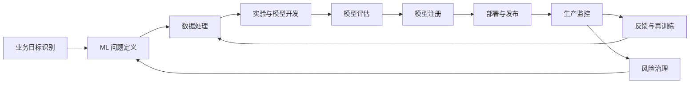
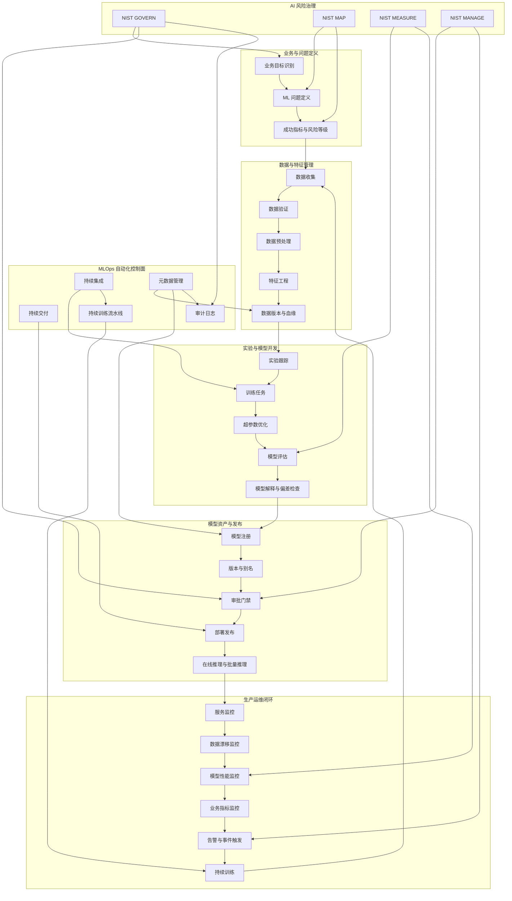
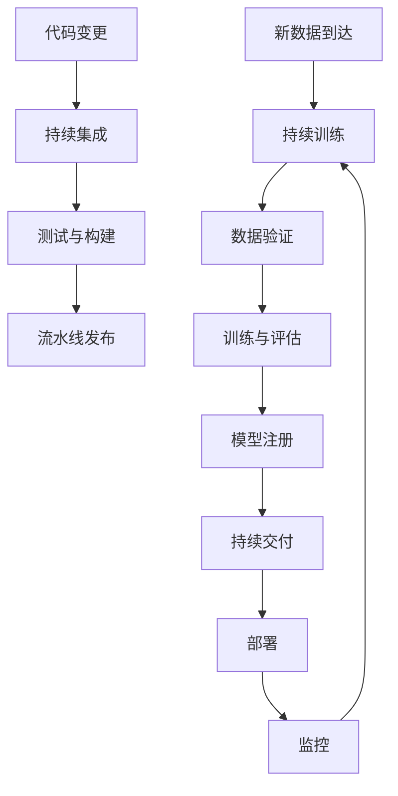
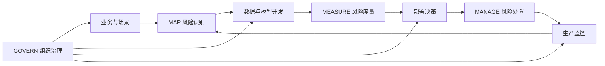

---

## title: ML 生命周期管理官方文档总结
created_at: 2026-06-01
updated_at: 2026-06-01
tags: [AI, 机器学习, MLOps, 生命周期管理, 模型治理, 模型部署, 模型监控]

# ML 生命周期管理官方文档总结

> 本文基于 Google Cloud、Microsoft Azure、AWS、MLflow、Kubeflow、NIST 等官方或权威资料整理，目标是形成一份可复用的 [[MLOps]] 与 [[机器学习生命周期]] 查阅笔记。  
> 核心观点：**ML 生命周期管理不是单纯的训练流程，而是把业务目标、数据、实验、模型、部署、监控、治理和持续改进连接成一个可追踪、可复现、可审计、可自动化的闭环。**

## 1. 一句话定义

ML 生命周期管理是围绕机器学习系统从**业务问题定义**到**数据准备**、**模型开发**、**模型部署**、**生产监控**、**持续训练**和**风险治理**的全流程管理方法。

MLOps 则是把 DevOps、DataOps 和模型治理思想应用到 ML 系统中的工程实践。Google Cloud 将 MLOps 描述为一种统一 ML 系统开发与运维的工程文化和实践，强调在 ML 系统构建的各个步骤中进行自动化与监控，包括集成、测试、发布、部署和基础设施管理。  
参考：[Google Cloud - MLOps continuous delivery and automation pipelines](https://docs.cloud.google.com/architecture/mlops-continuous-delivery-and-automation-pipelines-in-machine-learning)

AWS Well-Architected Machine Learning Lens 给出的通用生命周期包括：

- 业务目标识别
- ML 问题定义
- 数据处理，包括数据收集、预处理、特征工程
- 模型开发，包括训练、调参、评估
- 模型部署，包括推理和预测
- 模型监控

参考：[AWS Well-Architected - Machine learning lifecycle](https://docs.aws.amazon.com/wellarchitected/latest/machine-learning-lens/machine-learning-lifecycle.html)

## 2. 生命周期总览

这条链路的关键不是线性推进，而是**带反馈的迭代闭环**。AWS 明确指出 ML 生命周期阶段并非严格顺序，生命周期中会出现多个反馈环路。Kubeflow 也强调 AI 系统开发是迭代过程，需要评估各阶段输出，并在必要时调整模型和参数。

参考：

- [AWS Well-Architected - Machine learning lifecycle](https://docs.aws.amazon.com/wellarchitected/latest/machine-learning-lens/machine-learning-lifecycle.html)
- [Kubeflow - Architecture](https://www.kubeflow.org/docs/started/architecture/)

### 2.1 官方资料综合 Mermaid Chart

下图将 AWS Well-Architected 的 ML 生命周期阶段、Google Cloud 的 CI/CD/CT 自动化、Azure 与 MLflow 的模型注册治理、Kubeflow 的 Kubernetes 原生组件，以及 NIST AI RMF 的治理框架整合在一张图中。

## 3. 阶段一：业务目标识别

业务目标识别是 ML 生命周期的起点。一个 ML 项目首先要回答：

- 业务问题是否真的需要 ML？
- 预期产生什么业务价值？
- 成功标准是什么？
- 是否能用可观测指标衡量收益？
- 模型失败时的业务风险是什么？

AWS 强调，组织在考虑 ML 时必须清楚知道问题是什么，以及解决该问题能带来的业务价值；同时必须能够用具体业务目标和成功标准衡量业务价值。

常见产物包括：

- 业务目标说明
- 决策场景说明
- 目标用户和影响对象
- 成功指标，例如转化率、召回率、成本降低、响应时延、人工审核节省量
- 风险指标，例如误报成本、漏报成本、公平性风险、安全风险

实践建议：

- 不要从“我要训练一个模型”开始，而要从“哪个决策需要被改进”开始。
- 不要只定义模型指标，还要定义业务指标。
- 对高风险场景，要在项目早期引入合规、法务、安全、业务 owner 和模型治理角色。

参考：[AWS Well-Architected - Machine learning lifecycle](https://docs.aws.amazon.com/wellarchitected/latest/machine-learning-lens/machine-learning-lifecycle.html)

## 4. 阶段二：ML 问题定义

ML 问题定义是把业务问题转化成可建模问题的过程。

需要明确：

- 预测目标是什么？
- 标签或目标变量是什么？
- 输入特征来自哪里？
- 是分类、回归、排序、推荐、异常检测、生成式任务，还是多任务系统？
- 离线评估指标是什么？
- 线上业务指标是什么？
- 错误类型如何区分？例如 false positive 和 false negative 的代价是否不同。

AWS 指出，在这一阶段需要把业务问题框定为机器学习问题，明确要观察什么、预测什么，以及应该优化哪些性能指标和错误指标。

常见产物包括：

- ML problem statement
- 标签定义文档
- 特征候选清单
- 数据需求说明
- 离线评估方案
- 上线验收指标
- 风险分级和人类监督策略

实践建议：

- 指标必须和业务目标关联。模型 AUC 更高，不一定代表业务收益更高。
- 标签定义要考虑可获得性、延迟和噪声。例如“用户最终是否复购”可能需要等待很久，不适合所有实时训练场景。
- 对生成式 AI 或 LLM 应用，还需要定义安全性、事实性、拒答、幻觉率、人工偏好等评估维度。

## 5. 阶段三：数据处理与数据资产管理

数据处理通常包括：

- 数据收集
- 数据清洗
- 数据验证
- 数据预处理
- 特征工程
- 数据集划分
- 数据版本管理
- 数据质量监控

AWS 将数据处理拆成数据收集、数据预处理和特征工程。Kubeflow 在 AI 生命周期中把 Data Preparation 描述为摄取原始数据、执行特征工程、提取 ML features、准备训练数据的阶段，并指出通常会关联 Spark、Dask、Flink、Ray 等数据处理工具。

参考：

- [AWS Well-Architected - Machine learning lifecycle](https://docs.aws.amazon.com/wellarchitected/latest/machine-learning-lens/machine-learning-lifecycle.html)
- [Kubeflow - Architecture](https://www.kubeflow.org/docs/started/architecture/)

### 5.1 数据阶段的关键管理对象

数据阶段不应只保存一份 CSV 或 Parquet 文件，而应把数据作为可治理资产管理：

- 原始数据快照
- 清洗后数据集
- 训练集、验证集、测试集
- 特征定义
- 特征计算代码
- 数据 schema
- 数据质量规则
- 数据版本
- 数据血缘
- 数据访问权限
- 敏感字段和隐私处理说明

Azure Machine Learning 文档强调，Azure ML data assets 可用于跟踪、画像和版本化数据。模型注册和 job history 则会记录训练所用代码、数据和计算资源的快照，形成端到端审计轨迹。

参考：[Azure Machine Learning - MLOps model management](https://learn.microsoft.com/en-us/azure/machine-learning/concept-model-management-and-deployment?view=azureml-api-2)

### 5.2 数据质量与漂移

生产环境中的模型表现往往不是因为算法突然“坏了”，而是因为输入数据、业务环境、用户行为或标签分布发生变化。

需要监控的典型数据问题：

- schema 变化
- 缺失值比例变化
- 枚举值新增或异常
- 数值分布漂移
- 类别分布漂移
- 特征相关性变化
- 训练数据与推理数据不一致
- 线上特征延迟或缺失

Azure 文档提到，MLOps 能力包括监控 operational 和 ML-related issues，例如比较模型输入、探索模型特定指标，以及查看 ML 基础设施上的监控和告警。Azure 还支持围绕 data drift detection 等生命周期事件进行通知和自动化。

参考：[Azure Machine Learning - MLOps model management](https://learn.microsoft.com/en-us/azure/machine-learning/concept-model-management-and-deployment?view=azureml-api-2)

## 6. 阶段四：实验与模型开发

模型开发包括模型构建、训练、调参和评估。AWS 明确指出，模型开发阶段包括 model building、training、tuning、evaluation，并且 model building 可以包含自动化构建、训练、发布到 staging 和 production 的 CI/CD pipeline。

参考：[AWS Well-Architected - Machine learning lifecycle](https://docs.aws.amazon.com/wellarchitected/latest/machine-learning-lens/machine-learning-lifecycle.html)

### 6.1 实验管理

实验管理要回答：

- 这次实验使用了哪些数据？
- 使用了哪些代码版本？
- 使用了哪些参数？
- 使用了哪个运行环境？
- 训练产物在哪里？
- 指标结果是什么？
- 与其他实验相比是否更好？
- 是否可复现？

MLflow Tracking 体系和 SageMaker with MLflow 都围绕实验跟踪、训练输入输出记录、复现性和团队协作展开。AWS 说明 MLflow 可以跟踪训练迭代中的输入和输出，提高实验可重复性并促进数据科学家协作。

参考：

- [AWS SageMaker for MLOps](https://aws.amazon.com/sagemaker/ai/mlops/)
- [MLflow Model Registry](https://www.mlflow.org/docs/latest/ml/model-registry/)

### 6.2 环境复现

Azure 文档将 reusable software environments 作为 MLOps 能力之一，强调环境可以跟踪和复现 pip、conda 等依赖，用于模型训练和部署。

环境管理至少应覆盖：

- Python 版本
- 依赖包版本
- CUDA 和驱动要求
- 系统库
- 容器镜像
- 训练硬件类型
- 推理硬件类型
- 随机种子
- 分布式训练配置

参考：[Azure Machine Learning - MLOps model management](https://learn.microsoft.com/en-us/azure/machine-learning/concept-model-management-and-deployment?view=azureml-api-2)

### 6.3 自动化训练流水线

成熟的 ML 生命周期不依赖个人手动运行 Notebook，而是把训练过程沉淀为可重复执行的 pipeline。

典型 pipeline 步骤包括：

- 数据拉取
- 数据验证
- 数据预处理
- 特征工程
- 训练
- 超参数搜索
- 模型评估
- 模型解释性分析
- 偏差检查
- 模型注册
- 部署前验证

Kubeflow Pipelines 是基于 Kubernetes 的可移植、可扩展 ML workflow 平台。它允许用 KFP Python SDK 编写组件和 pipeline，将 pipeline 编译成平台中立的 IR YAML，并提交到 KFP backend 或 Google Cloud Vertex AI Pipelines。KFP 官方文档强调它可以管理、跟踪和可视化 pipeline definitions、runs、experiments 和 ML artifacts，并支持参数和 artifact 在组件之间传递。

参考：[Kubeflow Pipelines - Overview](https://www.kubeflow.org/docs/components/pipelines/overview/)

## 7. 阶段五：模型评估与上线门禁

模型评估不是只看一次离线指标，而是上线前的质量闸门。

评估维度可以分为：

- 预测性能：accuracy、precision、recall、F1、AUC、RMSE、NDCG 等。
- 业务指标：收入、转化、留存、人工节省、风险损失降低等。
- 稳定性：不同时间段、不同地区、不同用户群体上的表现。
- 鲁棒性：异常输入、噪声输入、边界样本上的表现。
- 公平性：不同群体之间是否存在不可接受的性能差异。
- 可解释性：模型输出是否能被业务、合规或审核人员理解。
- 安全性：是否容易被提示注入、数据投毒、对抗样本或越权调用影响。
- 成本与性能：推理延迟、吞吐、GPU 或 CPU 成本。

上线门禁建议包括：

- 指标必须超过当前生产模型或 baseline。
- 关键业务分群不能出现不可接受退化。
- 数据和模型 lineage 必须完整。
- 训练环境、数据版本和代码版本必须可追踪。
- 模型卡或上线说明必须包含适用范围和已知限制。
- 高风险模型需要人工审批。

Google Cloud 在 MLOps 自动化文档中强调，自动化 pipeline 需要引入数据验证和模型验证步骤。只有经过验证的模型才应进入部署流程。

参考：[Google Cloud - MLOps continuous delivery and automation pipelines](https://docs.cloud.google.com/architecture/mlops-continuous-delivery-and-automation-pipelines-in-machine-learning)

## 8. 阶段六：模型注册与模型资产管理

模型注册是 ML 生命周期管理的中枢。它把一次训练产生的模型文件，提升为可治理、可审计、可部署的模型资产。

### 8.1 模型注册应该记录什么

模型注册中心应记录：

- 模型名称
- 模型版本
- 模型文件或 artifact 地址
- 训练 run id
- 训练数据版本
- 代码版本
- 参数和超参数
- 评估指标
- 依赖环境
- 适用场景
- 不适用场景
- 审批状态
- 当前部署环境
- 责任人
- 标签和注释
- 上线和回滚记录

Azure 文档指出，model registration 会在 Azure ML workspace 中存储和版本化模型，模型注册表便于组织和跟踪训练好的模型；注册模型可以包含一个或多个文件；同名模型再次注册时会自动增加版本号；也可以附加 metadata tags 方便搜索。

参考：[Azure Machine Learning - MLOps model management](https://learn.microsoft.com/en-us/azure/machine-learning/concept-model-management-and-deployment?view=azureml-api-2)

### 8.2 MLflow Model Registry

MLflow Model Registry 是一个集中式模型存储、API 和 UI，用于协作管理机器学习模型的完整生命周期。官方文档强调它支持：

- lineage，即模型由哪个 experiment 和 run 产生
- versioning
- aliases
- metadata tagging
- annotation
- 从开发到生产部署阶段的信息管理

MLflow 最新文档推荐使用 model aliases 管理部署工作流，例如使用 `@champion` 指向当前生产冠军模型。这样生产应用可以引用稳定别名，而不需要硬编码版本号。

参考：[MLflow Model Registry](https://www.mlflow.org/docs/latest/ml/model-registry/)

### 8.3 AWS SageMaker Model Registry

AWS SageMaker Model Registry 用于集中跟踪和管理模型版本、metadata、模型性能基线与审批工作流。AWS 文档强调它可以帮助根据业务需求选择合适模型进行部署，并自动记录审批流程以支持审计和合规。

参考：[AWS SageMaker for MLOps](https://aws.amazon.com/sagemaker/ai/mlops/)

## 9. 阶段七：模型部署与发布

模型部署是把模型从 artifact 变成可被业务系统调用的服务或批处理任务。

部署方式通常包括：

- 在线实时推理
- 批量推理
- 流式推理
- 边缘端部署
- 嵌入式或端侧部署
- 人工审核辅助系统
- API 服务
- 数据库内或数据仓库内推理

Azure 文档说明，模型可以部署为 endpoint，在线 endpoint 适用于 real-time scoring，batch endpoint 适用于 batch scoring。部署一个 endpoint 通常需要模型、entry script、环境依赖、部署配置等信息。对于 MLflow model，Azure 文档也指出部署时不一定需要手动提供 entry script 或 environment。

参考：[Azure Machine Learning - MLOps model management](https://learn.microsoft.com/en-us/azure/machine-learning/concept-model-management-and-deployment?view=azureml-api-2)

### 9.1 发布策略

推荐的发布方式：

- Shadow deployment：新模型只接收镜像流量，不影响用户结果。
- Canary deployment：先让少量流量进入新模型。
- Blue green deployment：蓝绿切换，便于快速回滚。
- A B testing：多个模型版本分流，比较业务效果。
- Champion challenger：保留当前冠军模型，同时挑战者模型持续竞争。
- Human in the loop：高风险输出先经过人工审核。

Azure 支持在线 endpoint 的 controlled rollout，例如创建多个 deployment，通过调整 endpoint traffic percentage 做 A/B testing 或切换部署。AWS SageMaker 文档也提到其部署机制支持 Blue/Green deployment 和自动回滚能力，以降低端点更新风险。

参考：

- [Azure Machine Learning - MLOps model management](https://learn.microsoft.com/en-us/azure/machine-learning/concept-model-management-and-deployment?view=azureml-api-2)
- [AWS SageMaker for MLOps](https://aws.amazon.com/sagemaker/ai/mlops/)

## 10. 阶段八：生产监控

生产监控是 ML 生命周期闭环的关键。传统软件系统主要监控服务健康，而 ML 系统还要监控数据、模型、业务和风险。

### 10.1 需要监控的对象

服务层监控：

- 请求量
- 延迟
- 错误率
- 超时率
- CPU、GPU、内存
- 队列长度
- endpoint 可用性

数据层监控：

- schema 变化
- 缺失值
- 异常值
- 输入分布漂移
- 特征质量
- 训练服务偏差

模型层监控：

- 线上准确率
- 置信度分布
- 模型漂移
- 概念漂移
- 分群表现退化
- 偏差和公平性指标
- 解释性指标

业务层监控：

- 转化率
- 留存率
- 召回成本
- 人工审核量
- 风险损失
- 用户投诉

治理层监控：

- 未授权访问
- 越权调用
- 数据泄露风险
- 违反策略的输出
- 高风险模型调用记录
- 审计日志完整性

### 10.2 漂移与再训练

模型上线后，业务环境会变化，因此需要持续监控并触发再训练。

AWS SageMaker Model Monitor 用于检测 model drift 和 concept drift，并可以发送告警，帮助团队采取行动。AWS 还提到 SageMaker Model Monitor 与 SageMaker Clarify 集成，提高对潜在 bias 的可见性。

Azure 文档提到可以围绕 experiment completion、model registration、model deployment、data drift detection 等生命周期事件通知和告警，并通过 Event Grid 支持事件驱动流程。

参考：

- [AWS SageMaker for MLOps](https://aws.amazon.com/sagemaker/ai/mlops/)
- [Azure Machine Learning - MLOps model management](https://learn.microsoft.com/en-us/azure/machine-learning/concept-model-management-and-deployment?view=azureml-api-2)

## 11. 持续集成、持续交付与持续训练

ML 系统的自动化不仅是 CI/CD，还包括 CT，即 Continuous Training。

Google Cloud 的 MLOps 文档明确讨论如何为 ML 系统实现和自动化 CI、CD、CT。其成熟度分层中：

- Level 0：手动流程，数据科学家手动完成实验、训练、部署。
- Level 1：自动化 ML pipeline，实现连续训练，让新数据可以触发模型再训练并持续交付预测服务。
- Level 2：CI/CD pipeline 自动化，不仅自动训练模型，还自动构建、测试和部署 pipeline 组件。

Google Cloud 还强调，为了快速可靠地更新生产 pipeline，需要健壮的自动化 CI/CD 系统，让数据科学家围绕特征工程、模型架构、超参数探索新想法，并自动构建、测试、部署新的 pipeline components。

参考：[Google Cloud - MLOps continuous delivery and automation pipelines](https://docs.cloud.google.com/architecture/mlops-continuous-delivery-and-automation-pipelines-in-machine-learning)

### 11.1 ML 系统为什么比普通软件更需要 CT

普通软件的代码不变，行为通常相对稳定。ML 系统即使代码不变，行为也可能因为输入数据分布变化、用户行为变化、业务策略变化而退化。

因此，ML 生命周期管理必须额外管理：

- 数据版本
- 模型版本
- 特征版本
- 训练 pipeline 版本
- 评估数据版本
- 推理数据分布
- 线上反馈
- 再训练触发条件

## 12. MLOps 能力地图

一个完整的 ML 生命周期管理平台通常包含以下能力。

### 12.1 项目与实验能力

- 项目模板
- 标准目录结构
- Notebook 到 pipeline 的转化机制
- 实验跟踪
- 指标记录
- artifact 管理
- 团队协作和权限控制

### 12.2 数据能力

- 数据接入
- 数据校验
- 数据版本
- 数据 lineage
- 特征工程
- 离线特征库
- 在线特征库
- 数据质量监控

### 12.3 训练能力

- 训练任务调度
- 分布式训练
- 超参数搜索
- 自动化 pipeline
- 容器化环境
- GPU 资源管理
- 训练日志与指标

### 12.4 模型资产能力

- 模型注册
- 模型版本
- 模型 metadata
- 模型审批
- 模型别名
- 模型卡
- 模型 lineage
- 模型复现

### 12.5 部署能力

- 在线 endpoint
- 批处理 endpoint
- 蓝绿发布
- 灰度发布
- A/B testing
- 自动回滚
- 推理扩缩容
- 成本优化

### 12.6 监控能力

- 服务监控
- 数据漂移监控
- 模型漂移监控
- 性能退化监控
- 偏差监控
- 业务指标监控
- 告警和事件触发

### 12.7 治理能力

- 审计日志
- 权限控制
- 风险分级
- 模型审批
- 数据隐私
- 合规检查
- 人工监督
- 事故响应

## 13. 主流平台与组件映射

### 13.1 Google Cloud

Google Cloud 的官方 MLOps 资料重点强调：

- CI、CD、CT 的自动化
- ML pipeline 的生产化
- 数据验证和模型验证
- pipeline trigger
- metadata management
- Vertex AI Pipelines 与 Cloud Build 等组合

适合关注点：

- 端到端云上 MLOps 架构
- 自动化 pipeline
- 多环境部署
- 从实验到生产的工程化

参考：

- [Google Cloud - MLOps continuous delivery and automation pipelines](https://docs.cloud.google.com/architecture/mlops-continuous-delivery-and-automation-pipelines-in-machine-learning)
- [Google Cloud - Architecture for MLOps using TFX, Vertex AI Pipelines, and Cloud Build](https://cloud.google.com/architecture/architecture-for-mlops-using-tfx-kubeflow-pipelines-and-cloud-build)
- [Google Cloud - Practitioners guide to MLOps PDF](https://services.google.com/fh/files/misc/practitioners_guide_to_mlops_whitepaper.pdf)

### 13.2 Microsoft Azure Machine Learning

Azure ML 官方文档重点强调：

- 可复现 ML pipelines
- 可复用 software environments
- 模型注册、打包和部署
- 生命周期 metadata 和 lineage
- lifecycle event notification
- 监控 operational 和 ML-related issues
- Git 与 Azure Pipelines 自动化

适合关注点：

- 企业模型注册和治理
- Azure DevOps 集成
- endpoint 部署
- Event Grid 事件驱动自动化

参考：[Azure Machine Learning - MLOps model management](https://learn.microsoft.com/en-us/azure/machine-learning/concept-model-management-and-deployment?view=azureml-api-2)

### 13.3 AWS SageMaker

AWS SageMaker MLOps 资料重点强调：

- 标准化数据科学环境
- SageMaker Pipelines 自动化 workflow
- SageMaker Projects 引入 CI/CD
- SageMaker Model Registry 管理版本和审批
- lineage tracking 支持复现和排障
- Model Monitor 检测 drift
- Clarify 支持 bias 可见性
- Blue/Green deployment 和自动回滚

适合关注点：

- AWS 原生 MLOps
- 企业级审批与合规
- 生产模型监控
- 大规模训练和部署

参考：

- [AWS SageMaker for MLOps](https://aws.amazon.com/sagemaker/ai/mlops/)
- [AWS Well-Architected - Machine learning lifecycle](https://docs.aws.amazon.com/wellarchitected/latest/machine-learning-lens/machine-learning-lifecycle.html)
- [AWS SageMaker - Define a pipeline](https://docs.aws.amazon.com/sagemaker/latest/dg/define-pipeline.html)

### 13.4 MLflow

MLflow 的核心价值在于：

- 实验跟踪
- 模型记录
- 模型注册
- 模型版本管理
- 模型 alias
- metadata tagging
- lineage
- deployment workflow 管理

适合关注点：

- 跨平台实验管理
- 轻量级模型注册
- 开源 MLOps 基础设施
- 与 Databricks、SageMaker、Azure 等平台结合

参考：[MLflow Model Registry](https://www.mlflow.org/docs/latest/ml/model-registry/)

### 13.5 Kubeflow

Kubeflow 是面向 Kubernetes 的 AI platform 工具体系。Kubeflow 官方架构文档将其组件映射到 AI 生命周期：

- Spark Operator：数据准备和特征工程
- Notebooks：模型开发和交互式数据科学
- Trainer：大规模分布式训练或 LLM fine-tuning
- Katib：超参数搜索和 AutoML
- Model Registry：存储 ML metadata 和 model artifacts
- Pipelines：构建、部署和管理 AI lifecycle 的各个步骤
- KServe：生产级模型服务，通常用于模型在线 serving

适合关注点：

- Kubernetes 原生 AI 平台
- 私有化部署
- 可组合平台工程
- 多租户和资源调度
- 与 Kueue、KServe、Katib、Pipelines 等生态组合

参考：

- [Kubeflow - Architecture](https://www.kubeflow.org/docs/started/architecture/)
- [Kubeflow Pipelines - Overview](https://www.kubeflow.org/docs/components/pipelines/overview/)
- [Kubeflow GitHub](https://github.com/kubeflow/kubeflow)

## 14. 风险治理与 NIST AI RMF

ML 生命周期管理不能只关注工程效率，还必须覆盖风险治理。

NIST AI Risk Management Framework 是一个自愿使用的 AI 风险管理框架，目标是帮助组织更好地管理 AI 对个人、组织和社会带来的风险，并将可信性考虑纳入 AI 产品、服务和系统的设计、开发、使用和评估。

NIST AI RMF Core 包含四个高层函数：

- GOVERN：建立组织治理、政策、职责和风险文化。
- MAP：理解 AI 系统上下文，识别风险场景。
- MEASURE：使用定量或定性方法评估、分析和监测风险。
- MANAGE：根据风险优先级采取处置行动，持续跟踪残余风险。

NIST 文档强调，GOVERN 贯穿所有阶段，MAP、MEASURE、MANAGE 可以应用在 AI system-specific context 和 AI lifecycle 的特定阶段。

参考：

- [NIST - AI Risk Management Framework](https://www.nist.gov/itl/ai-risk-management-framework)
- [NIST AI RMF 1.0 PDF](https://nvlpubs.nist.gov/nistpubs/ai/NIST.AI.100-1.pdf)

### 14.1 将 NIST AI RMF 映射到 ML 生命周期

实际落地时，可以把治理要求嵌入每个阶段：

- 业务目标阶段：明确使用目的、受影响人群、风险等级。
- 数据阶段：检查数据来源、授权、隐私、偏差和代表性。
- 开发阶段：记录实验、参数、代码和训练数据版本。
- 评估阶段：增加公平性、鲁棒性、安全性、解释性评估。
- 注册阶段：要求模型卡、审批记录和责任人。
- 部署阶段：设置灰度、回滚、人类监督和访问控制。
- 监控阶段：持续监测漂移、偏差、滥用和事故。
- 退役阶段：记录退役原因、替代方案和历史影响。

## 15. 最小可行 MLOps 路线图

如果团队刚开始建设 ML 生命周期管理，不建议一开始搭建过重的平台。可以分阶段推进。

### 15.1 阶段 A：从手工到可复现

目标：

- 实验可追踪
- 训练可复现
- 模型可版本化

最低能力：

- Git 管理代码
- 数据集版本记录
- 实验参数和指标记录
- 训练环境固定
- 模型 artifact 存储
- README 或模型卡说明

推荐工具：

- MLflow Tracking
- DVC 或 LakeFS
- Docker
- GitHub Actions 或 Azure Pipelines

### 15.2 阶段 B：从可复现到流水线化

目标：

- 训练过程自动化
- 评估过程标准化
- 模型注册规范化

最低能力：

- 数据验证
- 训练 pipeline
- 自动评估
- 模型注册
- 上线前门禁
- 基础 CI

推荐工具：

- Kubeflow Pipelines
- Vertex AI Pipelines
- SageMaker Pipelines
- Azure ML pipelines
- MLflow Model Registry

### 15.3 阶段 C：从流水线化到生产闭环

目标：

- 部署自动化
- 线上可观测
- 可回滚
- 可持续训练

最低能力：

- endpoint 管理
- 灰度发布
- A/B testing
- 模型监控
- 数据漂移监控
- 告警触发
- 自动或半自动再训练

推荐工具：

- KServe
- SageMaker Endpoints 和 Model Monitor
- Azure Online Endpoints 和 Event Grid
- Vertex AI Model Monitoring
- Prometheus 和 Grafana

### 15.4 阶段 D：从生产闭环到治理平台

目标：

- 跨团队模型治理
- 审计与合规
- 风险管理制度化

最低能力：

- 模型目录
- 权限分级
- 审批流
- 模型卡
- 数据 lineage
- 模型 lineage
- 风险分级
- 事故响应
- 退役机制

参考框架：

- NIST AI RMF
- 云厂商 MLOps 最佳实践
- 企业内部安全与合规制度

## 16. 常见反模式

### 16.1 Notebook 即生产

问题：

- 难以复现
- 依赖隐式环境
- 参数散落
- 缺少测试
- 难以审计

改进：

- 将 Notebook 探索结果沉淀为 pipeline component。
- 关键训练逻辑进入可测试代码仓库。
- Notebook 保留为分析和报告工具，而不是生产执行入口。

### 16.2 只保存模型文件，不保存上下文

问题：

- 不知道模型由哪份数据训练
- 不知道代码版本
- 不知道评估指标
- 不能解释线上行为
- 无法合规审计

改进：

- 使用 Model Registry。
- 记录 run、data、code、environment、metrics、approval。

### 16.3 只有离线指标，没有线上监控

问题：

- 训练集表现好，线上表现可能迅速退化。
- 数据漂移、概念漂移、业务变化无法被发现。

改进：

- 监控服务、数据、模型、业务和治理指标。
- 为漂移和性能退化设置告警。
- 建立再训练和回滚流程。

### 16.4 自动化部署没有门禁

问题：

- 新模型可能在局部分群上严重退化。
- 高风险模型可能未经审批上线。

改进：

- 上线前强制评估。
- 对高风险场景引入人工审批。
- 使用灰度发布和自动回滚。

### 16.5 MLOps 被误解为工具采购

问题：

- 买了平台，但流程、责任和指标没有建立。
- 数据科学、工程、运维、治理之间仍然割裂。

改进：

- 先定义生命周期流程和责任边界。
- 再选择工具支撑流程。
- 把模型治理、数据治理、平台工程一起纳入设计。

## 17. 与传统软件生命周期的差异

ML 生命周期比传统软件生命周期多出几类复杂性：

- 数据是系统行为的一部分，不只是输入。
- 模型行为无法完全由显式代码审查解释。
- 训练与推理之间可能存在数据偏差。
- 同一份代码在不同数据上会产生不同行为。
- 线上环境变化会导致模型性能自然退化。
- 模型需要实验管理、模型注册、漂移监控和再训练。
- 风险治理需要覆盖公平性、可解释性、隐私和安全。

因此，MLOps 不是 DevOps 的简单复制，而是 DevOps 加 DataOps 加 Model Governance 的组合。

## 18. 推荐落地检查清单

立项阶段：

- 是否定义清楚业务目标？
- 是否确认 ML 是合适方案？
- 是否定义业务成功指标？
- 是否定义模型失败风险？

数据阶段：

- 是否记录数据来源？
- 是否有数据版本？
- 是否有数据质量规则？
- 是否识别敏感字段？
- 是否评估数据偏差？

开发阶段：

- 是否记录实验参数和指标？
- 是否固定训练环境？
- 是否可复现实验结果？
- 是否建立 baseline？

评估阶段：

- 是否有独立测试集？
- 是否做分群评估？
- 是否检查鲁棒性？
- 是否检查公平性和安全性？

注册阶段：

- 是否进入模型注册表？
- 是否记录 lineage？
- 是否有模型卡？
- 是否有审批状态？

部署阶段：

- 是否支持灰度？
- 是否支持回滚？
- 是否有 endpoint 监控？
- 是否有访问控制？

监控阶段：

- 是否监控数据漂移？
- 是否监控模型性能？
- 是否监控业务指标？
- 是否设置告警？
- 是否定义再训练触发条件？

治理阶段：

- 是否有责任人？
- 是否有审计日志？
- 是否有风险分级？
- 是否有事故响应流程？
- 是否有模型退役机制？

## 19. 总结

ML 生命周期管理的本质，是让模型从一次性实验变成可持续运营的工程资产。

成熟的生命周期管理至少要做到：

- 业务目标可衡量
- 数据和特征可治理
- 实验可追踪
- 训练可复现
- 模型可注册
- 部署可控制
- 线上可监控
- 漂移可响应
- 风险可治理
- 全链路可审计

从官方资料看，各个平台的表达不同，但方向高度一致：

- AWS 强调生命周期阶段、SageMaker Pipelines、Model Registry、Lineage、Monitor 和治理。
- Google Cloud 强调 CI/CD/CT 和 pipeline 自动化成熟度。
- Azure 强调模型注册、生命周期 metadata、事件通知、部署和监控。
- MLflow 强调实验、模型注册、版本、alias 和 lineage。
- Kubeflow 强调 Kubernetes 原生 AI platform 组件与 AI lifecycle 的映射。
- NIST 强调 AI 风险管理贯穿设计、开发、使用和评估。

因此，建设 ML 生命周期管理时，应先定义组织流程和治理目标，再选择合适平台工具；先实现可复现，再实现流水线化；先有监控和回滚，再谈完全自动化。

## Reference Links

### AWS

- [AWS Well-Architected Machine Learning Lens - Machine learning lifecycle](https://docs.aws.amazon.com/wellarchitected/latest/machine-learning-lens/machine-learning-lifecycle.html)
- [AWS SageMaker for MLOps](https://aws.amazon.com/sagemaker/ai/mlops/)
- [Amazon SageMaker - Define a pipeline](https://docs.aws.amazon.com/sagemaker/latest/dg/define-pipeline.html)
- [AWS Blog - Architect and build the full machine learning lifecycle with Amazon SageMaker](https://aws.amazon.com/blogs/machine-learning/architect-and-build-the-full-machine-learning-lifecycle-with-amazon-sagemaker/)

### Google Cloud

- [Google Cloud - MLOps: Continuous delivery and automation pipelines in machine learning](https://docs.cloud.google.com/architecture/mlops-continuous-delivery-and-automation-pipelines-in-machine-learning)
- [Google Cloud - Architecture for MLOps using TFX, Vertex AI Pipelines, and Cloud Build](https://cloud.google.com/architecture/architecture-for-mlops-using-tfx-kubeflow-pipelines-and-cloud-build)
- [Google Cloud - Practitioners guide to MLOps PDF](https://services.google.com/fh/files/misc/practitioners_guide_to_mlops_whitepaper.pdf)

### Microsoft Azure

- [Azure Machine Learning - MLOps model management with Azure Machine Learning](https://learn.microsoft.com/en-us/azure/machine-learning/concept-model-management-and-deployment?view=azureml-api-2)
- [Azure MLOps v2 GitHub](https://github.com/Azure/mlops-v2)

### MLflow

- [MLflow - Model Registry](https://www.mlflow.org/docs/latest/ml/model-registry/)
- [MLflow 2.16.2 - Model Registry](https://mlflow.org/docs/2.16.2/model-registry.html)

### Kubeflow

- [Kubeflow - Architecture](https://www.kubeflow.org/docs/started/architecture/)
- [Kubeflow Pipelines - Overview](https://www.kubeflow.org/docs/components/pipelines/overview/)
- [Kubeflow Pipelines - Pipeline concept](https://www.kubeflow.org/docs/components/pipelines/concepts/pipeline/)
- [Kubeflow GitHub](https://github.com/kubeflow/kubeflow)

### NIST

- [NIST - AI Risk Management Framework](https://www.nist.gov/itl/ai-risk-management-framework)
- [NIST AI RMF 1.0 PDF](https://nvlpubs.nist.gov/nistpubs/ai/NIST.AI.100-1.pdf)

## 缩写对照表

| 缩写          | 英文全称                                                             | 中文含义                 | 在本文中的上下文                                       |
| ----------- | ---------------------------------------------------------------- | -------------------- | ---------------------------------------------- |
| AI          | Artificial Intelligence                                          | 人工智能                 | 泛指使用数据、算法和模型完成感知、预测、生成或决策的系统。                  |
| ML          | Machine Learning                                                 | 机器学习                 | 本文讨论的生命周期主体，包括数据、训练、部署、监控和再训练。                 |
| MLOps       | Machine Learning Operations                                      | 机器学习运维               | 将 DevOps、DataOps 和模型治理用于 ML 系统生产化的工程实践。        |
| DevOps      | Development and Operations                                       | 开发运维一体化              | MLOps 借鉴的工程文化，强调自动化、持续交付和运维协同。                 |
| DataOps     | Data Operations                                                  | 数据运维                 | 面向数据流水线、数据质量、数据版本和数据治理的工程实践。                   |
| CI          | Continuous Integration                                           | 持续集成                 | 自动构建、测试和验证代码或 pipeline 组件。                     |
| CD          | Continuous Delivery 或 Continuous Deployment                      | 持续交付或持续部署            | 将通过验证的模型、服务或 pipeline 发布到目标环境。                 |
| CT          | Continuous Training                                              | 持续训练                 | 使用新数据或触发条件自动再训练模型的 MLOps 能力。                   |
| CI/CD/CT    | Continuous Integration, Continuous Delivery, Continuous Training | 持续集成、持续交付、持续训练       | Google Cloud MLOps 文档强调的自动化主线。                 |
| AWS         | Amazon Web Services                                              | 亚马逊云服务               | 本文引用 AWS Well-Architected 和 SageMaker 资料。      |
| Azure       | Microsoft Azure                                                  | 微软云平台                | 本文引用 Azure Machine Learning 的模型管理与 MLOps 文档。   |
| NIST        | National Institute of Standards and Technology                   | 美国国家标准与技术研究院         | 本文引用 NIST AI RMF 作为 AI 风险治理框架。                 |
| RMF         | Risk Management Framework                                        | 风险管理框架               | 在本文中特指 NIST AI Risk Management Framework。      |
| TFX         | TensorFlow Extended                                              | TensorFlow 扩展生产流水线框架 | Google Cloud MLOps 架构文档中用于生产级 ML pipeline 的组件。 |
| KFP         | Kubeflow Pipelines                                               | Kubeflow 流水线         | 用于构建、部署和管理可移植 ML workflow 的 Kubeflow 组件。       |
| API         | Application Programming Interface                                | 应用程序编程接口             | MLflow、Kubeflow、云平台等用于注册、查询、部署和管理模型的接口。        |
| UI          | User Interface                                                   | 用户界面                 | MLflow Registry、Kubeflow Dashboard 等提供可视化管理入口。 |
| SDK         | Software Development Kit                                         | 软件开发工具包              | 例如 KFP Python SDK、Kubeflow SDK、SageMaker SDK。  |
| DAG         | Directed Acyclic Graph                                           | 有向无环图                | ML pipeline 常用的任务依赖结构。                         |
| IR          | Intermediate Representation                                      | 中间表示                 | KFP 将 pipeline 编译成平台中立 IR YAML。                |
| YAML        | YAML Ain't Markup Language                                       | YAML 配置格式            | 常用于 pipeline、Kubernetes 和基础设施配置。               |
| CPU         | Central Processing Unit                                          | 中央处理器                | 模型训练或推理的通用计算资源。                                |
| GPU         | Graphics Processing Unit                                         | 图形处理器                | 深度学习训练和高吞吐推理常用的加速资源。                           |
| VM          | Virtual Machine                                                  | 虚拟机                  | 云上训练、部署或 endpoint 运行的计算资源类型。                   |
| AKS         | Azure Kubernetes Service                                         | Azure Kubernetes 服务  | Azure 中可用于在线 endpoint 或模型部署的 Kubernetes 环境。    |
| ONNX        | Open Neural Network Exchange                                     | 开放神经网络交换格式           | Azure 文档提到可用于模型转换和性能优化。                        |
| AUC         | Area Under the Curve                                             | 曲线下面积                | 分类模型常用评估指标，尤其用于二分类排序质量评估。                      |
| F1          | F1 Score                                                         | F1 分数                | precision 和 recall 的调和平均，适合类别不均衡场景。            |
| RMSE        | Root Mean Squared Error                                          | 均方根误差                | 回归模型常用评估指标。                                    |
| NDCG        | Normalized Discounted Cumulative Gain                            | 归一化折损累计增益            | 排序、推荐和搜索任务常用评估指标。                              |
| LLM         | Large Language Model                                             | 大语言模型                | 文中涉及生成式 AI、LLM fine-tuning 和大模型治理场景。           |
| GenAI       | Generative AI                                                    | 生成式人工智能              | 需要额外关注事实性、安全性、幻觉率和治理风险的 AI 类型。                 |
| A/B Testing | A/B Testing                                                      | A/B 测试               | 将流量分配给不同模型版本，比较线上业务效果。                         |

## Update History

- 2026-06-01: 在文末补充缩写对照表，覆盖 ML 生命周期管理、MLOps 自动化、平台组件、指标和治理框架中的常见缩写。
- 2026-06-01: 根据官方资料补充综合 Mermaid Chart，覆盖生命周期阶段、MLOps 自动化控制面和 NIST 风险治理闭环。
- 2026-06-01: 初次创建，基于 AWS、Google Cloud、Azure、MLflow、Kubeflow、NIST 等官方或权威资料整理 ML 生命周期管理与 MLOps 能力框架。

