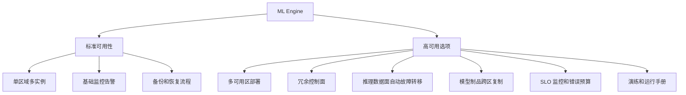

# ML Platform Availability SLA 商业评估

> 本文用于评估 ML Engine 当前 **99.9% 平台可用性目标**在商业 ML 平台市场中的位置。  
> 结论先行：**99.9% 是多数 ML 平台公开 SLA 的主流水平；99.95% 属于更高一档，通常需要明确限定服务类型、实例冗余、可用区或企业合同条款；99.99% 在主流 ML-specific 平台中并不常见，更多见于底层云基础设施或特定数据平台的业务连续性条款。**

## 1. 结论摘要

ML Engine 当前 99.9% availability target 可以作为商业上合理、可防守的默认承诺。它与 Google Vertex AI、Azure Machine Learning、OpenAI Enterprise API priority 或 scale traffic 这类公开可查的 ML/AI 服务承诺处在同一档。

但如果对标口径是“行业领导者最高可用性配置”，99.9% 不是最高档。AWS SageMaker Online Inference 在多实例端点条件下公开给出 99.95% SLA，Azure Databricks 公开 SLA 也是 99.95%。这类承诺通常不是单实例或默认配置自然得到的，而是依赖服务侧冗余、平台托管能力、企业级条款和明确的 SLA 计算方式。

因此，推荐商务表达采用以下口径：

- 对标准客户：**99.9% 是主流 ML 平台默认商业 SLA 水平**，可作为 ML Engine 的标准目标。
- 对高可用客户：提供 **99.95% architecture-ready option**，通过多实例、多可用区、自动故障转移和控制面降级能力支撑更高 SLA。
- 对极高可用客户：避免承诺 99.99% ML 平台级 SLA，除非合同边界严格限定到底层基础设施、读写控制面、灾备能力或特定服务子集。

## 2. SLA 与月度停机时间换算

以下换算按 30 天自然月估算。

| Availability SLA | 月度不可用比例 | 约等价停机时间 | 商业含义 |
|---|---:|---:|---|
| 99.0% | 1.0% | 7 小时 12 分钟 | 不适合作为生产 ML 平台主承诺 |
| 99.5% | 0.5% | 3 小时 36 分钟 | 可用于低关键性或非实时服务 |
| 99.9% | 0.1% | 43.2 分钟 | 主流 ML/AI 平台公开 SLA 档位 |
| 99.95% | 0.05% | 21.6 分钟 | 高可用档位，通常需要冗余架构或企业服务层级 |
| 99.99% | 0.01% | 4.32 分钟 | 通常属于底层云基础设施或特定高可用服务口径 |

## 3. 公开 SLA 对比矩阵

> 说明：SLA 通常只代表服务商可用性承诺和服务抵扣机制，不等于端到端业务连续性，也不保证模型质量、推理延迟、容量充足、GPU 库存或客户侧配置正确。

| 平台或服务 | 公开可验证 SLA | 约停机时间/月 | 证据强度 | 关键适用条件 |
|---|---:|---:|---|---|
| AWS SageMaker Online Inference | 99.95% | 21.6 分钟 | 高 | 仅适用于 InvokeEndpoint API，且模型端点由超过一个实例支持 |
| AWS SageMaker Batch Transform | 99.9% | 43.2 分钟 | 高 | 适用于 CreateTransformJob 与 StopTransformJob API |
| Google Cloud Vertex AI | 99.9% | 43.2 分钟 | 高 | 适用于 Training、Deployment、Batch Prediction；training cluster control plane API 另有 99% 口径 |
| Azure Machine Learning | 99.9% | 43.2 分钟 | 高 | Azure 官方产品页公开说明 Azure ML SLA 为 99.9%；Managed Online Endpoints 支持 SLA 和监控 |
| Azure Databricks | 99.95% | 21.6 分钟 | 中高 | 公开 Azure Databricks SLA 为 99.95%；Databricks 自身合同口径需看具体 MCSA、Order Form 和云环境 |
| OpenAI API Enterprise priority 或 scale traffic | 99.9% | 43.2 分钟 | 高 | 适用于 Enterprise 客户的 Scale Tier 或 Priority processing；标准 pay as you go API 不应默认按该口径宣传 |
| Snowflake 平台和 Cortex AI 所在平台环境 | 99.9% 到 99.99% 需分口径 | 43.2 到 4.32 分钟 | 中 | Snowflake 公开说明其成功查询执行 SLA 同时包含 99.9% 和 99.99% 阈值；Cortex AI 作为平台内 AI 能力，需按合同和服务范围确认 |
| Hugging Face Dedicated Inference Endpoints | 待合同确认 | 待确认 | 中低 | 官方 Dedicated Endpoints 文档强调专用托管基础设施和性能保障，但公开 99.9% SLA 证据不如 AWS、Google、OpenAI 直接 |
| NVIDIA Run:ai SaaS 或 NVIDIA Cloud Services | 待合同确认 | 待确认 | 中低 | NVIDIA Run:ai Control Plane 指向 NVIDIA Cloud Services SLA；公开 SLA 页面中常见 NVIDIA Cloud Offering 为 99%，Run:ai 具体 SLA 需查合同 |
| ML Engine | 99.9% 目标 | 43.2 分钟 | 内部目标 | 当前目标与主流 ML 平台默认档一致，可作为标准商业承诺基础 |

## 4. 排名口径修正

如果只按“最高公开数字”排序，容易产生误导。更稳妥的商业评估应按三层分类：

### 4.1 高可用公开档：99.95%

这一档适合表达为“top-tier availability target”，但必须附带条件。

代表服务：

- AWS SageMaker Online Inference：99.95%，要求 Online Inference endpoint supported by more than one instance。
- Azure Databricks：公开 SLA 为 99.95%，但要注意这是 Azure Databricks 服务口径，不等同于所有 Databricks 部署形态。

这一档的共同点不是“ML 平台天然更可靠”，而是服务范围和部署形态被严格限定，底层具备冗余调度、服务监控、自动恢复和云平台托管机制。

### 4.2 主流生产档：99.9%

这一档是 ML Engine 当前目标最适合对标的市场位置。

代表服务：

- Google Vertex AI Training、Deployment、Batch Prediction。
- Azure Machine Learning。
- AWS SageMaker Batch Transform。
- OpenAI Enterprise Scale Tier 或 Priority processing traffic。
- 多数需要企业合同或专用部署的 AI 服务承诺。

商业含义：

- 足以支撑大多数企业 ML 平台生产环境。
- 与主流云厂商 ML 服务公开 SLA 保持一致。
- 对客户来说是合理的 baseline，而不是明显低于市场的承诺。

### 4.3 极高可用档：99.99%

99.99% 不宜作为通用 ML 平台可用性承诺直接宣传。

原因：

- ML 平台包含训练、推理、模型注册、制品存储、特征访问、GPU 资源、控制面、数据面等多个层级，端到端可用性通常低于单个基础设施组件。
- 多数公开 ML-specific SLA 停留在 99.9% 或 99.95%。
- 99.99% 常见于底层云基础设施、负载均衡、存储、网络或特定数据平台业务连续性口径，而不是完整 ML 平台端到端 SLA。

## 5. ML Engine 的商业定位

ML Engine 99.9% availability target 可以这样定位：

> ML Engine targets 99.9% platform availability, which is aligned with the standard public SLA tier of major ML and AI platforms such as Google Vertex AI, Azure Machine Learning, and enterprise-grade OpenAI API offerings. For customers requiring higher availability, a high-availability deployment architecture can target 99.95% through redundant instances, zone-aware deployment, automated failover, and operational runbooks.

中文商务口径：

> ML Engine 当前 99.9% 平台可用性目标与主流商业 ML/AI 平台的公开 SLA 档位一致。对于需要更高可用性的客户，可通过多实例、多可用区、自动故障转移和运维值守机制设计 99.95% 高可用部署方案。

不建议使用的口径：

- “ML Engine 达到行业最高 SLA。”
- “99.9% 已经等同于 AWS SageMaker Online Inference 顶级 SLA。”
- “所有竞品都是 99.9%，因此没有必要支持 99.95%。”
- “99.99% 是 ML 平台行业通用目标。”

更稳妥的口径：

- “99.9% is industry-standard for default ML platform availability.”
- “99.95% is achievable in top-tier configurations with redundancy and strict service boundaries.”
- “99.99% should be treated as an exceptional infrastructure-level or contract-specific commitment, not a generic ML platform benchmark.”

## 6. 99.95% 目标所需架构能力

如果未来 ML Engine 要从 99.9% 推进到 99.95%，需要把 SLA 从“目标数字”转化为架构和运营能力。

关键能力清单：

- 多实例推理端点：避免单实例成为 SLA 下限。
- 多可用区或跨故障域部署：降低单 AZ、单节点池、单机架故障影响。
- 控制面和数据面分离：推理请求不应因控制面短时故障立即中断。
- 自动故障转移：包括 endpoint routing、health check、readiness probe、traffic shifting。
- 制品和元数据冗余：模型文件、镜像、配置、注册表、特征依赖要有恢复路径。
- 可观测性：availability、error rate、latency、capacity、queue depth、GPU availability 分开监控。
- 错误预算机制：把 99.9% 或 99.95% 转成月度 error budget，驱动发布节奏和变更冻结。
- SLA 排除项：客户配置错误、容量不足、第三方依赖、不可抗力、计划维护、preview 功能应在合同中清晰排除。

## 7. 商业建议

### 7.1 标准 SKU

标准 SKU 建议承诺 99.9%。

适用客户：

- 常规企业 ML 平台。
- 离线训练和批处理为主。
- 推理服务重要但不是强交易链路。
- 可以接受月度 43 分钟量级服务不可用预算。

建议表述：

> Standard deployment targets 99.9% monthly platform availability, aligned with mainstream managed ML platform SLAs.

### 7.2 高可用 SKU

高可用 SKU 可设计为 99.95% target 或 99.95% architecture option，正式承诺前应先完成可靠性验证。

适用客户：

- 在线推理进入关键业务链路。
- 停机影响客户收入、网络运维或自动化决策。
- 客户愿意为冗余实例、跨区部署和运维值守付费。

建议表述：

> High-availability deployment can target 99.95% monthly availability with redundant instances, zone-aware architecture, automated failover, and enhanced operational support.

### 7.3 合同与销售注意事项

商务合同中应避免只写一个 availability 百分比，至少补充以下定义：

- 统计周期：calendar month 还是 rolling 30 days。
- 统计对象：平台控制面、训练任务提交 API、在线推理 endpoint、批处理 API、UI、模型注册表是否分别计算。
- 计量方式：按 request error rate、API reachability、服务状态还是客户探针。
- 错误定义：HTTP 500、503、timeout、capacity error、latency breach 是否计入。
- 排除项：客户网络、错误配置、未遵循最佳实践、第三方服务、计划维护、preview feature。
- 补偿方式：service credit 的比例、上限、申请流程和证据要求。

## 8. 与现有 MLOps 知识库的关系

本文补充的是 [[ML-Lifecycle-Management-官方文档总结]] 和 [[MLOps-开源平台对比]] 中没有深入展开的商业 SLA 维度。

在 MLOps 生命周期中，availability SLA 主要落在以下阶段：

- 模型部署与发布：endpoint、deployment、traffic splitting、rollback。
- 生产监控：availability、error rate、latency、capacity。
- 平台治理：合同承诺、SLO、错误预算、服务抵扣。
- 可靠性工程：多实例、多区域、灾备、演练、runbook。

因此，SLA 不是单纯的商务指标，而是平台架构、运维成熟度和合同边界共同形成的承诺。

## 9. Sources

- [Amazon SageMaker Service Level Agreement](https://aws.amazon.com/sagemaker/sla/)
- [Azure Machine Learning product page](https://azure.microsoft.com/en-us/products/machine-learning)
- [Azure Machine Learning online endpoints](https://learn.microsoft.com/en-us/azure/machine-learning/concept-endpoints-online?view=azureml-api-2)
- [Azure Machine Learning managed online deployment YAML schema](https://learn.microsoft.com/en-us/azure/machine-learning/reference-yaml-deployment-managed-online?view=azureml-api-2)
- [Google Cloud Vertex AI Service Level Agreement](https://cloud.google.com/vertex-ai/sla)
- [OpenAI Scale Tier for API Customers](https://openai.com/api-scale-tier/)
- [OpenAI Priority Processing for API Customers](https://openai.com/api-priority-processing)
- [Databricks Multi-Cloud Platform Services Schedule](https://www.databricks.com/legal/platform-services-schedule)
- [Azure Databricks SLA](https://www.azure.cn/en-us/support/sla/databricks/)
- [NVIDIA Cloud Services Service Level Agreement](https://www.nvidia.com/en-us/agreements/service-level-agreement/nvidia-cloud-services-service-level-agreement/)
- [NVIDIA Run:ai Control Plane Service Terms](https://www.nvidia.com/en-us/agreements/cloud-services/runai-control-plane/)
- [Hugging Face Inference Endpoints pricing](https://huggingface.co/docs/inference-endpoints/pricing)
- [Hugging Face Inference Endpoints FAQ](https://huggingface.co/docs/inference-endpoints/en/faq)
- [Snowflake SLA commitments](https://www.snowflake.com/en/blog/leveling-up-sla-commitment/)
- [Snowflake Cortex AI](https://www.snowflake.com/en/product/features/cortex/)

## Update History

- 2026-06-02：基于 2026-05-28 的 ML Platform Availability SLA 商业评估内容创建笔记，补充官方 SLA 核对、证据强度、ML Engine 商业定位和 99.95% 架构建议。
