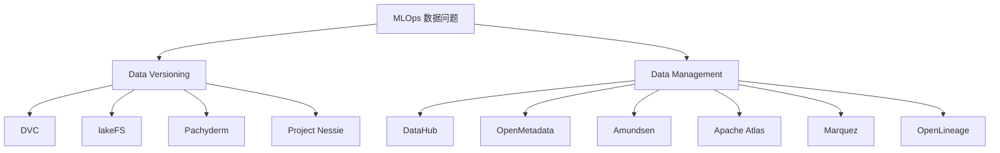

# MLOps 中 Data Versioning 与 Data Management 开源方案对比

> 结论先行：**Data Versioning** 和 **Data Management** 不是同一个问题域。  
> DVC、lakeFS、Pachyderm、Project Nessie 主要解决“数据版本、隔离、回滚、可复现”问题；  
> DataHub、OpenMetadata、Amundsen、Apache Atlas、Marquez/OpenLineage 主要解决“发现、血缘、治理、上下文、可观测”问题。  
> 如果把这两类工具直接拉到一张表里做单一排名，结论通常会失真。

## 1. 先把问题分层

在 MLOps 里，“数据管理”至少包含 4 层能力：

1. **数据版本控制**：某个训练集、特征集、表快照、对象集合在某个时间点到底是什么。
2. **数据发现与目录**：团队如何找到可用数据、知道它的 owner、schema、用途和可信度。
3. **血缘与影响分析**：某张表、某个特征、某个字段改动后，会影响哪些 pipeline、报表或模型。
4. **治理与质量**：权限、分类、敏感标签、质量检查、生命周期、审计。

因此更合理的做法不是问“哪个开源方案最好”，而是问：

- 你现在最缺的是 **版本化**，还是 **目录治理**？
- 你的数据主要是 **Git 仓库旁的大文件**、**对象存储里的数据湖**，还是 **Iceberg 湖仓表**？
- 你要解决的是 **训练可复现**，还是 **组织级 discoverability 和 governance**？

## 2. 市场上的主流开源图谱

更准确地说：

- **DVC**：Git 邻接型的数据和模型版本控制。
- **lakeFS**：对象存储层的 Git-like 数据版本控制。
- **Pachyderm**：Kubernetes 上的数据版本化流水线平台。
- **Project Nessie**：面向数据湖和 Iceberg catalog 的 Git-like 事务目录。
- **DataHub**：现代元数据图谱与数据目录平台。
- **OpenMetadata**：偏“语义上下文 + 质量 + 血缘 + 治理”的元数据平台。
- **Amundsen**：偏发现和搜索的数据目录。
- **Apache Atlas**：偏治理、分类、血缘、合规的元数据治理框架。
- **OpenLineage**：血缘采集标准。
- **Marquez**：OpenLineage 的参考实现与元数据服务。

## 3. Data Versioning 方案对比

### 3.1 快速判断

| 方案 | 本质定位 | 版本控制粒度 | 是否有 Git-like branch/merge | 典型依赖 | 最强场景 | 主要短板 |
| --- | --- | --- | --- | --- | --- | --- |
| DVC | Git for data and models | repo 内数据集、模型、pipeline、实验 | 弱，主要借助 Git 本身 | Git + 本地缓存 + 远程对象存储 | 训练可复现、项目级数据版本 | 更偏项目级，不是共享数据湖控制面 |
| lakeFS | Object storage 的 Git-like 控制层 | bucket/prefix/object 集合 | 强，branch、commit、merge 明确 | S3 / Azure Blob / GCS | 数据湖隔离测试、发布、回滚 | 主要管对象存储层，不是目录治理平台 |
| Pachyderm | 数据版本化 + 数据驱动 pipeline | repo、commit、pipeline 输入输出 | 有 commit 语义，但核心是流水线 | Kubernetes + object store | 版本化流水线、自动触发、并行处理 | 运维门槛高，更像平台而非轻量工具 |
| Project Nessie | 湖仓 catalog 的 Git-like 事务目录 | 表级、catalog 级、多表事务 | 强，branch、tag、merge | Iceberg + Spark/Trino/Flink 等 | Iceberg 数据湖、隔离实验、多表一致发布 | 更偏 lakehouse catalog，不是通用文件版本器 |

### 3.2 各方案理解

#### DVC

官方把 DVC 定位为 **Data Version Control**，强调三件事：

- version your data and models
- 用 Git repo 存版本元信息
- 用外部 cache 和 remote storage 存真正的大文件

它的核心优势是：

- 对 ML 项目团队最直接，几乎不改变 Git 工作流。
- 非常适合训练集、特征文件、模型权重和 `dvc.yaml` pipeline 一起管理。
- 本地即可用，不要求先搭一个中心化平台。
- 对“可复现实验”非常强，尤其适合单团队或中小团队。

它的典型边界是：

- 它不是共享数据湖的多团队控制平面。
- 它能管理数据版本，但不等于组织级数据目录、血缘治理平台。
- 当数据已经沉淀在共享对象存储、被多引擎共同读取时，DVC 往往不是最佳主控层。

一句话判断：**如果你的数据版本问题和代码仓库强绑定，优先看 DVC。**

#### lakeFS

官方把 lakeFS 定位为 **Data Version Control (Git for Data)**，核心表述是：

- 把 object storage 变成 Git-like repository
- 支持 branch、commit、merge
- 不复制数据即可获得隔离的数据环境
- 适配 Spark、Hive、Athena、DuckDB、Presto 等现代数据框架

它非常适合：

- 数据都在对象存储里。
- 你需要 dev / test / prod 数据分支。
- 你希望做 write-audit-publish 流程，而不是直接改生产数据。
- 你希望在不复制海量数据的前提下回溯、审计、回滚和重放。

它的典型边界是：

- 它主要解决存储层版本隔离，不负责完整目录治理。
- owner、glossary、质量、组织级发现，仍然需要 DataHub/OpenMetadata 这类工具补齐。

一句话判断：**如果你的数据在 S3/Blob/GCS，且想要 Git-like 数据湖工作流，优先看 lakeFS。**

#### Pachyderm

官方 README 把 Pachyderm 描述为：

- 自动化数据转换
- 数据变化驱动 pipeline 自动触发
- immutable data lineage and data versioning
- 基于 Kubernetes 的 autoscaling 和 parallel processing
- 标准对象存储 + 自动去重

这说明 Pachyderm 不只是“数据版本控制工具”，而是：

- 版本化数据
- 数据驱动 pipeline 编排
- lineage
- K8s 资源调度

它更像“版本化的数据流水线平台”。

适合场景：

- 你已经是 Kubernetes 团队。
- 你希望 pipeline 随数据变化自动触发。
- 你需要把 lineage、版本和 pipeline 执行放在一套系统里。

主要短板：

- 平台化程度高，复杂度也高。
- 对很多只想解决“训练数据版本”问题的团队来说，偏重。

一句话判断：**如果你要的是 K8s 原生的版本化数据流水线，而不是单点式版本工具，Pachyderm 才值得上。**

#### Project Nessie

官方将 Nessie 定位为 **Transactional Catalog for Data Lakes with Git-like semantics**。核心点是：

- changes are recorded as commits without copying actual data
- always-consistent view
- branches isolate incomplete work
- tags 固定版本
- 面向 Iceberg 和多引擎数据湖

Nessie 的关键价值不在“文件版本”，而在：

- **catalog 级版本控制**
- **多表一致提交**
- **面向数据湖表格式的事务隔离**
- **非常适合 Iceberg 场景**

它适合：

- 你已经在做湖仓或正在向 Iceberg 演进。
- 你关心多表事务、分析作业隔离分支、原子发布。
- 你希望 Spark、Flink、Trino 等共享一致目录语义。

它不适合：

- 你只是想给单个 ML 仓库里的训练文件做版本控制。
- 你还没有数据湖表格式和统一 catalog 诉求。

一句话判断：**如果你是 Iceberg/lakehouse 路线，Nessie 比 DVC 更对位。**

## 4. Data Management 方案对比

### 4.1 快速判断

| 方案 | 本质定位 | 核心能力 | 是否偏 MLOps | 部署复杂度 | 最适合 |
| --- | --- | --- | --- | --- | --- |
| DataHub | 元数据图谱和 AI data catalog | discovery、lineage、governance、observability、实时元数据 | 高 | 中高 | 现代数据平台和多团队治理 |
| OpenMetadata | 语义上下文平台 | metadata、quality、lineage、glossary、policy、semantic search | 高 | 中高 | 想把语义、质量、血缘、AI 上下文放一起 |
| Amundsen | data discovery and metadata engine | 搜索、浏览、使用上下文、轻目录 | 中 | 中 | 以发现和搜索为优先目标 |
| Apache Atlas | metadata governance framework | 分类、治理、血缘、安全集成、合规 | 中 | 高 | Hadoop/大数据治理、强分类合规 |
| Marquez | metadata service | job、run、dataset 元数据采集与展示 | 中 | 中 | 想先把 lineage backend 建起来 |
| OpenLineage | lineage collection standard | lineage event 模型、跨系统采集标准 | 高 | 低到中 | 想统一 lineage 采集协议 |

### 4.2 各方案理解

#### DataHub

DataHub 官方把自己定义为 **open-source metadata platform** 和 **open-source AI data catalog**，强调：

- discovery
- governance
- observability
- real-time metadata graph
- 80+ connectors
- AI agents / MCP / MLflow / Feast / Kubeflow 等生态集成

它的优势是：

- 非常像现代数据平台的“元数据中枢”。
- 覆盖搜索、schema、owner、lineage、治理、质量、影响分析。
- 生态和连接器较强，适合组织级推广。
- 对 MLOps 友好，因为它不是只看 BI，也覆盖 ML platform 集成。

它的边界也很清晰：

- 它不对实际数据做 branch/commit/version。
- 它解决的是“知道数据是什么、谁在用、改了会影响谁”，不是“把数据本体版本化”。

一句话判断：**如果你要组织级 metadata graph，DataHub 是最强的一梯队。**

#### OpenMetadata

OpenMetadata 官方最新定位是 **The Open Semantic Context Platform for Data and AI**。它特别强调：

- context
- semantics
- data quality
- lineage
- glossary 和 policy
- MCP、semantic search、AI SDK
- unified metadata knowledge graph

与 DataHub 相比，OpenMetadata 的公开叙事更强调：

- 语义层
- 质量与信任信号
- AI assistant/agent 所需上下文
- 开放标准和知识图谱

它很适合：

- 你希望把 metadata、quality、lineage、business semantics 放在同一层。
- 你不只关心 discoverability，也关心“AI 和人都能理解这份数据的业务含义”。
- 你希望未来把数据上下文暴露给 agent 或内部智能系统。

一句话判断：**如果你更在意“语义 + 质量 + lineage + AI context”的统一层，OpenMetadata 很有竞争力。**

#### Amundsen

Amundsen 官方定位是 **open source data discovery and metadata engine**，更直接地说是 **Google search for data**。

它的核心优势是：

- 搜索和发现体验好。
- 对数据分析师、数据科学家找表、找 dashboard、找特征很直接。
- 架构相对容易理解，目标足够聚焦。

它的边界是：

- 更偏目录和发现，不是强治理平台。
- 血缘、质量、策略治理等能力通常不如 DataHub/OpenMetadata 一体化。

一句话判断：**如果你最痛的是“找不到数据”，Amundsen 仍然很有效；如果你还要强治理，它通常不够。**

#### Apache Atlas

Apache Atlas 官方定义自己是 **metadata management and governance capabilities**，强调：

- metadata types and instances
- classification
- lineage
- search and discovery
- security and data masking
- 和 Ranger 的治理集成

Atlas 的优势是：

- 强治理、强分类、强合规语义。
- 在 Hadoop 生态和传统企业大数据治理场景里很经典。
- PII、SENSITIVE、数据分类传播这类能力表达明确。

Atlas 的短板是：

- 更重、更偏企业治理框架。
- 对现代数据栈和开发者体验，不一定比 DataHub/OpenMetadata 更轻更快。

一句话判断：**如果你是传统大数据平台、强合规治理导向，Atlas 仍然有价值；否则通常先看 DataHub 或 OpenMetadata。**

#### OpenLineage + Marquez

OpenLineage 官方定位是 **open standard for metadata and lineage collection**。  
Marquez 官方定位是 **metadata service**，用于 collection、aggregation、visualization 数据生态的 metadata。

这两个项目最容易被误用。正确理解是：

- **OpenLineage** 是标准。
- **Marquez** 是参考实现和 lineage backend。

它们的强项是：

- 统一采集 job、run、dataset 事件。
- 跨 Airflow、Spark、dbt、Flink 等系统聚合 lineage。
- 很适合先把 lineage 这条链打通。

它们的边界是：

- 不是完整 data catalog。
- 不是数据本体版本控制工具。
- glossary、owner workflow、组织级发现、治理深度通常需要其他平台补齐。

一句话判断：**如果你要补的是 lineage 基础设施，OpenLineage + Marquez 很合适；如果你要完整数据管理平台，它不够。**

## 5. 一张表看清楚“谁在替代谁，谁在互补谁”

| 工具 | 主要解决什么 | 能不能替代 DVC/lakeFS | 能不能替代 DataHub/OpenMetadata | 典型组合关系 |
| --- | --- | --- | --- | --- |
| DVC | 项目级数据和模型版本 | - | 否 | DVC + MLflow + DataHub |
| lakeFS | 对象存储级数据版本和隔离 | - | 否 | lakeFS + Spark + OpenMetadata |
| Pachyderm | 版本化数据流水线 | 部分 | 否 | Pachyderm + MLflow + DataHub |
| Nessie | Iceberg catalog 版本和事务 | 部分 | 否 | Nessie + Iceberg + OpenLineage |
| DataHub | metadata graph 和治理 | 否 | - | DataHub + lakeFS / DVC |
| OpenMetadata | 语义上下文和治理 | 否 | - | OpenMetadata + lakeFS / Nessie |
| Amundsen | 数据发现与搜索 | 否 | 只能替代部分目录场景 | Amundsen + Atlas / lineage 工具 |
| Atlas | 强治理和分类 | 否 | 可替代部分治理能力 | Atlas + Amundsen / Atlas + lineage |
| Marquez | lineage backend | 否 | 只能替代血缘子集 | OpenLineage + Marquez + DataHub |
| OpenLineage | lineage 标准 | 否 | 否 | OpenLineage + Marquez / DataHub / OpenMetadata |

核心判断：

- **DVC 不替代 DataHub。**
- **lakeFS 不替代 OpenMetadata。**
- **OpenLineage 不替代数据版本控制。**
- **Marquez 不替代完整数据目录。**

## 6. 选型建议

### 6.1 小团队或单模型团队

推荐：

- DVC
- MLflow
- 如果后面需要 discoverability，再补 DataHub 或 OpenMetadata

理由：

- 先把训练可复现和数据版本拉起来，收益最大。
- 没必要一开始就上重型 metadata platform。

### 6.2 已有对象存储数据湖，希望做 dev/test/prod 隔离

推荐：

- lakeFS
- Spark / Athena / DuckDB 等现有计算引擎
- DataHub 或 OpenMetadata

理由：

- lakeFS 解决数据环境隔离和版本发布。
- DataHub/OpenMetadata 解决数据发现、血缘、治理和上下文。

### 6.3 Kubernetes 原生数据平台

推荐：

- Pachyderm
- OpenLineage + Marquez
- 视治理需求补 DataHub/OpenMetadata

理由：

- Pachyderm 更像平台型方案。
- OpenLineage/Marquez 补齐统一 lineage 事件链。

### 6.4 Iceberg / Lakehouse 路线

推荐：

- Project Nessie
- Iceberg + Spark / Flink / Trino
- OpenMetadata 或 DataHub

理由：

- Nessie 对多表一致提交、分支和 catalog 版本更对位。
- 元数据治理仍需上层平台补齐。

### 6.5 强合规和分类治理企业

推荐：

- Apache Atlas
- 或者 DataHub / OpenMetadata 作为现代替代路线

判断标准：

- 如果你强依赖 Hadoop/Ranger/传统治理体系，Atlas 有现实基础。
- 如果你想兼顾现代数据栈、开发者体验和 AI/Agent 上下文，优先 DataHub 或 OpenMetadata。

## 7. 我的实用判断

如果从“今天就能落地、对大多数团队最实用”的角度看：

### 数据版本层

1. **DVC**：最适合项目级 ML 团队。
2. **lakeFS**：最适合对象存储数据湖团队。
3. **Project Nessie**：最适合 Iceberg/lakehouse 团队。
4. **Pachyderm**：最适合已经准备好接平台复杂度的 K8s 团队。

### 数据管理层

1. **DataHub**：最适合组织级元数据中枢。
2. **OpenMetadata**：最适合语义、质量、AI 上下文统一层。
3. **Amundsen**：最适合先解决 discoverability。
4. **Apache Atlas**：最适合传统大数据强治理。
5. **Marquez/OpenLineage**：最适合作为 lineage 子系统，而不是完整 data management 平台。

## 8. 补充对比：部署复杂度、学习成本、成熟度、与 MLflow/Kubeflow 的关系

这一节只回答一个更实际的问题：

> 如果你已经在用或准备使用 **MLflow**、**Kubeflow**，这些数据工具到底是“容易接上去”，还是“功能重叠会打架”？

先说明评估口径：

- **部署复杂度**：更看自建门槛、依赖组件和长期运维成本，不只是能不能 `docker run`。
- **学习成本**：更看团队是否需要理解新抽象，例如 branch/merge、catalog transaction、metadata graph、lineage spec。
- **成熟度**：综合项目历史、生产采用、社区活跃度和典型企业采用，不单看 GitHub stars。
- **与 MLflow/Kubeflow 的关系**：这里分成 4 类。

  - **强互补**：能力边界清晰，组合后收益明显。
  - **中度互补**：可以一起用，但通常需要额外约定接口或边界。
  - **弱互补**：理论上能一起用，但价值不一定高。
  - **局部重叠**：如果一起上，需要先定义谁负责 pipeline、metadata 或 lineage 控制面。

### 8.1 Data Versioning 方案细化矩阵

| 方案 | 部署复杂度 | 学习成本 | 成熟度 | 与 MLflow 的关系 | 与 Kubeflow 的关系 | 关键判断 |
| --- | --- | --- | --- | --- | --- | --- |
| DVC | 低 | 低到中 | 高 | 强互补 | 中度互补 | 最适合把训练数据、模型文件、实验输入输出和 Git/MLflow 串起来 |
| lakeFS | 中到中高 | 中 | 高 | 强互补 | 强互补 | 最适合共享对象存储数据湖，尤其适合给 Kubeflow pipeline 提供隔离数据分支 |
| Pachyderm | 高 | 高 | 中高 | 中度互补 | 局部重叠 | 它本身就带 pipeline 和数据版本控制，和 Kubeflow 一起用必须先划边界 |
| Project Nessie | 中到中高 | 中到高 | 中高 | 中度互补 | 中度互补 | 更适合 Iceberg/lakehouse，不是项目级训练数据管理工具 |

#### DVC 怎么看

- **和 MLflow 很搭**：DVC 管训练数据、特征文件、模型文件和 repro；MLflow 管 experiment tracking、registry、metrics 和 model lineage。
- **和 Kubeflow 也能搭**，但通常不是“原生一体化”，更像是：Kubeflow 执行 pipeline，DVC 管 pipeline 输入输出版本。
- 如果团队已经熟悉 Git，DVC 的学习阻力最小。

实务判断：

- **已经有 MLflow，且主要是项目级训练任务** -> DVC 往往是最稳的补位工具。
- **已经有 Kubeflow，但数据主要还在 Git 邻接项目里** -> DVC 可用，但通常不如 lakeFS 那样自然。

#### lakeFS 怎么看

- **和 MLflow 强互补**：lakeFS 管对象存储里的数据版本和隔离环境，MLflow 管实验、参数、指标、模型注册。
- **和 Kubeflow 强互补**：Kubeflow 更像执行平面，lakeFS 更像数据控制平面。
- 如果你的训练数据、特征快照、批处理输入都在 S3/Blob/GCS，lakeFS 的 branch/merge 价值会很明显。

实务判断：

- **MLflow + lakeFS** 非常适合共享数据湖上的训练流程。
- **Kubeflow + lakeFS** 是比 **Kubeflow + DVC** 更自然的一组搭配，尤其是多团队共享对象存储时。

#### Pachyderm 怎么看

- **和 MLflow 可以搭**，但 MLflow 主要承担 experiment tracking 和 registry，Pachyderm 更像版本化数据流水线执行平台。
- **和 Kubeflow 有局部重叠**：两者都可能承接 pipeline/orchestration 的职责。
- 如果团队没有很强的平台工程能力，Pachyderm 往往比 DVC 或 lakeFS 更重。

实务判断：

- **已经重仓 Kubeflow** 的团队，不要默认再上 Pachyderm，先问清楚是不是要双 pipeline 平台。
- Pachyderm 更适合“我要一套 K8s 原生数据流水线平台”，而不是“我只差数据版本控制”。

#### Project Nessie 怎么看

- **和 MLflow 的关系**更偏互补，但距离比 DVC/lakeFS 更远，因为它重点不在实验而在 catalog transaction。
- **和 Kubeflow 的关系**也主要通过 Spark/Flink/Trino 等计算链路体现，而不是直接替代 Kubeflow。
- 只有在 **Iceberg/lakehouse** 路线里，它的价值才会非常清晰。

实务判断：

- **如果你没有 Iceberg/湖仓背景，先不要为了“Git-like”而引入 Nessie。**
- **如果你已经在做 Iceberg + Spark/Flink**，Nessie 可能比 DVC/lakeFS 更对位。

### 8.2 Data Management 方案细化矩阵

| 方案 | 部署复杂度 | 学习成本 | 成熟度 | 与 MLflow 的关系 | 与 Kubeflow 的关系 | 关键判断 |
| --- | --- | --- | --- | --- | --- | --- |
| DataHub | 中高 | 中高 | 很高 | 强互补 | 强互补 | 最像组织级 metadata graph 中枢，官方生态里明确覆盖 MLflow 和 Kubeflow 类集成 |
| OpenMetadata | 中高 | 中高 | 高 | 中到强互补 | 中到强互补 | 强在语义、质量、血缘、上下文统一层，对 AI/agent 也友好 |
| Amundsen | 中 | 中 | 中高 | 弱到中度互补 | 弱到中度互补 | 更适合先解决搜索和发现，不是完整 ML metadata 平台 |
| Apache Atlas | 高 | 高 | 高 | 弱互补 | 弱到中度互补 | 偏治理和分类，适合强合规企业，不适合拿来做轻量 MLOps metadata 中枢 |
| OpenLineage + Marquez | 中 | 中 | 中高 | 中度互补 | 中度互补 | 强在作业血缘和运行元数据，不替代完整 catalog 或 experiment system |

#### DataHub 怎么看

在 DataHub 官方 README 里，集成分类明确包含 **ML Platforms: SageMaker, MLflow, Feast, Kubeflow, Weights & Biases**。这意味着它对 ML 生态的定位不是“顺带支持”，而是明确把 ML 系统视为 metadata graph 的一部分。

因此：

- **和 MLflow 是强互补**：MLflow 继续负责 experiment 和 registry，DataHub 负责资产发现、owner、lineage、影响分析、治理。
- **和 Kubeflow 也是强互补**：Kubeflow 是执行与训练平台，DataHub 是跨平台 metadata 中枢。

实务判断：

- 如果你希望把 **MLflow、Kubeflow、Feast、dbt、Airflow** 这些系统的 metadata 放到同一个图谱里，DataHub 很强。

#### OpenMetadata 怎么看

OpenMetadata 的官方表述虽然更强调“semantic context platform”，但它明确覆盖：

- ML models
- pipeline lineage
- ML model lineage
- 120+ connectors and ML platforms

所以它和 MLflow/Kubeflow 的关系可以理解为：

- **不是替代实验平台**，而是把实验平台和训练平台产生的上下文、血缘、质量、语义组织起来。
- 如果你关注的不只是“有没有元数据”，而是“AI 和工程师能否理解这些数据和模型的业务含义”，OpenMetadata 的表达更完整。

实务判断：

- **MLflow / Kubeflow 已有，且你下一步想补 business semantics、quality、AI context** -> OpenMetadata 很适合。

#### Amundsen 怎么看

- 和 MLflow/Kubeflow 的关系通常较弱。
- 它能作为发现层使用，但对 experiment、pipeline、model lineage 的统一表达没有 DataHub/OpenMetadata 那么强。

实务判断：

- 如果你只是先解决“模型团队找不到数据表和特征源”，Amundsen 仍可用。
- 如果你要更完整的 ML metadata 治理，不建议把它作为最终平台。

#### Apache Atlas 怎么看

- Atlas 更像治理骨架，不像面向现代 ML 团队体验优化的 metadata 产品。
- 和 MLflow/Kubeflow 可以发生关系，但更多依赖自定义集成、分类同步和 lineage 打通。

实务判断：

- 如果你的核心目标是 **PII 分类、治理传播、合规审计**，Atlas 仍然成立。
- 如果你的核心目标是 **MLOps data discoverability + AI context**，通常先看 DataHub/OpenMetadata。

#### OpenLineage + Marquez 怎么看

- **和 MLflow**：不是正面竞争，也不是直接替代。它们关注的是 lineage event、job、run、dataset metadata，不是 experiment registry。
- **和 Kubeflow**：如果你想把 pipeline runtime lineage 统一采集，OpenLineage/Marquez 的价值会更直接。

实务判断：

- 如果你已经有 MLflow，但缺统一 lineage backend，OpenLineage + Marquez 很适合补这一层。
- 如果你已经有 Kubeflow pipeline，但 lineage 可见性很弱，这组工具也值得优先评估。

### 8.3 如果你已经选了 MLflow，应该怎么配

| 你的现状 | 优先补什么 | 推荐组合 |
| --- | --- | --- |
| 单团队、代码仓库驱动 | 数据版本和 repro | MLflow + DVC |
| 多团队共享对象存储 | 数据湖版本和隔离 | MLflow + lakeFS |
| 已经是 Iceberg/lakehouse | catalog 事务和分支 | MLflow + Nessie |
| 缺组织级目录和 lineage | metadata graph | MLflow + DataHub 或 OpenMetadata |

一句话：**MLflow 最适合做实验和模型层，不适合独自承担“数据版本控制”和“组织级 metadata 治理”两件事。**

### 8.4 如果你已经选了 Kubeflow，应该怎么配

| 你的现状 | 优先补什么 | 推荐组合 |
| --- | --- | --- |
| 数据在对象存储数据湖 | 版本分支和回滚 | Kubeflow + lakeFS |
| 数据在项目仓库和中小规模训练集 | 项目级版本控制 | Kubeflow + DVC |
| 需要统一 lineage backend | runtime lineage | Kubeflow + OpenLineage + Marquez |
| 需要跨平台 metadata 和治理 | metadata graph | Kubeflow + DataHub 或 OpenMetadata |
| 已在评估 Pachyderm | 先划清 pipeline 边界 | Kubeflow 或 Pachyderm 二选一为主，避免双控制面 |

一句话：**Kubeflow 是训练与 pipeline 执行平面，通常还需要外部数据控制平面或 metadata 平面来补齐。**

### 8.5 最实用的最终结论

如果你只看这四个维度：部署复杂度、学习成本、成熟度、与 MLflow/Kubeflow 的关系，那么我会给出下面这组非常实用的排序：

#### 如果你最关心“低门槛、快落地”

1. **DVC**
2. **DataHub** 或 **OpenMetadata**
3. **lakeFS**

#### 如果你最关心“和 Kubeflow 搭起来最顺”

1. **lakeFS**
2. **DataHub**
3. **OpenMetadata**
4. **OpenLineage + Marquez**

#### 如果你最关心“和 MLflow 搭起来最顺”

1. **DVC**
2. **lakeFS**
3. **DataHub**
4. **OpenMetadata**

#### 如果你最关心“组织级长期演进”

1. **DataHub**
2. **OpenMetadata**
3. **lakeFS** 或 **Nessie**

## 9. 推荐组合

最常见、也最合理的不是单工具，而是组合：

- **DVC + MLflow + DataHub**
- **lakeFS + Spark + OpenMetadata**
- **Nessie + Iceberg + OpenLineage + Marquez**
- **Pachyderm + MLflow + DataHub**

可以把它理解成：

- 下层工具管理“数据本体版本”。
- 上层工具管理“数据的上下文、血缘和治理”。

## 10. 最后一句话

如果你的问题是：

- “训练集和模型文件怎么版本化？” -> 先看 **DVC**。
- “对象存储里的大数据怎么像 Git 一样 branch/merge？” -> 先看 **lakeFS**。
- “Iceberg 数据湖怎么做 Git-like catalog versioning？” -> 先看 **Project Nessie**。
- “公司里大家怎么知道有哪些数据、谁负责、血缘是什么、改了会影响谁？” -> 先看 **DataHub** 或 **OpenMetadata**。
- “我只想先把 lineage 标准化接起来。” -> 先看 **OpenLineage + Marquez**。

## Update History

- 2026-06-04: 补充部署复杂度、学习成本、成熟度，以及与 MLflow、Kubeflow 集成关系的细颗粒度对比。

## 参考来源

- DVC 官方 README: https://raw.githubusercontent.com/iterative/dvc/main/README.rst
- DVC 文档: https://doc.dvc.org/
- lakeFS 官方 README: https://raw.githubusercontent.com/treeverse/lakeFS/master/README.md
- lakeFS 文档: https://docs.lakefs.io/
- Pachyderm 官方 README: https://raw.githubusercontent.com/pachyderm/pachyderm/master/README.md
- Pachyderm 文档: https://docs.pachyderm.com/
- Project Nessie 官网: https://projectnessie.org/
- Project Nessie About: https://projectnessie.org/guides/about/
- DataHub 官方 README: https://raw.githubusercontent.com/datahub-project/datahub/master/README.md
- DataHub 文档: https://docs.datahub.com/
- OpenMetadata 官方 README: https://raw.githubusercontent.com/open-metadata/OpenMetadata/main/README.md
- OpenMetadata 文档: https://docs.open-metadata.org/
- Amundsen 官网: https://www.amundsen.io/
- Amundsen 官方 README: https://raw.githubusercontent.com/amundsen-io/amundsen/main/README.md
- Apache Atlas 官网: https://atlas.apache.org/
- OpenLineage 官网: https://openlineage.io/
- OpenLineage 官方 README: https://raw.githubusercontent.com/OpenLineage/OpenLineage/main/README.md
- Marquez 官方 README: https://raw.githubusercontent.com/MarquezProject/marquez/main/README.md