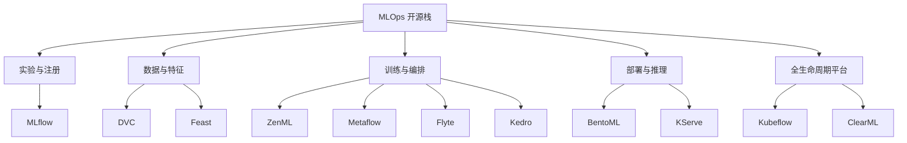
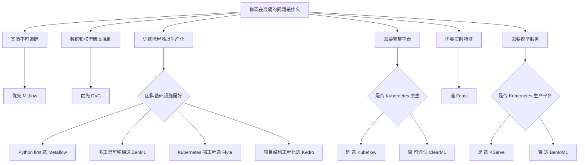

# 常用 MLOps 开源平台对比

> 本文基于各项目官方文档、GitHub 仓库信息和权威资料整理，重点比较常见开源 MLOps 平台的定位、技术指标、生命周期覆盖范围、通用程度和选型建议。  
> 结论先行：**不存在一个开源 MLOps 平台能优雅覆盖所有场景。最通用的基础组件通常是 MLflow 和 DVC；最完整的 Kubernetes 原生平台是 Kubeflow；生产编排层可在 ZenML、Metaflow、Flyte、Kedro 中选择；特征、推理服务层则常用 Feast、BentoML、KServe 作为专用组件。**

## 1. 对比范围

本文覆盖以下常用开源平台：

- Kubeflow
- MLflow
- ZenML
- Metaflow
- Flyte
- Kedro
- DVC
- ClearML
- Feast
- BentoML
- KServe

这些平台并不完全处在同一层级，不能只用“谁更好”来比较。更合理的方式是按 MLOps 生命周期能力拆分：

- 全生命周期平台：Kubeflow、ClearML
- 实验追踪与模型注册：MLflow
- 训练与工作流编排：ZenML、Metaflow、Flyte、Kedro
- 数据与模型版本管理：DVC
- 特征平台：Feast
- 模型服务与推理平台：BentoML、KServe

## 2. 总体判断

如果只允许选一个开源 MLOps 基础组件，优先考虑 **MLflow**。它的实验追踪、模型注册、模型打包和生态集成足够通用，几乎可以嵌入任何 MLOps 栈。

如果团队最痛的是数据和模型文件版本失控，优先考虑 **DVC**。它把 Git 工作流扩展到数据、模型和 pipeline 元数据，适合把 ML 项目变得可复现。

如果团队已经 Kubernetes 原生，并且有平台工程能力，优先考虑 **Kubeflow** 或 **Flyte**。Kubeflow 更像完整 AI 平台，Flyte 更像强类型、生产级 workflow orchestrator。

如果团队想让数据科学家用 Python 写生产 pipeline，同时尽量少接触基础设施，优先考虑 **Metaflow** 或 **ZenML**。Metaflow 更强调 Python-native 和从本地到云端的平滑扩展；ZenML 更强调可插拔 stack 和跨 orchestrator 可移植性。

如果团队需要完整但上手较快的一体化开源套件，可以评估 **ClearML**。它把 experiment management、data management、pipeline、orchestration、serving 放在一个体系内，但生态通用性通常不如 MLflow 这种事实标准组件。

如果问题已经非常具体：

- 实时特征一致性：选 Feast。
- Python 模型服务 API：选 BentoML。
- Kubernetes 上标准化模型推理：选 KServe。
- 数据科学项目结构工程化：选 Kedro。

## 3. 平台分层视图

## 4. 关键维度说明

### 4.1 生命周期覆盖度

生命周期覆盖度衡量一个平台覆盖 MLOps 阶段的广度：

- 数据版本
- 特征管理
- 实验追踪
- pipeline 编排
- 超参数搜索
- 模型注册
- 模型部署
- 模型监控
- 权限、审计与治理

覆盖度高不等于更适合所有团队。覆盖越广，通常部署、运维和学习成本也越高。

### 4.2 通用程度

本文的“通用程度”不是单纯 GitHub star 数，而是综合判断：

- 是否能嵌入多种技术栈
- 是否不强依赖单一云厂商
- 是否能本地启动并逐步扩展
- 是否与主流 ML 框架兼容
- 是否被其他平台或云服务广泛集成
- 是否能解决大多数团队都会遇到的问题

### 4.3 运维复杂度

运维复杂度重点看：

- 是否必须 Kubernetes
- 是否需要中心化服务
- 是否需要数据库、对象存储、消息队列等基础设施
- 是否需要专门平台团队维护
- 从本地实验到生产环境的迁移是否平滑

### 4.4 技术指标

本次客观指标抓取时间为 2026-06-02，来源为 GitHub API。指标包括：

- GitHub stars
- forks
- 主语言
- license
- 创建时间
- 最近更新时间

这些指标只能作为活跃度和社区规模参考，不能直接等价为生产可用性。

## 5. 平台逐项分析

### 5.1 Kubeflow

官方定位：

Kubeflow 是 Kubernetes 上的 AI platform 工具体系。官方 GitHub 将其描述为 Machine Learning Toolkit for Kubernetes；官方文档强调 Kubeflow AI reference platform 是 composable、modular、portable、scalable 的 Kubernetes-native 项目集合，覆盖 AI lifecycle 的多个阶段。

核心能力：

- Kubeflow Pipelines：构建、部署和管理 ML workflow。
- Kubeflow Trainer：大规模分布式训练或 LLM fine-tuning。
- Katib：超参数调优和 AutoML。
- Kubeflow Model Registry 或 Hub：模型元数据、模型版本和 artifact 管理。
- KServe：模型 serving。
- Notebooks：交互式数据科学环境。
- Spark Operator：数据准备和特征工程。

主要技术指标：

- GitHub repo：`kubeflow/kubeflow`
- Stars：约 15.7k
- Forks：约 2.7k
- License：Apache-2.0
- 创建时间：2017-11
- 最近更新时间：2026-06
- 技术底座：Kubernetes

优势：

- 开源 MLOps 中最接近“全生命周期平台”的 Kubernetes 原生方案。
- 组件覆盖广，适合统一平台工程建设。
- 可与 KServe、Katib、Pipelines、Trainer、Model Registry 组合。
- 适合多租户、GPU 集群、私有化 AI 平台场景。

短板：

- 运维复杂度高。
- 对 Kubernetes、Istio、Knative、存储、认证、多租户等平台能力要求高。
- 对小团队和早期项目通常过重。
- 组件较多，版本兼容和升级治理需要投入。

通用程度：

中高。对于 Kubernetes-native 企业平台很通用；对于普通数据科学团队不够轻量。

适合场景：

- 已经有 Kubernetes 平台团队。
- 需要私有化或混合云 AI 平台。
- 需要 Notebook、pipeline、training、serving、registry 的统一入口。
- 需要在 Kubernetes 上管理 GPU 和多租户 ML 工作负载。

不适合场景：

- 只有少数数据科学家，没有平台工程人员。
- 主要需求只是实验追踪或模型注册。
- 希望一两天内快速落地最小 MLOps。

参考：

- [Kubeflow GitHub](https://github.com/kubeflow/kubeflow)
- [Kubeflow Architecture](https://www.kubeflow.org/docs/started/architecture/)
- [Kubeflow Pipelines Overview](https://www.kubeflow.org/docs/components/pipelines/overview/)
- [Kubeflow Hub Overview](https://www.kubeflow.org/docs/components/hub/overview/)

### 5.2 MLflow

官方定位：

MLflow 是开源 AI/ML lifecycle 管理平台，核心能力集中在 experiment tracking、model registry、model packaging、evaluation 和 deployment workflow。官方文档说明 MLflow Tracking 提供 API 和 UI，用于记录 parameters、metrics、models、artifacts；Model Registry 提供 centralized model store、API 和 UI，用于模型 lineage、versioning、aliasing、tagging 和 annotation。

核心能力：

- MLflow Tracking：实验参数、指标、artifact 记录。
- MLflow Models：模型打包格式。
- MLflow Model Registry：模型注册、版本、alias、tag、annotation。
- MLflow Deployments：部分部署和推理接口能力。
- MLflow Evaluation：传统 ML 和 GenAI evaluation。

主要技术指标：

- GitHub repo：`mlflow/mlflow`
- Stars：约 26.2k
- Forks：约 5.8k
- 主语言：Python
- License：Apache-2.0
- 创建时间：2018-06
- 最近更新时间：2026-06

优势：

- 通用程度极高，是实验追踪和模型注册领域事实标准之一。
- 与 PyTorch、TensorFlow、Scikit-learn、Spark、Databricks、SageMaker 等生态兼容度高。
- 可以本地启动，也可以接入数据库和对象存储扩展到团队级。
- 学习成本低，数据科学家容易接受。
- 很适合作为其他 MLOps 平台的基础组件。

短板：

- 不是完整 pipeline orchestrator。
- 原生权限、治理、多租户能力在开源版中有限，企业级治理常依赖 Databricks 或自建外围系统。
- 模型 serving 能力有，但复杂生产 serving 通常会交给 BentoML、KServe、Seldon、云厂商 endpoint 等。

通用程度：

很高。几乎所有规模团队都可以从 MLflow 获益。

适合场景：

- 想快速建立实验追踪和模型注册。
- 需要跨框架记录模型和指标。
- 需要将 Notebook 或训练脚本变得可比较、可回溯。
- 已有其他 orchestrator，只缺 tracking 和 registry。

不适合场景：

- 希望一个工具直接解决训练调度、资源管理、特征服务、在线推理、监控和治理。
- 需要强多租户、强权限隔离和完整企业治理，但不使用托管平台。

参考：

- [MLflow Tracking](https://www.mlflow.org/docs/latest/ml/tracking/)
- [MLflow Model Registry](https://www.mlflow.org/docs/latest/ml/model-registry/)
- [MLflow GitHub](https://github.com/mlflow/mlflow)

### 5.3 ZenML

官方定位：

ZenML 是统一、可扩展、开源的 MLOps framework，用于创建 portable、production-ready MLOps pipelines。官方文档强调 ZenML 通过 stack 抽象解耦代码和基础设施，使同一套 pipeline 可以运行在不同 orchestrator 和 cloud backend 上。

核心能力：

- Python-first pipeline 和 step 抽象。
- Stack 机制：orchestrator、artifact store、container registry、experiment tracker、deployer 等组件组合。
- 支持 local、local Docker、Kubernetes、Kubeflow、Vertex AI、SageMaker、AzureML、Tekton、Airflow、SkyPilot 等 orchestrator。
- 可与 MLflow、BentoML、Seldon 等工具集成。
- 支持 pipeline 从本地开发迁移到生产基础设施。

主要技术指标：

- GitHub repo：`zenml-io/zenml`
- Stars：约 5.4k
- Forks：约 621
- 主语言：Python
- License：Apache-2.0
- 创建时间：2020-11
- 最近更新时间：2026-06

优势：

- 抽象层设计清晰，适合多工具组合。
- 对数据科学家友好，代码可读性较好。
- 可以把 MLflow、Kubeflow、Airflow、SageMaker、Vertex AI 等接在同一 pipeline 规范下。
- 适合希望保留基础设施选择权的团队。

短板：

- 作为“编排抽象层”，生产能力往往依赖背后的 orchestrator 和 stack 组件。
- 项目相对 MLflow、Kubeflow 年轻，企业采用案例和长期运维经验需要具体评估。
- 如果团队已经有稳定编排系统，额外引入 ZenML 需要评估抽象收益是否大于复杂度。

通用程度：

中高。对希望跨环境、跨 orchestrator 的团队很有价值；对只需要单点 tracking 或 serving 的团队不是第一优先级。

适合场景：

- 希望从本地 pipeline 平滑迁移到云上或 Kubernetes。
- 团队同时使用 MLflow、Kubeflow、Airflow、SageMaker 等多种工具。
- 希望降低 pipeline 与基础设施绑定。

参考：

- [ZenML Core Concepts](https://docs.zenml.io/getting-started/core-concepts.md)
- [ZenML Stacks](https://docs.zenml.io/stacks)
- [ZenML Orchestrators](https://docs.zenml.io/stacks/stack-components/orchestrators.md)
- [ZenML GitHub](https://github.com/zenml-io/zenml)

### 5.4 Metaflow

官方定位：

Metaflow 是 Netflix 开源的 Python 框架，用于开发、部署和运营 data-intensive applications，尤其是 data science、ML 和 AI 应用。官方文档强调 Metaflow 让数据科学家可以从本地原型平滑扩展到云端生产工作负载，并自动跟踪 flows、experiments 和 artifacts。

核心能力：

- Python class 和 decorator 风格定义 flow。
- 本地开发，云端扩展。
- 自动 artifact versioning。
- 支持 AWS、Azure、GCP 和 on-prem Kubernetes。
- 支持 AWS Batch、AWS Step Functions、Kubernetes、Argo Workflows、Apache Airflow 等执行和编排后端。
- 与 Netflix 和 Outerbounds 生态关联紧密。

主要技术指标：

- GitHub repo：`Netflix/metaflow`
- Stars：约 10.1k
- Forks：约 1.3k
- 主语言：Python
- License：Apache-2.0
- 创建时间：2019-09
- 最近更新时间：2026-06

优势：

- Python-native，数据科学家上手容易。
- 对“从 notebook 或脚本走向生产 flow”的路径设计较好。
- 不要求用户直接理解复杂 Kubernetes 平台细节。
- 与云基础设施集成成熟，尤其适合 AWS 或已有对象存储和批处理能力的团队。

短板：

- 不是全生命周期平台，不负责完整 model registry、feature store、serving 等所有层。
- 深度生产化通常仍需部署 Metaflow metadata service、artifact store 和 orchestrator。
- 对非 Python 工作负载不是最佳选择。

通用程度：

中高。对 Python 数据科学团队通用；对强 Kubernetes 平台团队，Flyte 或 Kubeflow 可能更自然。

适合场景：

- 数据科学家主导的 ML 项目。
- 团队希望少写基础设施配置，快速把 Python workflow 变成生产任务。
- AWS、Azure、GCP 或 Kubernetes 已有基础资源。

参考：

- [Metaflow Docs - What is Metaflow](https://docs.metaflow.org/introduction/what-is-metaflow)
- [Metaflow Official Site](https://metaflow.org/)
- [Metaflow GitHub](https://github.com/Netflix/metaflow)

### 5.5 Flyte

官方定位：

Flyte 是开源、Kubernetes-native workflow orchestrator，用于统一 data、ML 和 analytics 工作流。官方文档强调它由 Go 实现，支持 highly concurrent、scalable、reproducible workflows。

核心能力：

- Kubernetes-native workflow orchestration。
- Flytekit Python SDK。
- 强类型 task 和 workflow。
- 支持缓存、重试、并发、资源隔离。
- 支持单集群和多集群部署。
- 可作为数据、ML、analytics 统一工作流平台。

主要技术指标：

- GitHub repo：`flyteorg/flyte`
- Stars：约 7.1k
- Forks：约 824
- 主语言：Go
- License：Apache-2.0
- 创建时间：2019-10
- 最近更新时间：2026-06

优势：

- 生产级 workflow orchestrator 能力强。
- 类型系统和任务边界适合工程化团队。
- Kubernetes-native，适合平台团队统一多类工作流。
- 支持复杂依赖、并发和可复现执行。
- 多集群架构适合更大规模场景。

短板：

- 主要解决 workflow orchestration，不是完整 MLOps 所有层。
- Kubernetes 门槛较高。
- 对数据科学家而言比 Metaflow、Kedro、MLflow 更工程化。

通用程度：

中。对 Kubernetes 平台团队和复杂 workflow 很通用；对轻量 ML 团队偏重。

适合场景：

- 多团队共享 workflow 平台。
- 任务依赖复杂、数据和模型 pipeline 多。
- 需要强类型、缓存、可复现、可扩展编排。
- Kubernetes 已经是组织标准。

参考：

- [Flyte Documentation](https://docs-legacy.flyte.org/en/v1.10.7/index.html)
- [Flyte GitHub](https://github.com/flyteorg/flyte)
- [Microsoft Learn - Flyte on AKS](https://learn.microsoft.com/en-us/azure/aks/use-flyte)

### 5.6 Kedro

官方定位：

Kedro 是一个用于 data engineering 和 data science code 的开源 Python framework。官方站点将其称为 production-ready data pipelines 的 toolbox，借鉴软件工程最佳实践来构建可复现、可维护、模块化的数据和机器学习 pipeline。

核心能力：

- 项目脚手架。
- Node 和 Pipeline 抽象。
- Data Catalog。
- 自动解析数据依赖。
- Kedro-Viz 可视化数据和 ML workflow。
- 支持与 MLflow、Dask、Databricks、Docker、Kubeflow 等集成。

主要技术指标：

- GitHub repo：`kedro-org/kedro`
- Stars：约 10.9k
- Forks：约 1.0k
- 主语言：Python
- License：Apache-2.0
- 创建时间：2019-04
- 最近更新时间：2026-06

优势：

- 非常适合把混乱的数据科学代码整理为工程化项目。
- Data Catalog 对数据 I/O 抽象清晰。
- 对团队协作、模块化、可维护性帮助大。
- 学习成本低于 Kubeflow、Flyte。

短板：

- 不是完整 MLOps 平台。
- 实验追踪、模型注册通常需要配合 MLflow。
- 生产调度和部署通常依赖 Airflow、Prefect、Kubeflow、容器平台或自定义机制。

通用程度：

中高。作为数据科学项目结构和 pipeline 工程化框架很通用，但 MLOps 生命周期覆盖不完整。

适合场景：

- 数据科学代码需要标准化。
- 多人协作的数据处理和训练 pipeline。
- 希望把 Notebook 逻辑工程化。
- 已有 MLflow 或其他部署平台，只缺项目组织和 pipeline 结构。

参考：

- [Kedro Official Site](https://kedro.org/)
- [Kedro GitHub](https://github.com/kedro-org/kedro)
- [Kedro MLflow Integration](https://docs.kedro.org/en/stable/integrations-and-plugins/mlflow/)

### 5.7 DVC

官方定位：

DVC 是 free、open-source 的 data management、ML pipeline automation 和 experiment management 工具。官方文档强调 DVC 构建在 Git 之上，通过 `.dvc`、`dvc.yaml` 等元文件让数据、模型、pipeline 和实验进入 Git 工作流。

核心能力：

- 数据和模型版本管理。
- 大文件外部存储，Git 中保存 lightweight metadata。
- `dvc.yaml` 定义 pipeline DAG。
- `dvc repro` 复现实验。
- experiment tracking。
- data registry 和 model registry。
- 与 GitHub Actions、GitLab CI 等 CI/CD 工具结合。

主要技术指标：

- GitHub repo：`iterative/dvc`
- Stars：约 15.6k
- Forks：约 1.3k
- 主语言：Python
- License：Apache-2.0
- 创建时间：2017-03
- 最近更新时间：2026-06

优势：

- 数据和模型版本管理非常通用。
- 与 Git 工作流融合自然。
- 不要求启动中心化服务即可使用。
- 适合把数据、代码、参数、指标、模型版本关联起来。
- 对小团队和个人项目也友好。

短板：

- 不是完整模型服务或生产编排平台。
- 大规模多人协作时，需要规范远程存储、权限和 CI/CD 流程。
- UI、权限、模型治理等高级能力通常需要配套 Iterative Studio 或其他工具。

通用程度：

很高。只要 ML 项目涉及数据和模型文件版本，DVC 都有用。

适合场景：

- 数据集、模型权重、特征文件需要版本化。
- 需要可复现实验。
- 希望沿用 GitOps 工作流管理 ML 项目。
- 团队暂时不想部署复杂 MLOps 平台。

参考：

- [DVC User Guide](https://doc.dvc.org/user-guide)
- [DVC Get Started](https://doc.dvc.org/start)
- [DVC Versioning Data and Models](https://doc.dvc.org/example-scenarios/versioning-data-and-models)
- [DVC GitHub](https://github.com/iterative/dvc)

### 5.8 ClearML

官方定位：

ClearML 是开源、模块化 MLOps/LLMOps 平台，官方 README 将其描述为用于 streamlining AI workflow 的工具套件，覆盖 experiment manager、MLOps/LLMOps、data management、model serving 和 reports。

核心能力：

- ClearML Server：实验、模型、workflow 数据存储和 Web UI。
- ClearML Agent：任务远程执行、编排、复现和扩展。
- Experiment Manager：实验自动追踪。
- Data Management：对象存储之上的数据版本管理。
- Pipeline、Orchestration、Scheduling。
- ClearML Serving：模型部署和 serving，支持 Kubernetes 或 custom container。

主要技术指标：

- GitHub repo：`clearml/clearml`
- Stars：约 6.7k
- Forks：约 779
- 主语言：Python
- License：Apache-2.0
- 创建时间：2019-06
- 最近更新时间：2026-06

优势：

- 一体化程度高。
- 从实验追踪开始，可以逐步扩展到数据管理、pipeline、agent、serving。
- 自托管和 hosted service 两种路径。
- ClearML Serving 支持在线 endpoint、canary、Prometheus/Grafana 等。

短板：

- 生态事实标准程度不如 MLflow。
- 平台套件一体化会带来一定绑定。
- 复杂生产环境仍需要维护 server、agents、storage、serving infrastructure。

通用程度：

中。适合希望一体化套件的团队；如果组织偏好“最佳组件组合”，可能会选 MLflow、DVC、KServe、Feast 等单点工具组合。

适合场景：

- 希望一套系统管理实验、数据、任务、pipeline、serving。
- 团队需要远程 GPU worker 和任务队列。
- 希望快速搭建自托管 MLOps 控制台。

参考：

- [ClearML GitHub](https://github.com/clearml/clearml)
- [ClearML Serving Docs](https://clear.ml/docs/latest/docs/clearml_serving/)
- [ClearML Serving GitHub](https://github.com/clearml/clearml-serving)

### 5.9 Feast

官方定位：

Feast 是开源 feature store，用于定义、管理、验证和服务 production AI/ML features。官方文档强调 Feast 由 offline store 和 online store 两个基础组件组成，分别服务于模型训练和低延迟生产推理。

核心能力：

- Feature definitions。
- Feature registry。
- Offline store：历史特征抽取和训练数据生成。
- Online store：低延迟实时推理特征读取。
- Materialization：将 batch 或 stream 特征加载到 online store。
- Feature service：特征集合版本化和调用解耦。
- Python SDK 和 CLI。

主要技术指标：

- GitHub repo：`feast-dev/feast`
- Stars：约 7.1k
- Forks：约 1.3k
- 主语言：Python
- License：Apache-2.0
- 创建时间：2018-12
- 最近更新时间：2026-06

优势：

- 开源 feature store 中较有代表性的项目。
- 能解决训练和在线推理特征不一致的问题。
- 可复用现有数据基础设施，例如 BigQuery、Snowflake、Redshift、Redis、DynamoDB、PostgreSQL 等。
- 对实时模型和在线特征服务价值明显。

短板：

- 只解决 feature store 层，不负责完整训练、实验追踪、模型注册和模型 serving。
- 需要团队已有较成熟的数据工程和线上服务能力。
- 对纯离线模型或简单批处理模型可能过重。

通用程度：

中。对实时特征系统非常通用；对没有实时特征需求的团队不是优先项。

适合场景：

- 训练和推理需要使用同一套特征定义。
- 在线推荐、风控、广告、排序等低延迟特征场景。
- 多模型共享特征。
- 特征需要版本化、复用和治理。

参考：

- [Feast Introduction](https://docs.feast.dev/)
- [Feast Quickstart](https://docs.feast.dev/master/getting-started/quickstart)
- [Feast Running in Production](https://docs.feast.dev/v0.42-branch/how-to-guides/running-feast-in-production)
- [Feast GitHub](https://github.com/feast-dev/feast)

### 5.10 BentoML

官方定位：

BentoML 是统一 inference platform，用于部署和扩展 AI models。官方文档强调 BentoML 可以用 Python 包安装，构建 online API services，支持任意模型在任意云上部署和扩展。GitHub README 将其描述为用于构建 model inference APIs、job queues、LLM apps、multi-model pipelines 的 Python library。

核心能力：

- Python 模型服务框架。
- 将模型推理脚本转成 REST API。
- 支持任意 ML framework、modality 和 inference runtime。
- Dynamic batching。
- Model parallelism。
- Multi-model inference graph orchestration。
- Docker 部署和 BentoCloud 托管路径。
- Observability 和 model store 相关能力。

主要技术指标：

- GitHub repo：`bentoml/BentoML`
- Stars：约 8.7k
- Forks：约 969
- 主语言：Python
- License：Apache-2.0
- 创建时间：2019-04
- 最近更新时间：2026-06

优势：

- 专注模型服务，开发体验较好。
- 对 Python 模型和自定义推理逻辑友好。
- 适合快速构建 API、任务队列、多模型服务和 LLM app。
- 不强制 Kubernetes，可以本地、Docker、云上部署。

短板：

- 不是训练编排或模型治理平台。
- 大规模 Kubernetes 多模型服务治理时，可能需要结合 KServe、Knative、Istio、Prometheus 等。
- 托管能力部分依赖 BentoCloud。

通用程度：

中高。只要需要 Python 模型服务，BentoML 都很实用；但它覆盖的是 serving 层，不是完整 MLOps。

适合场景：

- 训练完成后需要快速包装为 API。
- 自定义前后处理逻辑较多。
- 多模型或多阶段 inference pipeline。
- LLM、embedding、reranker 等服务化。

参考：

- [BentoML Docs](https://docs.bentoml.com/)
- [BentoML GitHub](https://github.com/bentoml/BentoML)
- [Introducing BentoML 1.0](https://bentoml.com/blog/introducing-bentoml-10)

### 5.11 KServe

官方定位：

KServe 是 Kubernetes 原生的预测式和生成式 AI inference platform。官方站点称其为 self-hosted AI 的开源标准，提供统一平台服务 predictive 和 generative AI inference。KServe 使用 Kubernetes Custom Resource Definition 封装 autoscaling、networking、health checking 和 server configuration 等复杂度。

核心能力：

- InferenceService CRD。
- 多框架模型 serving。
- Predictive AI 和 Generative AI 支持。
- Autoscaling 和 scale-to-zero。
- Canary rollout 和 A/B testing。
- InferenceGraph 支持 pipeline 和 ensemble。
- 标准化 inference protocol。
- Knative mode、RawDeployment mode、ModelMesh mode。

主要技术指标：

- GitHub repo：`kserve/kserve`
- Stars：约 5.5k
- Forks：约 1.5k
- 主语言：Go
- License：Apache-2.0
- 创建时间：2019-03
- 最近更新时间：2026-06

优势：

- Kubernetes 上模型推理服务的代表性标准组件。
- 支持 canary、A/B testing、autoscaling、scale-to-zero 等生产能力。
- 可与 Kubeflow 生态天然配合。
- 对多框架模型和 LLM serving 越来越友好。

短板：

- 强依赖 Kubernetes。
- Serverless 模式通常还涉及 Knative、Ingress、Gateway、Istio 或其他网络组件。
- 不是实验追踪、训练编排或模型注册平台。

通用程度：

中高。对于 Kubernetes serving 层很通用；对非 Kubernetes 或轻量 API 场景，BentoML 可能更简单。

适合场景：

- 组织已经用 Kubernetes 管理生产服务。
- 需要统一模型 serving CRD。
- 需要模型版本、canary、scale-to-zero、traffic routing。
- Kubeflow 或自建 AI platform 的 serving 层。

参考：

- [KServe Official Site](https://kserve.github.io/website/)
- [KServe GitHub](https://github.com/kserve/kserve)

## 6. 通用程度排序

### 6.1 最通用基础组件

首选：

- MLflow：实验追踪和模型注册几乎每个团队都需要。
- DVC：数据和模型版本管理是可复现 ML 的基础。

原因：

- 都不强制 Kubernetes。
- 都可从本地项目开始。
- 都能与多种平台组合。
- 都解决非常普遍的痛点。

### 6.2 最完整平台

首选：

- Kubeflow：Kubernetes-native full AI platform。
- ClearML：一体化 MLOps suite。

差异：

- Kubeflow 更适合平台工程团队和 Kubernetes 原生组织。
- ClearML 更适合希望快速拥有一体化 UI、agent、serving、tracking 的团队。

### 6.3 最适合 pipeline 和 workflow

按场景选择：

- Metaflow：Python 数据科学团队，从本地到云端。
- ZenML：想要可插拔 stack 和跨 orchestrator 可移植性。
- Flyte：Kubernetes 原生、强类型、生产级 workflow。
- Kedro：项目结构、数据 pipeline 和工程化代码组织。

### 6.4 最适合服务化和推理

按场景选择：

- BentoML：Python API、LLM app、自定义推理逻辑、Docker 部署。
- KServe：Kubernetes 标准化推理、canary、autoscaling、scale-to-zero。

### 6.5 最适合实时特征

首选：

- Feast：开源 feature store 的代表性选择。

适合前提：

- 线上推理确实需要低延迟特征。
- 团队已有数据仓库、流式或批处理特征工程能力。
- 多模型需要共享特征定义。

## 7. 推荐组合

### 7.1 个人或小团队最小栈

推荐：

- MLflow：实验追踪和模型注册。
- DVC：数据和模型版本。
- GitHub Actions 或 GitLab CI：简单 CI/CD。
- BentoML：模型 API 服务。

优点：

- 学习成本低。
- 不需要 Kubernetes。
- 每个组件都能单独使用。

适合：

- 早期项目。
- 小团队。
- 主要目标是可复现和快速上线。

### 7.2 数据科学团队工程化栈

推荐：

- Kedro：项目结构和 pipeline。
- MLflow：实验追踪和模型注册。
- DVC：数据和模型版本。
- Metaflow 或 ZenML：生产 workflow 迁移。
- BentoML：服务化。

适合：

- Notebook 逻辑需要工程化。
- 多人协作。
- 需要从本地训练走向定期训练或云端训练。

### 7.3 Kubernetes 原生企业栈

推荐：

- Kubeflow：AI platform。
- Kubeflow Pipelines 或 Flyte：workflow。
- MLflow 或 Kubeflow Model Registry：模型注册。
- KServe：模型 serving。
- Feast：feature store。
- Prometheus 和 Grafana：监控。
- DVC 或 LakeFS：数据版本。

适合：

- 已有 Kubernetes 平台团队。
- 多租户 GPU 集群。
- 私有化部署。
- 对治理、隔离、扩展性要求高。

### 7.4 实时推荐或风控栈

推荐：

- Feast：offline 和 online feature store。
- MLflow：实验和 registry。
- KServe 或 BentoML：推理服务。
- DVC：训练数据和模型版本。
- Flyte 或 Metaflow：训练和特征 pipeline。

适合：

- 实时特征。
- 特征复用。
- 线上数据漂移和特征一致性要求高。

### 7.5 LLM 应用与 GenAI 服务栈

推荐：

- MLflow：模型、prompt、evaluation 追踪。
- ZenML 或 Metaflow：evaluation 和 batch pipeline。
- BentoML：LLM API 服务和自定义推理链路。
- KServe：Kubernetes 上大规模推理。
- ClearML：如果需要一体化任务和 GPU worker 管理。

适合：

- RAG pipeline evaluation。
- Prompt 和模型版本管理。
- LLM endpoint 服务化。
- GPU inference 成本和扩缩容管理。

## 8. 选型决策树

## 9. 关键结论

MLOps 开源平台的正确选型方法，不是寻找“唯一最强平台”，而是识别当前团队最薄弱的生命周期环节。

如果处在早期，先解决三个基础问题：

- 实验能否追踪：MLflow。
- 数据和模型能否版本化：DVC。
- 模型能否稳定服务化：BentoML。

如果进入团队协作和生产流水线阶段，再引入：

- Kedro：规范项目和数据 pipeline。
- Metaflow：Python-first 生产 workflow。
- ZenML：跨 stack 的 pipeline 抽象。
- Flyte：Kubernetes-native 强 workflow。

如果进入平台工程和企业治理阶段，再考虑：

- Kubeflow：完整 Kubernetes-native AI platform。
- KServe：标准化模型 serving。
- Feast：生产 feature store。
- ClearML：一体化 MLOps suite。

最常见、最稳妥的路径通常是：

1. 用 MLflow 和 DVC 建立可复现基础。
2. 用 Kedro、Metaflow 或 ZenML 让 pipeline 工程化。
3. 用 BentoML 或 KServe 解决 serving。
4. 当团队和工作负载足够大时，再建设 Kubeflow、Flyte、Feast 等平台级能力。

## Reference Links

### Kubeflow

- [Kubeflow GitHub](https://github.com/kubeflow/kubeflow)
- [Kubeflow Architecture](https://www.kubeflow.org/docs/started/architecture/)
- [Kubeflow Pipelines Overview](https://www.kubeflow.org/docs/components/pipelines/overview/)
- [Kubeflow Hub Overview](https://www.kubeflow.org/docs/components/hub/overview/)

### MLflow

- [MLflow Tracking](https://www.mlflow.org/docs/latest/ml/tracking/)
- [MLflow Model Registry](https://www.mlflow.org/docs/latest/ml/model-registry/)
- [MLflow GitHub](https://github.com/mlflow/mlflow)

### ZenML

- [ZenML Core Concepts](https://docs.zenml.io/getting-started/core-concepts.md)
- [ZenML Stacks](https://docs.zenml.io/stacks)
- [ZenML Orchestrators](https://docs.zenml.io/stacks/stack-components/orchestrators.md)
- [ZenML GitHub](https://github.com/zenml-io/zenml)

### Metaflow

- [Metaflow Docs - What is Metaflow](https://docs.metaflow.org/introduction/what-is-metaflow)
- [Metaflow Official Site](https://metaflow.org/)
- [Metaflow GitHub](https://github.com/Netflix/metaflow)

### Flyte

- [Flyte Documentation](https://docs-legacy.flyte.org/en/v1.10.7/index.html)
- [Flyte GitHub](https://github.com/flyteorg/flyte)
- [Microsoft Learn - Flyte on AKS](https://learn.microsoft.com/en-us/azure/aks/use-flyte)

### Kedro

- [Kedro Official Site](https://kedro.org/)
- [Kedro GitHub](https://github.com/kedro-org/kedro)
- [Kedro MLflow Integration](https://docs.kedro.org/en/stable/integrations-and-plugins/mlflow/)

### DVC

- [DVC User Guide](https://doc.dvc.org/user-guide)
- [DVC Get Started](https://doc.dvc.org/start)
- [DVC Versioning Data and Models](https://doc.dvc.org/example-scenarios/versioning-data-and-models)
- [DVC GitHub](https://github.com/iterative/dvc)

### ClearML

- [ClearML GitHub](https://github.com/clearml/clearml)
- [ClearML Serving Docs](https://clear.ml/docs/latest/docs/clearml_serving/)
- [ClearML Serving GitHub](https://github.com/clearml/clearml-serving)

### Feast

- [Feast Introduction](https://docs.feast.dev/)
- [Feast Quickstart](https://docs.feast.dev/master/getting-started/quickstart)
- [Feast Running in Production](https://docs.feast.dev/v0.42-branch/how-to-guides/running-feast-in-production)
- [Feast GitHub](https://github.com/feast-dev/feast)

### BentoML

- [BentoML Docs](https://docs.bentoml.com/)
- [BentoML GitHub](https://github.com/bentoml/BentoML)
- [Introducing BentoML 1.0](https://bentoml.com/blog/introducing-bentoml-10)

### KServe

- [KServe Official Site](https://kserve.github.io/website/)
- [KServe GitHub](https://github.com/kserve/kserve)

## Update History

- 2026-06-02: 初次创建，基于官方文档和 GitHub 指标整理常用开源 MLOps 平台定位、技术指标、通用程度和选型建议。
