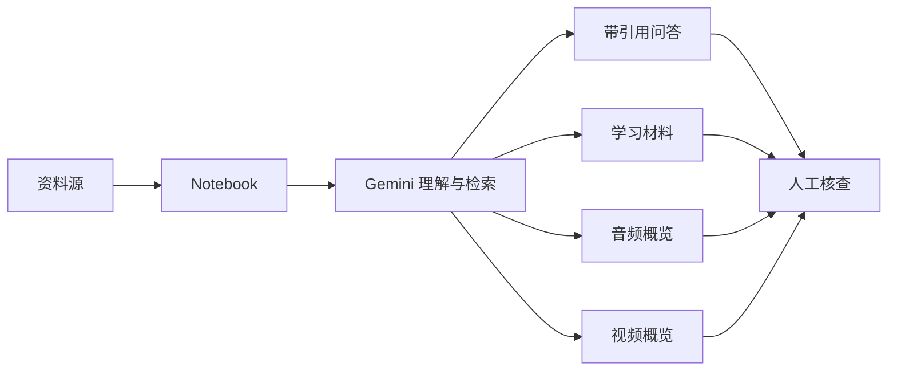
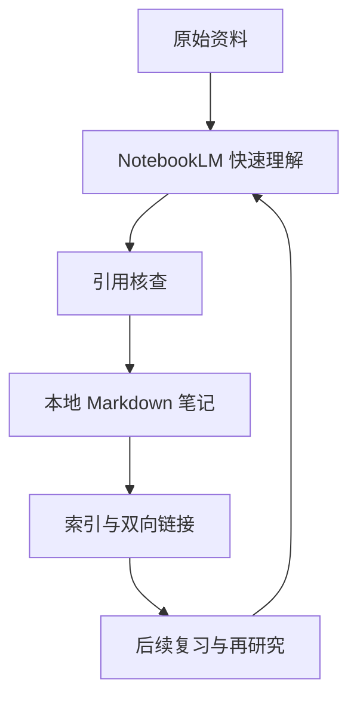

# NotebookLM 系统介绍

## 1. 核心定义

NotebookLM 是 Google 推出的 AI 研究与学习助手。它的核心定位不是通用聊天机器人，而是一个以用户资料为中心的“来源驱动型研究工作台”：用户先上传或导入资料，NotebookLM 再基于这些资料进行总结、问答、引用、知识连接和多形态内容生成。

Google 官方对 NotebookLM 的描述是：它是一个由 Gemini 驱动的研究与思考伙伴，能够基于用户信任的信息工作，并在回答中给出清晰引用。换句话说，NotebookLM 的价值不是“知道全世界所有事情”，而是“围绕你给它的资料成为一个临时专家”。

从知识管理角度看，NotebookLM 可以理解为：

- 一个面向资料集的 AI 阅读器。
- 一个带引用能力的文档问答系统。
- 一个能把资料转成学习材料的生成工具。
- 一个轻量级研究项目工作台。

它尤其适合处理论文、课程资料、调研报告、会议材料、产品文档、竞品资料、访谈记录和长篇网页等需要“快速理解、交叉比较、提炼观点”的场景。

## 2. 与普通 AI 聊天机器人的关键差异

NotebookLM 与通用 AI 助手最大的差异在于“来源边界”。

普通聊天机器人通常基于模型预训练知识、联网搜索结果、上下文窗口和工具调用来回答问题。NotebookLM 则要求用户先建立一个 notebook，并向其中添加 sources。之后的问答、总结和生成内容，都围绕这些 sources 展开。

这种设计带来三个结果：

1. **可追溯性更强**
   - NotebookLM 会在回答中显示引用，帮助用户回到原文核查。
   - 对学习、研究、法务、产品分析等场景，引用比单纯回答更重要。

2. **幻觉风险相对降低**
   - 官方强调 NotebookLM 的优势在于 source grounded，即基于用户上传资料回答。
   - 它仍可能犯错，但错误更容易通过引用和原文检查被发现。

3. **更适合封闭资料集研究**
   - 当任务目标是理解一组指定资料，而不是开放式搜索全网时，NotebookLM 的边界更清晰。
   - 典型例子包括“读完这 10 篇论文”“总结这些会议纪要”“从这些产品手册里找功能限制”。

## 3. 基础工作流

NotebookLM 的基本工作流是：创建 notebook，添加 sources，围绕 sources 提问，然后生成摘要、学习材料、音频或视频概览等派生成果。

这个流程里，最关键的不是“问得多”，而是“资料源选得准”。如果资料集本身质量低、范围混乱或存在冲突，NotebookLM 生成的摘要和结论也会受到影响。

## 4. 支持的资料类型

根据 Google NotebookLM 帮助文档，NotebookLM 支持多种 sources：

- Google Drive 文件，包括 Google Docs、Google Slides 和 Google Sheets。
- PDF、文本、Markdown、复制粘贴文本。
- 网站 URL。
- 公开 YouTube 视频 URL。
- 本地音频文件。
- 多种图片格式，例如 `jpg`、`png`、`webp`、`heic`、`tiff` 等。

官方帮助页给出的关键限制包括：

- 单个 source 最多可包含 500,000 words，或上传文件最大 200 MB。
- 免费用户最多可在一个 notebook 中包含 50 个 sources。
- Google Slides 支持最多 100 slides。
- Google Sheets 当前限制为 100k tokens。
- 网页导入主要抓取 HTML 文本内容，不导入图片、嵌入视频或嵌套网页；付费墙网页不支持。
- YouTube 导入依赖有效链接、安全性判断、字幕文件和语言支持。
- 本地音频导入会在导入时转录为文本，且无语音内容的音频不支持。

这些限制说明 NotebookLM 更适合“高质量资料包”的研究，而不是无限制爬取、归档或替代企业知识库。

## 5. 核心能力

### 5.1 来源驱动问答

用户可以直接针对 notebook 中的资料提问。NotebookLM 会从所选资料中查找相关内容，生成回答，并提供内联引用。

使用建议：

- 对多个资料一起提问时，尽量明确问题范围。
- 如果要针对某几份资料问答，可以在 Source 面板中手动选择资料。
- 如果回答过于泛化，应改成更具体的问题，例如从“总结这篇文章”改为“总结这篇文章中关于模型部署风险的三个关键观点”。
- 对重要结论必须回到引用原文核查，尤其是法律、医疗、财务、合规、商业决策类内容。

### 5.2 Source Guide 与摘要

NotebookLM 可以自动为单个 source 生成摘要，也可以在聊天中按用户问题生成更聚焦的摘要。

这两种摘要方式适合不同场景：

- Source Guide 适合快速了解单个资料的大意。
- 聊天摘要适合围绕某个主题、问题或决策点提炼资料。

例如，在阅读一组 MLOps 平台文档时，可以先用 Source Guide 了解每份文档，再追问“这些资料分别如何定义 model registry、pipeline orchestration 和 serving runtime 的边界”。

### 5.3 学习材料生成

NotebookLM 可以把 sources 转换成更适合学习的材料，例如 study guides、briefings、mind maps、flashcards 和 quizzes 等。

这些功能的学习价值在于：

- 把长文档拆成可复习的小块。
- 帮助用户检查自己是否真正理解资料。
- 用 mind map 建立概念之间的关系。
- 用 briefing 快速向他人转述资料要点。

但这些材料不应被视为权威教材。它们更像“第一版学习脚手架”，用户仍需要基于原文修正、补充和验证。

### 5.4 Audio Overview

Audio Overview 是 NotebookLM 的标志性功能之一。它会把 sources 转换成由 AI 主持人讲解的音频概览。Google 帮助文档将其定义为 AI hosts 对上传资料关键主题进行深入总结的讨论，目标是客观反映 source content，而不是输出 AI 主持人的主观意见。

官方支持的 Audio Overview 格式包括：

- **Deep Dive**：默认模式，由两位主持人深入讲解和连接资料主题。
- **The Brief**：简短概览，由单个说话者在两分钟以内给出关键要点。
- **The Critique**：用于对文章、设计文档等材料给出建设性反馈。
- **The Debate**：用正式辩论形式呈现多个视角。

Audio Overview 的重要特性：

- 可在后台生成。
- 可以通过 prompt 指定关注主题或专业程度。
- 可以在 80 多种语言中生成输出。
- 可以下载或分享，但 Workspace Enterprise 或 Education 账号当前不支持公开 notebook 分享。
- 交互模式允许用户用语音加入对话并提问，但官方文档显示交互模式当前仅支持英语。

使用时需要注意：官方明确提示 Audio Overview 包括声音在内均为 AI 生成，可能包含不准确内容或音频瑕疵。

### 5.5 Video Overview

Video Overview 会把 notebook 中的 sources 转换为带旁白和视觉元素的视频概览，用于把复杂资料变成更易理解的视觉 deep dive。

官方帮助文档列出的 Video Overview 格式包括：

- **Cinematic**：面向 18 岁以上用户，目前仅支持英语，用更沉浸的视觉和叙事方式解释复杂观点。
- **Explainer**：结构化、全面地连接资料中的关键点。
- **Brief**：短视频形式，帮助用户快速掌握文档核心观点。

Video Overview 还可以设置输出语言、视觉风格和 steering prompt。视觉风格包括 Classic、Whiteboard、Watercolor、Retro Print、Heritage、Paper-craft、Kawaii、Anime 或自定义风格。

需要注意：

- Video Overview 可能生成较慢，官方提示有时超过 30 分钟。
- 生成的视频、声音和视觉都是 AI 生成，可能存在不准确内容或音频问题。
- 移动端当前可能存在功能限制。

### 5.6 Fast Research 与 Deep Research

NotebookLM 支持从 Web 或 Google Drive 搜索来源，也支持使用 Deep Research。官方帮助文档描述，Deep Research 可以自动浏览大量网站、思考发现并生成多页报告，然后让用户把报告和相关 sources 导入 notebook。

这说明 NotebookLM 正在从“用户上传资料后的阅读助手”扩展为“研究资料发现加资料综合”的工作台。

使用上需要区分两层：

- Fast Research 和 Deep Research 帮你发现、汇集资料。
- NotebookLM notebook 帮你围绕已导入资料进行理解、问答和生成。

如果研究任务对来源质量要求很高，仍建议先人工筛选资料，再导入 NotebookLM。

## 6. 企业与隐私口径

NotebookLM 的隐私和企业可用性需要分个人账号与 Workspace 账号理解。

Google 官方主页和帮助文档给出的关键口径包括：

- 用户上传 sources 后，资料默认保持私有，除非用户选择分享 notebook。
- Google 表示 NotebookLM 不会用用户上传内容训练模型，除非用户主动提交反馈。
- 对 Google Workspace 或 Workspace for Education 用户，上传内容、查询和模型回答不会被人工审阅，也不会用于训练 AI 模型。
- NotebookLM 已包含在 Workspace 计划中；合格 Workspace 计划可获得更高额度和额外功能。
- Workspace 管理员可以在 Admin console 的 Generative AI NotebookLM 设置中打开或关闭用户访问。

从企业治理角度看，NotebookLM 的优势是与 Google Workspace 生态集成，能直接导入 Docs 和 Slides，并支持团队共享 notebook。但它仍不是完整的企业知识库或权限治理平台。企业若要大规模使用，需要额外关注：

- 哪些资料允许上传。
- notebook 分享边界。
- 是否涉及客户数据、代码、商业机密或受监管数据。
- 生成内容是否允许外发。
- 是否需要保留审计记录。

## 7. 适用场景

### 7.1 学习与课程复习

适合上传课程讲义、教材章节、课堂录音、论文和作业说明，生成：

- 概念解释。
- 复习提纲。
- quiz 和 flashcards。
- 章节之间的关系图。
- Audio Overview 作为通勤听课材料。

### 7.2 论文与技术调研

适合上传论文、技术报告、官方文档和 benchmark 资料，追问：

- 每篇资料的核心假设是什么。
- 方法之间有什么差异。
- 哪些结论互相支持，哪些结论存在冲突。
- 是否存在实验设计、样本选择或评估指标问题。

### 7.3 产品和竞品分析

适合上传竞品官网、产品手册、定价页、用户反馈和内部访谈记录，生成：

- 功能矩阵。
- 定位差异。
- 目标客户画像。
- 销售话术。
- 产品机会点。

### 7.4 会议和项目材料整理

适合上传会议纪要、项目计划、需求文档、决策记录和风险清单，提取：

- 决策项。
- 行动项。
- 风险和依赖。
- 未解决问题。
- 下次会议议程。

## 8. 不适用或需谨慎的场景

NotebookLM 不适合被当作以下系统的直接替代品：

- **正式文档管理系统**：它更像研究工作台，不是带完整生命周期、审批、版本和审计的 DMS。
- **企业知识库唯一入口**：它依赖 notebook 范围组织资料，不一定适合做全公司知识检索入口。
- **事实权威来源**：回答必须回到引用原文核查。
- **高频自动化处理系统**：NotebookLM 更面向人工研究和学习，不是批量 ETL、RAG API 或生产级知识服务。
- **敏感数据处理平台**：即使官方给出隐私承诺，企业仍需要根据合规要求评估数据上传边界。

## 9. 最佳实践

### 9.1 先定义 notebook 主题

一个 notebook 最好对应一个明确研究主题，例如：

- “Kubeflow 官方文档学习”
- “MLOps 开源平台对比”
- “某产品竞品调研”
- “PMP 考试复习”

不要把多个无关主题混在同一个 notebook 中。资料边界越清晰，回答越稳定。

### 9.2 控制资料质量

导入资料前先做筛选：

- 优先导入官方文档、原始论文、正式报告和高质量访谈。
- 对博客、新闻、论坛内容标注可信度。
- 对互相冲突的资料保留来源信息，不要只导入二手总结。

### 9.3 用问题驱动摘要

不要只问“总结一下”。更好的问题是：

- “从平台架构角度总结这几份资料的共同点和差异。”
- “列出这些资料中对可用性 SLA 的明确承诺和未明确承诺。”
- “这几份文档对用户权限模型的描述是否一致。”
- “哪些结论有引用证据，哪些只是推断。”

### 9.4 把 NotebookLM 输出再沉淀到本地知识库

NotebookLM 适合快速理解资料，但长期知识沉淀仍应进入自己的 Markdown 知识库。推荐流程：

1. 用 NotebookLM 对资料进行首轮理解。
2. 根据引用回到原文核查。
3. 将确认过的结论整理成本地 Markdown。
4. 在本地笔记中保留来源 URL、日期和更新历史。
5. 对后续变化做增量更新，而不是依赖 NotebookLM 临时会话。

## 10. 与本地知识库工作流的关系

在当前知识库中，NotebookLM 可以作为“资料理解加速器”，但不应替代本地知识归档。

建议定位如下：

- NotebookLM：用于快速读资料、跨文档问答、生成音频和学习材料。
- 本地 Markdown 知识库：用于保存经过核查和重写后的稳定知识。
- Cursor Agent：用于把研究结果结构化、补齐上下文、更新索引和维护双向链接。

这三者组合起来，可以形成一个学习闭环：

## 11. 一句话判断

NotebookLM 最适合用来处理“我有一组资料，需要快速理解、追问、提炼和转成学习材料”的任务。它不是万能知识库，也不是完全可信的事实机器；它的强项在于 source grounded synthesis，即围绕用户给定资料进行可引用的综合理解。

## 12. 参考来源

- Google NotebookLM 官方主页：https://notebooklm.google/
- Google NotebookLM Help - Learn about NotebookLM：https://support.google.com/notebooklm/answer/16164461?co=GENIE.Platform%3DDesktop&hl=en
- Google NotebookLM Help - Add or discover new sources：https://support.google.com/notebooklm/answer/16215270?co=GENIE.Platform%3DDesktop&hl=en
- Google NotebookLM Help - Generate Audio Overview：https://support.google.com/notebooklm/answer/16212820
- Google NotebookLM Help - Generate Video Overviews：https://support.google.com/notebooklm/answer/16454555?hl=en
- Google Workspace - NotebookLM for business：https://workspace.google.com/intl/en_ie/products/notebooklm/
- Google Workspace Help - Turn NotebookLM on or off：https://knowledge.workspace.google.com/admin/users/access/turn-notebooklm-on-or-off-for-users

## Update History

- 2026-06-02: 新建笔记，整理 NotebookLM 的定位、资料类型、核心功能、隐私口径、企业使用边界与本地知识库工作流建议。
