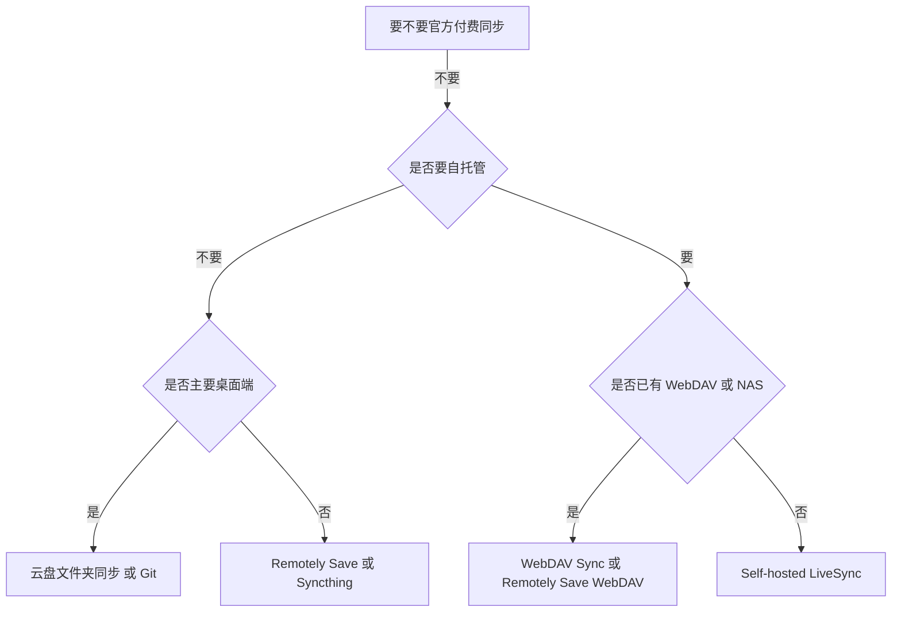

# Obsidian 代理设置与非官方 Vault 同步方案

## 1. 核心结论

关于 Obsidian 的代理和同步，可以先抓住两个结论：

1. **Obsidian 官方帮助文档没有提供单独的 GUI 代理设置页面**。如果你要让 Obsidian 走代理，通常要靠系统代理、启动参数，或者给具体插件与底层 CLI 单独配代理。
2. **不用官方付费 Obsidian Sync 完全可行**。官方帮助文档本身就把第三方云盘、本地同步、Git 和社区同步插件列为常见方法。

一句话理解：

```text
代理问题是“怎么让 Obsidian 连出去”，同步问题是“怎么让 Vault 在多设备之间保持一致”。
```

这两个问题经常混在一起，但实际配置层次并不相同。

## 2. Obsidian 代理到底怎么配

### 2.1 先澄清一个现实：Obsidian 没有单独的“代理设置”总开关

我检索了官方帮助仓库 `obsidianmd/obsidian-help`，没有看到 Obsidian 官方单独提供“Settings -> Proxy”这种统一入口。

所以实际可用的方法，来自它底层 Electron 网络栈，以及你所使用的具体插件或 CLI。

可以把代理分成三层：

1. **系统代理**：影响 Obsidian 本体和大部分走 Chromium/Electron 网络栈的请求。
2. **应用启动参数**：给 Obsidian 这个 Electron 应用单独指定代理。
3. **插件/CLI 代理**：例如 Git、Claudian、Claude Code、Remotely Save 这类组件，可能还要分别配置。

## 3. 推荐的代理配置顺序

### 3.1 最优先：先用系统代理

这是最省事、兼容性通常也最好的方法。

适用场景：

- 你只是想让 Obsidian 插件商店、社区插件下载、内置网页请求正常访问。
- 你已经在系统里使用 Clash、Surge、v2rayN、Proxifier、系统 PAC 等。

做法：

- **Windows**：在系统代理或你的代理客户端里开启全局代理或系统代理。
- **macOS**：在网络设置里启用 HTTP/HTTPS/SOCKS 代理，或让代理客户端接管系统代理。
- **Linux**：优先让桌面环境或代理客户端设置系统代理；如果你用 GNOME/KDE，也可以在对应网络设置中配置。

优点：

- 改动最少。
- 对 Electron/Chromium 类请求通常最自然。
- 以后 Obsidian 升级时也不容易失效。

缺点：

- 如果某些插件内部不是走 Electron 网络栈，而是自己调用 Node、Git、SSH 或外部 CLI，这些流量不一定自动跟随系统代理。

### 3.2 需要单独控制 Obsidian 时：用 Electron 启动参数

Electron 官方支持以下代理相关启动参数：

- `--proxy-server=地址:端口`
- `--proxy-bypass-list=主机列表`
- `--proxy-pac-url=PAC 地址`
- `--no-proxy-server`

其中最常用的是 `--proxy-server` 和 `--proxy-bypass-list`。

#### Linux 示例

```bash
obsidian --proxy-server=http://127.0.0.1:7890 --proxy-bypass-list="<local>;localhost;127.0.0.1"
```

如果你使用的是 AppImage：

```bash
./Obsidian.AppImage --proxy-server=http://127.0.0.1:7890 --proxy-bypass-list="<local>;localhost;127.0.0.1"
```

#### macOS 示例

```bash
open -a Obsidian --args --proxy-server=http://127.0.0.1:7890 --proxy-bypass-list="<local>;localhost;127.0.0.1"
```

#### Windows 示例

可以修改快捷方式的目标字段，在原可执行路径后追加：

```text
--proxy-server=http://127.0.0.1:7890 --proxy-bypass-list="<local>;localhost;127.0.0.1"
```

例如概念上会变成：

```text
"C:\Path\To\Obsidian.exe" --proxy-server=http://127.0.0.1:7890 --proxy-bypass-list="<local>;localhost;127.0.0.1"
```

### 3.3 PAC 场景

如果你的网络环境依赖 PAC：

```bash
obsidian --proxy-pac-url=http://127.0.0.1:7890/proxy.pac
```

### 3.4 一个容易踩坑的点

Electron 官方文档明确提到，`--proxy-server` **不支持在代理 URL 中内嵌用户名和密码认证**。如果你的代理需要账号密码，通常更稳妥的方式是：

- 用本地代理工具先做一层转发。
- 或者使用 PAC。
- 或者直接走系统代理。

## 4. 为什么有时“Obsidian 走了代理”，插件还是不通

因为不是所有能力都走同一条网络栈。

### 4.1 Git 类插件

如果你用的是 Git 仓库同步，真正联网的往往是 `git` 本身，而不是 Obsidian。

这种情况下要给 Git 单独配代理，例如：

```bash
git config --global http.proxy http://127.0.0.1:7890
git config --global https.proxy http://127.0.0.1:7890
```

如果你用 SSH，还要在 `~/.ssh/config` 里单独配代理。

### 4.2 需要外部 CLI 的插件

像 Claudian、Claude Code、Codex 一类方案，本质上还依赖外部 CLI 或 provider 进程。

这时 Obsidian 本体走代理，不代表 `claude`、`codex`、`npm`、`git`、`ssh` 也自动走代理。

这类情况更常见的做法是给 Obsidian 启动环境或系统 shell 设置环境变量：

```bash
export HTTP_PROXY=http://127.0.0.1:7890
export HTTPS_PROXY=http://127.0.0.1:7890
export NO_PROXY=localhost,127.0.0.1
```

如果是 Windows PowerShell：

```powershell
$env:HTTP_PROXY="http://127.0.0.1:7890"
$env:HTTPS_PROXY="http://127.0.0.1:7890"
$env:NO_PROXY="localhost,127.0.0.1"
```

### 4.3 企业代理和证书问题

如果你所在环境有 HTTPS 解密或企业中间人证书，最稳妥的方法不是忽略证书报错，而是：

1. 让操作系统信任企业 CA。
2. 让 Git、Node、CLI 共用这套系统证书链。

不建议用“忽略证书错误”这类粗暴方式长期运行。

## 5. 不用官方付费同步时，Vault 怎么同步

Obsidian 官方帮助文档在“Sync your notes across devices”里明确列出了常见同步方法：

- 第三方云盘同步：iCloud、OneDrive、Google Drive
- 本地同步：Syncthing
- 版本控制：Git、Working Copy
- 社区插件目录里还有大量其他同步插件

所以答案不是“能不能”，而是“你应该选哪一种”。

## 6. 五类常见非官方同步方案

### 6.1 第三方云盘文件夹同步

这是最容易理解的一类：把 Vault 直接放进云盘目录里。

官方帮助页明确给出的常见选项有：

- iCloud
- OneDrive
- Google Drive

#### 适合谁

- 不想折腾服务器。
- 主要在桌面端之间同步。
- 可以接受云盘客户端的行为模式。

#### 优点

- 最容易上手。
- 不需要 Obsidian 社区插件。
- 直接同步文件夹，迁移成本低。

#### 缺点

- 一定要把 Vault 设为 **离线可用**，否则云盘“按需下载”会导致 Obsidian 误以为文件消失。
- 官方帮助页明确提醒：**iCloud Drive on Windows** 可能造成文件重复或损坏。
- OneDrive/Google Drive 在移动端支持并不完整，尤其 iOS 侧体验并不理想。

#### 使用建议

- Apple 全家桶：优先 iCloud。
- Windows/macOS 双机：可以用 OneDrive 或 Google Drive，但务必保持文件离线常驻。
- 不建议把同一个 Vault 同时再叠加另一种实时同步服务。

### 6.2 Syncthing

这是官方帮助页明确列出的本地同步方案。

特点：

- 去中心化。
- 不依赖云盘。
- 设备间直接同步。

#### 适合谁

- 想尽量避免第三方云盘。
- 自己设备之间同步为主。
- 可以接受至少有设备在线时才更顺畅地同步。

#### 优点

- 自主可控。
- 不需要把 Vault 存到第三方云盘。
- 对纯 Markdown 知识库很友好。

#### 缺点

- 跨 iOS 生态不友好。
- 更依赖设备在线状态。
- 初次配置比云盘目录复杂。

#### 官方帮助页里的关键提醒

- Android 官方 App 已不再维护，通常改用社区维护的 Syncthing-Fork。
- 至少有一台设备经常在线时体验更好。
- 可以用 ignore 规则排除临时文件。
- 如果你想保留不同设备的独立设置，可以排除 `.obsidian`。

### 6.3 Git 同步

官方帮助页也明确把 Git 列为同步方法。

最原始的方式是：

```bash
git init
git add .
git commit -m "update"
git push origin main
```

然后在其他设备：

```bash
git pull origin main
```

#### 适合谁

- 重视版本历史。
- 主要内容是文本笔记而不是大量二进制附件。
- 能接受 Git 工作流。

#### 优点

- 历史最清晰。
- 回滚最方便。
- 适合技术类知识库。

#### 缺点

- 官方帮助页也明确提醒：**Git 默认不是自动同步**，需要手动 push/pull。
- 多设备同时编辑同一文件，容易出现合并冲突。
- 对移动端并不友好。

### 6.4 Obsidian Git 插件

如果你想把 Git 做得更自动化，可以用社区插件 **Obsidian Git**。

该插件 README 明确提供：

- 自动 commit / pull / push
- 启动时自动 pull
- diff、history、source control 视图

但它也明确提醒：

- **移动端非常不稳定**。
- Linux 上 Snap 不支持，Flatpak 也不推荐用于复杂场景。

因此更务实的判断是：

- **桌面端**：Obsidian Git 值得用。
- **移动端**：不建议把它当主同步方案。

### 6.5 WebDAV / S3 类社区插件

如果你想跨平台、跨桌面和移动端，又不想买官方 Sync，这类插件很常见。

常见代表有两个：

#### A. Remotely Save

从它的 README 看，Remotely Save 支持：

- S3 / S3 兼容存储
- Dropbox
- OneDrive
- WebDAV
- 以及更多云端后端

它还支持：

- 移动端
- 定时自动同步
- 端到端加密

适合谁：

- 想跨平台同步。
- 不想自建太复杂的服务。
- 想复用已有 WebDAV、S3、Dropbox 或 OneDrive 存储。

注意点：

- 它是**非官方同步插件**。
- 官方和插件 README 都建议先备份 Vault。
- 某些后端、某些高级能力可能带来额外成本或限制。

#### B. Obsidian WebDAV Sync

如果你已经有 WebDAV 服务，这个插件更聚焦。

从它的 README 看，它支持：

- 双向 WebDAV 同步
- 启动同步、定时同步、实时同步
- 多种冲突处理策略
- 客户端加密
- 对 `.obsidian` 的选择性同步

适合谁：

- 已经有 Nextcloud、群晖、坚果云、AList、Caddy/Nginx/Apache WebDAV。
- 想要相对轻量、明确的 WebDAV 工作流。

### 6.6 Self-hosted LiveSync

如果你想要更强的自托管和更接近实时同步，可以看 **Self-hosted LiveSync**。

它的 README 明确说明：

- 可基于 CouchDB、对象存储或 WebRTC P2P
- 支持端到端加密
- 支持设置、主题、插件等同步
- **不能和官方 Obsidian Sync 兼容，也不建议和 iCloud 等其他同步方案混用**

#### 适合谁

- 想完全自托管。
- 有一定服务端能力。
- 需要更强的同步能力而不仅是“文件夹复制”。

#### 不适合谁

- 不想维护后端。
- 希望十分钟就搭好。

## 7. 该怎么选

下面是一个更务实的选型表：

| 方案 | 上手难度 | 跨平台 | 移动端 | 自托管 | 版本历史 | 适合场景 |
|---|---|---|---|---|---|---|
| iCloud / OneDrive / Google Drive | 低 | 中 | 一般 | 否 | 弱 | 轻量日常同步 |
| Syncthing | 中 | 高 | Android 友好，iOS 弱 | 是 | 弱 | 自己设备间直连 |
| Git | 中 | 高 | 弱 | 可选 | 强 | 技术笔记、强历史追踪 |
| Obsidian Git | 中 | 中 | 弱 | 可选 | 强 | 桌面端自动化 Git |
| Remotely Save | 中 | 高 | 高 | 可选 | 中 | 跨平台多设备日常同步 |
| WebDAV Sync | 中 | 高 | 取决于平台 | 可选 | 中 | 已有 WebDAV 后端 |
| Self-hosted LiveSync | 高 | 高 | 高 | 是 | 中 | 重度自托管和实时同步 |

## 8. 我给你的推荐顺序

如果你问的是“现在就想稳定用起来，该怎么选”，我的建议是：

### 情况 A：你主要是桌面端，设备不多

优先顺序：

1. iCloud / OneDrive / Google Drive
2. Syncthing
3. Git

### 情况 B：你要桌面 + 安卓 + 尽量少折腾

优先顺序：

1. Remotely Save
2. Syncthing
3. WebDAV Sync

### 情况 C：你已经有 NAS、Nextcloud、群晖或 WebDAV

优先顺序：

1. WebDAV Sync
2. Remotely Save 的 WebDAV 模式
3. LiveSync

### 情况 D：你是技术用户，最看重版本历史

优先顺序：

1. Git + Obsidian Git（桌面端）
2. Git 手动同步
3. Git 只作为备份，不作为多端实时同步主方案

### 情况 E：你最看重完全自托管和隐私

优先顺序：

1. Self-hosted LiveSync
2. Syncthing
3. WebDAV + 加密

## 9. 非官方同步最重要的三条纪律

### 9.1 同一个 Vault 只跑一种“主同步机制”

这是最重要的一条。

不要把以下方案混着对同一个 Vault 做实时同步：

- Obsidian Sync + iCloud
- iCloud + Syncthing
- Syncthing + LiveSync
- Git 自动同步 + WebDAV 实时同步

混用最大的问题不是“偶尔有冲突”，而是会把冲突放大成文件重复、误删、旧文件复活和目录状态错乱。

### 9.2 先决定要不要同步 `.obsidian`

`.obsidian` 里有设置、插件、工作区布局、插件数据。

建议：

- **同平台、同工作习惯的设备**：可以同步大部分 `.obsidian`。
- **桌面和移动混用**：建议选择性同步，而不是整个目录无脑同步。
- **多设备各自布局不同**：至少把 `workspace.json` 这类界面文件按设备分开处理。

### 9.3 迁移前先完整备份

尤其是在你要从云盘切到 Syncthing、从 Git 切到 WebDAV、从 Remotely Save 切到 LiveSync 的时候。

最稳妥的迁移方式是：

1. 先停掉旧同步。
2. 做一份完整目录备份。
3. 在一台主设备上确认 Vault 是最新状态。
4. 让新同步方案以这台设备为基准初始化。
5. 其他设备重新接入，不要带着旧缓存直接混进来。

## 10. 一个简化决策图



## 11. 对你最务实的建议

如果你现在处在“刚开始搭建知识库”的阶段，我建议：

1. **代理**：先走系统代理；如果还不通，再给 Obsidian 单独加 `--proxy-server`。
2. **同步**：先选一种最简单、最稳的主方案，不要一开始就叠三层。
3. **桌面优先**：如果你主要是电脑上用，优先考虑云盘目录、Syncthing 或 Git。
4. **跨平台移动端优先**：优先考虑 Remotely Save 或 WebDAV。
5. **重度自托管**：再看 LiveSync。

## 11.1 设备组合案例：Windows + Android + iPad

这组设备的关键矛盾是：

- `iCloud` 对 iPad 很自然，但官方帮助页明确提醒 **iCloud Drive on Windows** 可能导致重复或损坏。
- `Syncthing` 对 Windows + Android 很合适，但官方帮助页也明确把它列为 **iOS 上不官方支持** 的方案。
- `Obsidian Git` 在桌面端不错，但插件 README 明确提醒 **移动端非常不稳定**。

所以如果你的目标是：

- 一套主同步机制覆盖三台设备
- 尽量少折腾
- 不买官方 Sync

我给你的主推荐是：

```text
Remotely Save + WebDAV 后端
```

如果你已经有现成对象存储，也可以用：

```text
Remotely Save + S3/R2/MinIO
```

### 为什么我首推它

原因很直接：

1. Obsidian 官方帮助页在 iPhone/iPad 部分明确说，Dropbox、Google Drive、OneDrive、Syncthing 这些在 iOS 上都不是官方支持路径，但很多用户会通过第三方工具或插件绕过去，其中就点名了 **Remotely Save** 和 **LiveSync**。
2. Remotely Save 的 README 明确写了 **Obsidian Mobile supported**，这对 Android 和 iPad 都更现实。
3. 对这组设备来说，`WebDAV` 比 `iCloud`、`Syncthing`、`Git` 更均衡，因为它对三端都没有天然短板。

### 为什么不把其他方案放第一位

#### 不推荐把 iCloud 放第一位

因为你的设备里有 Windows。

官方帮助页已经明确提示：

```text
iCloud Drive on Windows may lead to file duplication or corruption.
```

如果你是 `Mac + iPad`，iCloud 会很顺；但你是 `Windows + Android + iPad`，它就不再是最稳方案。

#### 不推荐把 Syncthing 放第一位

因为你的设备里有 iPad。

对于 `Windows + Android`，Syncthing 很强；但一旦加上 iPad，它就不再适合作为唯一主同步机制。

#### 不推荐把 Git / Obsidian Git 放第一位

因为你有两个移动端，且其中一个是 iPad。

Git 仍然适合做：

- 备份
- 历史追踪
- 版本审计

但不适合做这组设备的“最省心主同步”。

### 这组设备的推荐顺序

#### 方案 A：最均衡、最推荐

```text
Remotely Save + WebDAV
```

适合你如果：

- 想要一套方案覆盖 Windows、Android、iPad。
- 不想自己维护太重的后端。
- 已经有 Nextcloud、群晖、坚果云、AList、Caddy/Nginx/Apache WebDAV。

#### 方案 B：如果你没有 WebDAV，但能接受对象存储

```text
Remotely Save + S3/R2/MinIO
```

适合你如果：

- 没有现成 WebDAV。
- 更愿意用 Cloudflare R2、MinIO 或其他 S3 兼容存储。

#### 方案 C：如果你愿意重度自托管

```text
Self-hosted LiveSync
```

适合你如果：

- 接受搭 CouchDB 或对象存储。
- 想更强的同步能力。
- 能接受维护成本更高。

### 不建议的组合

对 `Windows + Android + iPad`，我不建议你把下面任何一种当主同步：

- `iCloud`
- `Syncthing`
- `Obsidian Git`
- `Working Copy + Git` 作为全设备主同步

原因不是它们完全不能用，而是：

- 要么对 iPad 不友好
- 要么对 Windows 不友好
- 要么对移动端太不稳

### 最小落地步骤

如果你现在就要搭，我建议这样做：

1. 在 Windows 上整理出唯一可信的主 Vault。
2. 先完整备份一份整个 Vault。
3. 在三台设备都安装 Obsidian。
4. 在三台设备都安装 `Remotely Save`。
5. 选择一个统一后端：
    - 有 WebDAV 就用 WebDAV
    - 没 WebDAV 就用 S3/R2
6. 三台设备使用**同一个 vault 名称**和**同一套 Remotely Save 配置**。
7. 第一次同步时，以 Windows 为源头，先完整上传。
8. Android 和 iPad 端新建空 Vault 后，再从远端拉取，不要拿旧目录直接混合接入。

### 关于 `.obsidian` 要不要同步

对这组设备，我建议不要一开始就全量同步 `.obsidian`。

更稳的做法是：

- 先同步正文笔记和附件。
- 再按需同步一部分设置。
- 对工作区布局、平台差异明显的插件数据保持谨慎。

一句话建议：

```text
先让内容稳定同步，再决定哪些配置值得跨平台共享。
```

### 一个更实际的长期方案

如果你同时又重视版本历史，我建议把职责拆开：

- **主同步**：Remotely Save + WebDAV
- **历史备份**：Windows 端定期 Git 提交

这样做的好处是：

1. 三端日常编辑不依赖 Git。
2. Windows 端还能保留版本历史。
3. 你不会把“移动端 Git 不稳定”这个问题带进主工作流。

## 11.2 如果你现在没有现成后端：WebDAV 还是 R2

如果前提是：

- 你现在**没有**现成的 NAS
- 没有 Nextcloud
- 没有群晖
- 没有已经可用的 WebDAV 账号

那我的默认建议是：

```text
优先选 R2，而不是从零开始折腾 WebDAV。
```

### 为什么我更偏向 R2

#### 1. 对你这组设备更统一

`Windows + Android + iPad` 这种组合，最怕的是某个后端只在某个平台上“勉强能用”。

R2 走的是 `S3-compatible` 路线，配合 Remotely Save 时，三端面对的是同一套对象存储配置：

- endpoint
- access key
- secret key
- bucket

不会像某些 WebDAV 方案那样还要额外处理不同服务商的路径、兼容性或策略差异。

#### 2. 从零开始时，R2 往往比“自建 WebDAV”更省事

如果你现在手里根本没有现成 WebDAV，那么所谓“选 WebDAV”，实际通常意味着你还得再做一步：

- 要么去找一个 WebDAV 服务商
- 要么自己搭 Nextcloud / AList / Nginx / Apache / 群晖 WebDAV

这时 WebDAV 的“简单”其实只成立于：

```text
你已经有现成 WebDAV
```

如果没有，R2 反而更像“直接开箱可用的远端后端”。

#### 3. 以后扩展性更好

Remotely Save 对 `Cloudflare R2 / S3-compatible / MinIO` 本来就有直接支持。

如果以后你：

- 想迁移到别的 S3 兼容对象存储
- 想把附件管理做得更规范
- 想保持后端和设备解耦

R2 这条路通常更容易延展。

### 那什么时候该选 WebDAV

只有一种情况我会把 WebDAV 放前面：

```text
你虽然说“还没定后端”，但其实已经很容易获得稳定 WebDAV。
```

比如：

- 你已经有群晖
- 你已经在用 Nextcloud
- 你已经有成熟可用的 WebDAV 网盘
- 你更熟悉 WebDAV 而不是云对象存储

这时 WebDAV 的优势是：

- 心智模型更直观
- 往往更接近“文件夹同步”的感觉
- 不需要理解 bucket、endpoint、access key 这些对象存储概念

### 一个最短判断法

你可以直接用这个规则：

```text
已有稳定 WebDAV -> 选 WebDAV
从零开始、没有现成后端 -> 选 R2
```

### 对你当前场景的直接结论

基于你现在给的信息，我会直接建议：

```text
先上 Remotely Save + Cloudflare R2
```

原因不是它绝对技术上更高级，而是：

- 更符合“从零开始”的前提
- 对 `Windows + Android + iPad` 更均衡
- 后续改造空间更大
- 不需要你先拥有一个 WebDAV 世界

## 12. 与现有知识的关联

- 如果你关心 Obsidian 在知识工作流中的整体定位，可以继续看 [[Obsidian-浏览器扩展-Claudian-知识工作流方案]]。
- 如果你需要给 Git 相关能力补代理，可以继续看 [[GitHub-CLI代理配置]]。

## 参考链接

- [Obsidian 官方帮助：Sync your notes across devices](https://help.obsidian.md/sync-notes)
- [Obsidian 官方帮助：Community plugins](https://help.obsidian.md/community-plugins)
- [Electron 官方文档：Supported Command Line Switches](https://www.electronjs.org/docs/latest/api/command-line-switches)
- [Electron 官方文档：session](https://www.electronjs.org/docs/latest/api/session)
- [Self-hosted LiveSync](https://github.com/vrtmrz/obsidian-livesync)
- [Obsidian WebDAV Sync](https://github.com/hesprs/obsidian-webdav-sync)
- [Remotely Save](https://github.com/remotely-save/remotely-save)
- [Obsidian Git](https://github.com/Vinzent03/obsidian-git)

## Update History

- 2026-06-11: 初次创建，整理 Obsidian 代理配置层次、Electron 启动参数，以及非官方 Vault 同步方案的选型建议。
- 2026-06-11: 补充 `Windows + Android + iPad` 设备组合的专门建议，明确推荐 Remotely Save + WebDAV 作为更均衡的非官方主同步路径，并说明为何不优先选择 iCloud、Syncthing 和移动端 Git。
- 2026-06-11: 补充“没有现成后端时 WebDAV vs R2”的直接判断，明确建议从零开始时优先选择 `Remotely Save + Cloudflare R2`；只有在已拥有稳定 WebDAV 的前提下才优先 WebDAV。