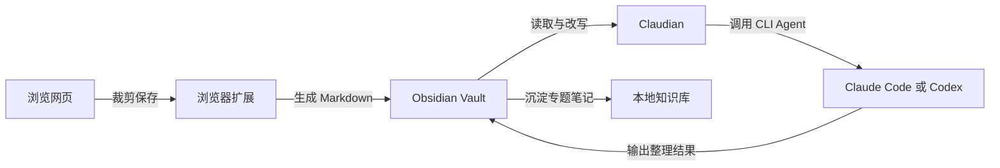

# Obsidian + 浏览器扩展 + Claudian 知识工作流方案

## 1. 核心结论

这套方案本质上是一个三层闭环：

1. 浏览器扩展负责把网页内容采集为结构化 Markdown。
2. Obsidian 负责把这些 Markdown 变成可链接、可检索、可长期保存的本地知识库。
3. Claudian 负责把 Claude Code、Codex 一类 agent 能力嵌入到 Obsidian vault 中，对已有笔记进行整理、改写、归档、交叉引用和多步处理。

一句话理解：

```text
浏览器扩展负责“采集”，Obsidian 负责“存储”，Claudian 负责“理解与加工”。
```

如果你的目标是把日常网页阅读、资料积累和 AI 辅助写作串成一个稳定工作流，这个组合是成立的，而且比“单纯浏览器对话”更适合做长期知识沉淀。

## 2. 三个组件分别干什么

### 2.1 浏览器扩展：负责采集

最稳妥的浏览器侧组件是官方 **Obsidian Web Clipper**。

它的定位很明确：

- 在浏览器里高亮、裁剪、保存网页内容。
- 把保存结果写成可离线保存的 Markdown。
- 支持模板、变量、过滤器等规则，把网页内容转成你想要的笔记格式。
- 支持 Chrome/Brave/Arc/Edge/Firefox/Safari 等主流浏览器生态。

它适合做的事：

- 保存文章全文或摘要。
- 保存带来源链接的网页摘录。
- 按模板把网页转成“稍后阅读”“研究卡片”“资料摘录”“案例库”等固定格式。

### 2.2 Obsidian：负责存储和组织

Obsidian 的价值不在于“能记笔记”这么简单，而在于：

- 底层就是本地 Markdown 文件，数据可控。
- 支持 Wikilinks、双向链接、标签、搜索和图谱视图。
- 适合把碎片化材料逐步沉淀成专题知识库。
- 非常适合与 Git、本地目录、同步盘、自定义脚本配合。

对这套方案来说，Obsidian 是“知识数据层”。

浏览器扩展采集来的内容最终都落到 vault 中，后续的 AI 处理、人工修改、目录整理也都围绕 vault 发生。

### 2.3 Claudian：负责把 agent 放进 vault

Claudian 不是浏览器扩展，而是一个 **Obsidian 社区插件**。

它当前公开元数据可以概括为：

- 插件 ID：`realclaudian`
- 名称：`Claudian`
- 当前版本：`2.0.22`
- 最低 Obsidian 版本：`1.7.2`
- 运行形态：`Desktop only`

它的核心能力不是“聊天 UI”本身，而是把 **Claude Code、Codex、Opencode、Pi** 一类 agent 能力直接嵌进 Obsidian vault。

官方描述里的关键点是：

- vault 会成为 agent 的工作目录。
- agent 可以在 vault 中读写文件、搜索内容、执行 bash、进行多步工作流。
- 支持 inline edit、slash commands、skills、`@mention`、plan mode、MCP servers、多会话标签页等能力。

这意味着它更像一个“知识库内的 AI 操作层”，而不是单纯的问答插件。

## 3. 这套方案的正确理解

很多人第一次听到“Obsidian + 浏览器扩展 + Claudian”时，会误以为它是一个浏览器内完成全部工作的方案。更准确的理解是：

- 浏览器内完成采集。
- 桌面端 Obsidian 完成存储与组织。
- 桌面端 Claudian 完成深度 AI 加工。

所以它不是“一个插件包打天下”，而是一个分层工作流。

## 4. 典型架构



如果再细一点，可以理解成两条链：

- 采集链：网页 -> 浏览器扩展 -> Markdown -> Vault
- 加工链：Vault -> Claudian -> Agent -> 改写后的 Markdown -> Vault

## 5. 一个典型使用流程

### 场景一：做技术研究

1. 在浏览器里阅读 GitHub README、官方文档、博客或论文解析。
2. 用 Obsidian Web Clipper 把正文、高亮和来源链接保存到 vault。
3. 进入 Obsidian，在对应专题目录查看新落下来的 Markdown。
4. 使用 Claudian 让 agent 完成以下事情：
   - 提炼核心结论
   - 改写成统一模板
   - 为术语添加双向链接
   - 把多个来源合并成一篇综述
   - 生成 TODO、问题清单、后续验证项
5. 最终形成可复用的本地专题文档。

### 场景二：做内容生产

1. 浏览器侧采集行业信息、竞品材料、案例文章。
2. 存入 Obsidian 的素材目录。
3. 用 Claudian 把素材重组为：
   - 提纲
   - 长文草稿
   - 演讲稿
   - 分享材料
   - FAQ
4. 人工做最终审校和发布。

### 场景三：做个人第二大脑

1. 浏览器扩展捕获外部信息。
2. Obsidian 维护自己的主题目录、标签和链接网络。
3. Claudian 帮你持续做结构化整理，而不是只做一次性对话。

## 6. 为什么这套方案有吸引力

### 6.1 数据是本地 Markdown，不被单个平台锁死

这是这套方案最大的优点之一。很多 AI 工具擅长生成，但不擅长长期管理知识资产。Obsidian 的好处是：

- 文件可读。
- 可迁移。
- 可备份。
- 可 Git 管理。
- 不依赖某个 SaaS 平台永久存在。

### 6.2 AI 不再脱离上下文

Claudian 的关键优势是，agent 不是对着一小段输入框工作，而是直接围绕整个 vault 工作。

这会带来三个变化：

1. 它能读已有笔记，而不是每次都重新喂上下文。
2. 它能直接修改目标文件，而不是只输出一段待复制文字。
3. 它能执行多步任务，比如搜索相关文件、生成综述、插入链接、重构结构。

### 6.3 浏览器采集和知识沉淀被打通

很多知识工作流失败，不是因为不会总结，而是因为“采集”与“整理”是两套割裂系统。

这套方案的价值就在于：

- 浏览器扩展解决输入。
- Obsidian 解决沉淀。
- Claudian 解决加工。

三者职责清晰，组合起来反而稳定。

## 7. 主要限制和风险

### 7.1 Claudian 依赖桌面端和 CLI 环境

根据项目说明，Claudian 是 desktop only。它通常要求你本机已经装好 Claude Code CLI，或者其他兼容 provider。

这意味着：

- 它不是纯网页即开即用。
- 环境变量、PATH、CLI 路径可能要自己配。
- 在 Windows/macOS/Linux 上都可能遇到路径识别和 Node 环境问题。

### 7.2 不是所有内容都适合直接交给 agent 改写

如果浏览器扩展保存下来的页面模板很脏、结构很乱，Claudian 虽然能处理，但前置模板设计不好，后续成本会更高。

因此实际落地时，浏览器扩展模板很关键。

### 7.3 隐私边界要看清楚

Claudian 文档明确说明：

- 你的输入、附加文件、图片和工具调用输出会发送给对应 provider。
- 本地会存储设置和会话元数据。
- Claude、Codex、Pi 等 provider 还会在各自目录存储转录或历史记录。

所以如果 vault 中包含敏感内容，就要慎重设计：

- 哪些目录允许 agent 访问。
- 哪些笔记只保留本地、避免进入模型上下文。
- 是否需要使用本地代理、企业网关或替代 provider。

## 8. 最适合哪些人

这套方案特别适合：

- 长期做研究、阅读和知识整理的人。
- 想把 AI 输出沉淀成长期资产，而不是一次性聊天记录的人。
- 已经习惯 Markdown、本地目录、Git 或第二大脑方法论的人。
- 需要把网页资料、代码资料、笔记资料统一进一个知识空间的人。

不一定适合：

- 只想偶尔问几个问题，不想维护本地知识库的人。
- 完全不想接触 CLI、路径配置、插件管理的人。
- 强依赖手机端一体化体验的人。

## 9. 一个务实的落地方案

如果你现在要搭建，建议按下面顺序：

1. 安装 Obsidian Desktop，并先把 vault 目录结构定下来。
2. 安装官方 Obsidian Web Clipper。
3. 先只做一到两个采集模板：
   - 文章摘录模板
   - 技术文档模板
4. 在 Obsidian 社区插件中安装 Claudian。
5. 本机安装 Claude Code CLI，先确保终端里 `claude` 命令可用。
6. 在 Claudian 里先完成最小验证：
   - 打开一个目录
   - 让它读取几篇已有笔记
   - 让它生成一篇综述
7. 等工作流跑通后，再加高级能力：
   - Skills
   - MCP
   - 统一命名规范
   - 自动归档规则

### 推荐目录示例

```text
Vault/
├── Inbox/
│   ├── Web-Clips/
│   └── Fleeting-Notes/
├── Topics/
│   ├── AI/
│   ├── Tools/
│   └── Projects/
├── Maps/
├── Templates/
└── Assets/
```

推荐做法：

- 浏览器扩展默认先落到 `Inbox/Web-Clips/`
- Claudian 再把内容整理进 `Topics/`
- 人工最后决定是否升级成正式知识卡片

## 10. 我对这套方案的判断

如果你追求的是：

- 网页采集能力
- 本地 Markdown 知识库
- AI 对知识库的持续加工

那么这套方案是合理的，而且是当前比较先进的一类个人知识工作流。

但要注意，它的强项不是“最省事”，而是“长期可积累”。

所以更准确的定位不是：

```text
一个聊天插件
```

而是：

```text
一个面向长期知识资产的个人研究与写作工作流
```

如果你只需要即时问答，浏览器 AI 或普通聊天工具可能更轻；如果你想把阅读、归档、写作、链接、持续整理合成一个系统，这个组合更有价值。

## 11. 与现有知识的关联

- 如果你关注 agent 在本地工作目录中执行多步任务的机制，可以继续看 [[Claude-Code-自定义Agent配置指南]]。
- 如果你关注更宽泛的 Agent 框架和能力边界，可以继续看 [[AI-Agent-架构与框架全景指南]]。

## 参考链接

- [Claudian GitHub 仓库](https://github.com/YishenTu/claudian)
- [Claudian Community Plugin 页面](https://community.obsidian.md/plugins/realclaudian)
- [Claudian manifest.json](https://raw.githubusercontent.com/YishenTu/claudian/main/manifest.json)
- [Claude Code 官方文档](https://code.claude.com/docs/en/overview)
- [Obsidian Web Clipper 官网](https://obsidian.md/clipper)
- [Obsidian Web Clipper GitHub 仓库](https://github.com/obsidianmd/obsidian-clipper)
- [Obsidian Web Clipper 帮助文档](https://help.obsidian.md/web-clipper)

## Update History

- 2026-06-10: 初次创建，整理 Obsidian、浏览器扩展与 Claudian 的分层工作流、适用场景与落地建议。