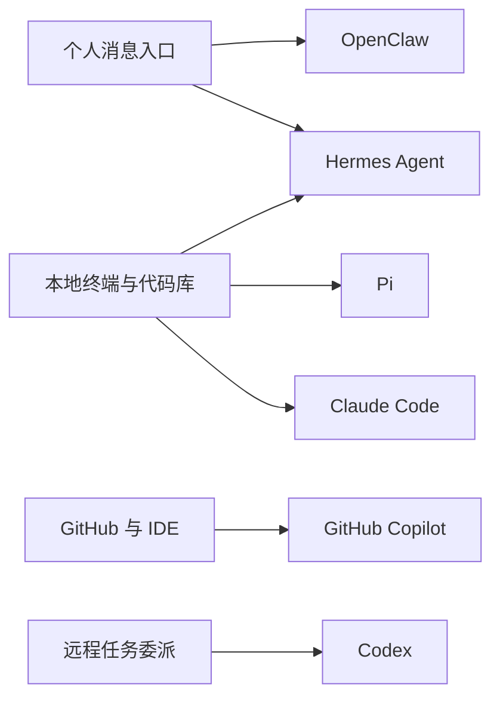

# OpenClaw、Hermes、Pi、Claude Code、Codex、Copilot 区别与选型指南

## 1. 核心结论

这 6 个名字很容易被混成一类，但它们其实分属不同层级：

- **OpenClaw**：偏 **personal assistant / messaging-native agent platform**。
- **Hermes Agent**：偏 **self-improving open agent framework**，兼顾终端、消息网关和技能沉淀。
- **Pi**：偏 **open coding-agent harness**，强调多 provider 和本地控制。
- **Claude Code**：偏 **成熟的一体化 coding agent 产品**。
- **Codex**：偏 **云端软件工程 agent / 远程执行系统**。
- **GitHub Copilot**：偏 **IDE 与 GitHub 工作流中的 AI 编程助手**，同时正扩展到 cloud agent 和第三方 agent 编排。

一句话先判断：

- 如果你要的是“像微信/Telegram 里养一个 AI 助理”，先看 **OpenClaw**。
- 如果你要的是“会自己积累技能、跨平台运行的开源 agent 框架”，先看 **Hermes Agent**。
- 如果你要的是“本地 coding agent 基建，自己掌控 provider 和运行栈”，先看 **Pi**。
- 如果你要的是“日常最顺手的 coding agent 产品体验”，先看 **Claude Code**。
- 如果你要的是“把任务丢给云端 agent 异步跑”，先看 **Codex**。
- 如果你要的是“IDE 里最自然、和 GitHub 最紧的一体化辅助”，先看 **GitHub Copilot**。

## 2. 先把它们放回各自正确层级

### 2.1 OpenClaw

OpenClaw 官方定位非常清楚：

```text
The AI that actually does things.
```

它的重点不是 IDE，也不是单纯终端，而是：

- 跑在你自己的机器或服务器上
- 接到 WhatsApp、Telegram、Discord、Slack、Signal、iMessage 等消息入口
- 具备持久记忆、浏览器控制、Shell/文件访问、技能与插件体系
- 能从手机或聊天窗口里驱动真实任务执行

所以 OpenClaw 更像：

```text
一个自托管的“个人操作系统式 AI 助手”
```

它可以做 coding，但 **不是 coding-first**。它的核心价值是“always-on assistant + chat app native + system control”。

### 2.2 Hermes Agent

Hermes Agent 是 Nous Research 的开源 agent 框架。官方把它定义为：

- **self-improving AI agent**
- 带有**内置学习闭环**
- 能从经验中创建技能并持续改进
- 可运行在终端、消息平台、IDE
- 支持 20+ provider

和 OpenClaw 相比，Hermes 明显更强调：

- agent 自我改进
- 技能沉淀
- provider 抽象层
- terminal-native coding/task agent 能力

所以 Hermes 更像：

```text
OpenClaw 的消息网关思路 + Pi 的开放 provider 思路 + 一个更强的技能学习闭环
```

### 2.3 Pi

Pi 是开源 coding agent harness。

它的核心特征是：

- 多 provider
- 本地 CLI
- runtime 可扩展
- 默认安全边界较弱，需要你自己做 sandbox/containerization

它强在“agent 基建与控制权”，弱在“默认产品化体验”。

### 2.4 Claude Code

Claude Code 是 Anthropic 的 agentic coding 产品。

它的重点是：

- 本地代码库上下文理解
- 文件编辑、命令执行、工具集成
- Terminal、IDE、Desktop、Web 多入口统一体验
- instructions、skills、hooks、MCP、custom agents

它更像“面向开发者的成熟工作台”。

### 2.5 Codex

Codex 现在的重点不是“补全模型”，而是 **cloud-based software engineering agent**。

它强调：

- 每个任务在独立云 sandbox 中执行
- 可并行、可异步
- 带日志、测试输出、证据链
- 适合把明确任务分发给远程 agent

它更像“远程 AI 工程师池”。

### 2.6 GitHub Copilot

GitHub Copilot 的基本盘仍然是：

- IDE 代码补全
- Chat
- CLI 辅助
- PR / review / GitHub 工作流集成

但它现在已经不只是“补全插件”了，还包括：

- editor 中的 agent mode
- GitHub 里的 cloud agent
- 第三方 agent 接入
- 统一的任务视图和企业控制面

所以 Copilot 的本质是：

```text
以 GitHub 和 IDE 工作流为中心的 AI 编程协作层
```

它不像 OpenClaw 那样是“个人 AI 助手 OS”，也不像 Codex 那样天然以“独立云执行沙箱”为中心。

## 3. 最关键的区别

| 维度 | OpenClaw | Hermes Agent | Pi | Claude Code | Codex | GitHub Copilot |
|---|---|---|---|---|---|---|
| 核心定位 | 个人/团队 AI 助手平台 | 自我改进 agent 框架 | 开源 coding harness | 一体化 coding agent 产品 | 云端软件工程 agent | GitHub/IDE AI 编程协作层 |
| 默认入口 | 聊天应用 | 终端 + 消息网关 + IDE | 本地 CLI | Terminal/IDE/Desktop/Web | ChatGPT/CLI/云端任务入口 | IDE/GitHub/CLI/PR |
| 是否 coding-first | 不是，偏 personal assistant | 较强 coding 与任务执行 | 是 | 是 | 是 | 是 |
| 是否 always-on | 强 | 可做 | 弱 | 中 | 弱 | 中 |
| 运行位置 | 自托管机器/服务器 | 本地、远端、消息平台后端 | 本地 | 本地为主 | 云端 sandbox | IDE + GitHub + cloud agent |
| 模型策略 | 多模型，可本地可云端 | 20+ provider | 多 provider | Claude 为中心，部分第三方 | OpenAI 为中心 | 多模型选择 + 第三方 agent 接入 |
| 差异化 | chat-app native、个人 OS 感 | 技能学习闭环、自改进 | 开放控制权 | 产品化体验强 | 异步委派、证据链强 | 与 GitHub 工作流结合最深 |
| 最适合 | 个人助理 / 自动化生活与工作 | 想搭自己的长期 agent 系统 | 想自己搭 coding agent 栈 | 高频本地开发 | 明确任务外包给云端 | IDE 内高频开发协作 |

## 4. 一张图看懂



这个图背后的真实含义是：

- **OpenClaw** 从“消息入口和日常助理”往系统执行延展。
- **Hermes Agent** 从“通用 agent 框架”同时覆盖终端、消息与技能学习。
- **Pi / Claude Code / Copilot** 更偏开发流程。
- **Codex** 更偏远程异步执行。

## 5. 你可以这样理解它们的关系

### 5.1 OpenClaw vs Hermes Agent

这是最容易问到的一组。

**OpenClaw 更像：**

- personal AI assistant
- 聊天入口优先
- “我在 Telegram 上发一句话，它去帮我做事”

**Hermes 更像：**

- 通用 agent runtime
- coding + task + memory + skills 都重
- 更强调 agent 能力的长期积累

简单说：

- 要“生活/工作助理入口”感，偏 **OpenClaw**。
- 要“长期可演化 agent 框架”感，偏 **Hermes**。

### 5.2 Hermes vs Pi

两者都开放，但侧重点不同：

- **Pi** 更接近 coding harness，本地控制感更强，概念更干净。
- **Hermes** 更像完整生态，消息网关、技能、记忆、provider、agent 学习都包进来了。

简单说：

- 要轻量、自己搭、偏 coding runtime，选 **Pi**。
- 要大而全、长期演化、跨入口，选 **Hermes**。

### 5.3 Claude Code vs Copilot

这是另一个常见混淆。

- **Claude Code**：更像“真正的 coding agent 工具本体”。
- **Copilot**：更像“嵌在 IDE 和 GitHub 工作流里的 AI 协作层”。

Copilot 当然也在增强 agent 能力，但它的护城河首先还是：

- GitHub 上下文
- PR / issue / repo 工作流
- IDE 集成

而 Claude Code 更强调 agent 本身的操作体验与执行闭环。

### 5.4 Codex vs Copilot

- **Codex** 偏“把任务交给云端 agent 干完再回来”。
- **Copilot** 偏“我在 GitHub / IDE 里一边干活一边让 AI 帮我”。

所以：

- 你要异步派单，偏 **Codex**。
- 你要 GitHub 内协作，偏 **Copilot**。

## 6. 最实用的选型建议

### 6.1 如果你的目标是个人 AI 助手

优先级：

1. **OpenClaw**
2. **Hermes Agent**

原因：这两个都天然支持“消息入口 + 长期运行 + 工具调用 + 记忆”，而 Pi / Claude Code / Copilot / Codex 不是从这个场景长出来的。

### 6.2 如果你的目标是本地高频编程

优先级：

1. **Claude Code**
2. **GitHub Copilot**
3. **Pi**

原因：

- Claude Code：agent 工作流更强。
- Copilot：IDE 与 GitHub 集成最强。
- Pi：更适合喜欢折腾底层栈的人。

### 6.3 如果你的目标是远程并行派工

优先级：

1. **Codex**
2. **GitHub Copilot cloud agent**
3. **Hermes Agent / OpenClaw 多 agent 编排**

原因：Codex 的产品重心就是“异步、隔离、可审计”。

### 6.4 如果你的目标是可控、可自建、长期演化

优先级：

1. **Hermes Agent**
2. **OpenClaw**
3. **Pi**

原因：这三者最接近“自己养 agent 系统”，而不是单纯消费闭源产品能力。

## 7. 最短版总结

如果只用一句话概括：

- **OpenClaw** = 聊天入口里的个人 AI 助手平台
- **Hermes Agent** = 自我改进的开源 agent 框架
- **Pi** = 开放的 coding-agent harness
- **Claude Code** = 成熟的一体化 coding agent 产品
- **Codex** = 云端异步软件工程 agent
- **GitHub Copilot** = GitHub/IDE 中心化的 AI 编程协作层

## 8. 参考链接

- OpenClaw 官网: https://openclaw.ai/
- OpenClaw GitHub: https://github.com/openclaw/openclaw
- Hermes Agent GitHub: https://github.com/NousResearch/hermes-agent
- Hermes Agent 文档: https://hermes-agent.nousresearch.com/docs/
- Pi README: https://raw.githubusercontent.com/earendil-works/pi/main/README.md
- Claude Code Overview: https://code.claude.com/docs/en/overview
- OpenAI Introducing Codex: https://openai.com/index/introducing-codex/
- GitHub Copilot: https://github.com/features/copilot
- GitHub Copilot Agents: https://github.com/features/copilot/agents

## Update History

- 2026-06-11: 初次创建，比较 OpenClaw、Hermes Agent、Pi、Claude Code、Codex、GitHub Copilot 的定位差异与选型建议。