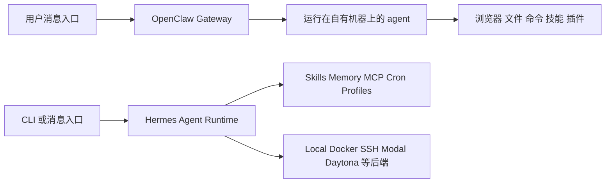

# OpenClaw vs Hermes Agent 详细对比

## 1. 核心结论

如果只用一句话概括两者的差别：

- **OpenClaw** 更像一个 **self-hosted personal assistant platform**，重点是“你从任何聊天入口发一句话，它就能在你的机器或服务器上持续帮你做事”。
- **Hermes Agent** 更像一个 **self-improving general-purpose agent framework**，重点是“同一个 agent 能在终端、消息平台和远端环境里长期运行，并把经验沉淀成技能，越用越像你的专属系统”。

二者都不是普通 chatbot，都有：

- 工具调用
- 文件与命令执行
- 消息入口
- 持久记忆
- 开源与自托管倾向

但它们的**设计中心**不同：

- OpenClaw 的设计中心是：**个人助理体验 + chat-native + always-on**
- Hermes 的设计中心是：**agent runtime + learning loop + provider abstraction + ops flexibility**

所以实际选型时，关键不在“能不能做事”，而在：

- 你想要的是不是一个“消息入口优先”的 personal AI
- 你是否需要一个会长期积累技能的 agent 系统
- 你更看重“产品感”还是“框架感”

## 2. 二者分别是什么

### 2.1 OpenClaw 是什么

OpenClaw 官方对自己的表达非常直接：

```text
The AI that actually does things.
```

结合官网与仓库文档，可以把它理解成：

- 一个**自托管 AI 助手平台**
- 一个把 **WhatsApp、Telegram、Discord、Slack、Signal、iMessage** 等入口接到 agent 的系统
- 一个可浏览网页、填表、读写文件、执行 shell、扩展 skills/plugins 的 always-on agent

它的默认想象不是：“我打开 IDE 和它一起写代码。”

而是：

```text
我在手机里给我的 AI 助理发一条消息，它在自己的机器上替我继续工作。
```

官网里最关键的几个信号是：

- Runs on your machine
- Any chat app
- Persistent memory
- Browser control
- Full system access
- Skills & plugins

这意味着 OpenClaw 最像：

```text
个人 AI 助理 + 消息网关 + 系统自动化中枢
```

### 2.2 Hermes Agent 是什么

Hermes Agent 官方把自己定义为：

- **The self-improving AI agent built by Nous Research**
- 唯一内置 learning loop 的 agent
- 能从经验中创建技能、改进技能、记住用户与环境、跨会话持续成长

同时 Hermes 也不是只做 terminal agent。它同样覆盖：

- CLI
- Messaging gateway
- IDE
- 远端终端后端
- MCP
- Cron
- Profiles

它的核心不是“聊天入口很爽”，而是：

```text
同一个 agent runtime 可以在多种环境下运行，并把经验转化成结构化技能和长期记忆。
```

所以 Hermes 更像：

```text
长期演化的通用 agent 框架
```

## 3. 设计中心的本质差异

这是最重要的一节。

### 3.1 OpenClaw 的中心：助手体验

OpenClaw 的设计重心很明显偏向：

- 个人/团队助理
- chat-native interaction
- 24/7 在线执行
- 一台机器上的全面控制
- 通过技能、插件、集成，把越来越多数字生活入口统一起来

你可以把它看成：

```text
不是“AI 在一个工具里帮我”，而是“AI 逐渐变成我的工具层本身”。
```

### 3.2 Hermes 的中心：agent 系统能力

Hermes 更强调这些问题：

- agent 如何记住用户和环境
- agent 如何把经验转化成可复用技能
- agent 如何在不同 provider 和不同后端之间切换
- agent 如何在 CLI / gateway / cron / profiles / MCP 之间形成一个完整系统

这就导致 Hermes 的“框架感”更强。

你可以把它看成：

```text
不是“先做一个助理”，而是“先做一个会不断自增强的 agent runtime”。
```

## 4. 架构与入口对比



### 4.1 OpenClaw 的入口模型

OpenClaw 以 **chat app** 为第一入口。

用户最自然的工作方式是：

- 从 Telegram / WhatsApp / Discord 发消息
- 让 assistant 在背景里继续跑
- 由 agent 自己调用系统能力和外部集成

它当然也可以接 web、voice、GitHub 等，但底层感受仍然是：

```text
我在和一个有自己电脑的助理沟通。
```

### 4.2 Hermes 的入口模型

Hermes 则同时强调：

- `hermes` CLI 是一等入口
- gateway 是另一等入口
- 二者共享大量 slash commands 和系统能力

这说明 Hermes 不是“消息优先再兼容 CLI”，而是：

```text
CLI 和消息平台是同一个 agent runtime 的两个操作面。
```

这对开发者很重要，因为它意味着：

- 你可以先在终端调试
- 再把同一个 agent 挂到 Telegram/Discord/WhatsApp
- 然后让它在后台或远端运行

OpenClaw 更容易给你“上手即用”的助理感；Hermes 更容易给你“系统是我自己搭起来的”的感觉。

## 5. 运行位置与部署模型

### 5.1 OpenClaw

OpenClaw 官网强调：

- runs on your machine
- macOS / Linux / Windows
- full access or sandboxed — your choice
- private by default

这说明 OpenClaw 的默认想象是：

- agent 跑在你控制的机器上
- 这台机器可以是本地电脑，也可以是自托管服务器
- 它作为一个 always-on control plane 持续存在

换句话说，OpenClaw 更像：

```text
一个长期驻留的个人助理服务
```

### 5.2 Hermes Agent

Hermes 的运行模型更灵活。

官方明确给出多种 terminal backend：

- local
- Docker
- SSH
- Daytona
- Singularity
- Modal

并强调它可以：

- 运行在笔记本之外
- 跑在 VPS、GPU cluster、serverless persistence 上
- 闲置时休眠，几乎零成本

因此 Hermes 的部署哲学更偏：

```text
agent runtime 与执行环境解耦
```

这是它与 OpenClaw 的一个关键差异。

OpenClaw 更偏“这就是我的 agent 机器”。

Hermes 更偏“agent 可以调度并切换不同执行环境”。

## 6. 记忆系统与技能系统

### 6.1 OpenClaw：偏产品化的持久上下文

OpenClaw 官网把记忆和技能放得很前：

- Persistent Memory
- Skills & Plugins
- It can even write its own skills

这代表它也有“自增强”倾向，但它更像是站在 personal assistant 语境下去做：

- 记住你的偏好
- 记住跨渠道上下文
- 把重复动作变成 skill
- 在长期对话中形成越来越个性化的助理

它的记忆更像：

```text
面向“你这个人”和“你正在经营的数字生活”的上下文系统
```

### 6.2 Hermes：偏 agent runtime 的闭环学习

Hermes 在这方面更系统化，也更“框架化”。

官方强调：

- built-in learning loop
- autonomous skill creation
- skill self-improvement during use
- FTS5 cross-session recall
- pluggable memory backends
- user profile modeling

这意味着 Hermes 的核心创新点，不只是“有记忆”，而是：

- agent 自己识别哪些经验值得固化
- 把这些经验写成 skills
- 在后续执行时再次载入并改进
- 同时允许你替换 memory backend

所以 Hermes 的技能系统不是简单的“插件库”，而更像：

```text
agent 的程序性记忆系统
```

### 6.3 二者差异总结

- **OpenClaw**：更像“一个越来越懂你的助理”。
- **Hermes**：更像“一个越来越会做事的 agent runtime”。

两者都有长期记忆，但 OpenClaw 更偏 assistant product，Hermes 更偏 learning system。

## 7. Provider 与模型策略

### 7.1 OpenClaw

OpenClaw 走的是：

- Anthropic
- OpenAI
- local models
- 兼容多种集成

它当然不是单一模型绑定，但官方对外表达里，provider abstraction 不是它最强烈的卖点。

它更强调的是：

- 你可以用不同模型驱动这个助理
- 但重点在于助理整体体验和渠道接入

### 7.2 Hermes

Hermes 明显把 provider abstraction 做成了核心能力。

文档明确写到：

- 20+ providers supported
- provider-agnostic
- swap provider mid-workflow
- credential pools rotate across multiple API keys

这说明 Hermes 的设计目标之一，就是：

```text
agent 系统不应与单一模型厂商耦合。
```

如果你的场景里需要：

- Anthropic / OpenAI / OpenRouter / local / Copilot / Codex 混用
- 按任务切 provider
- 成本、速度、能力分层路由

那么 Hermes 的架构更对路。

## 8. 安全、审批与边界控制

### 8.1 OpenClaw

OpenClaw 官方给出的边界是：

- Full system access
- sandboxed — your choice
- private by default

并且最近产品更新还强调：

- exec approvals
- low-risk review flow
- 人在回路中
- 技能安全扫描与 Skill Card

这说明 OpenClaw 正在把“强系统控制能力”与“更稳的 guardrail”结合起来。

它的安全重点更像：

- 助手既然要接管真实系统，就必须有 host exec guardrails
- 技能生态既然开放，就必须做 skill provenance 和 hidden instruction 风险控制

### 8.2 Hermes

Hermes 官方文档对安全模块的表述更偏标准化工程能力：

- command approval
- authorization
- container isolation
- DM pairing
- website blocklist
- security section in config

这说明 Hermes 的安全设计更像一套 framework-level control plane：

- 通过配置和后端隔离来控制风险
- 通过 provider、toolset、container、gateway pairing 等层面划边界

### 8.3 谁更安全

不能简单说谁绝对更安全。

更准确的说法是：

- **OpenClaw** 的风险面更接近“个人助理接管真实世界工作流”的风险
- **Hermes** 的风险面更接近“一个高可扩展 agent runtime 的工程控制问题”

如果你担心：

- 邮件、日历、浏览器、消息入口、个人数据被长期整合

你需要更严格地审视 OpenClaw 的 assistant power。

如果你担心：

- 多 provider、多后端、多工具集、多 profile 的复杂 agent 系统失控

你需要更严格地设计 Hermes 的配置与隔离。

## 9. 对开发者来说，哪个更顺手

### 9.1 OpenClaw

如果你是这样的人：

- 希望从手机就能调度 agent
- 希望 agent 在聊天里自动化一切
- 希望 coding 只是助理能力的一部分，而不是全部

那 OpenClaw 的产品吸引力会很强。

你会得到一种体验：

```text
我不是在用一个 AI 开发工具，我是在养一个数字助理。
```

### 9.2 Hermes

如果你是这样的人：

- 希望 agent 同时是 CLI 工具、消息 agent、自动化引擎
- 希望自己精细控制 provider、backends、memory、skills、profiles
- 希望 agent 长期演化并形成自己的工作系统

那 Hermes 会更合适。

你会得到一种体验：

```text
我不是只在用一个产品，我是在经营一个 agent runtime。
```

## 10. 场景选型

### 10.1 适合 OpenClaw 的场景

- 个人 AI 助理
- 家庭 / 团队消息驱动的长期自动化
- Gmail、Calendar、Browser、Docs、日常沟通等统一入口
- 手机优先、聊天优先、always-on 优先

### 10.2 适合 Hermes 的场景

- 想搭长期可演化的 agent 系统
- 终端工作流、研究工作流、工程自动化并重
- 需要强 provider 抽象层
- 需要 profiles、cron、MCP、multi-backend、memory backend 插拔

### 10.3 都能做，但重心不同的场景

- coding
- research
- ops automation
- background tasks
- multi-platform messaging

区别在于：

- OpenClaw 是从“assistant product”走到这些场景
- Hermes 是从“agent system”走到这些场景

## 11. 最终判断框架

如果你问：

### 我想要一个真正像个人助理的系统，最好可以从聊天软件里一直叫它做事

选 **OpenClaw**。

### 我想要一个会长期积累技能、可换 provider、可换后端、可配 profiles 的 agent 框架

选 **Hermes Agent**。

### 我想先要一个“能立即感受到未来”的产品

大概率先选 **OpenClaw**。

### 我想先搭一个“可长期维护、可工程化扩展”的 agent 系统

大概率先选 **Hermes Agent**。

## 12. 最短版总结

一句话：

**OpenClaw 更像 personal AI assistant platform；Hermes Agent 更像 self-improving agent operating system。**

再展开半句：

- OpenClaw 强在“入口自然、助手感强、消息驱动、系统控制强”。
- Hermes 强在“学习闭环、provider 抽象、后端灵活、agent 系统能力完整”。

## 13. 参考链接

- OpenClaw 官网: https://openclaw.ai/
- OpenClaw GitHub: https://github.com/openclaw/openclaw
- Hermes Agent GitHub: https://github.com/NousResearch/hermes-agent
- Hermes Agent 文档: https://hermes-agent.nousresearch.com/docs/

## Update History

- 2026-06-11: 初次创建，详细比较 OpenClaw 与 Hermes Agent 的定位、架构、记忆、安全、provider 策略和适用场景。