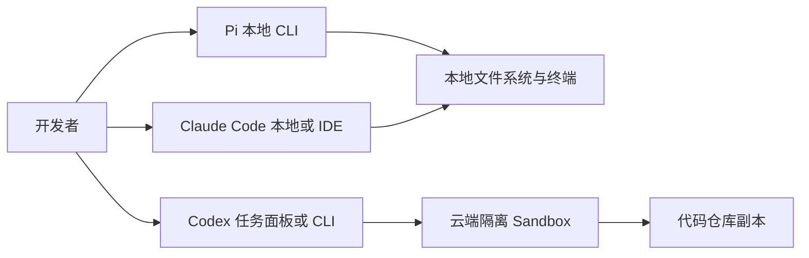

# Pi、Claude、Codex 区别与选型指南

## 1. 核心结论

如果把它们都放在“AI 编程 agent”这个篮子里看，可以先用一句话区分：

- **Pi**：一个**开源、多 provider、偏本地控制**的 coding agent harness，灵活，但默认安全边界更依赖你自己配置。
- **Claude Code**：Anthropic 的**全功能 agentic coding 工具**，强调在终端、IDE、桌面和 Web 之间统一工作流，工具链与产品化程度较强。
- **Codex**：OpenAI 的**云端软件工程 agent** 与配套 CLI 体系；核心优势是把任务放进隔离的云 sandbox 中异步执行，适合并行委派和可审计交付。

最容易混淆的点在于：

- `Claude` 既可以指 Claude 模型，也可以指 **Claude Code** 这个 coding agent 产品。
- `Codex` 既可能指 OpenAI 的**云端 agent 产品**，也可能指 **Codex CLI** 这个本地命令行工具。
- `Pi` 在这里指的是 [https://github.com/earendil-works/pi](https://github.com/earendil-works/pi) 这个开源 coding agent 项目，**不是** Inflection 的聊天产品 Pi。

## 2. 先看它们分别是什么

### 2.1 Pi

Pi 的官方描述是一个 **self extensible coding agent**，其 mono repo 里包括：

- 统一多模型访问层
- agent runtime
- coding agent CLI
- TUI 组件

它强调：

- 支持多 provider，不绑定单一家模型厂商
- 以本地 CLI 方式工作
- 可以自己扩展、自己容器化、自己决定隔离方式

但 Pi 官方也明确说明：

- **默认没有内建权限系统**来限制文件系统、进程、网络或凭据访问
- 如果你要更强边界，需要自己做 sandbox/containerization

这说明 Pi 更像“可定制 agent harness”，而不是“默认就替你把安全、审批、产品体验都包好”的托管产品。

### 2.2 Claude Code

Claude Code 官方定位是 **agentic coding tool**。

它的特点是：

- 能读取整个代码库
- 能编辑文件、运行命令、接入开发工具
- 可运行在 terminal、IDE、desktop、browser 等多个 surface
- 支持 instructions、skills、hooks、MCP、custom agents 等能力

它的产品思路更像：

```text
一个统一的、可跨终端与 IDE 的 Anthropic 编程代理工作台
```

如果你更关注：

- 日常结对编程
- 在本地项目里连续探索、修改、验证
- 用统一记忆和指令体系贯穿多个入口

那么 Claude Code 往往更顺手。

### 2.3 Codex

Codex 现在的官方定位不是单纯“代码补全模型”，而是 **cloud-based software engineering agent**。

它的典型工作方式是：

- 你把任务分配给 Codex
- 每个任务在**独立云端环境**中执行
- 这个环境预装你的代码仓库
- agent 可以读写文件、运行测试、lint、typecheck
- 完成后给出变更、日志、测试证据，供你审查和合并

Codex 强调的是：

- **异步委派**
- **并行任务处理**
- **隔离执行**
- **可验证证据链**

因此，Codex 更像“把代码任务外包给远程 agent 同事”，而不只是“在本地终端里陪你写代码”。

## 3. 三者最关键的差异

| 维度 | Pi | Claude Code | Codex |
|---|---|---|---|
| 产品形态 | 开源 coding agent harness / CLI | Anthropic 的 agentic coding 产品 | OpenAI 的云端软件工程 agent，另有 Codex CLI |
| 默认运行位置 | 本地 | 本地为主，跨 terminal/IDE/desktop/web | **云端 sandbox** 为主；CLI 是本地配套 |
| 模型耦合 | **多 provider** | 以 Claude 生态为中心，也支持部分第三方 provider | 以 OpenAI 生态为中心 |
| 执行风格 | 本地交互式、可自定义 | 本地交互式 + 多入口统一体验 | 远程异步委派 + 并行执行 |
| 安全边界 | 默认边界较弱，要自己做 sandbox | 产品内能力更完整，但仍需按环境配置 | 默认隔离较强，任务在云端独立环境里跑 |
| 证据与审计 | 取决于你的配置和工作流 | 有较强工具链与流程约束 | 明确强调日志、测试结果、可审查输出 |
| 最适合 | 想要开源、可扩展、多模型、自控栈 | 想要成熟日常 coding agent 体验 | 想把明确任务批量委派给远程 agent |

## 4. 用架构视角看差别



这个图反映的是三者最本质的区别：

- **Pi**：强调本地 agent harness，控制权在你自己。
- **Claude Code**：强调本地工作流与多入口统一体验。
- **Codex**：强调把任务送去远端隔离环境执行。

## 5. 你该怎么选

### 5.1 选 Pi 的情况

更适合你如果你要的是：

- 开源可控
- 多 provider 灵活切换
- 想自己掌控 agent runtime、容器化和安全边界
- 能接受自己做更多工程化配置

一句话：**更像工程师自己的 agent 基建。**

### 5.2 选 Claude Code 的情况

更适合你如果你要的是：

- 日常高频 coding assistant
- 本地代码库连续上下文工作
- 终端、IDE、Web 之间共享能力
- instructions、memory、MCP、subagents 这类产品化能力

一句话：**更像成熟的一体化编程代理工作台。**

### 5.3 选 Codex 的情况

更适合你如果你要的是：

- 把任务拆成多个工单并行跑
- 让 agent 在隔离环境中独立执行
- 更强的审计、日志和结果回放
- 明确边界的异步交付体验

一句话：**更像远程 AI 工程师池。**

## 6. 一个常见误区

很多人把这三者当成“同一层级的模型对比”，这其实不准确。

更准确的理解是：

- **Pi**：偏 agent harness / runtime / CLI 产品
- **Claude Code**：偏完整 coding agent 平台
- **Codex**：偏云端 agent 执行系统，同时有 CLI 配套

所以它们的区别，不只是“哪个模型更强”，更重要的是：

- 任务是在本地跑还是云端跑
- 你要自己管多少安全和环境问题
- 你更需要实时结对，还是异步委派

## 7. 参考链接

- Claudian README: https://raw.githubusercontent.com/YishenTu/claudian/main/README.md
- Claude Code Overview: https://code.claude.com/docs/en/overview
- OpenAI Introducing Codex: https://openai.com/index/introducing-codex/
- Pi README: https://raw.githubusercontent.com/earendil-works/pi/main/README.md

## Update History

- 2026-06-11: 初次创建，聚焦 Pi、Claude Code、Codex 的定位、运行方式与选型差异。