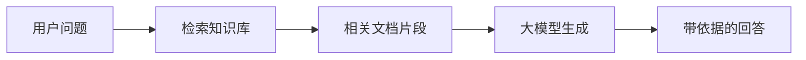
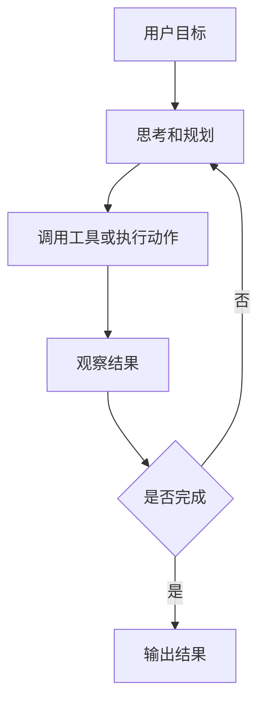
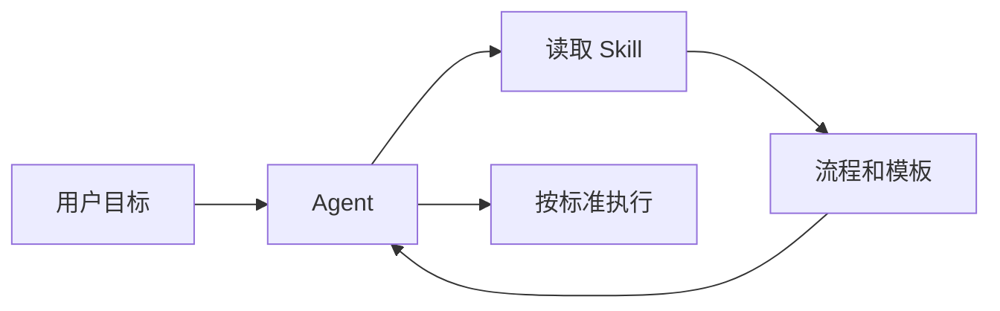
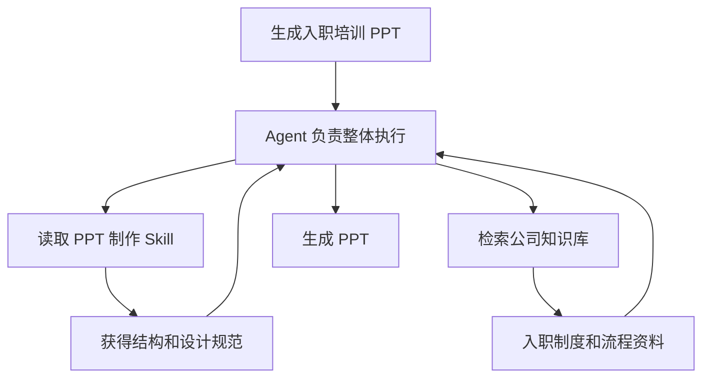
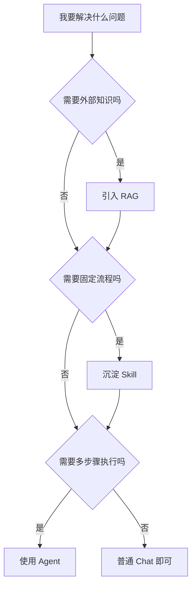

# RAG、Skill、Agent 的区别与联系

## 1. 核心结论

**RAG、Skill、Agent 不是同一层级的概念。**

一句话区分：

- **RAG**：解决“模型如何获得外部知识”的问题。
- **Skill**：解决“Agent 如何按固定方法做某类事”的问题。
- **Agent**：解决“如何围绕目标自主规划、调用工具并完成任务”的问题。

更直观地说：

```text
Agent = 执行者
Skill = 执行者可调用的专业方法包
RAG = 执行者获取外部知识的一种机制
```

它们可以独立存在，也可以组合使用。一个成熟的 AI 应用里，Agent 往往会同时使用 Skill 和 RAG。

## 2. 三者分别是什么

### 2.1 RAG 是什么

RAG 是 **Retrieval-Augmented Generation**，即“检索增强生成”。

它的核心思想是：不要只依赖模型参数中记住的知识，而是在回答前先从外部知识库中检索相关资料，再把资料作为上下文交给模型生成回答。

典型流程：



RAG 主要解决：

- 模型知识过时。
- 企业内部资料不在模型训练数据里。
- 需要可追溯引用。
- 需要降低幻觉。
- 不想为了每次知识更新都微调模型。

RAG 的关键组件通常包括：

- 文档解析与切分。
- Embedding 向量化。
- 向量数据库或搜索引擎。
- 关键词检索、向量检索或混合检索。
- Rerank 重排序。
- Context 拼接。
- 基于上下文的生成与引用。

### 2.2 Skill 是什么

Skill 是给 Agent 使用的 **可复用能力包、流程手册或专业 SOP**。

在 Cursor 或类似 Agent 系统中，一个 Skill 通常包含：

- 什么时候使用这个 Skill。
- 执行某类任务时的步骤。
- 必须遵守的规则。
- 可复用模板。
- 脚本、示例、参考资料。

Skill 本身通常不主动执行任务。它更像是一本“专业操作手册”，由 Agent 在需要时读取并执行。

例如：

- `elite-powerpoint-designer`：告诉 Agent 如何生成高质量 PPT。
- `create-skill`：告诉 Agent 如何创建新的 Skill。
- `sdk`：告诉 Agent 如何使用 Cursor SDK。
- `babysit`：告诉 Agent 如何持续维护 PR 到可合并状态。

Skill 主要解决：

- 重复任务如何标准化。
- 专业流程如何固化。
- 长规则如何按需加载，避免每次都塞进上下文。
- 团队经验如何沉淀为可复用能力。

### 2.3 Agent 是什么

Agent 是围绕目标自主完成任务的 **执行系统**。

它通常由三部分构成：

- **Model**：负责理解、推理、决策。
- **Tools**：负责读文件、写文件、搜索、运行命令、访问 API。
- **Instructions / Memory / Context**：负责约束行为、保存任务信息、提供背景。

Agent 的典型工作模式是 ReAct 循环：



Agent 主要解决：

- 复杂任务拆解。
- 多步骤执行。
- 工具调用。
- 结果验证。
- 错误恢复。
- 根据反馈调整策略。

例如用户说：“帮我修复这个测试失败，并提交一个 PR。”  
这不是单次问答，而是一个 Agent 任务：它需要读代码、理解错误、修改文件、运行测试、处理失败、总结结果。

## 3. 最核心差异

| 维度 | RAG | Skill | Agent |
|---|---|---|---|
| 本质 | 知识检索增强机制 | 可复用能力包或流程手册 | 自主执行任务的系统 |
| 解决问题 | 去哪里找知识 | 遇到某类任务该怎么做 | 如何完成一个目标 |
| 是否主动执行 | 否 | 否 | 是 |
| 是否需要工具 | 通常需要检索工具 | 本身不执行，由 Agent 读取 | 会主动调用工具 |
| 典型输入 | 用户问题、查询语句 | 任务类型、触发条件 | 用户目标 |
| 典型输出 | 相关上下文、引用资料 | SOP、模板、脚本、约束 | 完成后的结果 |
| 关注点 | 知识准确性、召回率、引用 | 流程稳定性、复用性 | 任务完成度、执行闭环 |
| 类比 | 图书馆检索系统 | 专家手册 | 会干活的项目负责人 |

## 4. 三者之间的联系

### 4.1 Agent 可以使用 RAG

Agent 在执行任务时，如果发现需要外部知识，可以调用 RAG 系统：


例子：

用户问：“根据公司内部制度，帮我写一份报销流程说明。”

Agent 可以：

1. 理解用户要写文档。
2. 调用 RAG 检索公司制度库。
3. 读取相关制度片段。
4. 生成说明文档。
5. 标注依据来源。

这里 RAG 是 Agent 的知识获取方式之一。

### 4.2 Agent 可以使用 Skill

Agent 在执行某类任务时，可以读取 Skill 里的方法论和步骤。



例子：

用户说：“用 Tech Keynote 风格帮我生成一份 HTML PPT。”

Agent 会读取 `elite-powerpoint-designer` Skill，了解：

- 使用什么视觉风格。
- 标题和正文用什么层级。
- 如何控制信息密度。
- 如何设计动画和过渡。
- 如何做质量检查。

这里 Skill 是 Agent 的专业工作方法。

### 4.3 Skill 可以规定 Agent 如何使用 RAG

Skill 不只是模板，也可以包含“遇到某类任务时如何检索知识库”的规则。

例如一个“法律合同审查 Skill”可以规定：

1. 先用 RAG 检索公司合同模板库。
2. 再检索过往风险案例。
3. 对照审查清单。
4. 输出风险等级和修改建议。

此时关系是：

```text
Agent 执行任务
Skill 规定流程
RAG 提供知识
```

### 4.4 RAG 也可以作为普通 Chat 的能力，而不一定需要 Agent

不是所有 RAG 应用都需要 Agent。

一个简单的企业知识库问答系统可以只是：

```text
用户问题 -> 检索文档 -> LLM 生成回答
```

它没有复杂规划，也没有多轮工具调用，所以不一定是 Agent。

## 5. 用一个例子串起来

假设用户说：

> 帮我根据公司知识库，生成一份新员工入职培训 PPT，并按照我们公司的培训模板来做。

这里三者可以这样分工：



拆解：

- **Agent**：理解目标、拆分任务、检索资料、生成内容、写文件、检查结果。
- **Skill**：告诉 Agent 如何做一份符合标准的 PPT。
- **RAG**：从公司知识库找出入职制度、组织架构、流程说明等资料。

## 6. 什么时候用哪个

### 6.1 什么时候需要 RAG

适合使用 RAG：

- 问题依赖外部文档、公司知识库、产品手册、历史记录。
- 知识经常变化，不适合写死在 Prompt 或微调进模型。
- 需要回答可引用、可追溯。
- 需要降低模型凭空编造。
- 数据量较大，不能全部塞进上下文。

不一定需要 RAG：

- 问题只依赖模型通用知识。
- 资料很短，可以直接放进 Prompt。
- 任务重点是操作流程，而不是知识检索。

### 6.2 什么时候需要 Skill

适合使用 Skill：

- 某类任务会反复出现。
- 需要固定流程、检查清单或输出模板。
- 有专业标准，不能每次临场发挥。
- 团队希望共享同一套 Agent 行为。
- 规则太长，不适合放在全局 Rules 里。

不一定需要 Skill：

- 只是一次性任务。
- 流程还在探索，没有稳定下来。
- 只需要简单聊天回答。

### 6.3 什么时候需要 Agent

适合使用 Agent：

- 任务需要多步骤执行。
- 需要读写文件、运行命令、调用 API。
- 需要根据中间结果调整策略。
- 需要验证结果是否完成。
- 任务目标比单次问答复杂。

不一定需要 Agent：

- 只是问一个概念。
- 只需要一次模型回答。
- 没有外部动作，也不需要工具调用。

## 7. 常见误区

### 7.1 误区一：有 RAG 就是 Agent

不一定。

RAG 只是“检索资料再回答”。如果系统没有自主规划、工具链编排、错误恢复和多步骤执行，它更像一个增强问答系统，而不是完整 Agent。

### 7.2 误区二：Skill 是一个小 Agent

不是。

Skill 本身不会主动思考，也不会自己调用工具。它是 Agent 的能力说明书。真正执行的是 Agent。

### 7.3 误区三：Agent 一定需要 RAG

不一定。

Agent 可以只依赖当前代码库、用户给定上下文、工具返回结果和模型自身能力。只有当任务需要外部知识库时，RAG 才成为必要组件。

### 7.4 误区四：RAG 可以替代 Skill

不能。

RAG 提供“知识内容”，Skill 提供“做事方法”。  
例如 RAG 可以告诉你公司有哪些发布规定，但 Skill 会告诉 Agent 每次发布应该按什么步骤执行、检查什么、输出什么格式。

## 8. 一个最简判断框架

遇到一个 AI 系统设计问题，可以按下面判断：



简单记忆：

```text
缺知识 -> RAG
缺流程 -> Skill
缺执行闭环 -> Agent
```

## 9. 和当前知识库中相关概念的连接

- [[Cursor-Agent-vs-Skill-使用决策指南]]：更详细解释 Cursor 语境中 Agent、Skill、Subagent 的区别。
- [[LLM-Skills-Technical-Guide]]：解释 Skill、Tool Calling、MCP、Function Calling 的关系。
- [[Agent运行机制详解]]：解释 Agent 的 ReAct 循环、工具调用和成本结构。
- [[RAG-Common-Issues-and-Optimization]]：解释 RAG 落地中的检索、生成、评估和优化问题。

## 10. 总结

RAG、Skill、Agent 的关系可以压缩成一句话：

> Agent 是会执行任务的主体；Skill 是让 Agent 按专业流程做事的手册；RAG 是让 Agent 或普通问答系统从外部知识库获取事实依据的机制。

在复杂系统中，它们不是互斥关系，而是组合关系：

```text
用户目标
  -> Agent 负责规划和执行
  -> Skill 提供流程和标准
  -> RAG 提供知识和证据
  -> Tools 执行外部动作
  -> 最终产出结果
```

## Update History

- 2026-05-29: 初次创建，系统梳理 RAG、Skill、Agent 的区别、联系、组合方式和使用判断框架。
