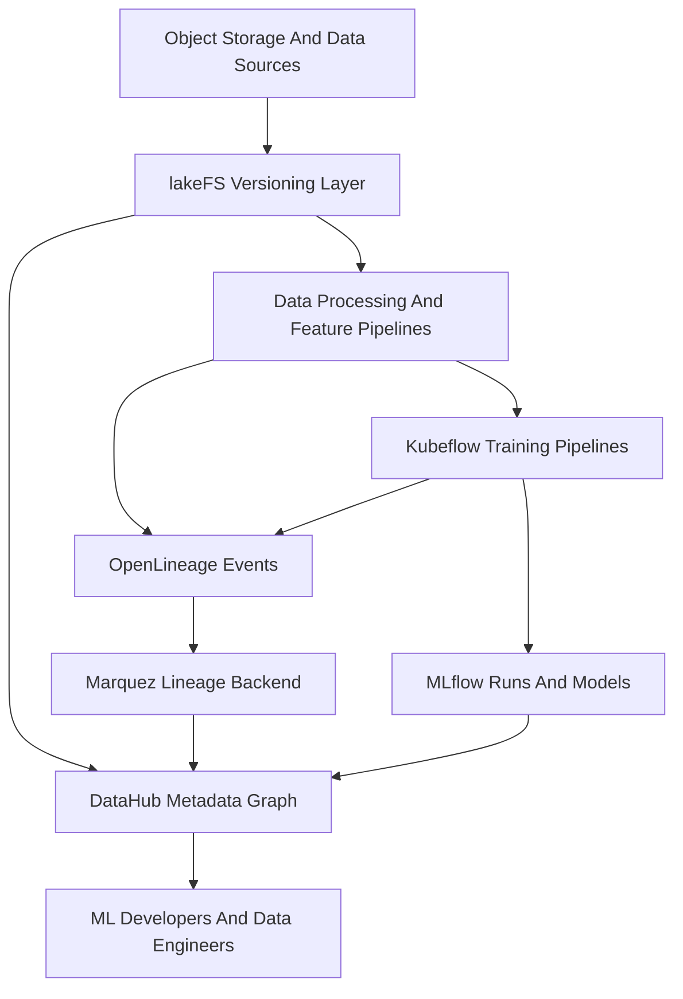

# 内部 MLOps 数据版本控制与数据管理平台 PRD

> 本文是面向内部平台团队、数据团队和模型开发团队的产品需求文档。  
> 目标不是做一个“什么都管”的大而全数据平台，而是先解决 MLOps 中最痛的 4 类问题：  
> **训练数据不可复现、数据资产不可发现、数据变更影响不可见、数据治理责任不清晰。**

> 本 PRD 基于 [[MLOps-Data-Versioning-与-Data-Management-开源方案对比]] 与 [[ML-Lifecycle-Management-官方文档总结]] 的结论整理，默认适用场景是：  
> 企业内部已有对象存储、MLflow、Kubeflow 或类似训练执行环境，希望建立一个可持续演进的数据控制平面和元数据平面。

## 0. 文档目标

本文用于统一以下内容：

- 为什么要做这件事。
- 这个平台到底解决哪些问题，不解决哪些问题。
- 第一阶段要交付什么，验收标准是什么。
- 产品能力、技术路线、角色边界、实施顺序如何定义。
- 平台团队、数据团队、模型团队、治理团队如何协作。

本文不是：

- 纯技术设计文档。
- 纯架构选型报告。
- 仅面向某一个算法项目的临时方案。

## 1. Background And Motivation

### 1.1 当前问题

在多数内部 MLOps 实践里，数据相关问题通常不是“没有数据”，而是“数据可复现性、可发现性和可治理性不足”。常见表现包括：

- 同一个训练任务重新运行后，无法确认读取的是否还是同一批数据。
- 模型效果波动时，团队无法快速定位是代码变了、参数变了，还是训练数据变了。
- 数据集、特征表、标签表、衍生表散落在对象存储、数仓、Notebook 和脚本中，缺少统一目录。
- 新团队成员不知道有哪些数据可用，也不知道 owner 是谁、可信度如何、更新频率如何。
- 上游字段、表结构或数据处理逻辑变更后，下游训练、特征生成或报表影响面不可见。
- 数据分级、敏感标签、生命周期、审计记录和访问边界不清楚。

这些问题最终会表现为：

- 模型训练可复现性差。
- 调试与回归分析成本高。
- 跨团队协作慢。
- 线上模型和离线数据认知不一致。
- 数据治理依赖人肉记忆和口头同步。

### 1.2 为什么现在做

当前是搭建内部数据版本控制与数据管理平台的合适时点，原因通常包括：

- MLflow、Kubeflow 或内部训练平台已经存在，实验与训练层逐步规范化。
- 数据问题已经成为训练效率、交付质量和治理审计的主要瓶颈。
- 团队协作从单项目走向多团队、多环境、多数据资产共享。
- 后续若要支持更严格的模型治理、数据合同、AI Agent、数据质量或 Lakehouse 演进，需要先补齐 metadata 和 versioning 基础层。

### 1.3 产品机会

如果平台能把“数据版本控制”和“数据管理”两件事拆开并组合好，就能同时提升：

- **研发效率**：更快定位训练问题和数据问题。
- **交付质量**：减少因数据漂移、误读、误用导致的回归。
- **平台可治理性**：清楚知道哪些数据被谁使用、由谁负责、改动影响到哪里。
- **组织可扩展性**：让新的项目和团队基于统一平台而不是复制各自的脚本与约定。

## 2. Product Vision

### 2.1 一句话愿景

建立一个面向内部 MLOps 的 **数据控制平面 + 元数据平面**，让模型开发团队能够：

- 知道自己在用什么数据。
- 复现自己曾经用过的数据。
- 看到数据从哪里来、流向哪里。
- 在数据变更时知道会影响什么。
- 在需要治理时知道责任归属和合规状态。

### 2.2 北极星定义

> 对任意一个已注册到平台的训练任务，团队应能在可接受时间内回答 5 个问题：
>
> 1. 用的是哪一版数据。  
> 2. 数据 owner 是谁。  
> 3. 数据从哪里来。  
> 4. 这次变更会影响哪些下游。  
> 5. 数据是否满足当前治理和质量要求。

### 2.3 产品定位

本平台不是要替代：

- MLflow 的 experiment tracking 和 model registry。
- Kubeflow 的 pipeline 执行和训练编排。
- 数仓、对象存储、数据湖、Iceberg、Hive、Spark 等底层数据系统。

本平台要做的是把这些系统之上的“数据可控、可见、可追、可治理”能力补齐。

## 3. Product Principles

平台设计遵循以下原则：

1. **平台分层，不做大一统幻觉**。数据版本控制和元数据治理是两层问题，不强行混成一个模块。
2. **共享平台优先对象存储语义**。内部平台优先解决共享数据湖上的 branch、commit、publish、audit，而不是只解决 repo 级文件版本。
3. **本地项目工作流不被破坏**。允许项目级团队继续用 Git + DVC 等方式做局部管理，但平台核心不依赖单仓库结构。
4. **元数据先于自动化治理**。先把资产、owner、lineage、usage、quality context 建起来，再逐步做强治理与自动化门禁。
5. **MVP 优先解决 80% 高频痛点**。先解决 reproducibility、discoverability、impact analysis 和 basic governance，不追求一步到位做全功能 data mesh。

## 4. Target Users And Stakeholders

### 4.1 目标用户

| 角色 | 典型诉求 | 主要痛点 |
| --- | --- | --- |
| ML Developer | 快速找到训练数据，复现历史实验，知道上游变化影响 | 数据版本不清、训练结果不可复现、找不到可信数据 |
| Data Engineer | 管理训练数据生产链路，控制发布与回滚，暴露 lineage | 数据发布影响面不清、缺隔离环境、缺统一资产入口 |
| MLOps Engineer / Platform Engineer | 统一数据工作流、接入 MLflow/Kubeflow、减少平台碎片化 | 工具多、边界乱、责任不清、难推广 |
| Data Steward / Governance Owner | 给数据分类、标注 owner、定义基础治理规则 | 资产散乱、合规口径难落地、变更难审计 |
| Engineering Manager / Product Owner | 提升交付效率和质量，降低回归和排障成本 | 团队各搞各的、经验不可复用、治理不可度量 |

### 4.2 关键干系人

| 干系人 | 关注点 |
| --- | --- |
| 平台团队 | 产品边界、集成成本、运维成本、落地顺序 |
| 模型团队 | 上手成本、对现有训练工作流的侵入性、可复现性收益 |
| 数据团队 | 数据发布方式、lineage 接入方式、catalog 资产完整度 |
| 安全与治理团队 | 权限、分级分类、审计、合规扩展性 |
| 管理层 | ROI、效率提升、风险降低、推广路径 |

## 5. Goals And Non-Goals

### 5.1 产品目标

第一阶段目标：

1. 建立共享训练数据和特征数据的版本化能力。
2. 建立面向训练相关数据资产的统一发现入口。
3. 建立核心训练链路的基础 lineage 与影响分析能力。
4. 建立最小可用的治理元数据能力：owner、标签、敏感级别、生命周期状态。
5. 打通与 MLflow、Kubeflow 的基础集成，让训练与数据上下文可关联。

### 5.2 非目标

第一阶段不做：

- 通用企业级全域数据治理平台替换。
- 所有历史数据资产一次性补齐元数据。
- 完整数据质量平台替换。
- 对所有数据引擎和所有作业系统做 100% 自动接入。
- 对所有模型训练任务强制启用复杂治理审批流。

## 6. Product Scope

### 6.1 In Scope

第一阶段纳入范围：

- 训练集、验证集、测试集、特征快照、标签集等核心 ML 数据资产。
- 基于对象存储的数据版本控制能力。
- 数据资产注册、搜索、详情页、owner、标签、描述、更新时间等基础 catalog 能力。
- 基础 lineage：数据集到训练任务、数据处理作业到数据集、上游到下游数据依赖。
- 训练任务与数据版本的关联展示。
- 与 MLflow 的实验 / run / model 关联。
- 与 Kubeflow 的 pipeline / run / component 关联。
- 最小治理能力：敏感标签、owner、状态、基础审计。

### 6.2 Out Of Scope

第一阶段不纳入：

- 在线 serving 数据面治理。
- 实时特征存储替换。
- 组织全域 BI 资产统一接入。
- 完整 data contract 平台。
- 完整数据质量规则市场。
- 强审批型数据访问管控产品。

## 7. Product Strategy And Recommended Stack

### 7.1 核心技术策略

基于前期调研，平台核心建议采用以下组合：

- **lakeFS**：平台级数据版本控制与对象存储 branch/commit/publish。
- **DataHub**：组织级 metadata graph、发现、owner、lineage、治理入口。
- **OpenLineage + Marquez**：统一 lineage 事件模型与基础 lineage backend。
- **MLflow**：experiment tracking、model registry。
- **Kubeflow**：训练与 pipeline 执行。

### 7.2 为什么不是把 DVC 作为平台核心

DVC 很适合项目级工作流，但平台核心不建议以 DVC 为共享控制面，原因包括：

- DVC 更偏 repo 邻接型数据版本，不是共享对象存储上的多团队主控层。
- 平台需要 branch、publish、审计、隔离环境等对象存储语义，这更符合 lakeFS。
- 共享数据平台需要 catalog 和 metadata graph，这不是 DVC 的主战场。

因此建议：

- **平台层**：lakeFS + DataHub + OpenLineage/Marquez。
- **项目层可选补充**：允许个别团队继续用 DVC 处理本地实验和 repo 级数据版本。

### 7.3 为什么第一阶段不以 Nessie 为主

Nessie 更适合 Iceberg/lakehouse catalog 事务控制。如果当前内部平台尚未把 Iceberg 作为统一湖仓主语义，那么第一阶段直接采用 Nessie 会增加：

- 学习成本。
- 目录语义迁移成本。
- 非 Iceberg 数据链路适配成本。

因此建议：

- 当前阶段以 lakeFS 作为平台主版本控制层。
- 当组织明确进入 Iceberg/Lakehouse 路线时，再评估 Nessie 作为二阶段演进方向。

## 8. User Journeys

### 8.1 训练前找数据

作为 ML Developer，我希望：

- 能通过一个统一入口搜索“customer churn training dataset”。
- 看到数据 owner、描述、更新时间、敏感级别、推荐用途。
- 知道该数据是否被其他模型团队使用。

验收标准：

- 可按名称、标签、描述、owner、业务域检索资产。
- 资产详情页至少包含：owner、更新时间、版本信息、上游来源、下游使用、标签、描述。

### 8.2 训练时锁定数据版本

作为 ML Developer，我希望：

- 在发起训练时能够选择明确的数据版本或 branch。
- 训练完成后，MLflow 中能关联这次训练使用的数据版本。

验收标准：

- 每个被平台接管的训练 run 都能关联一个明确的数据 version id / commit id。
- 训练 run 页面能回跳到对应数据版本详情。

### 8.3 数据工程师隔离发布

作为 Data Engineer，我希望：

- 能从生产数据创建 branch，在隔离环境完成变更验证后再发布到 main。
- 发布时能留下审计记录和变更说明。

验收标准：

- 支持 branch 创建、对比、merge / publish。
- 发布记录包含提交人、时间、说明、关联资产。

### 8.4 数据变更影响分析

作为平台或数据 owner，我希望：

- 当上游表、字段或特征生成逻辑变更时，知道影响哪些训练任务、模型或下游数据集。

验收标准：

- 核心资产支持 upstream / downstream lineage 展示。
- 可以从数据集查看下游训练任务或模型引用。

### 8.5 基础治理

作为 Data Steward，我希望：

- 给数据集打 owner、敏感等级、业务域、生命周期状态。
- 让这些信息在搜索和详情页可见。

验收标准：

- 支持 metadata 编辑和审计。
- 标签与 owner 可被查询和过滤。

## 9. Functional Requirements

### 9.1 数据版本控制

必须支持：

- 基于对象存储的数据版本控制。
- branch、commit、publish / merge。
- 数据版本快照查看。
- 数据版本与训练 run 关联。
- 审计日志记录。

优先级：P0

### 9.2 数据资产目录

必须支持：

- 数据资产注册。
- 搜索、过滤、浏览。
- owner、描述、标签、业务域、更新时间、状态展示。
- 资产详情页。

优先级：P0

### 9.3 基础 lineage 与影响分析

必须支持：

- 数据集 upstream/downstream 关系。
- 数据处理作业到数据集的关系。
- 训练任务到数据版本的关系。
- 模型到训练 run 的关系映射。

优先级：P0

### 9.4 与 MLflow 集成

必须支持：

- 训练 run 记录数据 version id。
- 从数据详情页查看关联 experiment / run。
- 从 run 页面回链数据资产。

优先级：P0

### 9.5 与 Kubeflow 集成

必须支持：

- Pipeline 运行时记录输入数据版本。
- Component 或 run 与相关数据资产建立映射。
- 基础 lineage 接入。

优先级：P1

### 9.6 基础治理元数据

必须支持：

- owner。
- 标签与分类。
- 敏感级别。
- 生命周期状态，例如 draft、active、deprecated。
- metadata 修改审计。

优先级：P1

### 9.7 权限与访问边界

第一阶段支持最小能力：

- 谁可以看 metadata。
- 谁可以编辑 metadata。
- 谁可以创建和发布数据分支。

优先级：P1

### 9.8 执行级需求矩阵

为避免 PRD 停留在方向层，第一阶段按 P0、P1、P2 三层拆解为可执行需求。这里的 owner 是建议主责，不代表全部研发工作只由单一角色完成。

#### 9.8.1 P0：必须形成 MVP 闭环

| 需求项 | 建议主责 owner | 主要协作方 | 验收标准 |
| --- | --- | --- | --- |
| 对象存储数据 branch、commit、publish | Platform Engineering | Data Engineering | 平台支持创建 branch、查看差异、提交变更和发布到主分支，且每次发布都有审计记录 |
| 数据版本与训练 run 绑定 | MLOps Engineering | Platform Engineering | 平台接管的训练 run 均能记录明确的数据 version id 或 commit id，且能从 run 页面跳转到数据版本 |
| 训练相关数据资产注册与搜索 | Platform Product + Platform Engineering | Data Steward | 用户可按名称、标签、owner、业务域检索资产，且资产详情页可展示核心元数据 |
| 核心 lineage 展示 | Platform Engineering | Data Engineering, MLOps Engineering | 核心试点资产能展示 upstream 和 downstream 关系，且至少覆盖数据集、处理任务和训练任务三类节点 |
| MLflow 基础打通 | MLOps Engineering | Platform Engineering | MLflow run 页面可查看关联数据版本，数据资产页可查看关联 experiment 或 run |

#### 9.8.2 P1：增强平台可治理性和可推广性

| 需求项 | 建议主责 owner | 主要协作方 | 验收标准 |
| --- | --- | --- | --- |
| Kubeflow pipeline 数据上下文接入 | MLOps Engineering | Platform Engineering | Kubeflow pipeline run 能记录输入数据版本，并能在平台查看基础关联关系 |
| 基础治理元数据 | Data Steward | Platform Product, Platform Engineering | 核心资产具备 owner、标签、敏感级别、生命周期状态，并支持查询和过滤 |
| metadata 修改审计 | Platform Engineering | Security / Governance | metadata 编辑、发布与关键字段变更均有审计记录 |
| 最小权限边界 | Platform Engineering | Security / Governance | 至少区分 metadata 查看、metadata 编辑、数据分支发布三类权限 |
| 资产采纳与接入运营机制 | Platform Product | Data Steward, Engineering Manager | 试点团队知道如何注册资产、更新 owner 和申请接入，且有明确的接入流程说明 |

#### 9.8.3 P2：二阶段能力，暂不阻塞首发

| 需求项 | 建议主责 owner | 主要协作方 | 验收标准 |
| --- | --- | --- | --- |
| 数据变更通知与影响提醒 | Platform Product + Platform Engineering | Data Steward | 上游关键资产变更后，能通知相关 owner 或下游使用方 |
| 数据质量信号接入 | Data Engineering | Platform Engineering, Data Steward | 资产详情页可展示最近的数据质量状态、基础校验结果或异常标记 |
| 治理策略模板与审批流 | Security / Governance | Platform Product, Platform Engineering | 对部分敏感资产支持模板化治理策略与可追踪审批记录 |
| Iceberg / Nessie 路线评估与试点 | Platform Architecture | Data Engineering | 在湖仓路线明确后完成试点评估，输出迁移条件、收益与代价 |

## 10. Non-Functional Requirements

| 类别 | 需求 |
| --- | --- |
| 可用性 | 核心 metadata 查询与版本控制接口应满足平台级可用性要求 |
| 性能 | 常见搜索、详情查询、版本查询应在可接受交互时间内返回 |
| 审计性 | 核心变更和发布动作必须可追溯 |
| 安全性 | 支持与企业统一认证授权体系集成 |
| 可扩展性 | 后续可扩展到 Iceberg、质量规则、更多数据源和更多 pipeline 系统 |
| 可观测性 | 需要有平台指标、操作日志、错误告警与基本 dashboard |

## 11. MVP Definition

### 11.1 MVP 范围

MVP 只交付以下最小闭环：

1. 对象存储训练数据的版本化。
2. 训练数据资产的注册与搜索。
3. 训练 run 与数据版本关联。
4. 基础 lineage 展示。
5. owner、标签、状态等基础 metadata。

### 11.2 MVP 不做的事

- 不做全量历史资产治理。
- 不做复杂审批流。
- 不做全局数据质量闭环。
- 不做 serving 侧全链路治理。

### 11.3 MVP 退出标准

MVP 是否完成，不以“工具部署完成”为准，而以下列业务闭环是否成立为准：

1. 试点团队的核心训练任务能够稳定绑定明确的数据版本，并能完成结果复现。
2. 试点数据资产能在统一目录中被检索、浏览并查看 owner、状态和基础上下游关系。
3. 数据工程师能够在隔离分支完成变更、发布到主分支并保留审计记录。
4. MLflow 至少能展示训练 run 与数据版本的双向关联。
5. 平台团队能够针对最近一次数据发布执行回溯和问题定位，而不依赖人工口头确认。

## 12. Success Metrics

建议把指标拆成 adoption、quality、efficiency 三类。

### 12.1 Adoption

- 已注册训练相关数据资产数。
- 已接入训练 pipeline 数。
- 有 owner 的核心数据资产覆盖率。
- 能关联数据版本的训练 run 占比。

### 12.2 Quality

- 训练可复现率。
- 能做 lineage 查询的核心资产覆盖率。
- 关键资产 metadata 完整度。

### 12.3 Efficiency

- 定位训练数据问题平均耗时。
- 新成员找到可用数据的平均耗时。
- 数据发布回滚耗时。

## 13. Product Workflow Overview

## 14. Release Plan

### Phase 0: Baseline

- 明确首批纳入平台的数据资产范围。
- 明确首批接入团队。
- 打通对象存储、MLflow、Kubeflow、metadata 平台的基本连接。

### Phase 1: MVP

- 上线数据版本控制闭环。
- 上线 catalog 搜索与详情页。
- 打通训练 run 与数据版本关联。
- 打通基础 lineage。

### Phase 2: Governance And Scale

- 引入更完整的标签、owner、生命周期和审计策略。
- 扩展更多团队和更多数据资产。
- 增加基础质量信号。

### Phase 3: Advanced Evolution

- 评估 Iceberg / Nessie 路线。
- 引入更高级数据质量与变更门禁。
- 支持更多 AI/Agent 使用 metadata graph。

## 15. Risks And Trade-Offs

### 15.1 风险

- 平台想一次性做太多，导致推进过慢。
- 工具边界不清，和 MLflow/Kubeflow 职责冲突。
- metadata 接入成本被低估，导致目录内容空洞。
- 只做工具部署，不做 owner 和流程治理，平台很快失效。

### 15.2 核心权衡

- 选择 lakeFS 而不是 DVC 作为平台核心，是为了共享对象存储和多团队协作；代价是平台复杂度更高。
- 选择 DataHub 作为 metadata 中枢，是为了更强的组织级图谱与生态；代价是自建和运维门槛高于轻量目录工具。
- 选择 OpenLineage + Marquez 做 lineage 基础设施，是为了标准化事件模型；代价是仍需接入和治理工作流。

## 16. Open Questions

以下问题需要在正式立项前确认：

1. 当前核心训练数据是否主要在对象存储，还是已经大量迁移到 Iceberg/Lakehouse。
2. 现有 MLflow、Kubeflow、Airflow、Spark 等系统的接入优先级如何排序。
3. 平台第一阶段是做“核心团队试点”，还是做“组织级统一平台”。
4. owner 和 metadata 维护责任归属于平台团队、数据团队，还是资产 owner。
5. 敏感数据分类、审计和权限要求是否需要在第一阶段强制落地。

## 17. 推荐决策

如果当前组织的状态符合下面大多数条件：

- 已有对象存储数据湖。
- 已有 MLflow、Kubeflow 或类似训练与编排平台。
- 多团队共享数据，训练可复现和数据发现已经成为痛点。
- 需要逐步加强 lineage 和治理，而不是一次性替换全部数据平台。

那么建议立项本产品，并按以下顺序执行：

1. 先做 **lakeFS + DataHub + MLflow 基本打通**。
2. 再接入 **Kubeflow 与 OpenLineage/Marquez**。
3. 最后逐步做 **metadata 完整度、治理与质量增强**。

## Update History

- 2026-06-05: 初版 PRD 创建，定义平台愿景、范围、用户、功能需求、技术策略、MVP、路线图和风险。
- 2026-06-05: 补充执行级需求矩阵，增加 P0/P1/P2 分层、建议 owner 和 MVP 退出标准，使 PRD 更适合立项评审和实施拆解。