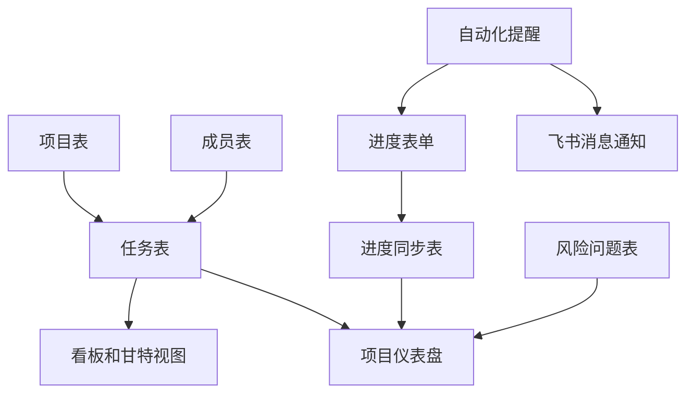
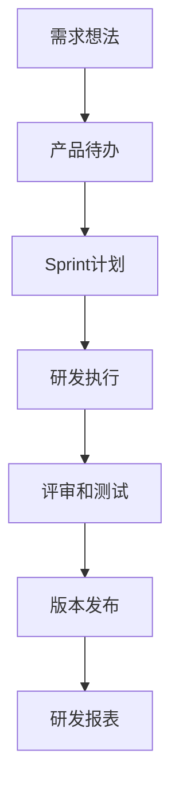
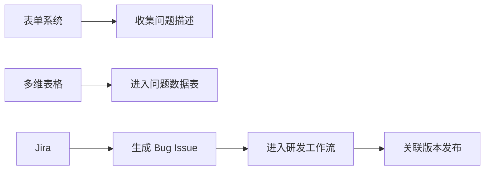
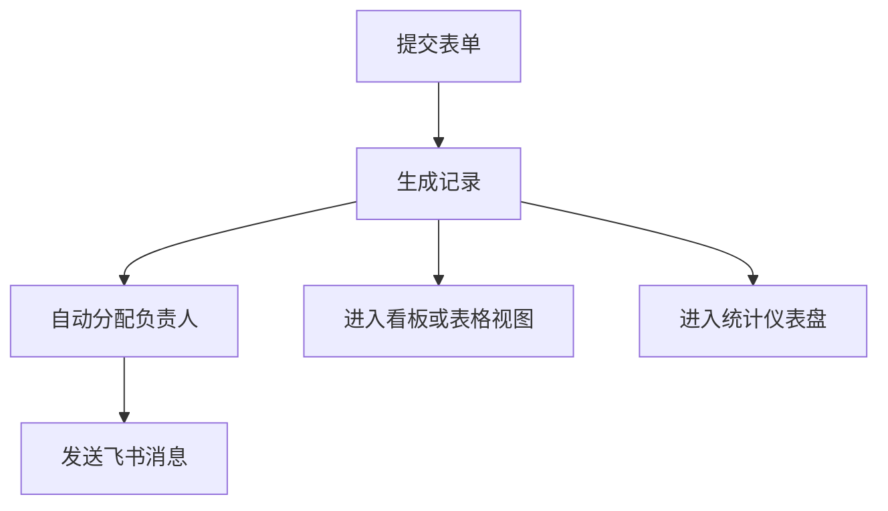
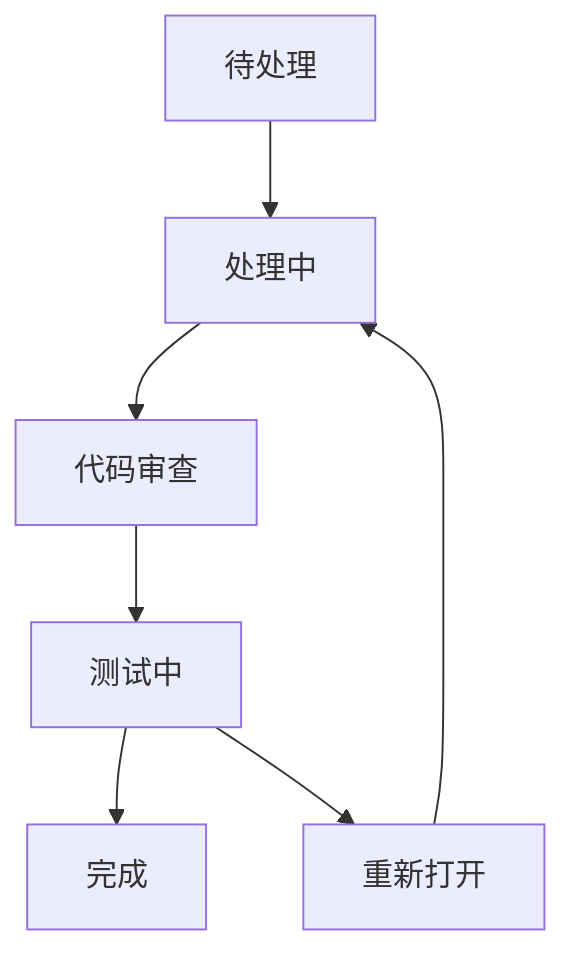

# 飞书多维表格 vs Jira 对比

## 1. 核心结论

飞书多维表格和 Jira 都可以做任务、需求、工单、项目管理，但它们的底层产品哲学不同：

- **飞书多维表格**：以“数据表”为中心，是一个轻量数据库和低代码业务系统搭建平台。
- **Jira**：以“Issue 工单”为中心，是一个专业的软件研发、项目跟踪和流程管理系统。

一句话概括：

> 多维表格适合业务团队快速搭建灵活数据系统；Jira 适合研发团队严肃管理需求、缺陷、迭代、版本和工程流程。

## 2. 底层模型差异

### 2.1 飞书多维表格：数据表模型

多维表格的核心对象是：

- 多维表格 App
- 数据表
- 字段
- 记录
- 视图
- 表单
- 自动化
- 仪表盘
- 权限

它的出发点是：先把业务对象结构化，再围绕结构化数据做录入、展示、协作、分析和自动化。

例如做一个客户管理系统，可以设计：

- 客户表
- 联系人表
- 商机表
- 合同表
- 回款表
- 跟进记录表

这些表之间通过关联字段连接。

### 2.2 Jira：Issue 模型

Jira 的核心对象是 Issue。Issue 可以代表：

- 需求
- Story
- Task
- Bug
- Epic
- Sub-task
- Incident
- Service request

Jira 的出发点是：围绕一个个 Issue 进行状态流转、责任分派、优先级排序、版本规划、Sprint 管理、评论协作、审计追踪和报表统计。

典型研发项目中，Jira 的结构通常是：

- Project
- Issue type
- Workflow
- Status
- Transition
- Field
- Board
- Sprint
- Release
- Component
- Automation

## 3. 在项目管理中的应用方式

### 3.1 多维表格如何做项目管理

多维表格做项目管理时，关键不是先画一个看板，而是先把项目管理对象结构化。一个常见设计可以拆成：

- **项目表**：项目名称、目标、负责人、阶段、开始时间、结束时间、总体进度、风险等级。
- **任务表**：任务名称、所属项目、负责人、优先级、状态、计划开始、计划结束、实际完成、依赖任务。
- **进度同步表**：每周进展、阻塞问题、下周计划、提交人、提交时间。
- **成员表**：项目角色、所属部门、可用时间、联系方式。
- **风险问题表**：风险描述、影响范围、处理人、处理状态、升级路径。

这些表通过关联字段连接起来，再为不同角色配置不同视图：

- 项目经理看甘特视图和风险视图，重点关注排期、依赖和阻塞。
- 执行成员看看板视图或个人任务视图，重点关注自己要推进的事项。
- 管理层看仪表盘，重点关注项目数量、延期风险、完成率和负责人负载。
- 外部协作方或项目成员用表单视图提交周报、变更、风险和进度。

典型流程如下：

这种方式适合轻量项目、业务项目、跨部门协作、项目台账、周报汇总和管理层驾驶舱。它的优势是搭建快、调整快、业务人员容易维护；限制是复杂依赖、研发迭代、版本发布、代码集成和流程审计能力不如 Jira。

### 3.2 Jira 如何做项目管理

Jira 做项目管理时，核心不是“表”，而是 work item 或 Issue。项目管理围绕工作项展开：

- 用 Epic、Story、Task、Bug 等类型表达不同层级的工作。
- 用 Workflow、Status、Transition 控制工作项如何流转。
- 用 Backlog、Sprint、Scrum Board、Kanban Board 组织研发执行。
- 用 Version、Release、Component 关联版本、模块和发布范围。
- 用报表跟踪燃尽图、速度、控制图、累计流图、版本进度和缺陷趋势。

Jira 的典型研发项目链路如下：

这使 Jira 更适合软件研发、缺陷跟踪、敏捷迭代、版本发布、IT 服务管理和大团队工程治理。

## 4. 与“表单系统”的关系

很多人会把多维表格、Jira 和表单系统混在一起，是因为三者都可以“收集信息”。

但它们的定位不同：

- **表单系统**：重点是收集数据。
- **飞书多维表格**：重点是把收集来的数据变成可管理的数据表和轻量业务系统。
- **Jira**：重点是把收集来的事项变成可追踪、可流转、可审计的 work item 或 Issue。

Jira Forms 的官方定位也是“收集信息并捕获工作”。在 Jira Software 或 Jira Work Management 中，表单提交后会在同一个 space 中自动创建 work item；在 Jira Service Management 中，表单通常和请求类型、服务门户、客户请求流程结合。也就是说，Jira Forms 是 Jira 的录入入口，提交后的管理对象仍然是 Jira work item，而不是一张自由建模的数据表。

例如“提交一个 Bug”：

表单只是入口，多维表格更像数据容器和轻量应用层，Jira 更像流程引擎和研发管理系统。

## 5. 核心能力对比

| 维度 | 飞书多维表格 | Jira |
|---|---|---|
| 核心对象 | 记录和数据表 | Work item / Issue |
| 产品定位 | 轻量数据库、低代码业务系统、协同表格 | 项目管理、研发流程、工单跟踪 |
| 适用人群 | 运营、销售、HR、行政、项目团队、业务团队 | 研发、测试、产品、项目经理、IT 服务团队 |
| 数据结构 | 多表、多字段、多视图、关联字段 | 项目、Issue 类型、字段、工作流、版本、Sprint |
| 流程能力 | 自动化流程，适合轻量业务流转 | 强工作流，适合严肃状态机和工程流程 |
| 表单能力 | 表单视图天然内置，提交后进入数据表 | 可通过 Jira Forms 或请求入口收集信息 |
| 视图能力 | 表格、看板、甘特、日历、表单、画册、仪表盘 | Scrum 看板、Kanban 看板、Backlog、Roadmap、报表 |
| 权限粒度 | 应用、页面、数据表、记录、字段等 | 项目、Issue、字段、安全级别、角色等 |
| 自动化 | 数据变更触发通知、更新、HTTP 请求等 | Issue 创建、状态变更、分派、评论、版本等规则 |
| 报表分析 | 仪表盘和图表偏业务数据分析 | 燃尽图、速度图、控制图、版本报告等研发管理指标 |
| 集成方式 | 飞书生态、开放 API、Webhook | Atlassian 生态、开发工具链、Marketplace、API |
| 复杂度 | 上手低，灵活度高 | 上手成本较高，流程治理能力强 |
| 治理风险 | 容易被搭成很多“野生小系统” | 容易配置过重、流程僵化 |

## 6. 工作流差异

### 6.1 多维表格的流程更像业务自动化

多维表格常见流程：

这种流程适合：

- 客户线索分配
- 招聘候选人跟进
- 内容选题推进
- 工单初筛
- 资产领用审批
- 活动报名统计

它的特点是灵活、快、低门槛，但不一定适合复杂工程治理。

### 6.2 Jira 的流程更像状态机

Jira 常见流程：

Jira 更关注：

- 谁负责这个 Issue。
- 当前处于什么状态。
- 谁可以把它从一个状态推进到另一个状态。
- 每个状态需要哪些字段。
- 是否关联 Sprint、版本、Epic、代码分支、Pull Request。
- 是否留下完整的变更历史。

这让 Jira 更适合研发流程、质量管理和交付追踪。

## 7. 数据结构差异

多维表格的优势是自由建模。你可以为不同业务对象分别建表，并通过关联字段形成业务网络。

Jira 的优势是标准化 Issue 管理。它天然假设你管理的是“待完成的工作项”，并围绕工作项提供优先级、负责人、状态、迭代、版本、组件、评论、附件、历史记录等能力。

因此：

- 如果你的对象是“客户、合同、候选人、设备、库存、选题”，多维表格更自然。
- 如果你的对象是“需求、Bug、任务、研发事项、服务请求”，Jira 更自然。

## 8. 权限与治理差异

多维表格权限更像业务应用权限：

- 谁能进入应用。
- 谁能看某个页面。
- 谁能看某张表。
- 谁能看或改某些记录和字段。
- 不同角色看到不同数据范围。

Jira 权限更像工程流程治理：

- 谁能创建 Issue。
- 谁能分派 Issue。
- 谁能编辑字段。
- 谁能变更状态。
- 谁能关闭、删除、管理项目。
- 哪些 Issue 只对特定角色可见。

如果企业重视工程过程合规、研发审计和跨团队协作，Jira 的治理模型通常更成熟。如果只是部门内部轻量管理，多维表格配置成本更低。

## 9. 报表差异

多维表格报表偏业务分析：

- 各状态数量。
- 各负责人工作量。
- 销售漏斗。
- 招聘转化率。
- 工单分类统计。
- 库存和资产分布。

Jira 报表偏研发交付：

- Sprint 燃尽图。
- 团队速度。
- Cycle time。
- Cumulative flow。
- 版本发布进度。
- 缺陷趋势。
- Epic 进度。

如果你要看业务数据，多维表格更顺手。如果你要看研发交付效率，Jira 更专业。

## 10. 典型选择建议

### 10.1 选飞书多维表格的情况

适合选择多维表格：

- 业务对象不是标准研发 Issue。
- 想快速从 Excel 升级到结构化协作系统。
- 需要多种视图展示同一份数据。
- 需要表单收集、轻量自动化和仪表盘。
- 团队成员主要是业务人员，不希望学习复杂系统。
- 流程变化频繁，要求快速调整。
- 业务系统还处在探索期，需要低成本试错。

典型场景：

- CRM 线索管理
- 招聘流程
- 内容排期
- 活动报名
- 工单初筛
- 项目台账
- 资产盘点
- 供应商管理

### 10.2 选 Jira 的情况

适合选择 Jira：

- 核心对象是需求、Bug、任务、研发事项。
- 团队使用 Scrum 或 Kanban。
- 需要 Sprint、Backlog、Epic、版本发布管理。
- 需要严格工作流和状态流转控制。
- 需要和代码仓库、CI、Confluence、测试管理等工具集成。
- 需要研发度量和交付报表。
- 团队规模较大，需要项目治理和权限标准化。

典型场景：

- 软件研发项目管理
- Bug 跟踪
- 敏捷迭代管理
- 版本发布跟踪
- IT 服务管理
- DevOps 流程协同

## 11. 两者如何配合

很多企业不是二选一，而是组合使用。

常见方式：

例如：

1. 业务侧用多维表格收集客户需求、运营反馈、销售线索。
2. 产品经理筛选和整理后，把明确要研发的需求同步到 Jira。
3. 研发团队在 Jira 中拆 Epic、Story、Task 和 Bug。
4. Jira 的研发状态再回流到多维表格，供业务团队查看。

这种模式可以让业务侧保持低门槛，研发侧保持流程严谨。

## 12. 判断口诀

可以用以下问题快速判断：

1. **这是不是标准研发工作项？**
   - 是：优先 Jira。
   - 否：优先多维表格。

2. **是否需要 Sprint、版本、Backlog、Epic？**
   - 是：Jira。
   - 否：多维表格可能足够。

3. **是否需要快速搭一个部门级系统？**
   - 是：多维表格。

4. **是否需要严格状态机、审计和工程治理？**
   - 是：Jira。

5. **使用者主要是业务人员还是研发人员？**
   - 业务人员：多维表格。
   - 研发人员：Jira。

6. **数据对象是否很多样？**
   - 客户、合同、候选人、设备、内容等：多维表格。
   - 需求、Bug、任务、缺陷、服务请求等：Jira。

## 13. 常见误区

### 13.1 用多维表格硬替 Jira

如果团队已经需要 Sprint、版本、Issue 生命周期、研发报表、代码集成和严格权限，那么用多维表格强行替代 Jira，后期可能会出现治理不足。

### 13.2 用 Jira 管所有业务数据

如果只是管理客户、合同、招聘、活动报名、资产台账，把它们全部塞进 Jira Issue，会让 Jira 变得臃肿，也会让业务人员使用困难。

### 13.3 把表单系统当成完整流程系统

表单系统解决的是“收集”，不是“管理”。如果提交后还需要分派、跟进、统计、权限和自动化，就需要多维表格或 Jira 这类后端管理系统。

## 14. 总结

飞书多维表格和 Jira 的区别，不是“谁更高级”，而是“服务的管理对象不同”。

- 多维表格管理的是广义业务数据。
- Jira 管理的是标准化工作项，尤其是研发和服务工作项。
- 表单系统只是数据入口，不是完整管理系统。

如果你要把一个业务流程从 Excel、群消息和人工提醒中解放出来，多维表格通常是更快的选择。如果你要管理软件研发交付、缺陷、迭代、版本和工程协作，Jira 更合适。如果业务需求最终要进入研发，最佳实践往往是多维表格在前端收集和筛选，Jira 在后端承接研发执行。

## 参考来源

- [[飞书多维表格系统介绍]]
- [飞书多维表格官网](https://base.feishu.cn/)
- [飞书开放平台：多维表格概述](https://open.larkoffice.com/document/server-docs/docs/bitable-v1/bitable-overview)
- [飞书帮助中心：快速上手多维表格](https://www.feishu.cn/hc/zh-CN/articles/697278684206-%E5%BF%AB%E9%80%9F%E4%B8%8A%E6%89%8B%E5%A4%9A%E7%BB%B4%E8%A1%A8%E6%A0%BC)
- [飞书帮助中心：多维表格实战模板：项目管理系统](https://www.feishu.cn/hc/zh-CN/articles/184008024837-%E5%A4%9A%E7%BB%B4%E8%A1%A8%E6%A0%BC%E5%AE%9E%E6%88%98%E6%A8%A1%E6%9D%BF-%E9%A1%B9%E7%9B%AE%E7%AE%A1%E7%90%86%E7%B3%BB%E7%BB%9F)
- [Atlassian Jira](https://www.atlassian.com/software/jira)
- [Atlassian Support: Jira Cloud administration](https://support.atlassian.com/jira-cloud-administration/)
- [Atlassian Support: What are forms and what can they do?](https://support.atlassian.com/jira-software-cloud/docs/what-are-forms-and-what-can-they-do/)
- [Atlassian Support: Manage access and share a form](https://support.atlassian.com/jira-software-cloud/docs/share-your-form/)
- [Atlassian: Agile project management with Jira](https://www.atlassian.com/software/jira/agile)
- [Atlassian Support: Generate a report](https://support.atlassian.com/jira-software-cloud/docs/generate-a-report/)

## Update History

- 2026-06-02: 补充项目管理落地建模、Jira Forms 官方表述、work item 术语和官方参考来源。
- 2026-05-21: 初次创建，系统对比飞书多维表格、表单系统与 Jira 在定位、模型、流程、权限、报表和适用场景上的差异。
