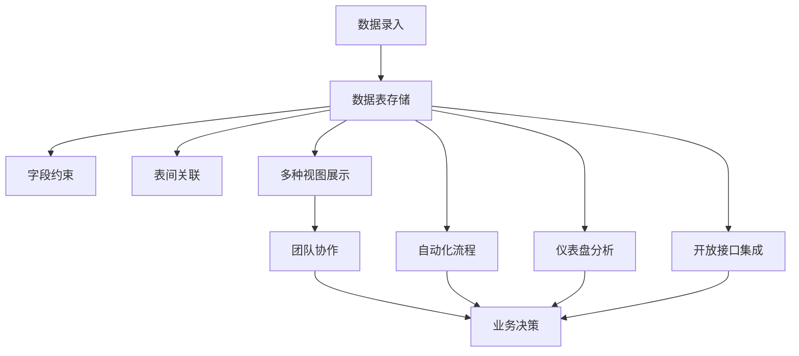

# 飞书多维表格系统介绍

## 1. 核心定义

飞书多维表格，也常被称为 Base 或 Bitable，是飞书提供的一种业务数据管理与低代码应用搭建工具。它既保留了表格的低门槛录入体验，又引入了数据库式的字段类型、数据关联、多视图、权限、自动化、仪表盘和开放 API。

从定位上看，它不是传统电子表格的简单升级，而更像一个面向业务人员的轻量业务系统搭建平台：

- 对普通用户来说，它是一个更结构化、更适合协作的表格。
- 对业务团队来说，它是一个可以快速搭建流程和管理系统的低代码平台。
- 对开发者来说，它是一个可通过 API 读写的在线数据容器。

飞书开放平台对多维表格的定义是：多维表格是全新的业务管理工具，可以帮助用户在线协同数据、构建个性化应用、掌控业务数据，并通过 API 打通内部业务系统。

## 2. 为什么叫“多维”

传统电子表格主要是二维结构：行和列。多维表格的“多维”体现在以下几个方面：

1. **字段类型多维**
   - 每一列不只是普通文本或数字，而是有明确类型。
   - 常见字段包括文本、数字、日期、人员、单选、多选、附件、超链接、复选框、公式、关联、查找引用、按钮、进度、评分、地理位置等。

2. **数据关系多维**
   - 可以通过关联字段把不同数据表连接起来。
   - 例如“客户表”关联“订单表”，“项目表”关联“任务表”，“候选人表”关联“面试记录表”。

3. **展示视图多维**
   - 同一份底层数据可以切换成不同视图。
   - 常见视图包括表格视图、看板视图、日历视图、甘特视图、表单视图、画册视图等。

4. **协作和权限多维**
   - 不同角色可以看到不同页面、不同数据表、不同记录、不同字段。
   - 多维表格应用权限还可以独立于源数据表权限设置。

5. **流程多维**
   - 数据变化可以触发自动化流程。
   - 自动化流程可以发送消息、邮件、HTTP 请求，也可以结合 AI 生成文本。

## 3. 基础数据模型

理解多维表格时，可以把它看成一个简化版在线数据库。

### 3.1 多维表格 App

一个多维表格可以理解为一个应用。开放平台中使用 `app_token` 标识一个多维表格应用。

多维表格可以有多种存在形态：

- 存放在飞书云空间中的独立多维表格。
- 放在知识库中的多维表格。
- 嵌入飞书文档中的多维表格。
- 嵌入电子表格中的多维表格。

### 3.2 数据表

数据表是多维表格中的数据容器。一个多维表格 App 中可以有一个或多个数据表。开放平台中使用 `table_id` 标识数据表。

例如，一个销售管理系统中可以包含：

- 客户表
- 商机表
- 合同表
- 回款表
- 跟进记录表

### 3.3 记录

记录对应数据表中的一行。开放平台中使用 `record_id` 标识记录。

例如在客户表中，一条记录就是一个客户；在任务表中，一条记录就是一个任务。

### 3.4 字段

字段对应数据表中的列。开放平台中使用 `field_id` 标识字段。

字段是多维表格区别于普通表格的关键。普通表格的一列往往只是单元格集合，而多维表格的字段具有明确数据类型和业务含义。

### 3.5 视图

视图是数据的展现方式。开放平台中使用 `view_id` 标识视图。

同一张数据表可以有多个视图。例如任务数据可以同时拥有：

- 表格视图：适合批量编辑。
- 看板视图：按任务状态拖拽管理。
- 甘特视图：查看项目周期。
- 日历视图：查看截止日期。
- 表单视图：对外收集任务或需求。

### 3.6 仪表盘

仪表盘用于对多维表格中的数据进行统计和可视化。开放平台中使用 `block_id` 标识仪表盘。

仪表盘适合做业务看板，例如销售漏斗、项目进度、工单数量、招聘转化率等。

### 3.7 自动化流程

自动化流程由触发条件和执行操作组成。开放平台中使用 `workflow_id` 标识自动化流程。

典型例子：

- 当任务状态变为“已完成”时，自动通知项目负责人。
- 当表单新增一条客户线索时，自动分配销售人员。
- 当合同到期前 7 天时，自动发送提醒。
- 当记录新增时，调用 HTTP 请求同步到外部系统。

## 4. 运行逻辑

多维表格的基本运行逻辑如下：

它的底层思路是：先把业务对象结构化，再围绕结构化数据做协作、视图、权限、自动化和系统集成。

## 5. 与普通电子表格的本质区别

### 5.1 普通电子表格更偏计算工具

Excel 或传统电子表格擅长：

- 临时数据处理。
- 公式计算。
- 财务建模。
- 一次性分析。
- 个人或小范围数据维护。

它的问题是：当数据变成多人协作、长期维护、角色权限、流程流转、系统集成时，表格很容易混乱。

### 5.2 多维表格更偏业务系统

多维表格擅长：

- 结构化管理业务对象。
- 多人实时协作。
- 用不同视图服务不同角色。
- 通过表单收集外部数据。
- 通过自动化驱动业务流程。
- 通过权限控制数据可见和可编辑范围。
- 通过 API 与其他系统集成。

因此，多维表格的核心不是“算得更强”，而是“管得更有结构、协作更顺、流程更自动”。

## 6. 核心能力模块

### 6.1 字段系统

字段系统决定数据的结构化程度。它让每一列都有明确类型，减少随意填写带来的脏数据。

常见字段能力：

- 基础字段：文本、数字、日期、复选框、超链接、附件。
- 协作字段：人员、群组、创建人、修改人。
- 选择字段：单选、多选，以及选项联动。
- 业务字段：按钮、流程、自动编号、电话、Email、地理位置、条码、进度、货币、评分。
- 高级字段：关联、查找引用、公式、AI 字段。

### 6.2 视图系统

视图系统解决“同一份数据给不同人怎么看”的问题。

常见使用方式：

- 运营看表格视图，方便批量维护。
- 项目经理看甘特视图，关注排期。
- 执行团队看看板视图，关注任务状态。
- 管理层看仪表盘，关注指标。
- 外部用户用表单视图，负责提交信息。

### 6.3 表间关联

表间关联是多维表格从“表格”走向“系统”的关键。

例如搭建一个客户管理系统：

- 客户表保存客户主体信息。
- 联系人表保存客户下的多个联系人。
- 商机表记录销售机会。
- 合同表记录签约信息。
- 回款表记录收款状态。

这些表之间可以通过关联字段连接起来，从而形成业务数据网络。

### 6.4 表单收集

表单视图可以把数据录入入口开放给成员或外部对象。它常用于：

- 需求收集。
- 客户线索收集。
- 问卷调研。
- 报名登记。
- 工单提交。
- 招聘候选人信息录入。

表单提交后的数据会进入对应数据表，后续可以继续进入看板、自动化、仪表盘或 API 流程。

### 6.5 自动化流程

自动化流程是多维表格的低代码工作流能力。

常见触发条件：

- 新增记录。
- 修改字段。
- 到达指定时间。
- 表单提交。
- Webhook 触发。

常见执行操作：

- 发送飞书消息。
- 发送邮件。
- 修改记录。
- 创建记录。
- 发起 HTTP 请求。
- 调用 AI 生成文本。

### 6.6 权限系统

多维表格权限通常分为源表权限和应用权限。

源表权限控制用户在多维表格本体中的访问能力。应用权限则控制用户在多维表格应用中的页面权限、数据权限和其他功能权限。

应用权限的特点：

- 应用所有者或具有管理权限的用户可以管理应用权限。
- 应用权限可以独立于源数据表权限。
- 可以设置页面权限。
- 可以设置数据表、记录、字段等数据权限。
- 可以创建自定义角色。
- 可以预览不同用户看到的页面和可操作范围。
- 对敏感数据，可以设置仅自定义角色可访问。

### 6.7 仪表盘与分析

仪表盘负责把业务数据变成指标和图表。它适合回答：

- 当前项目进度如何？
- 本月新增多少客户线索？
- 不同销售阶段的商机有多少？
- 哪类工单最多？
- 招聘漏斗在哪一步流失最严重？

### 6.8 开放 API

飞书开放平台提供多维表格服务端 API，可用于创建和管理多维表格、数据表、视图、字段、记录、仪表盘、高级权限、自动化流程等资源。

典型集成方式：

- 从业务系统同步数据到多维表格。
- 从多维表格读取数据生成报表。
- 用企业自建应用写入记录。
- 把多维表格作为轻量数据后台。
- 通过 HTTP 请求和 API 串联外部系统。

开放平台文档指出，批量操作单次最高为 1,000 条记录；为保证稳定性，建议对单一多维表格同时只请求一次 API 写操作。一个多维表格中字段上限为 300，其中公式字段最多 100 个；视图上限为 200；数据表和仪表盘合计上限为 100；高级权限自定义角色上限为 30，协作者上限为 200。

## 7. 典型应用场景

### 7.1 项目管理

适合管理项目、任务、负责人、截止日期、状态、优先级、依赖关系和进度。

常见组合：

- 表格视图用于批量维护任务。
- 看板视图用于按状态推进。
- 甘特视图用于排期。
- 自动化用于延期提醒。
- 仪表盘用于管理层查看进度。

### 7.2 CRM 客户管理

适合中小团队搭建轻量 CRM。

常见数据表：

- 客户表
- 联系人表
- 商机表
- 跟进记录表
- 合同表
- 回款表

### 7.3 工单与需求管理

适合收集和处理内部需求、客户反馈、Bug、售后工单。

典型流程：

### 7.4 内容生产管理

适合管理选题、作者、状态、发布时间、渠道、素材和复盘数据。

多维表格可以把内容从“灵感”推进到“发布”和“复盘”，并通过视图区分编辑、设计、运营和管理层关注的信息。

### 7.5 招聘流程管理

适合管理候选人、岗位、简历、面试安排、面试反馈、Offer 状态。

表单视图可以收集候选人信息，自动化流程可以提醒面试官填写反馈，仪表盘可以分析招聘漏斗。

### 7.6 库存与资产管理

适合管理设备、物料、库存数量、领用记录、责任人、维护周期。

通过自动化可以设置低库存提醒、到期维护提醒和资产归还提醒。

## 8. 不适合的场景

多维表格虽然强大，但不应被误用为所有系统的替代品。

不适合场景包括：

- 高频交易或高并发写入系统。
- 复杂事务一致性要求很高的核心数据库。
- 大规模数据仓库或专业 BI 引擎。
- 复杂 ERP、财务总账、供应链核心系统的完整替代。
- 强算法计算、复杂统计建模或超大规模离线计算。

更合理的定位是：多维表格适合作为业务协作层、轻量数据层、流程原型层和部门级应用层。

## 9. 建模方法

搭建多维表格时，不应直接把 Excel 搬进去，而应先做业务建模。

推荐步骤：

1. **识别业务对象**
   - 找出要管理的核心对象，例如客户、订单、任务、候选人、设备。

2. **拆分数据表**
   - 一个对象通常对应一张表。
   - 不要把所有字段塞进一张超级大表。

3. **定义字段类型**
   - 为每个字段选择合适类型。
   - 能用单选就不要用自由文本。
   - 能用人员字段就不要手填姓名。

4. **建立表间关联**
   - 用关联字段连接不同业务对象。
   - 避免重复维护同一份信息。

5. **设计视图**
   - 为不同角色设计不同视图。
   - 不要指望所有人都看同一个总表。

6. **设计权限**
   - 区分谁能看、谁能改、谁能管理。
   - 敏感数据优先使用角色和字段权限控制。

7. **添加自动化**
   - 先自动化高频、明确、低风险流程。
   - 不要一开始就设计过度复杂的流程。

8. **接入 API**
   - 当数据需要和企业内部系统同步时，再接入开放 API。

## 10. 最佳实践

1. **把多维表格当成轻量数据库，而不是传统表格**
   - 先设计数据结构，再录入数据。

2. **字段类型越明确，后续自动化越稳定**
   - 避免大量自由文本字段承载关键状态。

3. **视图服务角色，不服务炫技**
   - 每个视图都应对应明确的使用者和业务动作。

4. **权限设计要前置**
   - 尤其是客户、合同、薪酬、招聘等敏感数据。

5. **自动化从简单规则开始**
   - 先做提醒、通知、状态同步，再做复杂流程。

6. **关键业务不要只依赖人工维护**
   - 重要数据最好结合表单、自动化、API 或系统同步。

7. **定期清理字段和视图**
   - 多维表格容易随着业务演进变得臃肿，需要治理。

## 11. 一句话总结

飞书多维表格是介于电子表格、数据库、项目管理工具和低代码应用平台之间的业务协作工具。它最适合把部门级、团队级、流程型业务从“散乱表格和群消息”升级为“结构化数据、多人协作、自动流转和可视化管理”的轻量业务系统。

## 参考来源

- [飞书多维表格官网](https://base.feishu.cn/)
- [飞书帮助中心：快速上手多维表格](https://www.feishu.cn/hc/zh-CN/articles/697278684206-%E5%BF%AB%E9%80%9F%E4%B8%8A%E6%89%8B%E5%A4%9A%E7%BB%B4%E8%A1%A8%E6%A0%BC)
- [飞书开放平台：多维表格概述](https://open.larkoffice.com/document/server-docs/docs/bitable-v1/bitable-overview)
- [飞书帮助中心：管理多维表格应用权限](https://www.feishu.cn/hc/zh-CN/articles/798412479190-%E7%AE%A1%E7%90%86%E5%A4%9A%E7%BB%B4%E8%A1%A8%E6%A0%BC%E5%BA%94%E7%94%A8%E6%9D%83%E9%99%90)

## Update History

- 2026-05-21: 初次创建，系统整理飞书多维表格的定位、数据模型、核心能力、场景、限制与建模方法。
