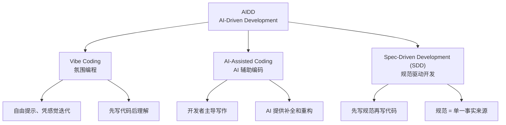

# AI-Driven Development (AIDD)

> 2026 年将 AI 置于软件开发生命周期中心的方法论总称。**AIDD 是伞，SDD 是伞下的一个支柱。**

## 三大方法论家族

AIDD 涵盖三种主流方法论，构成从灵活到严谨的完整光谱：



## 核心对比

| 维度 | Vibe Coding | AI-Assisted Coding | SDD |
|------|-------------|-------------------|-----|
| **核心理念** | 自由提示、凭感觉迭代 | 开发者主导，AI 辅助 | **先写规范再写代码** |
| **编写顺序** | 先写代码 | 人写代码，AI 补全 | 先写规范，AI 生成代码 |
| **治理/审计** | 最弱 | 中等 | **最强** |
| **AI 角色** | 主驾驶 | 副驾驶 | 严格按规范执行的执行者 |
| **确定性** | 最低（~45% 含安全漏洞） | 中 | **最高** |
| **适用场景** | 原型、内部工具、POC | 日常功能开发 | 关键业务系统、合规要求 |
| **代表工具** | Lovable, Bolt, v0 | GitHub Copilot, Cursor | GitHub Spec Kit, OpenSpec, Kiro |

## AIDD 光谱

三种方法论不是非此即彼的选择，而是**同一光谱上的不同位置**：

```
灵活性高 ←————————————————————————→ 确定性高

Vibe Coding      AI-Assisted Coding         SDD
   ↑                    ↑                     ↑
  原型                 日常开发              生产系统
  探索                 个人效率              合规审计
```

## 最佳实践：混合使用

2026 年的行业共识是**有意识混合**：

- **用 Vibe Coding 探索和原型** — 快速验证想法
- **用 AI-Assisted Coding 作为日常基线** — 保持开发效率
- **用 SDD 交付生产系统** — 确保质量、治理和可维护性

> **SDD 的本质：AIDD 在企业级、关键业务场景下的「工业化」版本。**

---

## 与 Loop Engineering 的关系

AIDD 是开发**方法论**，Loop Engineering 是 Agent 的**自动化运行机制**：

- AIDD 回答「**怎么用 AI 开发软件**」（方法论层）
- Loop Engineering 回答「**如何让 Agent 持续运转**」（自动化层）
- 两者互补：AIDD 决定工作方式，Loop Engineering 让这种工作方式自动持续

---

## 来源

- [[wiki/concepts/spec-driven-development]] — SDD 概念页（AIDD 的子方法论）
- [[wiki/concepts/vibe-coding]] — Vibe Coding 概念页（AIDD 的另一种子方法论）
- [[wiki/concepts/loop-engineering]] — Loop Engineering，AIDD 的自动化运行机制
