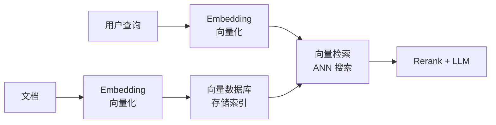

# Embedding（嵌入 / 向量化）

> 将文本、图像等非结构化数据映射到高维向量空间的技术。RAG 系统的向量检索、语义搜索、文本相似度计算的基础。

## 核心概念

- **Embedding Model**: 将文本转为向量（如 OpenAI ada-002, BGE, E5）
- **向量维度**: 通常 768-4096 维
- **语义相似度**: 向量空间中的余弦相似度衡量语义相关性
- **索引**: 高效近似检索（ANN），如 HNSW、IVF

## 与 RAG 的关系

## 常见 Embedding 模型

| 模型 | 维度 | 特点 |
|------|------|------|
| OpenAI text-embedding-3-small | 1536 | 通用, 性价比高 |
| BAAI BGE | 1024 | 开源, 中英文好 |
| intfloat e5 | 1024 | 跨语言 |
| Cohere embed | 4096 | 企业级 |

## 来源

- 知识库内 11 处引用
