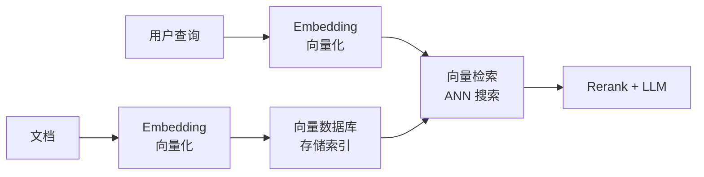

# Embedding（嵌入 / 向量化）

> 将文本、图像等非结构化数据映射到高维向量空间的技术。RAG 系统的向量检索、语义搜索、文本相似度计算的基础。

## 核心概念

- **Embedding Model**: 将文本转为向量（如 OpenAI ada-002, BGE, E5）
- **向量维度**: 通常 768-4096 维
- **语义相似度**: 向量空间中的余弦相似度衡量语义相关性
- **索引**: 高效近似检索（ANN），如 HNSW、IVF

## 与 RAG 的关系

## 相似度度量

文本向量化后有三种常见相似度/距离度量方式：

| 度量方式 | 含义 | 特点 |
|---------|------|------|
| **余弦相似度** (Cosine Similarity) | 看两个向量方向是否一致 | RAG 场景最常用，对向量长度不敏感 |
| **内积** (Dot Product) | 看对应维度乘积之和 | 向量 L2 归一化后与余弦排序等价 |
| **欧氏距离** (L2 Distance) | 看两点空间中的绝对距离 | 对向量幅度更敏感 |

> 选余弦相似度的核心原因：RAG 关注语义方向是否接近，而非向量长度本身。

## 常见 Embedding 模型

| 模型 | 维度 | 特点 |
|------|------|------|
| OpenAI text-embedding-3-small | 1536 | 通用, 性价比高, 可降维 |
| OpenAI text-embedding-3-large | 3072 | 更高精度, 可降维 |
| BAAI BGE 系列 | 1024 | 开源, 中英文好, 可私有化 |
| intfloat E5 系列 | 1024 | 跨语言 |
| GTE 系列 | 768 | 开源, 阿里出品 |
| Cohere Embed | 4096 | 企业级 |

> 选型建议：MTEB 榜单作为参考，最终需用业务数据评测召回率、相关性和延迟。

## 来源

- [[wiki/sources/rag-basis-concepts-javaguide]] — 万字详解 RAG 基础概念 (JavaGuide)
- 知识库内 12 处引用
