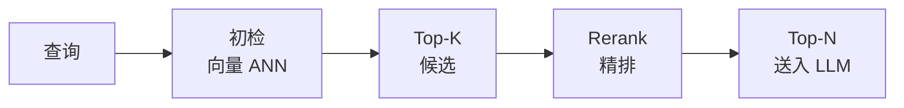

# Rerank（重排序）

> RAG 系统中在向量检索之后、LLM 生成之前的关键优化环节。用更精确（但更慢）的模型对初检结果重新排序，提升送入 LLM 上下文的质量。

## 检索流程

## 为什么需要 Rerank

| 阶段 | 方法 | 速度 | 精度 |
|------|------|------|------|
| 初检 | 向量 ANN（HNSW/IVF） | 快 | 中 |
| 精排 | Cross-encoder Reranker | 慢 | 高 |

- 初检用双编码器（Bi-encoder）粗筛候选
- 精排用交叉编码器（Cross-encoder）精细打分
- Rerank 是 RAG 优化中 ROI 最高的手段之一

## 来源

- [[wiki/concepts/rag-optimization]]
- [[wiki/syntheses/rag-optimization-guide]]
- [[wiki/sources/rag-optimization-javaguide]] — 万字详解 RAG 优化 (JavaGuide)
