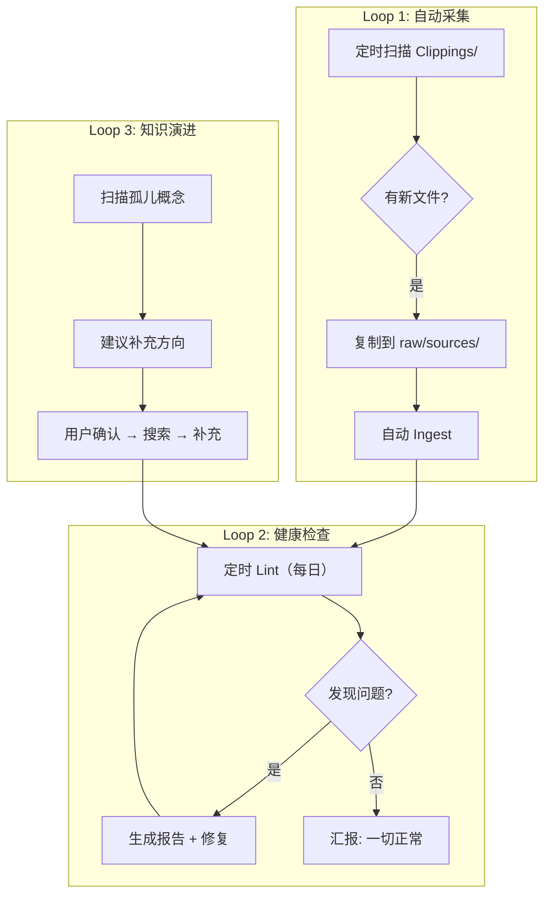

# Wiki Loop Engineering

> 将 Loop Engineering 的方法论应用到 LLM Wiki 知识库的维护中，让 Agent 从「被动响应」变为「主动循环」。

## 现有模式 vs Loop 模式

| 维度 | 现有（被动） | Loop（主动） |
|------|-------------|-------------|
| Ingest | 用户说"帮我 Ingest"才执行 | 定时扫描 `Clippings/`，自动搬入并 Ingest |
| Lint | 用户说"帮我 lint"才执行 | 定时自动运行，问题主动汇报 |
| 知识缺口 | 用户提问才发现 | Agent 周期性扫描，主动建议补充方向 |
| 更新 | 一次性任务 | 持续循环，每次迭代积累 |

## 本知识库的 Loop 架构



## 三个 Loop 的定义

### Loop 1: 自动采集 (Auto-Ingest)
- **触发**: 定时扫描 `Clippings/` 目录
- **动作**: 新文件 → 复制到 `raw/sources/` → 执行完整 Ingest
- **输出**: 更新 `wiki/index.md` + `wiki/log.md`
- **验证**: 确保 `raw/sources` 与 `wiki/sources` 数量一致

### Loop 2: 健康检查 (Scheduled Lint)
- **触发**: 定时执行（每日/每周）
- **动作**: 孤儿页 → 索引一致性 → 交叉引用检查 → 统计核对
- **输出**: Lint 报告（问题列表 + 建议）
- **验证**: 前次 Lint 的问题是否已修复

### Loop 3: 知识演进 (Knowledge Evolution)
- **触发**: Lint 发现缺口 / 用户提问暴露盲区
- **动作**: Agent 主动识别反复出现但 wiki 中无对应页面的概念
- **输出**: 建议搜索方向，用户确认后补充
- **验证**: 补充后再次 Lint 确认闭环

## 实现方式

通过 Claude Code 的 **CronCreate** 定时任务实现：

```json
// Loop 1: 每周一三五检查新剪藏
// Loop 2: 每天自动 Lint
// Loop 3: 每周知识缺口分析
```

每个 Loop 完成时自动记录到 `wiki/log.md`。

## 来源

- [[wiki/sources/loop-engineering-guide]]
- [[wiki/concepts/harness-engineering]]
