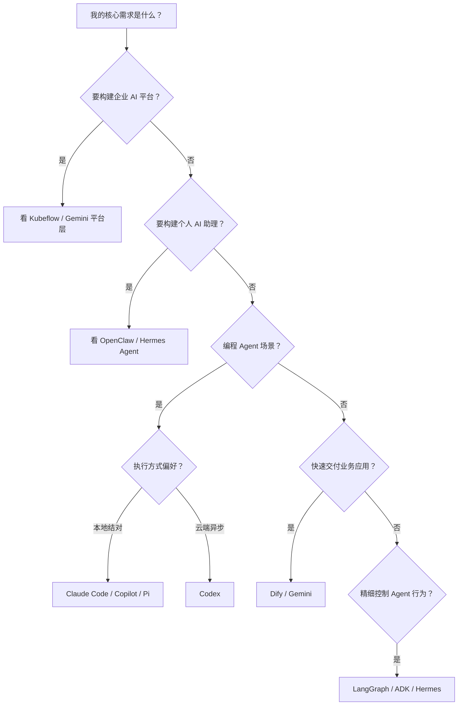

# AI Agent 生态全景对比

> 综合 4 篇对比分析文章，构建从企业平台到个人工具的 AI Agent 生态全景框架，解决「如何从混乱的选型中做出正确决策」的问题。

---

## 一、核心洞察：三层分层框架

AI Agent 领域的工具和平台看似混乱，但按抽象层级可分为清晰的三个层次：

```
┌─────────────────────────────────────┐
│     应用交付层 (Application Layer)     │
│  Gemini Enterprise · Dify · OpenClaw │
│  面向：产品快速上线 · 业务交付效率      │
├─────────────────────────────────────┤
│     编排与 Runtime 层 (Orchestration) │
│  LangGraph · ADK · Hermes Agent      │
│  面向：精细控制 · 状态管理 · 多 Agent  │
├─────────────────────────────────────┤
│     平台与基础设施层 (Platform/Infra)  │
│  Kubeflow · Pi · Codex (云沙箱)       │
│  面向：训练部署 · 平台底座 · 控制权    │
└─────────────────────────────────────┘
```

这个三层框架是理解整个 AI Agent 生态的核心工具。大部分选型困惑源于拿不同层级的工具做直接比较。

---

## 二、分层详解

### 2.1 应用交付层

这一层的工具让团队以最高效率交付 AI 产品。

| 工具 | 核心定位 | 抽象层级 | 最适合 |
|------|----------|----------|--------|
| **Gemini Enterprise Agent Platform** | 托管型企业 Agent 栈（GCP） | 中高 | 已深度使用 GCP 的企业 |
| **Dify** | 开源低代码 AI 应用平台 | 高 | 快速搭建可视化 AI 应用 |
| **OpenClaw** | 个人消息助理平台 | 中高 | 聊天入口驱动的个人助理 |

**选择指南**：
- 已绑定 GCP + 需要企业级 Agent → Gemini
- 快速业务交付 + 可视化编排 → Dify
- 个人助理 + chat-native + always-on → OpenClaw

### 2.2 编排与 Runtime 层

这一层的工具提供对 Agent 行为的精细控制。

| 工具 | 核心定位 | 抽象层级 | 最适合 |
|------|----------|----------|--------|
| **LangGraph** | 低层 Agent 编排框架 | 低 | 精细控制长状态多 Agent 系统 |
| **ADK (Agent Development Kit)** | Google 开源 Agent 开发套件 | 中低 | GCP 生态内代码优先开发 |
| **Hermes Agent** | 自我改进的开源 Agent 框架 | 中 | 长期演化可学习的 Agent 系统 |

**选择指南**：
- 需要状态机式精细控制 → LangGraph
- GCP 生态 + 代码优先 → ADK
- 长期演化 + 技能自改进 → Hermes Agent

### 2.3 平台与基础设施层

这一层提供训练、部署、执行的基础运行环境。

| 工具 | 核心定位 | 控制权 | 最适合 |
|------|----------|--------|--------|
| **Kubeflow** | Kubernetes AI 平台底座 | 高 | 企业 AI 训练部署平台 |
| **Pi** | 开源 coding agent harness | 高 | 自建 coding agent 栈 |
| **Codex** | 云端软件工程 agent | 中 | 异步并行委派任务 |

**选择指南**：
- 训练/模型管理/GPU 调度 → Kubeflow
- 自建 coding agent 基建 → Pi
- 云端异步隔离执行 → Codex

---

## 三、编程 Agent 子生态

Claude Code、GitHub Copilot、Codex 构成编程 Agent 子生态，按执行模型区分：

```
本地实时结对：
  Pi（开源控制） → Claude Code（产品体验） → Copilot（IDE/GitHub 集成）

远端异步委派：
  Codex（云端沙箱）
```

| 维度 | Pi | Claude Code | Codex | GitHub Copilot |
|------|-----|-------------|-------|----------------|
| 运行位置 | 本地 | 本地为主 | 云端沙箱 | IDE/GitHub |
| 模型绑定 | 多 provider | Claude 生态 | OpenAI 生态 | 多模型 |
| 执行风格 | 交互式可配 | 交互式产品化 | 异步并行 | IDE 协作 |
| 控制权 | 最高 | 中 | 中低 | 低 |

**一句话选型**：
- 要控制权 → Pi
- 要日常开发体验 → Claude Code
- 要异步派工 → Codex
- 要 IDE/GitHub 集成 → Copilot

---

## 四、Personal AI Agent 子生态

OpenClaw 和 Hermes Agent 构成另一子生态：面向个人用户的 always-on agent。

| 维度 | OpenClaw | Hermes Agent |
|------|----------|--------------|
| 设计中心 | 个人助理体验 | Agent runtime 学习闭环 |
| 入口模型 | 消息优先 | CLI + 消息平台平等 |
| 记忆风格 | 越来越懂你的助理 | 越来越会做事的 runtime |
| Provider 策略 | 多模型非核心卖点 | 20+ provider 核心能力 |
| 部署模型 | 我的 agent 机器 | runtime 与环境解耦 |

**一句话选型**：
- 要「养一个数字助理」→ OpenClaw
- 要「经营一个 agent runtime」→ Hermes Agent

---

## 五、企业级 Agent 平台子生态

Gemini、Kubeflow、Dify、LangGraph 构成企业级选型子生态。

```
企业 AI 系统选型
  ├── Agent 应用层: Gemini · Dify
  ├── Agent 编排层: LangGraph · ADK
  └── AI 平台底座: Kubeflow
```

**最现实的组合方式**：
| 组合 | 下层负责 | 上层负责 |
|------|----------|----------|
| Kubeflow + Gemini | 训练、模型资产、私有 serving | Agent 应用、记忆、工具编排 |
| Kubeflow + LangGraph | 模型与平台底座 | 复杂 Agent runtime 和业务逻辑 |
| Dify + 自有模型 | 模型服务与数据服务 | 快速交付 AI 应用、可视化 workflow |

---

## 六、全局选型决策树



---

## 七、生态全景总结

所有这些工具和平台不是竞争关系，而是**分层协作**关系。一个典型的成熟部署可能同时跨越三个层级：

- **Kubeflow** 管训练和模型（基础设施层）
- **Hermes Agent / LangGraph** 管 Agent runtime 编排（编排层）
- **Dify** 或自建应用管最终用户交付（应用层）

理解每层解决什么问题，比在单层内比「谁更强」更重要。

---

## 来源

- [[wiki/sources/gemini-enterprise-vs-kubeflow-comparison]]
- [[wiki/sources/gemini-kubeflow-dify-langgraph-comparison]]
- [[wiki/sources/openclaw-vs-hermes-comparison]]
- [[wiki/sources/openclaw-hermes-pi-codex-copilot-comparison]]
- [[wiki/sources/pi-claude-codex-comparison]]
- [[wiki/sources/pi-claude-codex-english-presentation]]

## 相关页面

- [[wiki/entities/dify]]
- [[wiki/entities/langgraph]]
- [[wiki/entities/openclaw]]
- [[wiki/entities/pi-agent]]
- [[wiki/entities/google-adk]]
- [[wiki/entities/kubeflow]]
- [[wiki/entities/hermes-agent]]
- [[wiki/entities/claude-code]]
