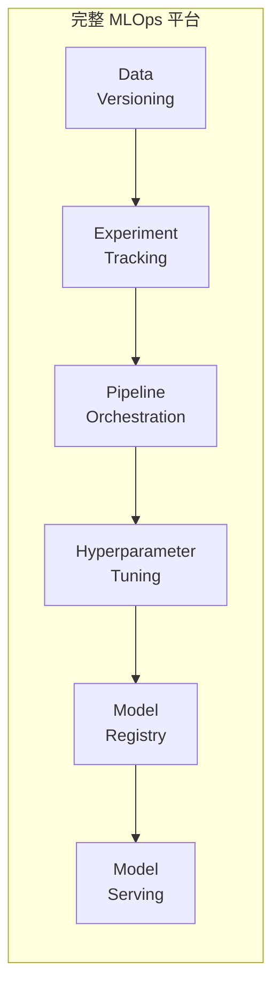
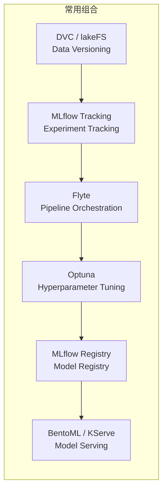

<style>
section { font-size: 20px !important; padding: 40px !important; }
section.lead h1 { font-size: 38px !important; }
section.lead h2 { font-size: 26px !important; }
h1 { font-size: 30px !important; }
h2 { font-size: 24px !important; }
p, li { font-size: 18px !important; }
table { font-size: 15px !important; }
table th, table td { padding: 4px 8px !important; }
code { font-size: 13px !important; }
pre { font-size: 13px !important; }
blockquote { font-size: 17px !important; }
</style>

<!--
_class: lead invert
_paginate: false
-->

# Flyte vs Kubeflow

## 工作流引擎 vs 完整 MLOps 平台

---

<!--
_header: 最常见的误解
-->

## 首先澄清一个常见误解

> ❌ "Flyte 是 Kubeflow 的轻量替代"
>
> ✅ 实际上 **它们不在同一层**

```
Kubeflow =  完整 MLOps 平台（覆盖 6 层能力）
Flyte    =  只做 Pipeline 编排这一层
```

所谓 "Flyte vs Kubeflow" 的对比文章，实际比的是：

**Flyte vs Kubeflow Pipelines（KFP）**— Kubeflow 的一个子组件

就像说「MySQL 和 AWS 比」一样，不在一个层面。

---

<!--
_header: 完整 MLOps 栈
-->

## MLOps 平台需要什么？



| 层 | 代表工具 | Flyte | Kubeflow |
|---|---------|-------|----------|
| Serving | KServe / BentoML | ❌ | ✅ |
| Registry | MLflow Registry | ❌ | ✅ |
| Tuning | Katib / Optuna | ❌ | ✅ |
| **Pipeline** | **KFP / Flyte** | **✅** | **✅** |
| Tracking | MLflow / W&B | ❌ | ✅ |
| Data | DVC / lakeFS | ❌ | ❌ |

Kubeflow = 6 层中覆盖 5 层；Flyte = 只做 1 层

---

<!--
_header: Flyte 是什么
-->

## Flyte 是什么

> **Flyte** = Lyft/Union.ai 开源的 **ML 工作流编排引擎**

它专注做好一件事：**Pipeline 编排**

### 它有什么

- ✅ `@task` / `@workflow` 纯 Python decorator
- ✅ 强类型系统（torch / numpy / pandas / Spark）
- ✅ Fast Registration（秒级迭代，无需 rebuild Docker）
- ✅ 动态 DAG（`@dynamic`，运行时生成图）
- ✅ 多租户（RBAC / 配额 / 命名空间隔离）
- ✅ 内置 Checkpoint（故障恢复从中断点继续）

### 它没有什么

- ❌ 模型服务（Serving）
- ❌ 模型注册表（Registry）
- ❌ 超参调优（Tuning）
- ❌ 实验追踪（Tracking）
- ❌ Notebook 环境

---

<!--
_header: Kubeflow 是什么
-->

## Kubeflow 是什么

> **Kubeflow** = Google → CNCF 的 **完整 MLOps 平台**

它覆盖 ML 全生命周期：

| 组件 | 功能 |
|------|------|
| **Notebooks** | Jupyter 开发环境 |
| **Pipelines (KFP)** | ML 工作流编排 |
| **Trainer** | 分布式训练作业 |
| **Katib** | 超参数调优 |
| **Model Registry** | 模型版本管理 |
| **KServe** | 模型推理服务 |

Kubeflow 是一个**平台**，不是一个工具。

---

<!--
_header: 正确对比：Flyte vs Kubeflow Pipelines
-->

## 这才是公平对比

正确的比较方式：**Flyte vs Kubeflow Pipelines (KFP)**

| 维度 | KFP v2 | Flyte |
|------|--------|-------|
| 设计哲学 | K8s 薄层封装 | **抽象掉 K8s** |
| Python SDK | 仍需基础设施 DSL | `@task` `@workflow` 原生 |
| 本地开发 | Kind/Minikube | `flytectl demo start` |
| 迭代速度 | 改代码 → rebuild → 10-15 分钟 | Fast Registration → **秒级** |
| 动态 DAG | ❌ v2 不原生支持 | ✅ `@dynamic` |
| 强类型 | 基础类型 | torch / numpy / pandas |
| 多租户 | 有限 | ✅ 一等公民 |
| Checkpoint | ❌ | ✅ intra-task |
| 资源占用 | ~40 pods / 12GB | **~3-4 pods / 2.5GB** |

---

<!--
_header: 如何看待成本对比
-->

## 关于「迁移后节省 40-67% 成本」

这个数据的**前提**是：

```
你的栈里已经有了：
  ✅ Serving（KServe / BentoML）
  ✅ Registry（MLflow）
  ✅ Tuning（Optuna）
  ✅ Tracking（W&B / MLflow）

你只是把 KFP 替换成 Flyte → 确实省了编排层的资源
```

如果从零开始，用 Flyte 替代 Kubeflow **整体**：

```
你需要自己拼：
  ❌ Serving     → 另接 BentoML / FastAPI
  ❌ Registry    → 另接 MLflow
  ❌ Tuning      → 另接 Optuna
  ❌ Tracking    → 另接 W&B / MLflow

拼完后的总成本不一定比 Kubeflow 低
```

---

<!--
_header: 选型建议
-->

## 怎么选？

### 选 Kubeflow 整体

当你需要**完整的 MLOps 平台**：

- 没有现成的 Serving / Registry / Tuning
- 有专职 DevOps/K8s 团队（~15+ 工程师）
- 主要负载是大规模分布式训练
- 想要 Notebook → Pipeline → Serving 一体化

### 选 Flyte

当你**只需要替换编排层**：

- 已经有 Serving / Registry / Tuning 等周边工具
- 数据科学家不应该碰 K8s
- 迭代速度 > 平台完整性
- 需要多租户隔离
- 在意云成本

---

<!--
_header: 最实际的组合
-->

## 最务实的组合



Flyte 在这里替代的是 **Kubeflow Pipelines 的角色**，而不是 Kubeflow 整体。

Kubeflow 的优势是**一站式集成**；Flyte 的优势是**单点做到极致**。

---

<!--
_class: lead invert
_paginate: false
-->

## 一句话总结

> **Flyte ≠ Kubeflow 替代品**
>
> Flyte = 顶级编排引擎
>
> Kubeflow = 完整 MLOps 平台
>
> 它们解决的不是同一个问题。

### 参考来源

- [[wiki/entities/flyte]]
- [[wiki/entities/kubeflow]]
- [[wiki/sources/mlops-open-source-platform-comparison]]
- [[wiki/syntheses/mlops-ecosystem-overview]]
