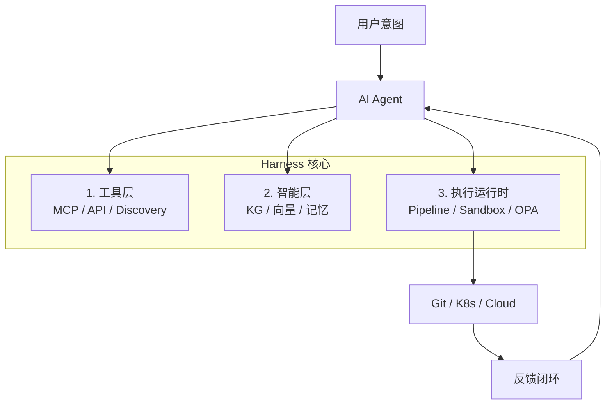
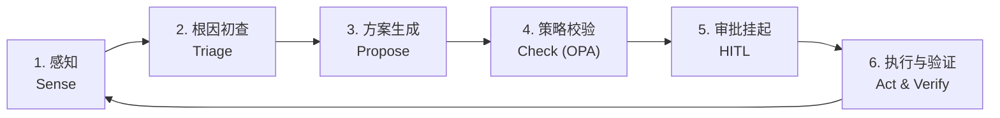

---
marp: true
theme: gaisler
style: |
  section {
    font-size: 22px;
  }
  section h1 {
    font-size: 60px;     
  }
  section h2 {
    font-size: 45px;  
  }

---

<!--
_header: Harness Engineering — 概述
-->

## 一句话定义

> **Harness Engineering**（装具工程）是工程化设计「模型在怎样的运行时里完成任务」的学科。

它通过一套**确定性的基础设施**（Scaffolding）包裹**概率性的模型**，将 LLM 从不稳定的「对话者」转化为可靠的「执行者」。

核心公式：

$$AI\ System\ Effectiveness \approx Prompt \times Content \times Harness$$

---

<!--
_header: 范式转移
-->

## 范式转移：从先知到组件

| 维度 | 传统模式 (Oracle) | Harness 模式 (Component) |
|------|------------------|------------------------|
| 角色定位 | 问题的最终解决者 | 复杂指令的拆解与推理引擎 |
| 可靠性来源 | 更好的 Prompt / 更大的模型 | 确定性的运行时与护栏 |
| 性能瓶颈 | 模型幻觉（Hallucination） | 支架设计的合理性与上下文质量 |
| 价值主张 | "AI 辅助" | **"AI 自主"** |

> **关键洞察**：优化 Harness 层，即使不换模型，AI Agent 成功率可提升 **6 倍以上**

---

<!--
_header: 三层大图
-->

## 三层架构全景



---

<!--
_header: 第一层 — 工具层
-->

## 第一层：工具层 (Tool Layer) — "系统调用"

| 组件 | 功能 | 类比 |
|------|------|------|
| **MCP Server** | 标准化协议接口 | 网卡驱动 |
| **API Proxy** | 身份验证与审计 | 防火墙日志 |
| **Runtime Discovery** | 运行时发现可用工具 | 即插即用 |

Agent 不再硬编码工具接口。通过 MCP，Agent 在启动时查询可用"技能集"：

```json
{"method": "tools/list"} → 返回所有可用 K8s/Terraform/Jira 指令
```

---

<!--
_header: 第二层 — 智能层
-->

## 第二层：智能层 (Intelligence Layer) — "存储系统"

传统 RAG 在处理结构化问题时极易出错。Harness 引入**四层数据模型**：

| 层级 | 内容 | 技术 | 确定性 |
|------|------|------|--------|
| **Tier 1** | 核心实体（服务/环境） | HQL + 图数据库 | 最高 |
| **Tier 2** | 结构化日志/Trace | HQL 过滤 + 范围检索 | 高 |
| **Tier 3** | 外部集成（Jira/GitHub） | API 映射层 | 中 |
| **Tier 4** | 原始 API 数据 | MCP 调用 | 低 |

**因果链追踪**：`告警 → 微服务 → 部署事件 → PR → Diff`

---

<!--
_header: 第三层 — 执行运行时
-->

## 第三层：执行运行时 — "操作系统内核"

### OPA 治理模式 (Open Policy Agent)

Agent 每次执行有副作用的操作前，必须通过 OPA Kernel 审批：

```rego
# 周五下午禁止操作生产环境
is_forbidden_window {
    day := time.weekday(time.now_ns())
    day == "Friday"
    hour := time.date(time.now_ns())[3]
    hour >= 16
}

# 敏感操作需要人工审批
requires_hitl {
    input.target_resource == "database"
    input.risk_score > 7
}
```

---

<!--
_header: 硬件隐喻参考模型
-->

## 硬件隐喻：一张图记住 Harness

| Harness 组件 | 硬件隐喻 | 职责 |
|-------------|---------|------|
| **LLM** | 🔲 CPU | 原始推理与意图理解 |
| **Context Window** | 🧮 RAM | 易失性工作内存 |
| **Knowledge Graph** | 💾 Hard Drive | 长期结构化组织记忆 |
| **OPA Kernel** | 🧠 OS Kernel | 权限控制与安全护栏 |
| **MCP** | 🔌 Syscalls | 与外部世界交互的标准接口 |
| **Pipeline** | 🔄 System Bus | 数据流动与任务调度中心 |

---

<!--
_header: 自愈闭环
-->

## 自愈闭环 (Self-Healing Loop)



**示例场景**：
1. 部署失败 → Agent 调知识图谱查变更 → 生成回滚/热修方案
2. OPA 拦截（"双 11 期间禁止热修"）→ 发送 Slack 审批
3. 人类批准 → Agent 执行回滚 → 监控 10 分钟确认恢复

---

<!--
_header: 三层工程的关系
-->

## Harness vs Prompt vs Content

```
Prompt  Engineering:  怎么告诉模型做事      ← 指令层
Content Engineering:  给模型什么知识和上下文  ← 知识层
Harness Engineering:  整个系统如何可靠运行   ← 系统层
```

| 系统复杂度 | 关键抓手 |
|-----------|---------|
| 单轮轻任务 | Prompt Engineering 足够 |
| 知识密集型 | Content Engineering 更关键 |
| 多步骤 Agent | **Harness Engineering 最重要** |

> 三者不是前后淘汰，而是**分层协同**。系统越复杂，关注点越外扩。

---

<!--
_header: 实践建议
-->

## 如何落地？

### 从这些信号入手

| 现象 | 问题层 |
|------|--------|
| 回答格式混乱、忽略约束 | **Prompt** |
| 改错文件、引用错接口、事实不准 | **Content** |
| 不跑测试、乱用工具、死循环、越权操作 | **Harness** |

### 最小落地步骤

1. **先加护栏** — 用 OPA 或等效策略拦截高风险操作
2. **再建记忆** — 知识图谱或结构化记忆（HQL/图数据库）
3. **后做闭环** — Pipeline Engine 编排 + 自愈重试

---

<!--
_class: lead invert
_paginate: false
-->

## 核心 takeaways

> **Harness Engineering ≠ 新概念，而是范式升维。**
>
> 它把 AI Agent 从"聪明的对话者"变成了 "可靠的生产系统组件"。

```
Prompt   = 指令
Content  = 事实
Harness  = 执行系统
三者协同 = 生产级 AI
```

### 参考来源

- [[wiki/sources/harness-engineering-deep-dive]]
- [[wiki/sources/harness-content-prompt-engineering]]
- [[wiki/concepts/harness-engineering]]
