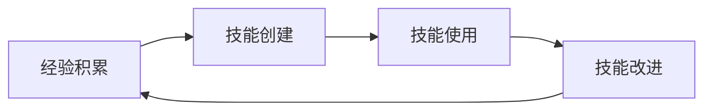

<style>
section { font-size: 20px !important; padding: 40px !important; line-height: 1.5 !important; }
h1 { font-size: 36px !important; margin: 0 0 12px 0 !important; }
h2 { font-size: 28px !important; margin: 0 0 10px 0 !important; }
h3 { font-size: 22px !important; margin: 0 0 8px 0 !important; }
p { font-size: 18px !important; margin: 4px 0 !important; }
li { font-size: 17px !important; margin: 2px 0 !important; }
blockquote { font-size: 18px !important; margin: 6px 0 !important; padding: 6px 16px !important; }
table { font-size: 14px !important; width: 100% !important; }
table th, table td { padding: 3px 8px !important; }
code { font-size: 13px !important; }
pre { font-size: 13px !important; margin: 6px 0 !important; }
.mermaid { font-size: 14px !important; }
section.lead { justify-content: center !important; align-items: center !important; text-align: center !important; }
section.lead h1 { font-size: 42px !important; }
section.lead h2 { font-size: 30px !important; }
ul, ol { margin: 4px 0 !important; padding-left: 24px !important; }
</style>---

<!--
_class: lead invert
_paginate: false
-->

# Hermes Agent

## Nous Research 的自我进化 AI Agent

---

<!--
_header: 概述
-->

## 一句话定义

> **Hermes Agent** = Nous Research 构建的**自主 AI Agent**，核心特色是**闭环学习系统**——从经验中创建技能、在使用中自我改进、跨会话持久化记忆。

它不是编码助手（如 Claude Code），也不是个人助理（如 OpenClaw），而是一个**通用的、可长期演化的 Agent 框架**。

### 一句话 vs 同类

| 对比对象           | 差异                                                                   |
| -------------- | -------------------------------------------------------------------- |
| vs Claude Code | Hermes 能**自主创建和改进技能**，不依赖手动编写 SKILL.md                               |
| vs OpenClaw    | Hermes 是**框架感更强**的 runtime，而非开箱即用的助理产品                               |
| vs Pi          | Hermes 是**完整生态**（消息网关 + 技能 + 记忆 + provider 抽象），Pi 偏轻量 coding harness |

---

<!--
_header: 闭环学习
-->

## 核心特色 1：闭环学习

这是 Hermes 区别于其他 Agent **最核心的差异化能力**。



| 能力 | 说明 |
|------|------|
| **自主技能创建** | Agent 自动识别值得固化的经验，写成 Skills |
| **技能自我改进** | 在后续执行中再次载入并改进，越用越好 |
| **FTS5 跨会话召回** | 全文搜索 + LLM 摘要，跨会话知识不丢失 |
| **用户画像建模** | Honcho dialectic 模型，越用越懂你 |

---

<!--
_header: 闭环学习对比
-->

## 闭环学习：vs Claude Code

**Claude Code Skills** = 手动编写 SKILL.md（静态 1.0）

**Hermes Agent Skills** = 自主创建 + 运行时改进（动态 2.0）

核心差异在于：Claude Code 需要人在 `.claude/skills/` 目录下放置 SKILL.md 文件，Agent 按需读取执行。而 Hermes 的 Agent 在运行时能**自动识别**值得固化的经验模式，将其**自主编写为 Skill 文件**，并在后续使用中持续改进。

---

<!--
_header: 随处运行
-->

## 核心特色 2：随处运行

Hermes 的 Agent runtime **与执行环境解耦**，支持 **6 种终端后端**：

```
local    本地直接运行
Docker   容器隔离（生产推荐）
SSH      远程执行机
Daytona  云开发环境
Modal    Serverless 无服务器
Singularity 容器平台
```

> "不绑定在笔记本上" — 你可以从 Telegram 发消息，Agent 在云端 VM 执行，甚至不需要 SSH 进去。

---

<!--
_header: 消息网关
-->

## 核心特色 3：20+ 消息平台

Hermes 的 **Messaging Gateway** 支持 20+ 平台，从同一个 Agent runtime 接出。

| 分类 | 平台 |
|------|------|
| 即时通讯 | Telegram, Discord, WhatsApp, Signal |
| 办公协作 | Slack, Teams, 飞书, 钉钉, WeCom |
| 国产平台 | 微信, QQ Bot, 元宝 |
| 其他 | Email, SMS, Home Assistant |

**网关推荐拓扑**：
- **飞书 WebSocket 模式**：ECS 只需出网，不需域名/HTTPS
- **微信 iLink**：仅限私聊，群聊不可靠

---

<!--
_header: Skills 系统
-->

## 核心特色 4：Skills 系统

Hermes 的 Skills 是**可移植、可共享、可自改进**的：

- **格式**: 标准的 SKILL.md（兼容 Claude Code / Cursor 格式）
- **开放标准**: 兼容 [agentskills.io](https://agentskills.io)
- **社区市场**: Skills Hub 社区贡献
- **三级加载机制**:
  1. Metadata（名称+简介）— 始终加载
  2. Instructions（SKILL.md 全文）— 按需加载
  3. Scripts（代码/资源）— 运行时加载

**这和 Claude Code 的区别**：
- Claude Code：人在 `.claude/skills/` 放 SKILL.md，Agent 按需读取
- Hermes：Agent **在运行时自动创建和优化** SKILL.md

---

<!--
_header: 更多能力
-->

## 更多核心能力

| 能力 | 说明 |
|------|------|
| **MCP 支持** | 连接任何 MCP 服务器扩展工具集 |
| **调度自动化** | 内置 Cron，任意平台投递结果 |
| **Sub-agent 委派** | 隔离子 Agent 并行工作 |
| **Voice Mode** | CLI/Telegram/Discord 实时语音 |
| **SOUL.md** | 定义 Agent 人格和默认语气 |
| **Context Files** | 项目级上下文，塑造每次对话 |
| **安全控制** | 命令审批、授权、容器隔离、DM pairing |

---

<!--
_header: 部署架构
-->

## 部署架构

### 推荐拓扑：单机版

```
ECS Ubuntu 22.04/24.04
  → Hermes Agent
  → Docker backend（隔离执行环境）
  → Feishu Gateway（WebSocket，首选入口）
  → systemd 常驻服务
```

### 最小上线顺序

```
1. 创建 ECS → 开放 22 端口
2. 安装 Hermes → 跑通 CLI 对话
3. 配置 Provider（DashScope 或 Nous Portal）
4. 安装 Docker → 切 backend: docker
5. 飞书 gateway 验证（hermes gateway run）
6. systemd 常驻（hermes gateway install --system）
```

---

<!--
_header: Provider 策略
-->

## Provider 策略：真正的 Provider-agnostic

Hermes 的核心差异化之一——**20+ provider，可混用、可热切换**：

| 特点 | 说明 |
|------|------|
| 多 Provider | Anthropic / OpenAI / OpenRouter / Google / DashScope 等 |
| Provider-agnostic | 不绑定任何一家 |
| Workflow 切换 | 按任务切 provider（成本/速度/能力路由） |
| 凭据池 | 多个 API key 轮转 |

中国用户：ECS + DashScope/Qwen 是最自然组合。

---

<!--
_header: vs Claude Code
-->

## Hermes vs Claude Code

| 维度 | Hermes Agent | Claude Code |
|------|-------------|-------------|
| 定位 | 通用自主 Agent 框架 | IDE 内嵌编码助手 |
| 技能创建 | 自主创建 + 运行时改进 | 手动编写 SKILL.md |
| 运行环境 | 6 种后端，不绑定 | 本地 CLI |
| 消息平台 | 20+ | CLI 为主 |
| 学习能力 | 闭环学习（核心差异） | 无内置学习 |
| 编码能力 | 较强 | 最强（原生优化） |
| 上手难度 | 中（需配置 gateway + backend） | 低（开箱即用） |

---

<!--
_header: vs OpenClaw
-->

## Hermes vs OpenClaw

| 维度 | Hermes Agent | OpenClaw |
|------|-------------|----------|
| 设计中心 | Agent runtime + 学习闭环 | 个人助理体验 + always-on |
| 第一入口 | CLI 和消息同等 | 聊天应用优先 |
| 上手体验 | 框架感强，需配置 | 开箱即用，助理感强 |
| 技能系统 | 闭环学习，自主创建+改进 | 插件/技能扩展 |
| Provider | 20+ providers，核心卖点 | 多模型但非核心 |
| 运行位置 | 6 种 backend 切换 | 自托管机器 |

**一句话**：要 "个人助理" → OpenClaw；要 "Agent 系统" → Hermes

---

<!--
_header: 安全
-->

## 安全设计

Hermes 的安全边界是 **framework-level control plane**：

| 机制 | 说明 |
|------|------|
| 命令审批 | `approvals.mode: smart` 降低批准疲劳 |
| 容器隔离 | Docker backend：cap-drop、no-new-privileges |
| DM pairing | 未授权用户私聊 bot → 配对码 → 管理员批准 |
| Allowlist | `GATEWAY_ALLOWED_USERS` 白名单 |
| 网站黑名单 | 限制 Agent 访问的站点 |
| 权限最小化 | `.env` 权限 600，密钥不入库 |

---

<!--
_class: lead invert
_paginate: false
-->

## 总结

> **Hermes Agent 的核心价值** = 一个会**自己学习、自己改进、跨会话记忆**的 Agent runtime。

它不像 Claude Code 那样开箱即用，也不像 OpenClaw 那样助理感强。它的定位是：**让你搭建一个长期可演化的 Agent 系统**。

### 参考

- [[wiki/entities/hermes-agent]] · [[wiki/entities/nous-research]] · [[wiki/concepts/agent-skills-system]]
- [[wiki/sources/hermes-agent-docs]] · [[wiki/sources/hermes-agent-alicloud-deployment-guide]]
- [[wiki/sources/hermes-agent-alicloud-messaging-guide]] · [[wiki/sources/openclaw-vs-hermes-comparison]]
