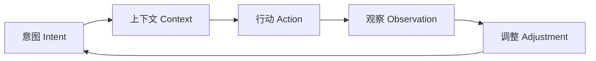
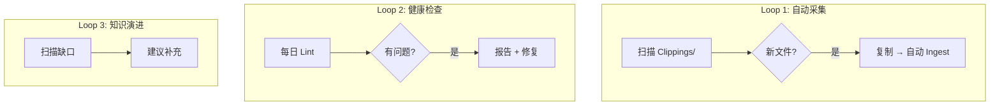

<style>
section { font-size: 20px !important; padding: 40px !important; line-height: 1.5 !important; }
h1 { font-size: 36px !important; margin: 0 0 12px 0 !important; }
h2 { font-size: 28px !important; margin: 0 0 10px 0 !important; }
h3 { font-size: 22px !important; margin: 0 0 8px 0 !important; }
p { font-size: 18px !important; margin: 4px 0 !important; }
li { font-size: 17px !important; margin: 2px 0 !important; }
blockquote { font-size: 18px !important; margin: 6px 0 !important; padding: 6px 16px !important; }
table { font-size: 14px !important; width: 100% !important; }
table th, table td { padding: 3px 8px !important; }
code { font-size: 13px !important; }
pre { font-size: 13px !important; margin: 6px 0 !important; }
.mermaid { font-size: 14px !important; }
section.lead { justify-content: center !important; align-items: center !important; text-align: center !important; }
section.lead h1 { font-size: 42px !important; }
section.lead h2 { font-size: 30px !important; }
ul, ol { margin: 4px 0 !important; padding-left: 24px !important; }
</style>

<!--
_class: lead invert
_paginate: false
-->

# Loop Engineering

## AI 编程的第四次范式跃迁

---

<!--
_header: 范式演进
-->

## 四次范式跃迁

```
Prompt Engineering  →  怎么问
Context Engineering →  给什么信息
Harness Engineering →  如何组织能力
Loop Engineering    →  如何让 AI 持续创造结果
```

> "你不应该再手动提示 AI 了，你应该设计让 Agent 自己提示自己的 Loop"

---

<!--
_header: 核心循环
-->

## 核心循环



Loop Engineering 在外循环层工作（你设计的系统），Agent 内循环负责（感知→推理→行动→观察）。

---

<!--
_header: 六大要素
-->

## 六大要素

| 要素 | 说明 |
|------|------|
| **Automations** | 自动触发器、定时调度 |
| **Worktrees** | 并行隔离的工作空间 |
| **Skills** | SKILL.md 技能文件 |
| **Connectors** | MCP 连接器 |
| **Sub-Agents** | 制作者-检查者模式 |
| **Memory** | 持久化文件状态 |

---

<!--
_header: 五种 Loop 模式
-->

## 五种 Loop 模式

| 模式 | 触发条件 | 典型场景 |
|------|---------|---------|
| **Test-driven** | 测试失败 → 修复 → 验证 | TDD 开发流程 |
| **Type-driven** | 类型错误 → 修正 → 编译 | TypeScript 项目 |
| **Review-driven** | 提交代码 → Review → 修改 | PR 审查流程 |
| **Runtime-debug** | 运行时错误 → 诊断 → 修复 | Bug 排查 |
| **UI-driven** | 产品反馈 → 迭代 → 验证 | 产品开发 |

---

<!--
_header: 构建四步法
-->

## Loop 构建四步法

1. **窄任务开始** — 先跑通一个简单的循环（如自动 Lint）
2. **明确验证方式** — 如何确认 Loop 工作正常
3. **设置保险机制** — 不让 Agent 擅自修改未确认的内容
4. **逐步提升自主程度** — 从只读报告 → 建议 → 自动执行

> 从只读 Loop 开始（只写 TODO.md，不碰源码），逐步提升自主程度。

---

<!--
_header: 三大风险
-->

## 三大风险

| 风险 | 说明 |
|------|------|
| **验证仍是你的责任** | Loop 自动化不代表你可以不管，结果仍需人工确认 |
| **理解债积累更快** | Agent 决策越多，你对系统的理解缺口越大 |
| **认知投降** | 过度依赖 Loop 导致丧失判断力 |

---

<!--
_header: 与 Harness 的关系
-->

## Loop vs Harness

| 维度 | Harness Engineering | Loop Engineering |
|------|-------------------|-----------------|
| 核心问题 | 如何可靠运行？ | 如何持续创造结果？ |
| 关注点 | 基础设施、安全护栏 | 自动化循环、触发机制 |
| 典型组件 | MCP、OPA、Sandbox | Cron、Worktree、Sub-agent |
| 关系 | **基础** | **上层建筑** |

> Harness = Agent 的操作系统内核
> Loop = Agent 的定时任务调度器 + 自愈机制

---

<!--
_header: 应用在 Wiki
-->

## 应用到本知识库



详见 [[wiki/concepts/wiki-loop-engineering]]

---

<!--
_class: lead invert
_paginate: false
-->

## 总结

> **Loop Engineering** = 设计让 Agent **自己提示自己**的循环系统。

它是 Prompt → Context → Harness → Loop 四次跃迁的最终形态。

### 参考

- [[wiki/sources/loop-engineering-guide]]
- [[wiki/concepts/wiki-loop-engineering]]
- [[wiki/concepts/harness-engineering]]
