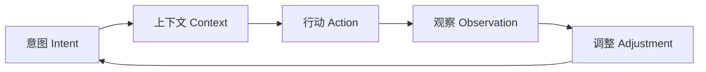
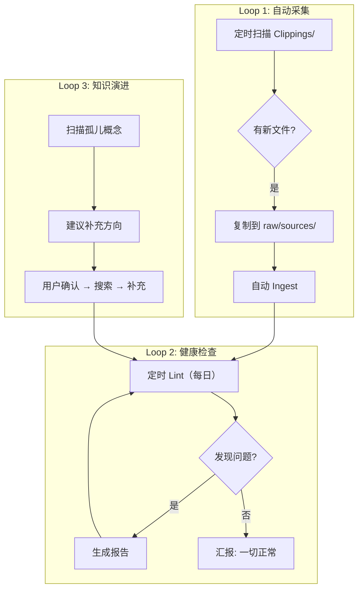

# Claude Code 中实践 Loop Engineering — 实操指南

> **Loop Engineering ≠ 更好的 Prompt，而是设计让 Agent「自己提示自己」的自动化循环系统。**
>
> 如果说 [[wiki/syntheses/harness-engineering-with-claude-code]] 是让 Agent 跑得稳（可靠运行），Loop Engineering 就是让 Agent 跑不停（持续创造结果）。

相关概念：[[wiki/concepts/wiki-loop-engineering]] · [[wiki/concepts/harness-engineering]] · [[wiki/entities/claude-code]] · [[wiki/concepts/spec-driven-development]] · [[wiki/concepts/vibe-coding]]

---

## Loop Engineering vs Harness Engineering

两者不是替代关系，而是**分层协同**：

| 维度       | Harness Engineering                            | Loop Engineering                              |
| -------- | ---------------------------------------------- | --------------------------------------------- |
| **核心问题** | 如何让 Agent **可靠运行**？                            | 如何让 Agent **持续创造结果**？                         |
| **关注点**  | 基础设施、安全护栏、权限控制                                 | 自动化循环、触发机制、迭代节奏                               |
| **典型组件** | CLAUDE.md, MCP, Hooks, Permissions, Sub-agents | `/loop` 命令, CronCreate, Worktree, Auto Memory |
| **设计目标** | 让 Agent 不犯错、不越权、不崩溃                            | 让 Agent 自我驱动、持续迭代、渐进改进                        |
| **关系**   | **基础层** — Agent 的操作系统内核                        | **应用层** — Agent 的定时任务调度器 + 自愈机制               |
| **类比**   | 建造一个可靠的工厂车间                                    | 设计车间里的自动化流水线                                  |

> **Harness = 跑得稳，Loop = 跑不停。** 没有 Harness 的 Loop 会失控，没有 Loop 的 Harness 是在浪费 Agent 的潜力。

---

## 什么是 Loop Engineering

### Karpathy 的范式演进

从 Karpathy 的视角，AI 编程经历了四次范式跃迁：

```
Prompt Engineering  →  怎么问（指令层）
Content Engineering →  给什么信息（知识层）
Harness Engineering →  如何组织能力（系统层）
Loop Engineering    →  如何让 AI 持续创造结果（自动化层）
```

Loop Engineering 是第四次跃迁。它的核心不是写更好的 Prompt，而是**设计系统让 Agent 自己提示自己，自动完成整个工作循环**。

### 核心循环模型



Loop Engineering 在**外循环层**工作（你设计系统），Agent 的**内循环**负责（感知→推理→行动→观察）。

---

## Claude Code 的 Loop 机制一览

### 1. `/loop` 命令 — 同会话定时循环

最简单的 Loop 入口。在同一次对话中定时重复执行某个任务：

```
/loop 10m 检查当前分支的 CI 状态
/loop 5m /test        # 每 5 分钟跑一次测试
/loop 30m 帮我检查是否有新的待处理 Issue
```

**适用场景**：
- 轮询等待外部状态（CI 完成、部署成功）
- 重复运行测试直到全量通过
- 定时检查任务状态

**注意事项**：
- `/loop` 在同一会话中运行，上下文会积累
- 长期循环建议用 CronCreate 替代

### 2. CronCreate — 跨会话定时任务

通过工具 API 注册持久化的定时任务，在指定时间唤醒 Agent：

```
CronCreate(cron="0 9 * * 1-5", prompt="运行每日 Lint 检查并报告")
CronCreate(cron="30 14 * * 1", prompt="检查 Clippings/ 新文件并 Ingest")
```

**与 `/loop` 的区别**：

| 特性 | `/loop` | CronCreate |
|------|---------|------------|
| 会话持久性 | 同一会话内 | 跨会话持久 |
| 上下文 | 上下文持续累积 | 每次全新启动 |
| 适用 | 短期轮询 (< 几小时) | 长期定时任务 (每天/每周) |
| 自动清理 | 会话结束时停止 | durable=false 会话结束消失 |

**最佳实践**：
- `durable: true` — 在 `.claude/scheduled_tasks.json` 持久化，重启后继续
- 每次任务执行时记录状态到文件，下次执行以读取
- 任务完成时通过 CronDelete 清理自身（一次性任务）

### 3. Worktree 隔离循环

每次 Loop 在独立的 Git Worktree 中运行，互不干扰：

```bash
# 在 worktree 中运行 Lint
EnterWorktree(name="daily-lint")
# ... 执行 Lint 操作 ...
ExitWorktree(action="remove")
```

**适用场景**：
- 对生产仓库执行有风险的自动操作
- 并行运行多个独立 Loop
- 每个 Loop 有自己的文件系统上下文

### 4. Sub-agent 分工循环

创建专用 Agent 形成「制作者-检查者」循环：

```
/agent create reviewer
/agent create linter
```

**循环模式**：主 Agent 编码 → reviewer 审查 → 主 Agent 修复 → linter 验证 → 循环结束

---

## 五种 Loop 模式及 Claude Code 实现

### 模式 1: Test-Driven Loop (TDD 循环)

**流程**：写测试 → 测试失败 → 实现 → 测试通过 → 重构 → 测试通过

```bash
# 通过 /loop 实现 TDD 循环
/loop 30s "运行 pytest，如果有失败测试就修复它们，直到全部通过"
```

**在 Claude Code 中的实现**：
1. 编写测试（或让 Agent 根据 Spec 写测试）
2. 运行 `pytest` → 看到失败
3. Agent 自动修复实现代码
4. 再次运行测试
5. 循环直到全部通过

### 模式 2: Review-Driven Loop (审查循环)

**流程**：生成代码 → 自我审查 → 修改 → 再审查 → 完成

**关键技巧**：使用**第二模型作为审查者**（如 Codex 插件）：

```
在 CLAUDE.md 中添加：
## Loop 规则
在提交 PR 前，先通过 Codex 审查一次代码改动。
如发现安全问题或架构问题，先修复再提交。
```

### 模式 3: Type-Driven Loop (类型驱动循环)

**流程**：写代码 → 类型错误 → 修正 → 编译通过

```bash
# TypeScript 项目中的类型循环
/loop 30s "运行 tsc --noEmit，修复所有类型错误"
```

### 模式 4: Runtime-Debug Loop (运行时调试循环)

**流程**：运行 → 出错 → 诊断 → 修复 → 再运行

```bash
# 在 Claude Code 中
帮我启动这个服务
# 服务报错...
诊断并修复这个错误
# 修复后再运行
# 重复直到服务正常
```

### 模式 5: Aggregation/Synthesis Loop (聚合循环 — LLM Wiki 模式)

**这是本知识库的核心模式**：定期将分散信息聚合为结构化知识。

**流程**：扫描新资料 → 阅读 → 总结 → 写入 Wiki → 更新索引

```bash
# 通过 CronCreate 实现
CronCreate(
  cron="0 9 * * 1,3,5",  # 每周一三五早上 9 点
  prompt="检查 Clippings/ 目录的新文件，执行 Ingest 流程",
  durable=true
)
```

详见 [[wiki/concepts/wiki-loop-engineering]]

---

## Loop 构建四步法

从零开始构建一个可靠的 Loop，遵循以下四个步骤：

### 第一步：窄任务开始

不要一开始就设计复杂的多循环系统。先跑通一个最简单的 Loop：

```
示例：自动 Lint 循环
1. 手动运行一次 Lint 检查
2. 确认输出格式和内容
3. 用 CronCreate 注册定时任务
4. 验证定时任务是否触发
```

### 第二步：明确验证方式

每个 Loop 必须有明确的「成功/失败」标准：

| Loop 类型 | 验证方式 |
|-----------|---------|
| Lint 循环 | Lint 报告是否生成？是否完整？ |
| 采集循环 | 新文件是否被正确处理？索引是否更新？ |
| TDD 循环 | 测试通过率是否达到 100%？ |
| 知识演进 | 新概念页是否创建？交叉引用是否补充？ |

### 第三步：设置保险机制

**永远不要让 Loop 在无人确认的情况下修改重要内容**：

```
保险机制清单：
□ 只读 Loop → 只写报告/TODO.md，不碰源码
□ 差分输出 → 修改前先生成 diff，人工确认后再应用
□ 渐进授权 → 从「仅报告」→「建议」→「自动执行」
□ 熔断机制 → 检测到异常模式时自动停止循环
```

### 第四步：逐步提升自主程度

```
Level 0: 手动触发 + 只读报告
Level 1: 定时触发 + 只读报告
Level 2: 定时触发 + 自动建议
Level 3: 定时触发 + 自动执行（低风险操作）
Level 4: 自动触发 + 全自主执行
```

> **核心原则：只对「错了也能轻松恢复」的事情开启自动执行。**

---

## 本知识库的 Loop 架构（参考实现）



每个 Loop 通过 `CronCreate` 注册，完成时记录到 `wiki/log.md`。

详见 [[wiki/concepts/wiki-loop-engineering]]

---

## Loop 与 Harness 的协同配置

一个生产级的 Loop 系统需要 Harness 支撑：

| Loop 需要 | Harness 提供 | 配置位置 |
|-----------|-------------|----------|
| 每次启动知道规则 | CLAUDE.md | 项目根目录 |
| 安全地调用外部工具 | MCP | `.claude/settings.json` |
| 提交前自动验证 | PreCommit Hook | `settings.json` 的 hooks |
| 权限边界 | Permissions | `settings.json` |
| 可复用任务模板 | Skills | `.claude/skills/` |
| 知识记忆 | Auto Memory | `~/.claude/memory/` |

> **建议配置顺序**：先配好 Harness（CLAUDE.md + Hooks + MCP），再建 Loop（CronCreate + Worktree）。

---

## 成熟度模型

| Level | 状态 | 特征 |
|-------|------|------|
| **L0** | 纯手动 | 所有操作人工触发，无自动化循环 |
| **L1** | 单 Loop | 一个自动化循环（如自动 Lint），只读报告 |
| **L2** | 多 Loop | 多个并行 Loop，各自独立运行 |
| **L3** | 联动 Loop | Loop 间有依赖关系，一个 Loop 的输出触发另一个 |
| **L4** | 自进化 | Loop 能检测自身效果，自动调整参数和频率 |

---

## 常见陷阱

| 陷阱 | 现象 | 解决方案 |
|------|------|----------|
| **循环过频** | 同一任务反复执行，浪费 Token | 设置合理的最小间隔，增加状态检查 |
| **验证缺失** | Loop 在执行但没人检查结果 | 每个 Loop 必须有输出日志和验证步骤 |
| **理解债积累** | Agent 决策越来越多，你对系统理解缺口越大 | 定期阅读 Loop 的输出日志，保持理解同步 |
| **认知投降** | 过度依赖 Loop，丧失判断力 | Loop 只做可验证的事，核心决策留给人 |
| **熔断缺失** | Loop 在异常状态下持续运行 | 增加错误检测和自动停止机制 |

---

## P0 / P1 / P2 行动清单

| 优先级 | 做什么 | Claude Code 实现 | 预估投入 |
|--------|--------|-----------------|----------|
| **P0** | 建一个最简单的只读 Loop | CronCreate + 生成报告文件 | 15 min |
| | 明确 Loop 的验证方式 | 定义成功/失败标准 | 10 min |
| | 设置输出日志 | Loop 结果写入文件 | 10 min |
| **P1** | Harness 基础配置 | CLAUDE.md + Hooks + MCP | 1-2 h |
| | 多 Loop 并行 | CronCreate 多个定时任务 | 30 min |
| | Worktree 隔离 | 高风险 Loop 在 worktree 运行 | 30 min |
| **P2** | Loop 间联动 | 一个 Loop 触发另一个 | 1 h |
| | Loop 自检 | Loop 监控自身效果 | 2 h |
| | 熔断机制 | 异常检测 + 自动停止 | 2 h |

---

## 相关来源

- [[wiki/syntheses/harness-engineering-with-claude-code]] — Claude Code Harness 实践（互补指南）
- [[wiki/concepts/wiki-loop-engineering]] — 本知识库的 Loop 架构
- [[wiki/syntheses/loop-engineering-presentation]] — Loop Engineering Marp 演示
- [[wiki/sources/loop-engineering-guide]] — Loop Engineering 6 要素 + 5 循环模式
- [[wiki/sources/karpathy-agentic-engineering-interview]] — Karpathy AI Ascent 访谈原文
- [[wiki/sources/karpathy-method-practical-guide]] — Karpathy Method 三层法实操
- [[wiki/concepts/harness-engineering]] — Harness Engineering 概念页
