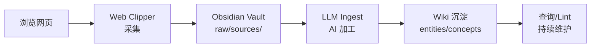

< style>
section { font-size: 20px !important; padding: 40px !important; }
h1 { font-size: 36px !important; margin: 0 0 12px 0 !important; }
h2 { font-size: 28px !important; margin: 0 0 10px 0 !important; }
p { font-size: 18px !important; margin: 4px 0 !important; }
li { font-size: 17px !important; margin: 2px 0 !important; }
table { font-size: 14px !important; width: 100% !important; }
table th, table td { padding: 3px 8px !important; }
code { font-size: 13px !important; }
pre { font-size: 13px !important; }
blockquote { font-size: 18px !important; margin: 6px 0 !important; }
.mermaid { font-size: 14px !important; }
section.lead { justify-content: center !important; align-items: center !important; text-align: center !important; }
section.lead h1 { font-size: 42px !important; }
section.lead h2 { font-size: 30px !important; }
</style>

<!--
_class: lead invert
_paginate: false
-->

# Obsidian + Claudian + LLM Wiki

## 个人知识工作流

---

<!--
_header: 三个组件
-->

## 三个组件

```
┌────────────────────────────────────────────┐
│   Claude Code / Codex  (AI 引擎)            │
│         ↕  CLI 通信                         │
│   Claudian          (AI 桥接层)              │
│         ↕  Obsidian 插件 API                 │
│   Obsidian          (知识库 IDE)              │
│   LLM Wiki          (知识库架构)              │
└────────────────────────────────────────────┘
```

---

<!--
_header: 各司其职
-->

## 各司其职

| 组件 | 角色 | 核心价值 |
|------|------|---------|
| **Obsidian** | 知识库 IDE | 本地 Markdown、双向链接、图谱视图 |
| **Claudian** | AI 桥接层 | 侧边栏嵌入 Claude Code，不切屏 |
| **Claude Code** | AI 引擎 | 读写文件、多步任务、Agent 模式 |
| **LLM Wiki** | 知识库架构 | 三层分离（Raw → Wiki → Schema） |

---

<!--
_header: 三层架构（LLM Wiki）
-->

## LLM Wiki 三层架构

**Raw 层**（只读，不可变）→ `raw/sources/` + `raw/assets/`

**Wiki 层**（AI 维护）→ `entities/` + `concepts/` + `sources/` + `syntheses/`

**Schema 层**（定义规则）→ `CLAUDE.md` + `.claude/agents/llm-wiki.md`

对比传统 RAG：RAG 每次查询重新合成，LLM Wiki 持续积累产生复利。

---

<!--
_header: 知识工作流
-->

## 知识工作流



三层闭环：采集层（Web Clipper）→ 存储层（Obsidian）→ 加工层（Claudian）

---

<!--
_header: 采集链
-->

## 采集链

```
网页 → Obsidian Web Clipper → raw/sources/ → 待 Ingest
```

- 用浏览器扩展剪藏网页、论文、文章
- 保存为结构化 Markdown（支持模板/变量）
- 文件落入 `Clippings/`，再移入 `raw/sources/`

支持的来源：网页、PDF、YouTube、音频、Google Drive

---

<!--
_header: 加工链
-->

## 加工链（Ingest 流程）

```
raw/sources/ 新文件
  → AI 阅读源材料
  → 创建 wiki/sources/ 摘要页
  → 更新关联的 entity / concept 页
  → 如多篇同主题 → 创建 synthesis 综合分析
  → 更新 index.md + log.md
```

全部由 LLM 自动执行，用户只需说"帮我 Ingest"。

---

<!--
_header: 查询链
-->

## 查询链

```
用户提问
  → AI 读 index.md 定位相关页面
  → 深入阅读 wiki 内容
  → 综合回答（引用来源）
  → 有价值的回答归档为 wiki 新页面
```

"答案即知识"——好答案不会消失在聊天历史中。

---

<!--
_header: 维护链
-->

## 维护链（Lint + Loop）

```
Lint 检查：
  → 孤儿页（零入链页面）
  → 索引统计准确性
  → raw/sources 与 wiki 一致性
  → 知识缺口扫描（Loop 3）

Loop 自动化：
  Loop 1: 自动采集（扫描 Clippings/）
  Loop 2: 每日 Lint
  Loop 3: 知识演进（建议补充方向）
```

---

<!--
_header: 你的当前配置
-->

## 你的当前配置

| 项目 | 内容 |
|------|------|
| Vault 路径 | OneDrive/workspace/study_pool |
| AI 后端 | Claude Code（通过反代连 DeepSeek） |
| 模型 | deepseek-v4-flash (Haiku) |
| 插件 | Claudian + Excalidraw + Obsidian Git + BRAT |
| 同步 | OneDrive + Git |
| 知识库 | 27 实体 + 27 概念 + 87 源摘要 + 13 综合分析 |

---

<!--
_class: lead invert
_paginate: false
-->

## 总结

> **Obsidian** 存知识，**Claudian** 连 AI，**LLM Wiki** 定架构。

三者组合形成一个从采集到沉淀的完整知识工作流闭环。

### 参考

- [[wiki/entities/claudian]]
- [[wiki/concepts/llm-wiki-pattern]]
- [[wiki/sources/obsidian-claudian-workflow]]
- [[wiki/concepts/wiki-loop-engineering]]
